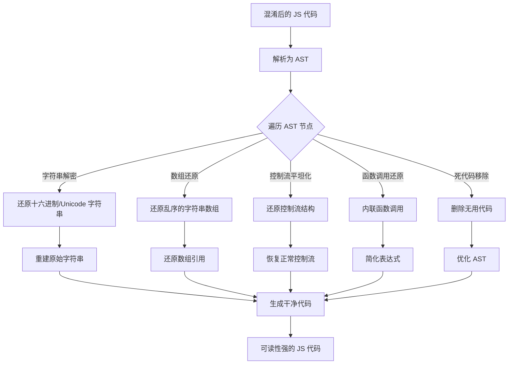

# AST技术在JS逆向中的应用

AST（Abstract Syntax Tree，抽象语法树）是JavaScript逆向工程中的一项重要技术，它通过解析和分析代码的结构而非直接操作文本，为代码转换和逆向分析提供了更强大的工具。

## 什么是AST

AST是源代码的树状结构表示，它将代码分解为语法单元并展示它们之间的层次关系。例如，一个简单的赋值语句 `let x = 42;` 会被解析为：

- VariableDeclaration
  - VariableDeclarator
    - Identifier (name: "x")
    - Literal (value: 42)

## AST在JS逆向中的主要用途

1. **代码反混淆**：
   - 还原被压缩/混淆的变量名和函数名
   - 解析控制流混淆（如switch-case混淆）
   - 展开常量表达式

2. **代码分析**：
   - 识别关键函数和调用关系
   - 提取API调用和加密算法
   - 分析数据流和控制流

3. **代码修改**：
   - 插入调试代码
   - 移除反调试代码
   - 修改业务逻辑

## 常用工具和库

- **Babel**：最流行的JavaScript AST解析和转换工具
- **Esprima**：高性能的JavaScript解析器
- **acorn**：小巧快速的JavaScript解析器
- **recast**：保留代码格式的AST操作工具
- **jscodeshift**：基于AST的批量代码转换工具

## 基本工作流程

1. **解析**：将源代码转换为AST（parse）
2. **遍历**：访问AST节点（traverse）
3. **修改**：根据需要修改AST（transform）
4. **生成**：将AST转换回源代码（generate）

## 示例：使用Babel解析和修改代码

```javascript
const parser = require('@babel/parser');
const traverse = require('@babel/traverse').default;
const generator = require('@babel/generator').default;

// 1. 解析代码为AST
const code = `function square(n) { return n * n; }`;
const ast = parser.parse(code);

// 2. 遍历和修改AST
traverse(ast, {
  Identifier(path) {
    if (path.node.name === 'n') {
      path.node.name = 'x';
    }
  }
});

// 3. 生成新代码
const output = generator(ast);
console.log(output.code); 
// 输出: function square(x) { return x * x; }
```

AST技术相比正则表达式等文本处理方法，能够更准确地理解和操作代码结构，是复杂JS逆向工程的核心技术之一。

# OBfuscator混淆
https://obfuscator.io/
在这个网站中进行obfuscator混淆

没混淆前的代码在浏览器控制台正常输出值
混淆后也可以输出hello world。

将其混淆加密后的数据在网站`https://webcrack.netlify.app/`进行自动解密
**
或者在网址
https://deli-c1ous.github.io/javascript-deobfuscator/
也可以还原

也可以尝试用结合ai进行还原

## 靶场
https://spa13.scrape.center/js/main.js
此处的js混淆可以看到很明显的ob混淆特征
用上面提到的两个网站进行还原，可以看到一个无法还原，一个还原不够完整
用ai进行还原，deepseek和豆包尝试后可以完美还原出来很完美的还原了出来
在线AST解析的网站
https://astexplorer.net/
参考：
https://mp.weixin.qq.com/s/bOc8PYbFdTyFRQcfSppo8w
https://mp.weixin.qq.com/s/rURCR085HiojW2_67enJkA
第一词法分析
一段代码首先会被分解成段段有意义的词法单元，
比如const name="qc”这段代码，它可被折分成四部分：
1、const
2、name
3、=
4、qc
每个部分都具备一定的含义。
第二语法分析
接着编译器会尝试对一个个法单元进行语法分析，将其转换为能代表程序语法结构的数据结构。
比如
1、const就被分析为VariableDeclaration类型，代表变量声明的具体定义；
2、name就被分析为ldentifier类型，代表一个标识符
3、qc就被分析为Literal类型，代表文本内容；
第三指令生成
最后将AST转为可执行指令并执行
Literal:简单理解就是字面量，比如3、"abc"、null这些都是基本的字面量。在代码中又细分为数字字面量，字符字面量等；
Declarations:声明，通常声明方法或者变量。
Expressions:表达式，通常有两个作用：一个是放在赋值语句的右边进行赋值，另外还可以作为方法的参数。
Statemonts:语句。
Identifier:标识符，指代变量名，比如上述例子中的name就是ldentifier。
Classes:类，代表一个类的定义。
Functions:方法声明。
Modules:模块，可以理解为一个Node.js模块。
Program:程序，整个代码可以称为Program。



在线工具
- https://www.kitboxpro.com/tools/js-reverse
- https://deli-c1ous.github.io/javascript-deobfuscator/
- https://webcrack.netlify.app/

