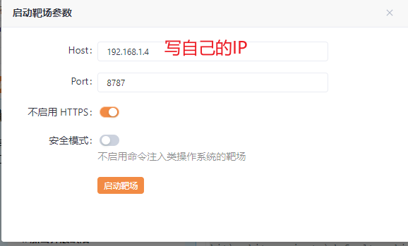
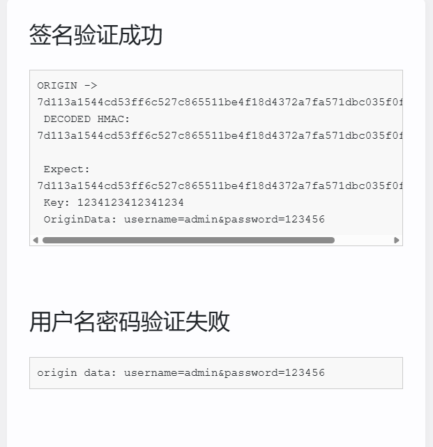

# JS逆向中的签名绕过介绍

在JavaScript逆向工程中，签名绕过是一项常见的技术，主要用于破解网站或应用的安全机制，特别是那些依赖客户端生成的签名进行API请求验证的系统。

## 什么是签名机制

签名机制是网站防止未授权API调用的一种安全措施，通常包括：
- 客户端生成基于特定算法的签名
- 将签名附加到请求中
- 服务端验证签名的有效性

## 常见的签名绕过方法

### 1. 直接提取签名算法
- 通过静态分析JS代码，定位签名生成函数
- 提取算法逻辑并用其他语言重新实现
- 适用于算法不依赖环境变量的情况

### 2. 动态调用JS函数
- 使用Python的PyExecJS、Node.js等工具直接调用原始JS函数
- 适用于算法复杂但可独立运行的情况

### 3. 参数固定化
- 发现签名中某些参数是固定值或可预测
- 直接硬编码这些值而无需计算

### 4. 重放攻击
- 捕获有效签名并在其有效期内重复使用
- 适用于签名时效较长且不绑定特定请求内容的情况

### 5. 环境模拟
- 分析签名对浏览器环境的依赖（如cookie、localStorage）
- 在请求中模拟这些环境因素

## 案列
### 案列一

#### 打开yakit，启动靶场，**并访问**





#### 开始测试
随便输入一组弱口令


可以看到签名验证成功，用户名密码错误
抓取提交表单内容的数据包，进行爆破

==抓包的时候如果使用bp抓包访问127.0.0.1:8787可能抓取不到包，需要访问前面开启靶场的时候设置的IP==
抓到提交表单的数据包，尝试爆破

全部失败，因为签名验证失败

所以当遇到数字签名的时候，不能获取到签名，第一关都过不了，也就说不了用户名和密码了。所以尝试了解数字签名的生成。
#### 签名绕过
还是来到提交表单页面，输入admin,123456,进行测试，打开开发者工具，抓取这个提交表单内容的数据包。


定位到这个文件，因为是靶场，可以很明显看到加密手法。

```
function generateKey() {
        return  CryptoJS.enc.Utf8.parse("1234123412341234")  // 十六位十六进制数作为密钥
    }

    const key = generateKey()

    // 解密方法
    function Decrypt(word) {
        return  ""; 
    }

    // 加密方法
    function Encrypt(word) {
        console.info(word);
        return  CryptoJS.HmacSHA256(word, key.toString(CryptoJS.enc.Utf8)).toString(); 
    }

    function getData() {
        return {
            "username": document.getElementById("username").value,
            "password": document.getElementById("password").value,
        }
    }

    function outputObj(jsonData) {
        const word = `username=${jsonData.username}&password=${jsonData.password}`;;
        return {
            "signature": Encrypt(word),
            "key": key.toString(),
            username: jsonData.username, password: jsonData.password,
        }
    }
```
签名通过Encrypt(word)来得到，定位Encrypy函数可以得到通过CryptoJS.HmacSHA256来处理，有两个参数，word和key，key可以搜索得到是generateKey()函数得到，word是const word = `username=${jsonData.username}&password=${jsonData.password}`;获得。
所以签名算法就很明确了。
在这里，word值是字符串`username=admin&password=123456
key的值经过generateKey函数处理后是31323334313233343132333431323334
由此经过Encrypy处理后sign就变成7d113a1544cd53ff6c527c865511be4f18d4372a7fa571dbc035f0fc12b2b092
#### 本地测试
了解签名算法逻辑后使用工具CyberChef可以测试一下是否逆向正确。
测试下面数据，

可以看到签名的值，使用加密工具看自己逆向的是否正确

可以看到值一样，成功逆向。
之后就可以使用破解后的sign结合到数据包中进行测试了，推测可以按照爆破的字典写一个脚本生成sign的字典，然后进行爆破。（还没学到这里）
### 案例二
目标网址：https://www.kaoshibao.com/
https://www.kaoshibao.com/online/paper/detail/?paperid=23151209
访问后打开调试工具抓取浏览包，可以看到这次sign签名位置请求头中。

##### 方法一（定位sign算法位置）
可以看到请求的网址  
https://www.kaoshibao.com/api/questions/lists
可以在路径/api/questions/lists处进行断点

当访问到路径/api/questions/lists的时候，说明签名已经产生了，查看==调用堆栈==
堆栈从下到上的执行，查看
查看作用域发现sign已经产生，访问更早一步的匿名，在这个文件中通过正则匹配搜索\bsign来搜索签名前生的位置，
成功定位到签名算法的位置，t.headers是请求头的标志。
##### 方法二
sign可能存在的形式
>  1.sign
>  2.sign:
>  3.sign=
>  4.{sign(: | =) }
>  ........
>  
通过在网络包中全局搜索通过正则表达式

点击进去成功定位

#### 逆向sign

>  t.headers.Sign = h,
>  h = ws()(o + c + r + n + o)
>  o = "12b6bb84e093532fb72b4d65fec3f00b",
>  n = (new Date).getTime(),
>   r = t.url.replace("/api", ""),
>   c = l.$cookies.get("uu"
>通过控制台
>
>如此就可以得到所有的值
>ws()使用md5加密
t.url='/api/banner/get'
写一个py脚本实现sign的加密过程

```
import hashlib

import time

  

def generate_sign(url, cookie_uu):

    """

    生成 sign 参数

    参数:

        url: API 路径，例如 '/api/banner/get'

        cookie_uu: cookie 中的 uu 值

    返回:

        sign 字符串

    """

    o = "12b6bb84e093532fb72b4d65fec3f00b"

    n = str(int(time.time() * 1000))  # 当前时间戳，毫秒级

    r = url.replace("/api", "")  # 去掉 /api 部分

    c = cookie_uu

    # 拼接字符串: o + c + r + n + o

    sign_str = o + c + r + n + o

    # MD5 加密

    m = hashlib.md5()

    m.update(sign_str.encode('utf-8'))

    sign = m.hexdigest()

    return sign

  

# 示例使用

if __name__ == "__main__":

    url = "/api/banner/get"

    cookie_uu = "e9ffc306-738b-4752-81ed-8e484140c74e"  # 替换为实际的 cookie uu 值

    sign = generate_sign(url, cookie_uu)

    print(f"Generated Sign: {sign}")

    print(f"Timestamp: {int(time.time() * 1000)}")
   
```
将cookie中uu的值暂时替换上去，

成功逆向sign
后续因为sign加密中使用了时间戳，所以写一个python脚本访问请求url，
```
import hashlib

import time

import requests

import json

import uuid

  

def generate_sign(url, uu_cookie, timestamp=None):

    """

    生成 sign 参数

    参数:

        url (str): 请求的URL (例如 '/api/questions/lists')

        uu_cookie (str): cookies中的'uu'值

        timestamp (str, optional): 可选的时间戳，如果不提供则使用当前时间

    返回:

        dict: 包含 sign 和时间戳 timestamp 的字典

    """

    # 固定值 o

    o = "12b6bb84e093532fb72b4d65fec3f00b"

    # 时间戳 timestamp

    timestamp = timestamp or str(int(time.time() * 1000))

    # 处理URL r

    r = url.replace("/api", "")

    # uu cookie值 c

    c = uu_cookie

    # 拼接字符串

    concatenated = o + c + r + timestamp + o

    # MD5加密

    sign = hashlib.md5(concatenated.encode('utf-8')).hexdigest()

    return {

        'sign': sign,

        'timestamp': timestamp

    }

  

def make_request():

    # 请求URL

    url = "https://www.kaoshibao.com/api/questions/lists"

    # 从cookie中提取的uu值

    uu_cookie = "e9ffc306-738b-4752-81ed-8e484140c74e"

    # 生成sign和时间戳

    sign_data = generate_sign("/api/questions/lists", uu_cookie)

    # 生成新的request-id

    request_id = str(uuid.uuid4())

    # 请求头

    headers = {

        'authority': 'www.kaoshibao.com',

        'accept': 'application/json, text/plain, */*',

        'accept-language': 'zh-CN,zh;q=0.9',

        'cache-control': 'no-cache',

        'client-identifier': uu_cookie,  # 使用uu_cookie作为client-identifier

        'content-type': 'application/json;charset=UTF-8',

        'cookie': f'UM_distinctid=1980cdeeb2f1243-05df1e0e2b857f-4c657b58-232800-1980cdeeb301807; uu={uu_cookie}; Hm_lvt_975400bd703f587eef8de1efe396089d=1752562592,1752586822; HMACCOUNT=0321B88F336C73D8; CNZZDATA1278923901=1938137518-1752562593-%7C1752586828; Hm_lpvt_975400bd703f587eef8de1efe396089d=1752586828',

        'origin': 'https://www.kaoshibao.com',

        'platform': 'web',

        'pragma': 'no-cache',

        'referer': 'https://www.kaoshibao.com/online/paper/detail/?paperid=23151209',

        'request-id': request_id,

        'sec-ch-ua': '"Not/A)Brand";v="8", "Chromium";v="137", "Edge";v="137"',

        'sec-ch-ua-mobile': '?0',

        'sec-ch-ua-platform': '"Windows"',

        'sec-fetch-dest': 'empty',

        'sec-fetch-mode': 'cors',

        'sec-fetch-site': 'same-origin',

        'sign': sign_data['sign'],

        'timestamp': sign_data['timestamp'],

        'user-agent': 'Mozilla/5.0 (Windows NT 10.0; Win64; x64) AppleWebKit/537.36 (KHTML, like Gecko) Chrome/137.0.0.0 Safari/537.36 Edg/137.0.0.0',

        'version': '2.4.2'

    }

    # 请求体

    payload = {

        "paperid": "23151209",

        "type": "all",

        "size": 10,

        "page": 1

    }

    try:

        # 发送POST请求

        response = requests.post(

            url,

            headers=headers,

            json=payload,  # 使用json参数自动序列化并设置Content-Type

            verify=True  # 保持SSL验证开启

        )

        # 检查响应状态

        if response.status_code == 200:

            print("请求成功！")

            print("响应内容:")

            try:

                print(json.dumps(response.json(), indent=2, ensure_ascii=False))

            except ValueError:

                print(response.text)

        else:

            print(f"请求失败，状态码: {response.status_code}")

            print(f"响应内容: {response.text}")

        return response

    except requests.exceptions.RequestException as e:

        print(f"请求发生错误: {e}")

        return None

  

if __name__ == "__main__":

    response = make_request()
```
即可实现，不要忘记post的请求数据载荷，

签名绕过在渗透测试中要不要绕过取决于要测试的参数和sign有没有联系

![[assets/考试宝sign逆行流程.canvas|考试宝sign逆行流程]]

### 案例三
https://www.iciba.com/translate

#### 定位加密位置

在这个位置断点调试，通过ai分析


> 这段 JavaScript 代码看起来是一个翻译功能的实现，可能是用于调用某个翻译 API（如金山词霸的翻译服务）。我来逐步分析这段代码：

### 代码功能分析

1. **解析和修改语言代码**：
   ```javascript
   var t = l().parse(e);
   (null === t || void 0 === t ? void 0 : t.to) && "jp" === t.to && (t.to = "ja"),
   (null === t || void 0 === t ? void 0 : t.from) && "jp" === t.from && (t.from = "ja"),
   e = l().stringify(t);
   ```
   - 使用 `l().parse(e)` 解析输入数据 `e`（可能是 JSON 字符串）
   - 将语言代码中的 `"jp"`（日语旧代码）转换为 `"ja"`（标准 ISO 代码）
   - 修改 `to`（目标语言）和 `from`（源语言）字段
   - 最后重新序列化为字符串

2. **生成签名**：
   ```javascript
   var n = m()("6key_web_new_fanyi".concat(w.LI).concat(t.q.replace(/(^\s*)|(\s*$)/g, ""))).toString().substring(0, 16);
   n = (0, x.$Q)(n);
   ```
   - 拼接字符串：`"6key_web_new_fanyi" + w.LI + 去除首尾空格后的查询文本`
   - 通过 `m()` 函数（可能是 hash 函数如 MD5）处理
   - 取前 16 个字符
   - 再用 `x.$Q` 函数进一步处理（可能是加密或编码）

3. **发送翻译请求**：
   ```javascript
   return (0, r.ZP)("/index.php?c=trans&m=fy&client=6&auth_user=key_web_new_fanyi&sign=".concat(encodeURIComponent(n)), {
       baseURL: "//ifanyi.iciba.com",
       method: "post",
       headers: {
           "Content-Type": "application/x-www-form-urlencoded"
       },
       data: e
   }
   ```
#### 逆向
>  **var n = m()("6key_web_new_fanyi".concat(w.LI).concat(t.q.replace(/(^\s*)|(\s*$)/g, ""))).toString().substring(0, 16);**
   ***n = (0, x.$Q)(n);***

> w.Li的值是6dVjYLFyzfkFkk（固定）
> t.q=你好（需要翻译的值）

==始终无法确定m()函数的功能==

#### python代码实现
```
import hashlib

from Crypto.Cipher import AES

from Crypto.Util.Padding import pad

import base64

  

def calculate_md5_sign(input_str):

    """计算输入字符串的 MD5，并返回前 16 位 hex"""

    md5_hash = hashlib.md5(input_str.encode("utf-8")).hexdigest()

    return md5_hash[:16]

  

def aes_encrypt(plaintext, key="L4fBtD5fLC9FQw22"):

    """AES-ECB 加密，返回 Base64 结果"""

    key_bytes = key.encode("utf-8")

    cipher = AES.new(key_bytes, AES.MODE_ECB)

    padded_data = pad(plaintext.encode("utf-8"), AES.block_size, style="pkcs7")

    encrypted = cipher.encrypt(padded_data)

    return base64.b64encode(encrypted).decode("utf-8")

  

def combined_sign(base_str, dynamic_part):

    """

    组合签名计算：

    1. 拼接 base_str + dynamic_part

    2. 计算 MD5 前 16 位

    3. 进行 AES 加密

    """

    full_input = base_str + dynamic_part

    md5_16 = calculate_md5_sign(full_input)

    encrypted_result = aes_encrypt(md5_16)

    return encrypted_result

  

def interactive_test():

    """交互式测试，动态输入 '傻逼' 部分并输出加密结果"""

    base_str = "6key_web_new_fanyi6dVjYLFyzfkFkk"  # 固定前缀

    while True:

        dynamic_part = input("请输入动态部分（输入 'exit' 退出）: ").strip()

        if dynamic_part.lower() == "exit":

            break

        encrypted = combined_sign(base_str, dynamic_part)

        print(f"输入: {dynamic_part} | 加密结果: {encrypted}")

  

if __name__ == "__main__":

    print("===== 动态加密测试 =====")

    print("固定部分: '6key_web_new_fanyi6dVjYLFyzfkFkk'")

    print("动态部分: 由用户输入（原代码中的 '傻逼' 位置）")

    interactive_test()
```
猜测m()使用md5加密，通过脚本实现和数据包的结果一样

## 防御措施

网站为防止签名绕过通常会：
- 将核心算法放在WebAssembly中
- 使用代码混淆增加分析难度
- 绑定用户会话和设备指纹
- 设置短时效的签名
- 服务端加强验证逻辑

1 1 0 0
0 1 0 1
1 0 0 1
1 1 0 0 