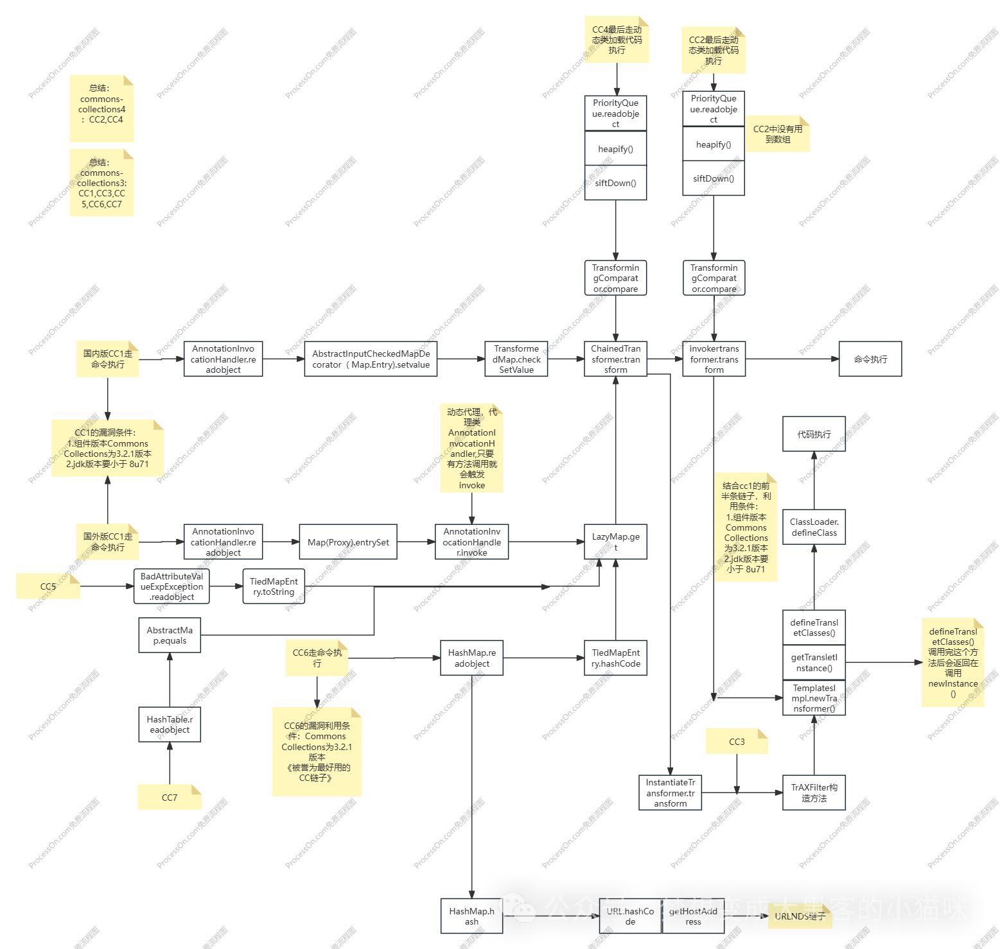

## Java安全之CC链汇总

Java 反序列化中的 CC 链（Commons Collections 链）是基于 Apache Commons Collections 库构造的一系列反序列化漏洞利用链，主要用于触发远程代码执行。随着 JDK 版本更新和 Commons Collections 库的修复，研究人员陆续提出了 7 个主要版本的 CC 链，每个版本针对不同环境（JDK 版本、Commons Collections 版本）进行适配。以下是各版本的详细分析：



图片来自文章https://mp.weixin.qq.com/s/Aq3FDhFQmS9SSlOlXAHmAA

### **1. CC-1 链**

#### **适用环境**

- Commons Collections 3.1-3.2.1
- JDK 1.7 及以下（JDK 8u71 前部分版本可利用）

#### **进入点**

`sun.reflect.annotation.AnnotationInvocationHandler`（实现`Serializable`接口，反序列化时执行`readObject`方法）。

#### **利用链**

```plaintext
AnnotationInvocationHandler.readObject()  
→ Map.Entry.setValue()（触发对Map的操作）  
→ LazyMap.get()（调用工厂类的transform方法）  
→ ChainedTransformer.transform()（链式调用多个Transformer）  
→ InvokerTransformer.transform()（反射调用Runtime.exec()）  
```

#### **执行点**

`InvokerTransformer.transform()`通过反射执行`Runtime.getRuntime().exec(cmd)`。

#### **分析**

- 核心是利用`LazyMap`的延迟加载特性：`LazyMap.get(key)`会调用`factory.transform(key)`，而`factory`被替换为`ChainedTransformer`（包含恶意 Transformer 链）。
- 依赖`AnnotationInvocationHandler`的`readObject`方法：该方法会遍历`memberValues`（一个 Map）的 entry 并调用`setValue`，若 Map 是`LazyMap`且 key 不存在，则触发`get()`方法。
- 局限性：JDK 8u71 后`AnnotationInvocationHandler`的`readObject`被修改，限制了对 Map 的操作，导致该链失效。

### **2. CC-2 链**

#### **适用环境**

- Commons Collections 4.0+（3.x 不适用，因类结构变化）
- JDK 版本无严格限制（避开对`AnnotationInvocationHandler`的修复即可）

#### **进入点**

`java.util.HashMap`（反序列化时执行`readObject`方法，会处理键值对）。

#### **利用链**

```plaintext
HashMap.readObject()  
→ HashMap.putVal()（处理entry时调用hash()）  
→ TiedMapEntry.hashCode()（调用getValue()）  
→ LazyMap.get()（触发transform）  
→ ChainedTransformer.transform()  
→ InvokerTransformer.transform()（执行命令）  
```

#### **执行点**

与 CC-1 相同，最终通过`InvokerTransformer`反射执行命令。

#### **分析**

- 针对 Commons Collections 4.x 的适配：4.x 中`LazyMap`的`get()`方法实现变化，且`TiedMapEntry`替代了部分 3.x 的逻辑。
- 利用`HashMap`的`readObject`：反序列化时会重新计算键的哈希值，若键是`TiedMapEntry`，则`hashCode()`会调用`getValue()`，进而触发`LazyMap.get()`。
- 优势：避开了`AnnotationInvocationHandler`的限制，可在更高版本 JDK 中使用（只要 Commons Collections 4.x 存在）。

### **3. CC-3 链**

#### **适用环境**

- Commons Collections 3.1-3.2.1
- JDK 1.7 及以下（依赖`TemplatesImpl`的字节码加载）

#### **进入点**

`com.sun.org.apache.xalan.internal.xsltc.trax.TrAXFilter`（构造函数接受`Templates`对象，反序列化时触发初始化）。

#### **利用链**

```plaintext
TrAXFilter.<init>()（反序列化时初始化）  
→ TemplatesImpl.newTransformer()（加载字节码）  
→ TemplatesImpl.getTransletInstance()（实例化恶意类）  
→ 恶意类静态代码块/Runtime.exec()（执行命令）  
```

#### **执行点**

恶意字节码被`TemplatesImpl`加载后，在类初始化或实例化时执行命令（通常通过静态代码块）。

#### **分析**

- 结合了`TemplatesImpl`的字节码加载能力：`TemplatesImpl`是 JDK 自带类，可通过反序列化加载恶意字节码（需构造`_bytecodes`字段）。
- 利用`TrAXFilter`的构造函数：反序列化`TrAXFilter`时会调用其构造函数，传入恶意`TemplatesImpl`对象，触发字节码加载。
- 优势：不依赖`InvokerTransformer`，可绕过对反射调用的检测，但依赖 JDK 内置类的漏洞（部分 JDK 版本已修复）。

### **4. CC-4 链**

#### **适用环境**

- Commons Collections 3.1-3.2.1
- JDK 8u71 及以上（规避`AnnotationInvocationHandler`的修复）

#### **进入点**

`java.util.PriorityQueue`（反序列化时执行`readObject`，会调用比较器的`compare`方法）。

#### **利用链**

```plaintext
PriorityQueue.readObject()  
→ PriorityQueue.heapify()（调整堆结构，调用compare()）  
→ TransformingComparator.compare()（调用transform方法）  
→ ChainedTransformer.transform()  
→ InvokerTransformer.transform()（执行命令）  
```

#### **执行点**

与 CC-1 相同，通过`InvokerTransformer`反射执行命令。

#### **分析**

- 解决 JDK 8u71 后`AnnotationInvocationHandler`失效问题：改用`PriorityQueue`作为进入点，其`readObject`会调用`heapify()`，进而触发比较器的`compare`方法。
- 核心是`TransformingComparator`：该类的`compare`方法会调用`transformer.transform()`，若`transformer`是`ChainedTransformer`，则触发恶意链。
- 优势：适配高版本 JDK，无需依赖`AnnotationInvocationHandler`。

### **5. CC-5 链**

#### **适用环境**

- Commons Collections 3.1-3.2.1
- JDK 8u71 及以上

#### **进入点**

`javax.management.BadAttributeValueExpException`（反序列化时`readObject`处理`val`字段）。

#### **利用链**

```plaintext
BadAttributeValueExpException.readObject()  
→ toString()（对val字段调用toString()）  
→ TiedMapEntry.toString()（调用getValue()）  
→ LazyMap.get()  
→ ChainedTransformer.transform()  
→ InvokerTransformer.transform()（执行命令）  
```

#### **执行点**

与 CC-1 相同，通过`InvokerTransformer`反射执行命令。

#### **分析**

- 替代`AnnotationInvocationHandler`的新进入点：`BadAttributeValueExpException`的`readObject`会对`val`字段调用`toString()`，若`val`是`TiedMapEntry`，则触发`getValue()`。
- 利用`TiedMapEntry`的`toString()`：该方法会调用`getValue()`，进而触发`LazyMap.get()`，与 CC-1 的核心逻辑一致，但进入点不同。
- 优势：`BadAttributeValueExpException`是 JDK 内置类，无特殊版本限制，适配范围广。

### **6. CC-6 链**

#### **适用环境**

- Commons Collections 3.2.1（修复了部分 3.1 的漏洞后）
- JDK 8u71 及以上

#### **进入点**

`java.util.HashMap`（同 CC-2，但利用逻辑更隐蔽）。

#### **利用链**

```plaintext
HashMap.readObject()  
→ HashMap.put()（处理entry时调用put()）  
→ HashMap.hash()（计算哈希值，调用key.hashCode()）  
→ TiedMapEntry.hashCode()（调用getValue()）  
→ LazyMap.get()  
→ ChainedTransformer.transform()  
→ InvokerTransformer.transform()（执行命令）  
```

#### **执行点**

与 CC-1 相同，通过`InvokerTransformer`反射执行命令。

#### **分析**

- 针对 Commons Collections 3.2.1 的修复：3.2.1 中`LazyMap`的`get()`方法增加了空值检查，CC-6 通过`HashMap`的`put()`和`hash()`方法触发`TiedMapEntry.hashCode()`，间接调用`LazyMap.get()`，绕过检查。
- 逻辑与 CC-2 类似，但更强调对 3.2.1 版本的适配，利用`HashMap`反序列化时的键处理流程。

### **7. CC-7 链**

#### **适用环境**

- Commons Collections 3.1-3.2.1
- JDK 1.7 及以下（依赖`InstantiateTransformer`）

#### **进入点**

`java.util.Hashtable`（反序列化时`readObject`处理键值对，调用`rehash()`）。

#### **利用链**

```plaintext
Hashtable.readObject()  
→ Hashtable.rehash()（重新哈希，调用key.hashCode()）  
→ TiedMapEntry.hashCode()（调用getValue()）  
→ LazyMap.get()  
→ ChainedTransformer.transform()  
→ InstantiateTransformer.transform()（实例化恶意类）  
→ 恶意类构造方法/Runtime.exec()（执行命令）  
```

#### **执行点**

`InstantiateTransformer.transform()`通过反射实例化恶意类，在构造方法中执行命令。

#### **分析**

- 替换`InvokerTransformer`为`InstantiateTransformer`：`InstantiateTransformer`可实例化任意类，若目标类的构造方法包含命令执行逻辑（如自定义恶意类），则可触发代码执行。
- 利用`Hashtable`的`rehash()`：反序列化时`Hashtable`会调用`rehash()`，触发键的`hashCode()`，与`TiedMapEntry`和`LazyMap`配合形成完整链。
- 优势：避开`InvokerTransformer`的检测（部分防御机制会拦截`InvokerTransformer`），但需预先定义恶意类的字节码。

## 表格汇总

| 链名称  | 核心机制 / 特点                                              | 关键入口点 (Source)             | 命令执行方式 (Sink)                           | 适用 Commons Collections 版本 |
| :------ | :----------------------------------------------------------- | :------------------------------ | :-------------------------------------------- | :---------------------------- |
| **CC1** | 最经典的基础链，利用 `AnnotationInvocationHandler`和 `TransformedMap` | `AnnotationInvocationHandler`   | `InvokerTransformer`反射调用 `Runtime.exec()` | 3.x (3.1 - 3.2.1)             |
| **CC2** | 为 **CC 4.0** 设计，使用 `PriorityQueue`和 `TemplatesImpl`加载字节码 | `PriorityQueue`                 | `TemplatesImpl`加载恶意字节码                 | 4.0                           |
| **CC3** | 在 **CC 3.x** 中绕过对 `InvokerTransformer`的直接使用，结合 `InstantiateTransformer`和 `TemplatesImpl` | `AnnotationInvocationHandler`   | `TemplatesImpl`加载恶意字节码                 | 3.x                           |
| **CC4** | **CC2 和 CC3 的结合体**，用于 CC 4.0 分支，利用 `InstantiateTransformer` | `PriorityQueue`                 | `TemplatesImpl`加载恶意字节码                 | 4.0                           |
| **CC5** | 解决 **高版本 JDK（≥8u71）** 下 `AnnotationInvocationHandler`被修复的问题，改用 `BadAttributeValueExpException`作为入口 | `BadAttributeValueExpException` | `InvokerTransformer`反射调用 `Runtime.exec()` | 3.x                           |
| **CC6** | **通用性极强**，融合CC1和URLDNS链思路，使用 `HashMap`和 `TiedMapEntry`作为入口，不依赖 `AnnotationInvocationHandler` | `HashMap`                       | `InvokerTransformer`反射调用 `Runtime.exec()` | 3.x, 4.0                      |
| **CC7** | 另一个高版本JDK的绕过链，利用 `Hashtable`的 `readObject`方法中比较key的机制触发 | `Hashtable`                     | `InvokerTransformer`反射调用 `Runtime.exec()` | 3.x                           |

## **总结：CC 链演进逻辑**

CC 链的 7 个版本核心是围绕**反序列化入口类**和**Commons Collections 库的类特性**展开，主要解决两个问题：

1. **JDK 版本适配**：随着 JDK 对`AnnotationInvocationHandler`等类的修复，不断寻找新的进入点（如`PriorityQueue`、`BadAttributeValueExpException`）。
2. **Commons Collections 版本适配**：针对库中`LazyMap`、`Transformer`等类的修复，调整调用链（如 CC-2 适配 4.x，CC-6 适配 3.2.1）。

每个版本的本质是通过构造 “反序列化入口类→触发中间类方法→调用恶意 Transformer 链→执行命令” 的流程，利用 Java 反射和序列化机制的特性实现远程代码执行。