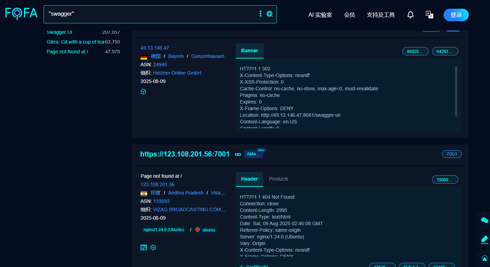
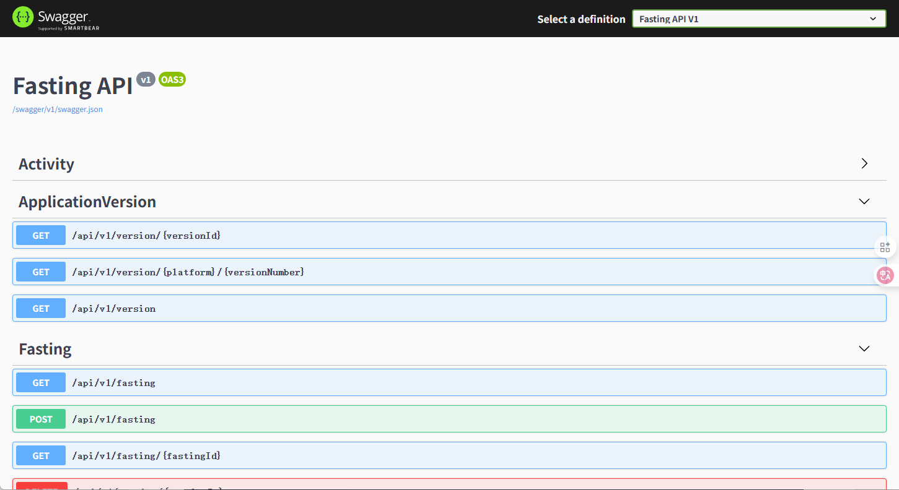

靶场：https://github.com/j3ers3/Hello-Java-Sec

下载源码后按照要求配置数据库。然后启动

如果报错，检查maven的源，尝试切换到国内源，然后重新重新加载几次。差不多就可以启动访问了。

## SPEL表达式注入

## SSTI模板注入

## SWagger

**Swagger** 是一套用于 **描述、文档化和测试 RESTful API 的工具集**，它提供了一个标准化的接口定义语言，帮助开发人员、测试人员和其他团队成员更容易地理解和操作 API。

在现代软件开发中，特别是在构建和维护 RESTful API 时，Swagger 提供了一种自动化生成接口文档、客户端代码和服务器代码的方式，极大地提高了开发效率和 API 的可维护性。

### Swagger接口泄露漏洞

**Swagger 接口漏洞** 是指由于不当配置或缺乏安全保护导致 API 文档（Swagger UI）暴露在互联网，进而可能被恶意攻击者利用，从而对系统造成安全威胁的漏洞。Swagger 通过自动生成 API 文档和提供交互式的 API 调用界面，使开发者能够快速调试和测试 API，但是如果接口文档没有得到妥善保护，就会导致敏感信息的泄露、未经授权的接口访问、恶意操作等安全风险。

#### **常见的 Swagger 接口漏洞及其安全风险**

1. **暴露敏感 API 信息**
   - **问题**：Swagger UI 会展示完整的 API 文档，包括所有的端点、请求参数、响应格式、返回状态码等。如果这些信息暴露给外部攻击者，攻击者可以通过查看文档来了解系统的内部结构，包括敏感接口，如用户认证、支付接口、数据查询接口等。
   - **危害**：攻击者能够通过接口文档发现潜在的漏洞或执行恶意请求，如利用暴露的敏感接口修改数据、获取用户信息或直接攻击系统。
2. **暴露未授权访问接口**
   - **问题**：Swagger UI 默认并不具备身份验证或权限控制。如果在生产环境中暴露 Swagger UI，任何人都可以访问 API 文档并尝试通过交互式 UI 执行接口操作，而不需要任何身份验证或授权。
   - **危害**：未经授权的用户可以利用接口直接对系统发起请求（如删除数据、修改配置、绕过身份验证等），造成数据丢失、信息泄露或其他严重后果。
3. **接口暴露未经审计的敏感功能**
   - **问题**：Swagger UI 可能会暴露一些未经审计的、潜在危险的接口，例如修改数据库、删除用户数据或远程执行命令等。如果这些接口没有进行适当的安全控制或审计，它们会成为攻击者的攻击入口。
   - **危害**：攻击者通过 Swagger UI 调用这些高权限接口，可能会使得整个系统处于危险之中。
4. **CORS 配置不当**
   - **问题**：在开发过程中，Swagger UI 可能会向后端发起跨域请求（CORS）。如果后端服务器没有正确配置 CORS 策略，Swagger UI 可能会允许来自恶意域的跨域请求。
   - **危害**：攻击者可以利用跨域请求在用户不知情的情况下发起恶意 API 请求，可能会泄露用户数据或发起不当操作。
5. **Swagger 配置不当**
   - **问题**：开发者可能在生产环境中错误地暴露了 Swagger UI，或未对其进行适当的安全配置。例如，开发环境的 Swagger 配置可能被错误地复制到生产环境中，导致 API 文档暴露。
   - **危害**：暴露的接口文档为攻击者提供了详细的 API 结构，帮助他们针对性地发起攻击。

