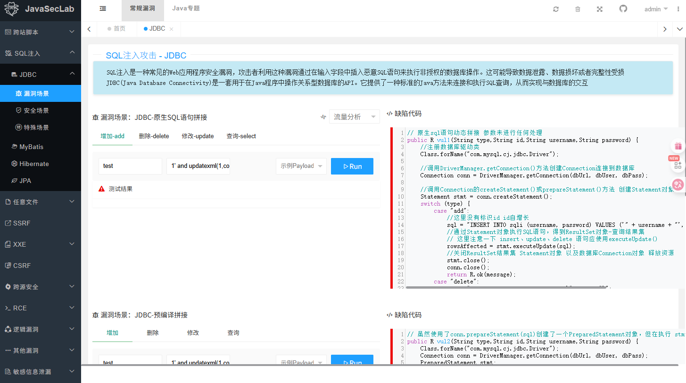

# Sql注入

学习靶场：https://github.com/whgojp/JavaSecLab

按照教程安装启动靶场后进入靶场，

## JDBC中的SQL注入

JDBC(Java Database Connectivity)是Java连接数据库的标准API。

### 易受攻击的代码示例：

```
String username = request.getParameter("username");
String password = request.getParameter("password");
String sql = "SELECT * FROM users WHERE username = '" + username + "' AND password = '" + password + "'";
Statement stmt = connection.createStatement();
ResultSet rs = stmt.executeQuery(sql);
```

如果用户输入`admin' --`作为用户名，SQL语句将变为：

```
SELECT * FROM users WHERE username = 'admin' --' AND password = ''
```

`--`是SQL注释符号，后面的条件被忽略，导致可以绕过密码验证。

### 防护措施：使用PreparedStatement

```
String sql = "SELECT * FROM users WHERE username = ? AND password = ?";
PreparedStatement pstmt = connection.prepareStatement(sql);
pstmt.setString(1, username);
pstmt.setString(2, password);
ResultSet rs = pstmt.executeQuery();
```

PreparedStatement使用参数化查询，将输入数据作为参数而非SQL语句的一部分处理，有效防止SQL注入。

### 靶场演示



运行查看

返回：

> java.sql.SQLException: XPATH syntax error: '~root@172.17.0.1~'

payload

> 1' and updatexml(1,concat(0x7e,(SELECT user()),0x7e),1) AND '1'='1
>
>  `UPDATEXML()` 函数用法：
>
> XML 字符串：
>
> ```
> <person>
>   <name>John</name>
>   <age>30</age>
> </person>
> ```
>
> 函数调用
>
> ```
> SELECT UPDATEXML('<person><name>John</name><age>30</age></person>', '/person/name', 'Alice');
> ```
>
> 这个查询会返回：
>
> ```
> xml复制编辑<person>
>   <name>Alice</name>
>   <age>30</age>
> </person>
> ```
>
> 所以这个payload：
>
> - `1'`: 结束当前字符串。
>
> - `AND`: 用来添加一个新的条件，保证 SQL 查询能够继续执行。
>
> - `updatexml(1, concat(0x7e, (SELECT user()), 0x7e), 1)`: 使用 `UPDATEXML()` 函数来获取当前数据库的用户名（通过 `user()` 函数）。将数据库的用户名包围在 `~` 符号中。
>
> - `AND '1'='1`: 保证查询的条件为真，继续执行后面的恶意代码。

分析缺陷代码

```java
// 原生sql语句动态拼接 参数未进行任何处理
public R vul1(String type,String id,String username,String password) {
    //注册数据库驱动类
    Class.forName("com.mysql.cj.jdbc.Driver");

    //调用DriverManager.getConnection()方法创建Connection连接到数据库
    Connection conn = DriverManager.getConnection(dbUrl, dbUser, dbPass);

    //调用Connection的createStatement()或prepareStatement()方法 创建Statement对象
    Statement stmt = conn.createStatement();
    switch (type) {
        case "add":
            //这里没有标识id id自增长
            sql = "INSERT INTO sqli (username, password) VALUES ('" + username + "', '" + password + "')";
            //通过Statement对象执行SQL语句，得到ResultSet对象-查询结果集
            // 这里注意一下 insert、update、delete 语句应使用executeUpdate()
            rowsAffected = stmt.executeUpdate(sql);
            //关闭ResultSet结果集 Statement对象 以及数据库Connection对象 释放资源
            stmt.close();
            conn.close();
            return R.ok(message);
        case "delete":
            sql = "DELETE FROM users WHERE id = '" + id + "'";
            rowsAffected = stmt.executeUpdate(sql);
            ...
        case "update":
            sql = "UPDATE sqli SET password = '" + password + "', username = '" + username + "' WHERE id = '" + id + "'";
            rowsAffected = stmt.executeUpdate(sql);
            ...
        case "select":
            sql = "SELECT * FROM users WHERE id  = " + id;
            ResultSet rs = stmt.executeQuery(sql);
            ...
        }
}
```

在这段代码中，SQL 查询是通过 **字符串拼接** 的方式生成的。

> sql = "INSERT INTO sqli (username, password) VALUES ('" + username + "', '" + password + "')";

这是代码中查询通过拼接字符串构成

插入payload后：

> INSERT INTO sqli (username, password) VALUES ('1' and updatexml(1, concat(0x7e, (SELECT user()), 0x7e), 1) AND '1'='1', 'password123');

然后mysql直接执行上面的语句，发生sql注入

### **JDBC - 预编译语句拼接**

代码片段如下：

```
public R vul2(String type, String id, String username, String password) {
    // 注册数据库驱动类
    Class.forName("com.mysql.cj.jdbc.Driver");

    // 创建数据库连接
    Connection conn = DriverManager.getConnection(dbUrl, dbUser, dbPass);

    // 创建Statement对象
    Statement stmt = conn.createStatement();
    switch (type) {
        case "add":
            sql = "INSERT INTO sqli (username, password) VALUES ('" + username + "', '" + password + "')";
            rowsAffected = stmt.executeUpdate(sql);
            break;
        case "delete":
            sql = "DELETE FROM users WHERE id = '" + id + "'";
            rowsAffected = stmt.executeUpdate(sql);
            break;
        case "update":
            sql = "UPDATE sqli SET username = '" + username + "', password = '" + password + "' WHERE id = '" + id + "'";
            rowsAffected = stmt.executeUpdate(sql);
            break;
        case "select":
            sql = "SELECT * FROM users WHERE id = " + id;
            ResultSet rs = stmt.executeQuery(sql);
            break;
    }
    stmt.close();
    conn.close();
}
```

#### **分析：**

- 这里的 `INSERT`, `DELETE`, `UPDATE`, `SELECT` SQL 查询是通过 **直接拼接** 用户输入（如 `username`, `password`, `id`）来构建的。

- **SQL 注入风险**：如果攻击者输入特定的恶意字符串，例如：

  - `username = 'admin' --` 或 `password = 'anything'`，查询会变为：

    ```
    INSERT INTO sqli (username, password) VALUES ('admin' --', 'anything');
    ```

    `--` 是 SQL 的注释符号，这会导致后面的密码部分被注释掉，从而跳过验证。

  - `id = '1 OR 1=1 --` 可以使 `DELETE` 或 `SELECT` 查询执行恶意操作。

#### **防范方法：**

### **JdbcTemplate 拼接 SQL 查询（不安全）**

```
String sql = "INSERT INTO sqli (username, password) VALUES ('" + username + "', '" + password + "')";
JdbcTemplate jdbcTemplate = new JdbcTemplate();
jdbcTemplate.execute(sql);
```

#### **分析：**

此场景类似于第一个场景，但是使用了 **JdbcTemplate** 作为数据库操作工具。尽管 `JdbcTemplate` 是 Spring 提供的数据库访问工具，它并没有自动防止 SQL 注入攻击。如果开发者仍然使用字符串拼接来构建 SQL 查询，则存在同样的风险。

- **SQL 注入风险**：和第一个场景一样，攻击者仍然可以利用拼接方式注入恶意 SQL 代码。

#### **防范措施：**

- 使用 **NamedParameterJdbcTemplate** 或 **JdbcTemplate** 的参数化查询功能，避免直接拼接 SQL 查询。例如：

  ```
  String sql = "INSERT INTO sqli (username, password) VALUES (:username, :password)";
  Map<String, Object> params = new HashMap<>();
  params.put("username", username);
  params.put("password", password);
  jdbcTemplate.update(sql, params);
  ```

### 防范

使用预编译：

查看安全场景的情况

对于上面提到的三个场景，都是存在sql注入的；需要使用预编译进行防护

JDBC预编译

```
 sql = "INSERT INTO users (username, password) VALUES (?, ?)"; 
            stmt = conn.prepareStatement(sql);
            // 参数化处理
            stmt.setString(ueditor, username); 
            stmt.setString(2, password);
            // 使用预编译时 不需要传递sql语句
            rowsAffected = stmt.executeUpdate()
```

JdbcTemplate预编译

```
sql = "INSERT INTO sqli (username, password) VALUES (?,?)";
rowsAffected = jdbctemplate.update(sql, username, password);
```

自定义黑名单-用户输入过滤

检测用户输入是否存在敏感字符：'、;、--、+、,、%、=、>、<、*、(、)、and、or、exeinsert、select、delete、update、count、drop、chr、midmaster、truncate、char、declare

## Mybatis

MyBatis支持两种参数符号，一种是#，另一种是$，#使用预编译，$使用拼接SQL。

1、order by注入：由于使用#{}会将对象转成字符串，形成order by "user" desc造成错误，因此很多研发会采用${}来解决，从而造成注入.

2、like 注入：模糊搜索时，直接使用'%#{q}%' 会报错，部分研发图方便直接改成'%${q}%'从而造成注入.

3、in注入：in之后多个id查询时使用#同样会报错，从而造成注入.

# MyBatis SQL注入安全问题详解

MyBatis 是一个优秀的持久层框架，支持定制化 SQL、存储过程以及高级映射，但在使用不当的情况下，仍然可能存在 SQL 注入风险。

## 一、MyBatis 中 SQL 注入的产生原因

SQL 注入主要发生在 MyBatis 使用动态 SQL 时，特别是当开发者不正确地拼接 SQL 语句时。主要风险点包括：

1. **使用 `${}` 进行字符串拼接**
   - MyBatis 中 `${}` 是直接替换变量内容到 SQL 中
   - `#{}` 是使用预编译参数化查询

2. **不安全的动态 SQL 构建**
   - 使用不安全的动态标签如 `<if>`, `<choose>`, `<when>`, `<otherwise>` 时
   - 不正确的 `ORDER BY` 或 `GROUP BY` 动态处理

## 二、常见的 MyBatis SQL 注入场景

### 1. 直接使用 `${}` 拼接 SQL

```java
@Select("SELECT * FROM users WHERE name = '${name}'")
List<User> findByName(@Param("name") String name);
```

攻击者可以传入 `name` 值为 `' OR '1'='1` 导致注入。

### 2. 不安全的 ORDER BY 动态排序

```xml
<select id="getUsers" resultType="User">
    SELECT * FROM users
    ORDER BY ${columnName}
</select>
```

攻击者可控制 `columnName` 传入恶意值如 `"name; DROP TABLE users; --"`

### 3. 动态表名/列名使用 `${}`

```xml
<select id="queryByTable" resultType="map">
    SELECT * FROM ${tableName}
    WHERE id = #{id}
</select>
```

### 4. 不安全的 LIKE 查询

```xml
<select id="search" resultType="User">
    SELECT * FROM users
    WHERE name LIKE '%${keyword}%'
</select>
```

## 三、MyBatis SQL 注入防御措施

### 1. 优先使用 `#{}` 而非 `${}`

```java
@Select("SELECT * FROM users WHERE name = #{name}")
List<User> findByName(@Param("name") String name);
```

### 2. 必须使用 `${}` 时的安全处理

对于表名、列名等无法使用参数化查询的情况：

- 使用白名单校验
- 进行严格的输入验证
- 使用枚举限制可选值

```java
// 白名单校验示例
private static final Set<String> ALLOWED_COLUMNS = 
    Set.of("id", "name", "email", "create_time");

public String validateColumnName(String columnName) {
    if (!ALLOWED_COLUMNS.contains(columnName)) {
        throw new IllegalArgumentException("Invalid column name");
    }
    return columnName;
}
```

### 3. 安全的 LIKE 查询写法

```xml
<select id="search" resultType="User">
    SELECT * FROM users
    WHERE name LIKE CONCAT('%', #{keyword}, '%')
</select>
```

### 4. 使用 MyBatis 的安全动态 SQL 标签

```xml
<select id="getUsers" resultType="User">
    SELECT * FROM users
    <where>
        <if test="name != null">
            AND name = #{name}
        </if>
        <if test="email != null">
            AND email = #{email}
        </if>
    </where>
</select>
```

### 5. 使用拦截器进行全局检查

可以自定义 MyBatis 拦截器，检查 SQL 中是否包含 `${}` 的不安全使用：

```java
@Intercepts({@Signature(type= StatementHandler.class, method="prepare", args={Connection.class, Integer.class})})
public class SqlInjectionInterceptor implements Interceptor {
    @Override
    public Object intercept(Invocation invocation) throws Throwable {
        StatementHandler statementHandler = (StatementHandler) invocation.getTarget();
        BoundSql boundSql = statementHandler.getBoundSql();
        String sql = boundSql.getSql();
        
        if (sql.contains("${")) {
            throw new RuntimeException("Potential SQL injection risk: ${} usage detected");
        }
        
        return invocation.proceed();
    }
}
```

## 四、最佳实践建议

1. **代码审查**：定期检查项目中 `${}` 的使用情况
2. **静态代码分析**：使用工具如 SonarQube 检测潜在 SQL 注入
3. **最小权限原则**：数据库账户只授予必要权限
4. **日志监控**：记录和监控异常 SQL 查询
5. **ORM 使用规范**：制定团队 MyBatis 使用规范

## 五、总结

MyBatis 本身是安全的，但开发者错误的使用方式会导致 SQL 注入风险。关键在于：

- 理解 `${}` 和 `#{}` 的区别
- 避免用户输入直接参与 SQL 拼接
- 必须使用动态 SQL 时实施严格的安全控制
- 建立代码审查和安全测试流程


# Hibernate SQL注入安全问题详解

Hibernate 是一个广泛使用的 ORM（对象关系映射）框架，虽然它提供了抽象层来操作数据库，但如果使用不当，仍然可能存在 SQL 注入风险。

## 一、Hibernate 中 SQL 注入的产生原因

Hibernate 提供了多种数据查询方式，每种方式在不正确使用时都可能引入注入漏洞：

1. **HQL（Hibernate Query Language）注入**
   - 当使用字符串拼接方式构造 HQL 查询时
   - 未正确使用参数化查询

2. **原生 SQL 查询注入**
   - 直接使用字符串拼接构造原生 SQL 语句

3. **Criteria API 的不安全使用**
   - 虽然相对安全，但某些复杂场景仍可能存在问题

4. **不安全的投影（Projection）和排序（Order）**

## 二、常见的 Hibernate SQL 注入场景

### 1. HQL 字符串拼接注入

```java
// 不安全的HQL查询
String hql = "FROM User WHERE username = '" + username + "'";
Query<User> query = session.createQuery(hql, User.class);
List<User> results = query.list();
```

攻击者可传入 `username` 值为 `admin' OR '1'='1` 导致注入。

### 2. 原生 SQL 拼接注入

```java
// 不安全的原生SQL查询
String sql = "SELECT * FROM users WHERE username = '" + username + "'";
SQLQuery query = session.createSQLQuery(sql);
List results = query.list();
```

### 3. 不安全的排序参数

```java
String sortOrder = request.getParameter("sort"); // 用户可控
String hql = "FROM User ORDER BY " + sortOrder;
Query<User> query = session.createQuery(hql, User.class);
```

攻击者可传入 `sort` 值为 `id; DROP TABLE users; --`。

### 4. 不安全的命名参数使用

虽然命名参数通常安全，但错误使用仍可能有问题：

```java
// 错误示例 - 参数名拼接
String paramName = "username"; // 假设来自用户输入
String hql = "FROM User WHERE " + paramName + " = :value";
Query<User> query = session.createQuery(hql, User.class);
query.setParameter("value", someValue);
```

## 三、Hibernate SQL 注入防御措施

### 1. 使用参数化查询（推荐方式）

#### 对于 HQL：

```java
// 使用命名参数
String hql = "FROM User WHERE username = :username";
Query<User> query = session.createQuery(hql, User.class);
query.setParameter("username", username);

// 或使用位置参数
String hql = "FROM User WHERE username = ?1";
Query<User> query = session.createQuery(hql, User.class);
query.setParameter(1, username);
```

#### 对于原生 SQL：

```java
String sql = "SELECT * FROM users WHERE username = ?";
SQLQuery query = session.createSQLQuery(sql);
query.setParameter(0, username);
```

### 2. 使用 Criteria API（更安全的选择）

```java
CriteriaBuilder builder = session.getCriteriaBuilder();
CriteriaQuery<User> criteria = builder.createQuery(User.class);
Root<User> root = criteria.from(User.class);

// 添加查询条件
criteria.select(root).where(builder.equal(root.get("username"), username));

List<User> results = session.createQuery(criteria).getResultList();
```

### 3. 必须使用动态排序时的安全处理

```java
// 定义允许排序的字段白名单
Set<String> allowedSortFields = Set.of("id", "username", "createTime");

String sortField = request.getParameter("sort");
Sort.Direction direction = Sort.Direction.fromString(request.getParameter("dir"));

if (!allowedSortFields.contains(sortField)) {
    throw new IllegalArgumentException("Invalid sort field");
}

// 使用Criteria API安全排序
CriteriaBuilder builder = session.getCriteriaBuilder();
CriteriaQuery<User> criteria = builder.createQuery(User.class);
Root<User> root = criteria.from(User.class);

criteria.select(root);
criteria.orderBy(direction == Sort.Direction.ASC ? 
    builder.asc(root.get(sortField)) : builder.desc(root.get(sortField)));

List<User> results = session.createQuery(criteria).getResultList();
```

### 4. 使用 Hibernate 过滤器（Filter）

对于需要动态添加条件的场景，可以使用 Hibernate 过滤器：

```java
// 定义过滤器
@FilterDef(name = "usernameFilter", parameters = @ParamDef(name = "username", type = "string"))
@Filter(name = "usernameFilter", condition = "username = :username")

// 使用过滤器
session.enableFilter("usernameFilter").setParameter("username", username);
```

### 5. 输入验证和过滤

对所有用户提供的输入进行严格验证：

```java
// 验证用户名只包含允许的字符
if (!username.matches("[a-zA-Z0-9_]+")) {
    throw new IllegalArgumentException("Invalid username");
}
```

## 四、Hibernate 最佳安全实践

1. **避免字符串拼接**：永远不要直接拼接用户输入到 HQL 或 SQL 中
2. **使用类型安全 API**：优先使用 Criteria API 或 QueryDSL
3. **最小权限原则**：数据库账户只授予必要权限
4. **启用 Hibernate 日志**：监控生成的 SQL 语句
5. **定期安全审计**：检查项目中的 HQL/SQL 查询
6. **使用安全框架**：如 Spring Data JPA 可以进一步减少风险
7. **升级 Hibernate**：使用最新版本以获得安全修复

## 五、Hibernate 与 JPA 的注意事项

使用 JPA（Java Persistence API）时，同样需要注意：

```java
// 不安全的JPA查询
String jpql = "SELECT u FROM User u WHERE u.username = '" + username + "'";
TypedQuery<User> query = entityManager.createQuery(jpql, User.class);

// 安全的JPA查询
String jpql = "SELECT u FROM User u WHERE u.username = :username";
TypedQuery<User> query = entityManager.createQuery(jpql, User.class);
query.setParameter("username", username);
```

## 六、总结

Hibernate 提供了多种防止 SQL 注入的机制，但关键在于开发者的正确使用：

1. 永远优先使用参数化查询（命名参数或位置参数）
2. 对于动态部分（如表名、列名），使用白名单验证
3. 考虑使用更类型安全的 Criteria API 或 QueryDSL
4. 实施严格的输入验证
5. 定期进行安全代码审查

通过遵循这些原则，可以充分利用 Hibernate 的优势同时保持应用程序的安全性。

 

# JPA (Java Persistence API) SQL注入安全问题详解

JPA 作为 Java EE 的持久化标准，被 Hibernate、EclipseLink 等 ORM 框架实现，虽然提供了抽象层来操作数据库，但不当使用仍可能导致 SQL 注入风险。

## 一、JPA 中 SQL 注入的产生原因

### 1. JPQL (Java Persistence Query Language) 注入
- 字符串拼接构造 JPQL 查询
- 未正确使用参数化查询

### 2. 原生 SQL (Native Query) 注入
- 直接拼接用户输入到原生 SQL 语句
- 不安全的动态 SQL 构造

### 3. 不安全的排序和分页参数
- 用户控制的排序字段直接拼接到查询中
- 不安全的动态表名/列名处理

### 4. 不安全的实体管理器操作
- 直接使用字符串拼接构造查询条件

## 二、常见的 JPA SQL 注入场景

### 1. JPQL 字符串拼接注入

```java
// 不安全的JPQL查询
String jpql = "SELECT u FROM User u WHERE u.username = '" + username + "'";
TypedQuery<User> query = entityManager.createQuery(jpql, User.class);
List<User> results = query.getResultList();
```

攻击者可传入 `username` 值为 `admin' OR '1'='1` 导致注入。

### 2. 原生 SQL 拼接注入

```java
// 不安全的原生SQL查询
String sql = "SELECT * FROM users WHERE username = '" + username + "'";
Query query = entityManager.createNativeQuery(sql);
List results = query.getResultList();
```

### 3. 不安全的排序参数

```java
String sortField = request.getParameter("sort"); // 用户可控
String jpql = "SELECT u FROM User u ORDER BY u." + sortField;
TypedQuery<User> query = entityManager.createQuery(jpql, User.class);
```

攻击者可传入 `sort` 值为 `id; DROP TABLE users; --`。

### 4. 不安全的动态条件构造

```java
// 不安全的条件拼接
String condition = " AND u.role = '" + userRole + "'";
String jpql = "SELECT u FROM User u WHERE 1=1" + condition;
TypedQuery<User> query = entityManager.createQuery(jpql, User.class);
```

## 三、JPA SQL 注入防御措施

### 1. 使用参数化查询（推荐方式）

#### 命名参数：

```java
String jpql = "SELECT u FROM User u WHERE u.username = :username";
TypedQuery<User> query = entityManager.createQuery(jpql, User.class);
query.setParameter("username", username);
```

#### 位置参数：

```java
String jpql = "SELECT u FROM User u WHERE u.username = ?1";
TypedQuery<User> query = entityManager.createQuery(jpql, User.class);
query.setParameter(1, username);
```

### 2. 原生 SQL 查询的参数化

```java
String sql = "SELECT * FROM users WHERE username = ?";
Query query = entityManager.createNativeQuery(sql);
query.setParameter(1, username);
```

### 3. 使用 Criteria API（类型安全查询）

```java
CriteriaBuilder cb = entityManager.getCriteriaBuilder();
CriteriaQuery<User> cq = cb.createQuery(User.class);
Root<User> root = cq.from(User.class);

// 添加查询条件
cq.select(root).where(cb.equal(root.get("username"), username));

TypedQuery<User> query = entityManager.createQuery(cq);
List<User> results = query.getResultList();
```

### 4. 动态排序的安全处理

```java
// 定义允许排序的字段白名单
Set<String> allowedSortFields = Set.of("id", "username", "createTime");

String sortField = request.getParameter("sort");
if (!allowedSortFields.contains(sortField)) {
    throw new IllegalArgumentException("Invalid sort field");
}

// 使用Criteria API安全排序
CriteriaBuilder cb = entityManager.getCriteriaBuilder();
CriteriaQuery<User> cq = cb.createQuery(User.class);
Root<User> root = cq.from(User.class);

cq.select(root);
cq.orderBy(cb.asc(root.get(sortField))); // 或 cb.desc()

TypedQuery<User> query = entityManager.createQuery(cq);
List<User> results = query.getResultList();
```

### 5. Spring Data JPA 的安全使用

#### 不安全的方式：

```java
@Query("SELECT u FROM User u WHERE u.username = ?1 AND u.role = '" + role + "'")
List<User> findByUsernameAndRole(String username, String role);
```

#### 安全的方式：

```java
@Query("SELECT u FROM User u WHERE u.username = ?1 AND u.role = ?2")
List<User> findByUsernameAndRole(String username, String role);

// 或使用命名参数
@Query("SELECT u FROM User u WHERE u.username = :username AND u.role = :role")
List<User> findByUsernameAndRole(
    @Param("username") String username, 
    @Param("role") String role);
```

### 6. 输入验证和过滤

```java
// 验证用户名只包含允许的字符
if (!username.matches("[a-zA-Z0-9_]+")) {
    throw new IllegalArgumentException("Invalid username");
}
```

## 四、JPA 最佳安全实践

1. **永远使用参数化查询**：避免任何形式的字符串拼接
2. **优先使用 Criteria API**：类型安全的查询构建方式
3. **动态部分使用白名单**：如表名、列名等
4. **最小权限原则**：数据库账户只授予必要权限
5. **启用 SQL 日志**：监控生成的 SQL 语句
6. **使用最新版本**：保持 JPA 实现框架更新
7. **静态代码分析**：使用工具检测潜在问题

## 五、特殊场景处理

### 1. 动态表名处理

```java
// 定义允许的表名白名单
Set<String> allowedTables = Set.of("users", "products", "orders");

String tableName = request.getParameter("table");
if (!allowedTables.contains(tableName)) {
    throw new IllegalArgumentException("Invalid table name");
}

String sql = "SELECT * FROM " + tableName + " WHERE id = ?";
Query query = entityManager.createNativeQuery(sql);
query.setParameter(1, id);
```

### 2. IN 子句的安全处理

```java
// 不安全的方式
String ids = "1,2,3"; // 来自用户输入
String jpql = "SELECT u FROM User u WHERE u.id IN (" + ids + ")";

// 安全的方式
List<Long> idList = Arrays.asList(1L, 2L, 3L);
String jpql = "SELECT u FROM User u WHERE u.id IN :ids";
TypedQuery<User> query = entityManager.createQuery(jpql, User.class);
query.setParameter("ids", idList);
```

## 六、总结

JPA 注入防护的核心原则：

1. **绝不信任用户输入**：所有输入必须验证和过滤
2. **使用参数化查询**：无论是 JPQL 还是原生 SQL
3. **优先使用类型安全 API**：Criteria API 或 QueryDSL
4. **动态部分严格限制**：使用白名单机制
5. **保持框架更新**：及时应用安全补丁
