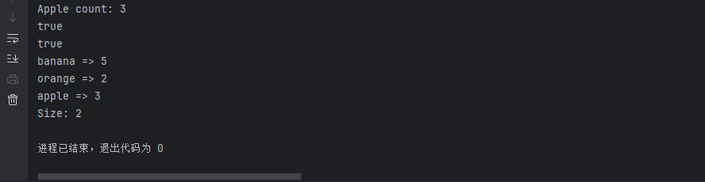
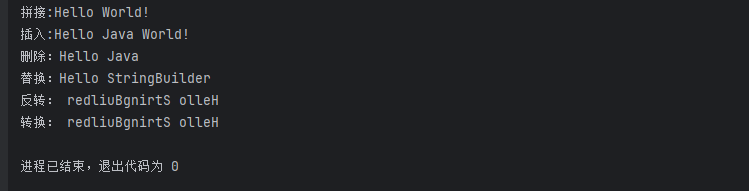

# 基础学习

## HashMap

`HashMap` 是 Java 集合框架中的一个 **哈希表（散列表）实现**，用于存储**键值对（key-value）**。

它的特点是：

- **键唯一**，值可以重复
- 查询、插入、删除操作的时间复杂度通常是 **O(1)**
- 允许存储 `null` 键和 `null` 值（键最多一个为 null）

基础用法：

```java
import java.util.HashMap;

public class Demo {
    public static void main(String[] args) {
        HashMap<String, Integer> map = new HashMap<>();

        // 添加元素
        map.put("apple", 3);
        map.put("banana", 5);
        map.put("orange", 2);

        // 获取元素
        int appleCount = map.get("apple"); // 返回 3
        System.out.println("Apple count: " + appleCount);

        // 判断键或值是否存在
        System.out.println(map.containsKey("banana")); // true
        System.out.println(map.containsValue(5)); // true

        // 遍历
        for (String key : map.keySet()) {
            System.out.println(key + " => " + map.get(key));
        }

        // 删除元素
        map.remove("banana");

        // 大小
        System.out.println("Size: " + map.size());
    }
}

```

运行结果：



### ⚠️ 注意事项

| 项目                                | 说明                                             |
| ----------------------------------- | ------------------------------------------------ |
| 不保证顺序                          | 插入顺序不会被保留，如需顺序，用 `LinkedHashMap` |
| 线程不安全                          | 多线程场景下使用 `ConcurrentHashMap` 替代        |
| 键需实现 `hashCode()` 与 `equals()` | 否则可能无法正确定位元素                         |
| null                                | 键最多允许一个为 `null`，值可以有多个为 `null`   |


## StringBuilder

`StringBuilder` 是 Java 中用于**构建可变字符串**的类，位于 `java.lang` 包中。它在需要频繁修改字符串内容（如拼接、插入、删除等）的场景下，性能远优于 `String`。

### 🆚 与 `String` 和 `StringBuffer` 的对比

| 类名            | 可变性 | 线程安全               | 性能                           |
| --------------- | ------ | ---------------------- | ------------------------------ |
| `String`        | 不可变 | 线程安全（因为不可变） | 最慢（每次操作都会创建新对象） |
| `StringBuilder` | 可变   | **不线程安全**         | 最快，适合单线程               |
| `StringBuffer`  | 可变   | **线程安全**           | 较慢，适合多线程               |

```java
package sec.basec.yufa.String_Builder;

public class Demo {
    public static void main(String[] args) {
        StringBuilder sb = new StringBuilder();

        // 添加内容（拼接）
        sb.append("Hello");
        sb.append(" ");
        sb.append("World!");
        System.out.println("拼接:"+sb);

        // 插入
        sb.insert(6, "Java ");
        System.out.println("插入:"+sb);

        // 删除
        sb.delete(11, 17); // 删除 "World"
        System.out.println("删除："+sb);

        // 替换
        sb.replace(6, 10, "StringBuilder");
        System.out.println("替换："+sb);

        // 反转
        sb.reverse();
        System.out.println("反转："+sb);

        // 转换为 String
        String result = sb.toString();
        System.out.println("转换："+sb);

//        System.out.println(result);  // 输出反转后的字符串
    }
}
```



## StringBuffer

`StringBuffer` 是 Java 中用于操作 **可变字符串** 的类，它的功能和 `StringBuilder` 基本相同，但**线程安全**。

### 核心特点

| 特点     | 描述                                                         |
| -------- | ------------------------------------------------------------ |
| 可变性   | 字符串内容可以修改，不像 `String` 一样每次生成新对象         |
| 线程安全 | 所有方法基本都使用了 `synchronized` 修饰，**适合多线程环境** |
| 效率略低 | 因为加了线程锁，在单线程下性能不如 `StringBuilder`           |

```java
public class Demo {
    public static void main(String[] args) {
        StringBuffer sb = new StringBuffer("Hello");

        // 追加字符串
        sb.append(" World");

        // 插入内容
        sb.insert(6, "Java ");

        // 替换部分内容
        sb.replace(6, 10, "StringBuffer");

        // 删除内容
        sb.delete(0, 6);

        // 反转字符串
        sb.reverse();

        // 输出结果
        System.out.println(sb.toString());  // 输出反转后的字符串
    }
}
```

## IO流

> Java 中的 IO（Input/Output）流是用来处理**数据的输入与输出**的机制，是 Java 编程中非常核心的部分之一，常用于**读写文件、网络通信、控制台交互**等。
>
> ------
>
> ## 🧩 一、Java IO 流的分类
>
> Java IO 流分为以下四大类：
>
> | 类型       | 字节流（8位）  | 字符流（16位） |
> | ---------- | -------------- | -------------- |
> | 输入（读） | `InputStream`  | `Reader`       |
> | 输出（写） | `OutputStream` | `Writer`       |
>
> 
>
> ### ✅ 选择规则：
>
> - 处理**二进制数据**（如图片、音频、文件）：用 **字节流**
> - 处理**文本数据**：用 **字符流**
>
> ------
>
> ## 📦 二、常用类（继承体系）
>
> ### 1. 字节流
>
> | 类名                   | 描述                           |
> | ---------------------- | ------------------------------ |
> | `FileInputStream`      | 读取文件的字节流               |
> | `FileOutputStream`     | 写入文件的字节流               |
> | `BufferedInputStream`  | 带缓冲的字节输入流（提高效率） |
> | `BufferedOutputStream` | 带缓冲的字节输出流             |
> | `ObjectInputStream`    | 用于反序列化对象               |
> | `ObjectOutputStream`   | 用于序列化对象                 |
>
> 
>
> ### 2. 字符流
>
> | 类名                 | 描述                                    |
> | -------------------- | --------------------------------------- |
> | `FileReader`         | 读取文件的字符流                        |
> | `FileWriter`         | 写入文件的字符流                        |
> | `BufferedReader`     | 带缓冲的字符输入流（支持 `readLine()`） |
> | `BufferedWriter`     | 带缓冲的字符输出流                      |
> | `InputStreamReader`  | 字节流 → 字符流的桥梁                   |
> | `OutputStreamWriter` | 字符流 → 字节流的桥梁                   |
>
> 
>
> ------
>
> ## 🛠 三、基本使用示例
>
> ### 示例1：使用字符流读取文件内容（推荐方式）
>
> ```
> java复制编辑import java.io.*;
> 
> public class ReadFileDemo {
>     public static void main(String[] args) throws IOException {
>         try (BufferedReader reader = new BufferedReader(new FileReader("example.txt"))) {
>             String line;
>             while ((line = reader.readLine()) != null) {
>                 System.out.println(line);
>             }
>         }
>     }
> }
> ```
>
> ### 示例2：使用字节流写入文件内容
>
> ```
> java复制编辑import java.io.*;
> 
> public class WriteFileDemo {
>     public static void main(String[] args) throws IOException {
>         try (FileOutputStream fos = new FileOutputStream("output.bin")) {
>             String data = "Hello, IO!";
>             fos.write(data.getBytes()); // 字符串转字节
>         }
>     }
> }
> ```
>
> ------
>
> ## 🧠 四、IO 流的设计原则
>
> 1. **面向抽象（接口/父类）编程**：例如接受 `InputStream` 而非具体类。
> 2. **装饰者模式（Decorator）**：`BufferedReader` 是对 `Reader` 的包装。
> 3. **关闭资源使用 try-with-resources**（JDK 7+）。
>
> ------
>
> ## ⚙️ 五、使用场景举例
>
> | 场景                         | 推荐使用                                   |
> | ---------------------------- | ------------------------------------------ |
> | 读写文本文件                 | `BufferedReader` / `BufferedWriter`        |
> | 读写二进制文件（图片、视频） | `FileInputStream` / `FileOutputStream`     |
> | 对象持久化                   | `ObjectOutputStream` / `ObjectInputStream` |
> | 网络通信（低级）             | `InputStream` / `OutputStream`             |
> | 字节转字符（带编码）         | `InputStreamReader` / `OutputStreamWriter` |
>
> 
>
> ------
>
> ## 🔒 六、注意事项
>
> - 文件读写前建议判断文件是否存在
> - 流使用后要**关闭**（或用 try-with-resources 自动关闭）
> - 字符流编码问题可能会导致乱码，推荐显式指定编码，例如：
>
> ```
> java
> 
> 
> 复制编辑
> new InputStreamReader(new FileInputStream("file.txt"), "UTF-8");
> ```

## Object

> ##  一、什么是 `Object` 类？
>
> `Object` 是 Java 中所有类的**直接或间接父类**，也就是说：
>
> > **每一个类**，如果没有显式继承其他类，**默认就继承 `Object`**。
>
> ```
> java复制编辑public class MyClass {
>     // 等同于：public class MyClass extends Object
> }
> ```
>
> ------
>
> ## 📦 二、`Object` 类中有哪些常用方法？
>
> `Object` 提供了一组基础方法，所有 Java 对象都可以使用或重写：
>
> | 方法名                                | 作用                                            |
> | ------------------------------------- | ----------------------------------------------- |
> | `equals(Object obj)`                  | 比较两个对象是否“相等”                          |
> | `hashCode()`                          | 返回对象的哈希码，用于哈希结构如 `HashMap`      |
> | `toString()`                          | 返回对象的字符串表示                            |
> | `getClass()`                          | 获取运行时类对象                                |
> | `clone()`                             | 创建并返回对象副本（需要实现 `Cloneable` 接口） |
> | `finalize()`                          | 对象被 GC 回收前调用（不推荐使用）              |
> | `wait()` / `notify()` / `notifyAll()` | 线程通信相关，配合 `synchronized` 使用          |
>
> 
>
> ------
>
> ## 🧠 三、重点方法详解
>
> ### 1. `equals(Object obj)`
>
> 默认实现是“**地址比较**”，如果你想比较内容，要重写：
>
> ```
> java复制编辑@Override
> public boolean equals(Object obj) {
>     if (this == obj) return true;
>     if (obj == null || getClass() != obj.getClass()) return false;
>     MyClass other = (MyClass) obj;
>     return this.id == other.id;
> }
> ```
>
> ### 2. `hashCode()`
>
> 配合 `equals()` 使用，常用于 `HashMap`, `HashSet` 等结构。
>
> > **规则：** 如果两个对象 `equals()` 相等，则它们的 `hashCode()` 也必须相等。
>
> ```
> java复制编辑@Override
> public int hashCode() {
>     return Objects.hash(id, name);
> }
> ```
>
> ### 3. `toString()`
>
> 默认返回的是类名 + 哈希码（如 `MyClass@1a2b3c`），通常会被重写用于打印信息：
>
> ```
> java复制编辑@Override
> public String toString() {
>     return "User{id=" + id + ", name='" + name + "'}";
> }
> ```
>
> ### 4. `getClass()`
>
> 返回当前对象的 `Class` 类型：
>
> ```
> java复制编辑Object obj = new String("hello");
> System.out.println(obj.getClass()); // class java.lang.String
> ```
>
> ------
>
> ## 🧪 四、Object 示例代码
>
> ```
> java复制编辑public class User {
>     int id;
>     String name;
> 
>     public User(int id, String name) {
>         this.id = id;
>         this.name = name;
>     }
> 
>     @Override
>     public boolean equals(Object obj) {
>         if (this == obj) return true;
>         if (!(obj instanceof User)) return false;
>         User other = (User) obj;
>         return this.id == other.id && this.name.equals(other.name);
>     }
> 
>     @Override
>     public int hashCode() {
>         return id + name.hashCode();
>     }
> 
>     @Override
>     public String toString() {
>         return "User{id=" + id + ", name='" + name + "'}";
>     }
> }
> ```
>
> ------
>
> ## 🏗 五、`Object` 的使用场景
>
> | 场景                   | 说明                                     |
> | ---------------------- | ---------------------------------------- |
> | 泛型容器中存储任意对象 | 如 `List<Object>`、`Map<Object, Object>` |
> | 类型转换               | 使用 `instanceof` + 强制类型转换         |
> | 反射                   | 使用 `getClass()`、`Class.forName()`     |
> | 多态                   | 方法参数为 `Object` 时可接受任意类型     |
>
> 
>
> ------
>
> ## ❗ 六、注意事项
>
> 1. 如果你要使用 `HashMap` 存储自定义类的键，一定要重写 `equals()` 和 `hashCode()`
> 2. 如果你要打印对象信息，一定要重写 `toString()`
> 3. `clone()` 是浅拷贝，通常不推荐直接用；建议使用拷贝构造函数或自定义 `clone()` 方法
> 4. `finalize()` 方法已被废弃，不推荐使用
>
> ------
>
> ## 🔚 总结一句话：
>
> > **`Object` 是 Java 世界的祖先，掌握它的常用方法，是写好类和集合的基础。**


## 🚪 1. Servlet（服务端程序入口）

### ✅ 概念：

`Servlet` 是 **Java Web 的核心组件**，是运行在服务器端的 Java 类，用于接收和响应浏览器请求。

### 📦 作用：

- 接收请求（HTTP 请求）
- 处理业务逻辑
- 生成响应（HTML、JSON 等）

### 🧱 生命周期：

由容器（如 Tomcat）管理：

1. **初始化**：`init()`
2. **处理请求**：`service()` 或 `doGet()` / `doPost()`
3. **销毁**：`destroy()`

### ✍ 示例代码：

```
java复制编辑@WebServlet("/hello")
public class HelloServlet extends HttpServlet {
    @Override
    protected void doGet(HttpServletRequest req, HttpServletResponse resp)
        throws ServletException, IOException {
        resp.getWriter().write("Hello, Servlet!");
    }
}
```

------

## 👂 2. Listener（监听器）

### ✅ 概念：

`Listener` 是用来**监听 Web 应用中某些事件的发生**，如应用启动、Session 创建、属性变化等。

### 📦 常见监听器类型：

| 监听类型                 | 作用                             |
| ------------------------ | -------------------------------- |
| `ServletContextListener` | 监听 Web 应用启动和销毁          |
| `HttpSessionListener`    | 监听 Session 创建与销毁          |
| `ServletRequestListener` | 监听请求创建与销毁               |
| `xxxAttributeListener`   | 监听属性变化（添加、删除、修改） |


### ✍ 示例代码（应用启动监听器）：

```
java复制编辑@WebListener
public class AppListener implements ServletContextListener {
    @Override
    public void contextInitialized(ServletContextEvent sce) {
        System.out.println("应用启动！");
    }

    @Override
    public void contextDestroyed(ServletContextEvent sce) {
        System.out.println("应用关闭！");
    }
}
```

------

## 🚧 3. Filter（过滤器）

### ✅ 概念：

`Filter` 是一种用于 **拦截请求/响应** 的组件，在请求到达 Servlet 前或响应返回浏览器前做处理。

### 📦 用途：

- 登录验证
- 编码设置（如 UTF-8）
- 请求日志
- 防止 SQL 注入/XSS

### ✍ 示例代码：

```
java复制编辑@WebFilter("/*")  // 拦截所有请求
public class MyFilter implements Filter {
    @Override
    public void doFilter(ServletRequest request, ServletResponse response,
                         FilterChain chain) throws IOException, ServletException {
        System.out.println("请求被过滤");
        chain.doFilter(request, response); // 放行
    }
}
```

------

## 🧲 4. Interceptor（拦截器，Spring MVC 提供）

### ✅ 概念：

`Interceptor` 是 Spring MVC 提供的组件，作用类似 Filter，但它是基于 **Spring MVC 调度机制**，能拦截 Controller 方法执行前后。

### 📦 用途：

- 权限验证（如用户是否登录）
- 日志记录（记录 Controller 层访问）
- 请求统计、限流
- 数据封装（如统一响应结构）

### 🧱 生命周期方法：

| 方法                | 说明                                 |
| ------------------- | ------------------------------------ |
| `preHandle()`       | 控制器方法调用前执行，**可中断请求** |
| `postHandle()`      | 控制器执行后，视图渲染前             |
| `afterCompletion()` | 整个请求完成后（包括视图渲染）       |


### ✍ 示例代码：

```
java复制编辑public class MyInterceptor implements HandlerInterceptor {
    @Override
    public boolean preHandle(HttpServletRequest request,
                             HttpServletResponse response,
                             Object handler) throws Exception {
        System.out.println("前置拦截器逻辑");
        return true; // 返回 false 阻止请求继续
    }
}
```

注册方式（Spring Boot）：

```
java复制编辑@Configuration
public class WebConfig implements WebMvcConfigurer {
    @Override
    public void addInterceptors(InterceptorRegistry registry) {
        registry.addInterceptor(new MyInterceptor())
                .addPathPatterns("/**");
    }
}
```

------

## 🔍 对比总结

| 特性         | Servlet      | Listener     | Filter           | Interceptor        |
| ------------ | ------------ | ------------ | ---------------- | ------------------ |
| 属于         | Java EE 原生 | Java EE 原生 | Java EE 原生     | Spring MVC         |
| 拦截对象     | 直接处理请求 | 监听事件     | 请求和响应       | 控制器调用         |
| 能否中断流程 | 否           | 否           | 可以             | 可以               |
| 顺序位置     | 最后         | 全程         | 在 Servlet 之前  | 在 Controller 之前 |
| 用途         | 请求处理核心 | 生命周期管理 | 编码、安全、日志 | 权限、日志、预处理 |


------

## ✅ 使用建议

| 场景                                           | 使用            |
| ---------------------------------------------- | --------------- |
| 想要拦截所有请求或响应并统一处理（编码、安全） | **Filter**      |
| 想要在 Controller 方法调用前后进行控制         | **Interceptor** |
| 需要对应用、Session 生命周期进行监听           | **Listener**    |
| 自己处理请求和响应逻辑                         | **Servlet**     |