# ORM框架

## maven配置

https://blog.csdn.net/cxy2002cxy/article/details/144809310

# JBDC

参考：https://www.jianshu.com/p/ed1a59750127

## 创建项目

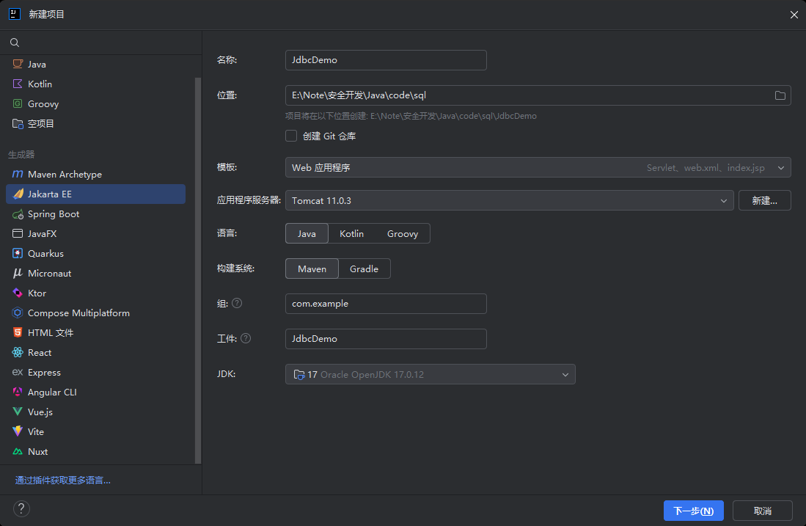

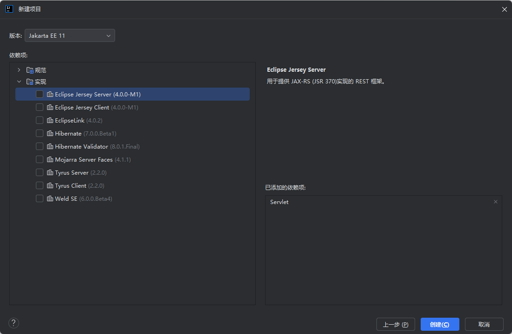

## 引入依赖

启动MySQL，我启动的小皮面板自带的MySQL，创建数据库，然后在idea中测试连接并并连接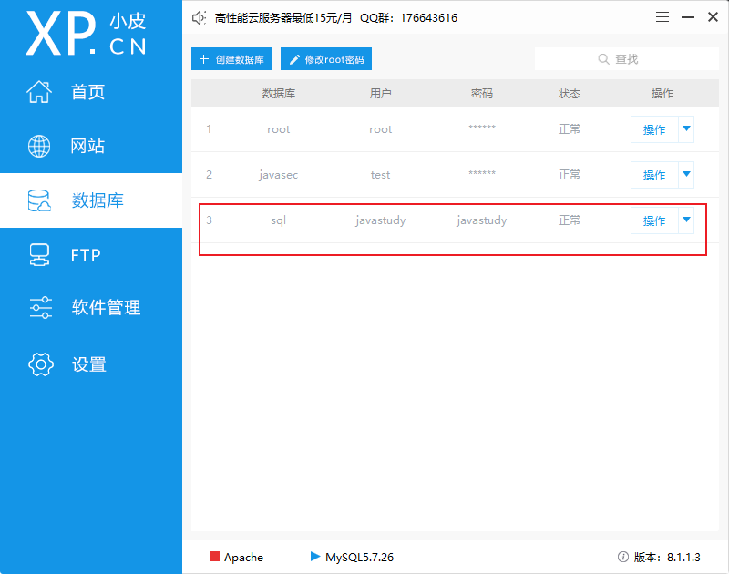

连接后在新创建的数据库中创建表并且添加一些数据

```mysql
-- 创建学生表
CREATE TABLE students (
    student_id INT PRIMARY KEY AUTO_INCREMENT,
    name VARCHAR(50) NOT NULL,
    gender ENUM('男', '女') NOT NULL,
    birth_date DATE,
    class_id INT,
    email VARCHAR(100),
    phone VARCHAR(20),
    admission_date DATE NOT NULL,
    address TEXT,
    CONSTRAINT chk_email CHECK (email LIKE '%@%.%')
);

-- 创建教师表
CREATE TABLE teachers (
    teacher_id INT PRIMARY KEY AUTO_INCREMENT,
    name VARCHAR(50) NOT NULL,
    gender ENUM('男', '女') NOT NULL,
    birth_date DATE,
    department VARCHAR(50) NOT NULL,
    title VARCHAR(30),
    hire_date DATE NOT NULL,
    email VARCHAR(100),
    phone VARCHAR(20),
    office VARCHAR(20)
);

-- 向学生表插入数据
INSERT INTO students (name, gender, birth_date, class_id, email, phone, admission_date, address) VALUES
('张三', '男', '2005-03-15', 101, 'zhangsan@example.com', '13800138001', '2023-09-01', '北京市海淀区中关村大街1号'),
('李四', '女', '2005-07-22', 101, 'lisi@example.com', '13800138002', '2023-09-01', '北京市朝阳区建国路88号'),
('王五', '男', '2004-11-30', 102, 'wangwu@example.com', '13800138003', '2023-09-01', '北京市西城区金融大街33号'),
('赵六', '女', '2005-05-18', 102, 'zhaoliu@example.com', '13800138004', '2023-09-01', '北京市东城区东直门内大街9号'),
('钱七', '男', '2005-01-25', 103, 'qianqi@example.com', '13800138005', '2023-09-01', '北京市丰台区科技园2号');

-- 向教师表插入数据
INSERT INTO teachers (name, gender, birth_date, department, title, hire_date, email, phone, office) VALUES
('刘教授', '男', '1978-06-10', '计算机科学', '教授', '2010-08-15', 'liu@example.com', '13900139001', 'A101'),
('陈副教授', '女', '1982-09-25', '数学', '副教授', '2015-03-20', 'chen@example.com', '13900139002', 'B205'),
('张老师', '男', '1985-12-15', '物理', '讲师', '2018-07-10', 'zhang@example.com', '13900139003', 'C312'),
('王老师', '女', '1988-03-30', '英语', '讲师', '2020-09-01', 'wang@example.com', '13900139004', 'D408'),
('李教授', '男', '1975-11-05', '历史', '教授', '2008-05-15', 'li@example.com', '13900139005', 'E102');
```

然后引入依赖

https://mvnrepository.com/

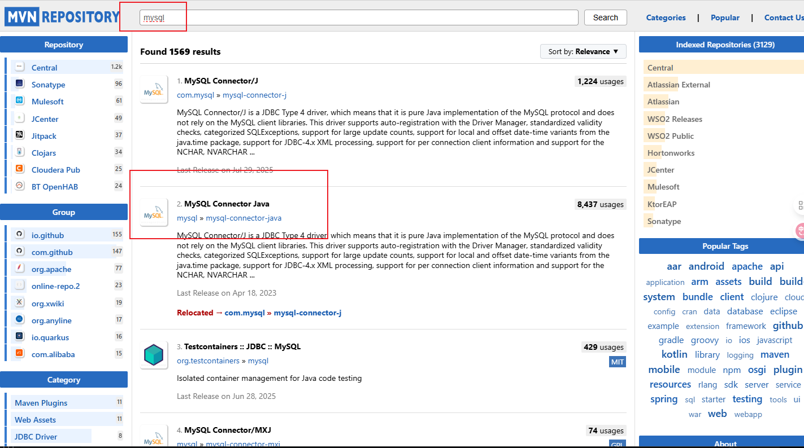

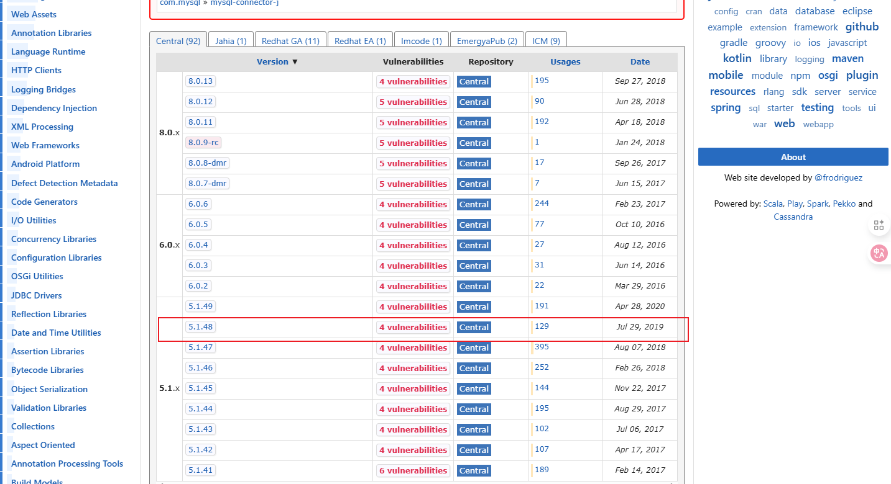

由于本地的MySQL版本是5.7，所以此处不要选择太新的，我选择5.1.48

然后我们的项目使用maven创建，所以选择maven

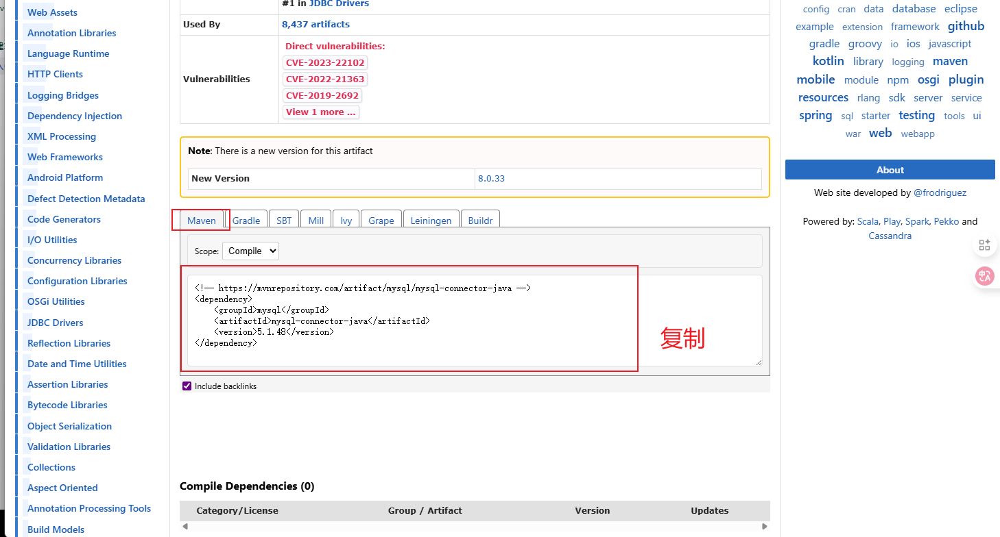

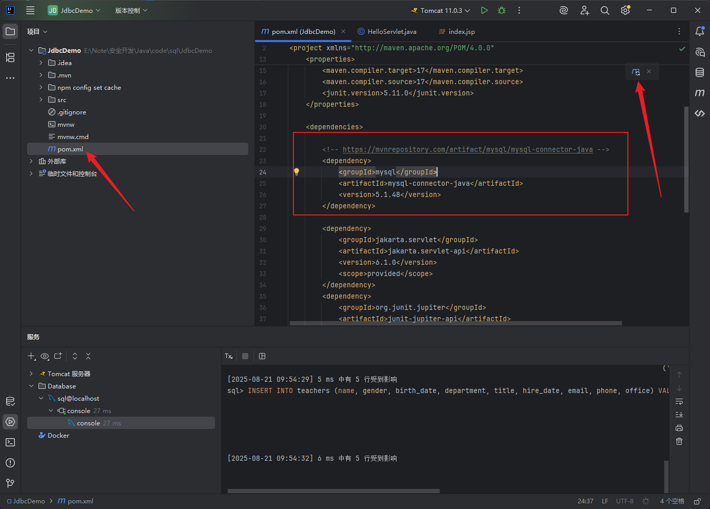

将其复制到我们项目的pom.xml文件中，然后右上角更新一下，然后就会自己下载，

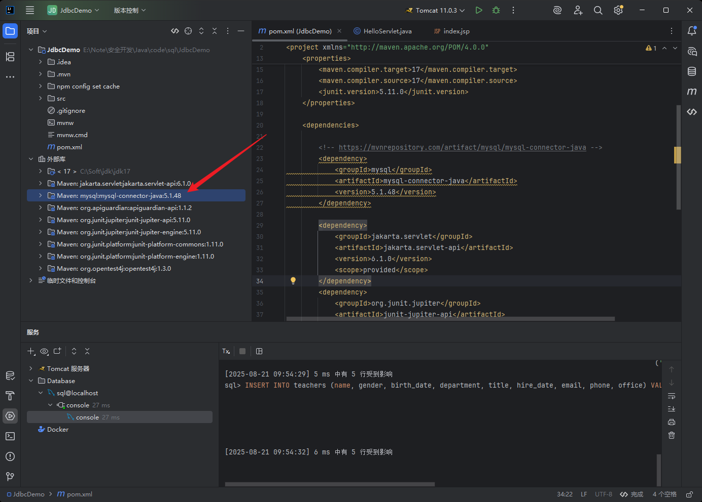

查看依赖库，确定下载成功，如果没有，可以尝试换一个版本，比如5.1.47等

## 代码

### 注册驱动

```java
Class.forName("com.mysql.jdbc.Driver");
```

### 建立连接

```dart
Connection connection = DriverManager.getConnection(url,user,password); 
    
url格式
    MySql:      jdbc:mysql://ip:3306/sid  (本机地址简写jdbc:mysql:///sid)
    Oracle:     jdbc:oracle:thin:@ip:1521:sid
    SqlServer:  jdbc:microsoft:sqlserver://ip:1433;DatabaseName=sid
    
参数(可选,user和password可以写在url参数中)
    ?user=lioil&password=***&useUnicode=true&characterEncoding=UTF-8
    
协议:子协议://ip地址:端口号/库名?参数1=值&参数2=值
jdbc:mysql://localhost:3306/sid?useUnicode=true&characterEncoding=utf-8
```

### 具体步骤

首先创建一个包，然后新建一个类，并且继承HttpServlet，配置路由

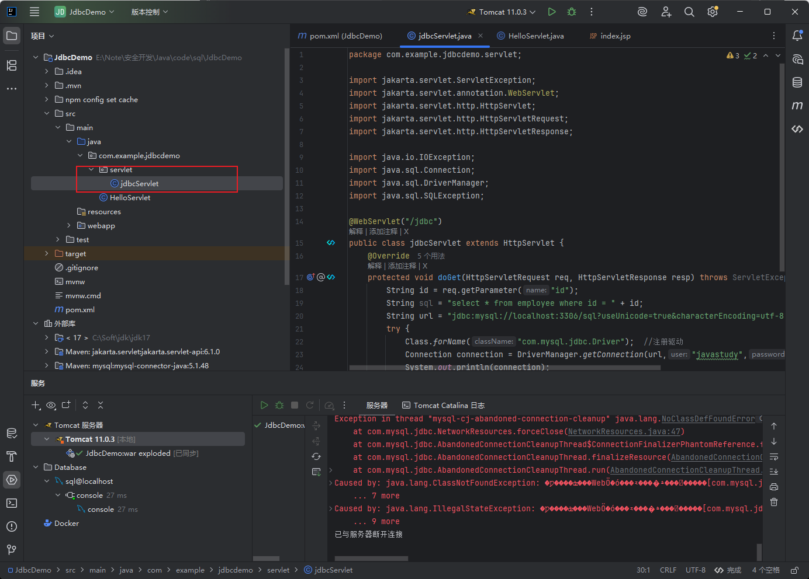

重写doGet()方法

然后先建立驱动，然后建立连接，接的导入类，可能报错可以异常捕获，完整代码如下

```java
package com.example.jdbcdemo.servlet;

import jakarta.servlet.ServletException;
import jakarta.servlet.annotation.WebServlet;
import jakarta.servlet.http.HttpServlet;
import jakarta.servlet.http.HttpServletRequest;
import jakarta.servlet.http.HttpServletResponse;

import java.io.IOException;
import java.sql.Connection;
import java.sql.DriverManager;
import java.sql.SQLException;

@WebServlet("/jdbc")
public class jdbcServlet extends HttpServlet {
    @Override
    protected void doGet(HttpServletRequest req, HttpServletResponse resp) throws ServletException, IOException {
        String id = req.getParameter("id");
        String sql = "select * from employee where id = " + id;
        String url = "jdbc:mysql://localhost:3306/sql?useUnicode=true&characterEncoding=utf-8";
        try {
            Class.forName("com.mysql.jdbc.Driver");  //注册驱动
            Connection connection = DriverManager.getConnection(url,"javastudy","javastudy"); //建立数据库连接
            System.out.println(connection);
        } catch (ClassNotFoundException | SQLException e) {
            throw new RuntimeException(e);
        }
    }
}

```

在代码中输出链接，运行代码，查看是否正常连接。

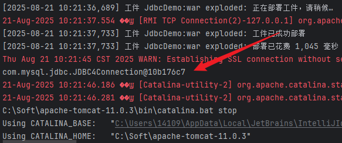

连接正常

我的sql语句错误，记得从自己的数据表中操作

```java
String sql = "select * from students where id = " + id;
```

### 执行语句并输出结果到页面

由于之前只顾的学习操作，没有注意参数和我的数据库不匹配，下面是修改完善后的代码

```java
package com.example.jdbcdemo.servlet;

import jakarta.servlet.ServletException;
import jakarta.servlet.annotation.WebServlet;
import jakarta.servlet.http.HttpServlet;
import jakarta.servlet.http.HttpServletRequest;
import jakarta.servlet.http.HttpServletResponse;

import java.io.IOException;
import java.io.PrintWriter;
import java.sql.*;
import java.util.ArrayList;
import java.util.List;

@WebServlet("/jdbc")
public class jdbcServlet extends HttpServlet {
    @Override
    protected void doGet(HttpServletRequest req, HttpServletResponse resp) throws ServletException, IOException {
        // 设置响应内容类型和字符编码
        resp.setContentType("text/html;charset=UTF-8");
        PrintWriter out = resp.getWriter();

        // 获取请求参数
        String id = req.getParameter("id");

        // SQL查询语句 - 修改为匹配students表的实际结构
        String sql = "SELECT student_id as id, name, gender, birth_date, class_id, email, phone, admission_date, address FROM students";
        if (id != null && !id.isEmpty()) {
            sql += " WHERE student_id = " + id;
        }

        // 数据库连接URL
        String url = "jdbc:mysql://localhost:3306/sql?useUnicode=true&characterEncoding=utf-8";

        // 声明数据库连接对象和Statement对象
        Connection connection = null;
        Statement statement = null;
        ResultSet resultSet = null;

        try {
            // 1. 注册数据库驱动
            Class.forName("com.mysql.jdbc.Driver");

            // 2. 建立数据库连接
            connection = DriverManager.getConnection(url, "javastudy", "javastudy");

            // 3. 创建Statement对象
            // Statement是Java JDBC中用于执行SQL语句的接口
            // 这行代码通过Connection对象创建了一个Statement实例，用于后续执行SQL查询
            // Statement对象就像一个执行器，它接收SQL语句并将其发送给数据库执行
            statement = connection.createStatement();

            // 4. 执行SQL查询，获取结果集
            // executeQuery()方法用于执行SQL查询语句
            // 返回一个ResultSet对象，包含了查询结果
            // ResultSet就像一个指向查询结果的指针，初始位置在第一行之前
            resultSet = statement.executeQuery(sql);

            // 5. 处理查询结果
            out.println("<html><head><title>学生信息</title></head><body>");
            out.println("<h1>学生信息列表</h1>");

            // 添加返回首页的链接
            out.println("<p><a href='" + req.getContextPath() + "/jdbc'>查看所有学生</a></p>");

            out.println("<table border='1' cellpadding='5' cellspacing='0'>");
            // 修改表头以匹配students表的实际字段
            out.println("<tr><th>学号</th><th>姓名</th><th>性别</th><th>出生日期</th><th>班级ID</th><th>邮箱</th><th>电话</th><th>入学日期</th><th>地址</th></tr>");

            // 遍历结果集
            while (resultSet.next()) {
                // 从结果集中获取数据 - 修改为匹配students表的实际字段
                int studentId = resultSet.getInt("id");
                String name = resultSet.getString("name");
                String gender = resultSet.getString("gender");
                Date birthDate = resultSet.getDate("birth_date");
                int classId = resultSet.getInt("class_id");
                String email = resultSet.getString("email");
                String phone = resultSet.getString("phone");
                Date admissionDate = resultSet.getDate("admission_date");
                String address = resultSet.getString("address");

                // 将数据输出到HTML表格中
                out.println("<tr>");
                out.println("<td>" + studentId + "</td>");
                out.println("<td>" + name + "</td>");
                out.println("<td>" + gender + "</td>");
                out.println("<td>" + birthDate + "</td>");
                out.println("<td>" + classId + "</td>");
                out.println("<td>" + email + "</td>");
                out.println("<td>" + phone + "</td>");
                out.println("<td>" + admissionDate + "</td>");
                out.println("<td>" + address + "</td>");
                out.println("</tr>");
            }

            out.println("</table>");
            out.println("</body></html>");

        } catch (ClassNotFoundException | SQLException e) {
            // 发生异常时输出错误信息
            out.println("<html><head><title>错误</title></head><body>");
            out.println("<p>发生错误: " + e.getMessage() + "</p>");
            out.println("<p><a href='javascript:history.back()'>返回上一页</a></p>");
            out.println("</body></html>");
            throw new RuntimeException(e);
        } finally {
            // 6. 关闭资源（遵循后开先关的原则）
            try {
                if (resultSet != null) resultSet.close();
                if (statement != null) statement.close();
                if (connection != null) connection.close();
            } catch (SQLException e) {
                e.printStackTrace();
            }
        }
    }
}

```

- 使用说明：
  1. 访问/jdbc查看所有学生信息
  2. 访问/jdbc?id=1查看特定ID的学生信息
  3. 如果出现错误，会显示错误信息并提供返回链接

访问：http://localhost:8080/JdbcDemo_war_exploded/jdbc

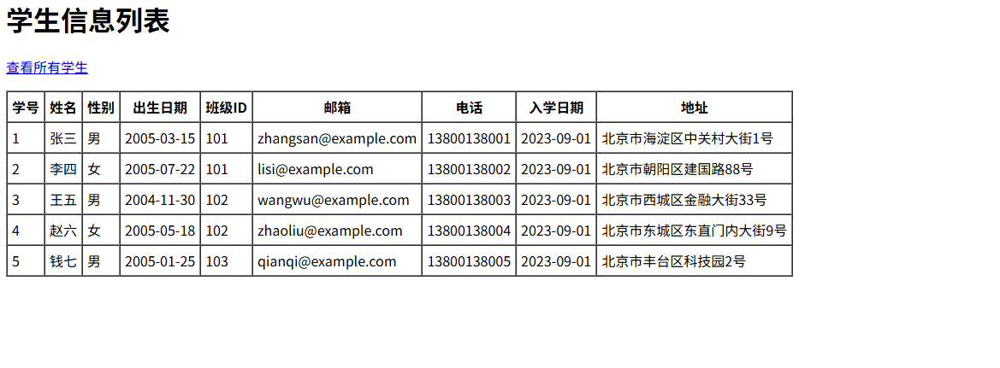

### 安全问题

从安全的角度出发，当前代码并不安全

比如pyload：http://localhost:8080/JdbcDemo_war_exploded/jdbc?id=1 union select 1,2,user(),version(),database(),6,7,8,9

​	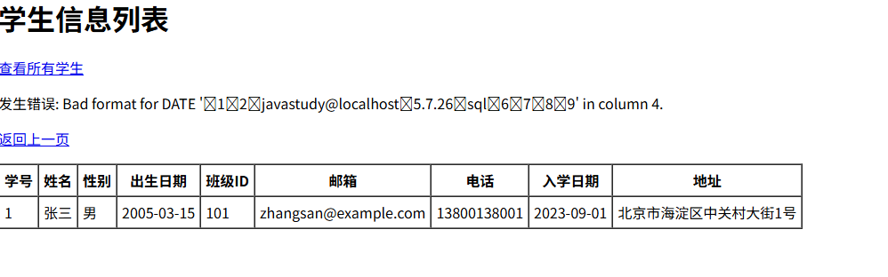

这是因为语句是直接拼接的，无论我们输入什么，都是直接拼接

安全写法：使用预编译

```
preparedStatement = connection.prepareStatement(sql);
// 设置参数值
preparedStatement.setInt(1, id);
```

完整代码

```java
package com.example.jdbcdemo.servlet;

import jakarta.servlet.ServletException;
import jakarta.servlet.annotation.WebServlet;
import jakarta.servlet.http.HttpServlet;
import jakarta.servlet.http.HttpServletRequest;
import jakarta.servlet.http.HttpServletResponse;

import java.io.IOException;
import java.io.PrintWriter;
import java.sql.*;
import java.util.ArrayList;
import java.util.List;

@WebServlet("/jdbc")
public class jdbcServlet extends HttpServlet {
    @Override
    protected void doGet(HttpServletRequest req, HttpServletResponse resp) throws ServletException, IOException {
        // 设置响应内容类型和字符编码
        resp.setContentType("text/html;charset=UTF-8");
        PrintWriter out = resp.getWriter();

        // 获取请求参数
        String idParam = req.getParameter("id");

        // 基础SQL查询语句 - 使用参数化查询
        String sql = "SELECT student_id as id, name, gender, birth_date, class_id, email, phone, admission_date, address FROM students";

        // 数据库连接URL
        String url = "jdbc:mysql://localhost:3306/sql?useUnicode=true&characterEncoding=utf-8";

        // 声明数据库连接对象和PreparedStatement对象
        Connection connection = null;
        PreparedStatement preparedStatement = null;
        ResultSet resultSet = null;

        try {
            // 1. 注册数据库驱动
            Class.forName("com.mysql.jdbc.Driver");

            // 2. 建立数据库连接
            connection = DriverManager.getConnection(url, "javastudy", "javastudy");

            // 3. 根据是否有id参数来决定是否使用参数化查询
            if (idParam != null && !idParam.isEmpty()) {
                // 验证id是否为数字
                try {
                    int id = Integer.parseInt(idParam);
                    sql += " WHERE student_id = ?";
                    // 创建PreparedStatement对象，使用参数化查询
                    preparedStatement = connection.prepareStatement(sql);
                    // 设置参数值
                    preparedStatement.setInt(1, id);
                } catch (NumberFormatException e) {
                    // 如果id不是数字，返回错误信息
                    out.println("<html><head><title>错误</title></head><body>");
                    out.println("<p>学号必须是数字</p>");
                    out.println("<p><a href='javascript:history.back()'>返回上一页</a></p>");
                    out.println("</body></html>");
                    return;
                }
            } else {
                // 没有id参数时，使用普通查询
                preparedStatement = connection.prepareStatement(sql);
            }

            // 4. 执行SQL查询，获取结果集
            resultSet = preparedStatement.executeQuery();

            // 5. 处理查询结果
            out.println("<html><head><title>学生信息</title></head><body>");
            out.println("<h1>学生信息列表</h1>");

            // 添加返回首页的链接
            out.println("<p><a href='" + req.getContextPath() + "/jdbc'>查看所有学生</a></p>");

            out.println("<table border='1' cellpadding='5' cellspacing='0'>");
            // 修改表头以匹配students表的实际字段
            out.println("<tr><th>学号</th><th>姓名</th><th>性别</th><th>出生日期</th><th>班级ID</th><th>邮箱</th><th>电话</th><th>入学日期</th><th>地址</th></tr>");

            // 遍历结果集
            while (resultSet.next()) {
                // 从结果集中获取数据 - 修改为匹配students表的实际字段
                int studentId = resultSet.getInt("id");
                String name = resultSet.getString("name");
                String gender = resultSet.getString("gender");
                Date birthDate = resultSet.getDate("birth_date");
                int classId = resultSet.getInt("class_id");
                String email = resultSet.getString("email");
                String phone = resultSet.getString("phone");
                Date admissionDate = resultSet.getDate("admission_date");
                String address = resultSet.getString("address");

                // 将数据输出到HTML表格中
                out.println("<tr>");
                out.println("<td>" + studentId + "</td>");
                out.println("<td>" + name + "</td>");
                out.println("<td>" + gender + "</td>");
                out.println("<td>" + birthDate + "</td>");
                out.println("<td>" + classId + "</td>");
                out.println("<td>" + email + "</td>");
                out.println("<td>" + phone + "</td>");
                out.println("<td>" + admissionDate + "</td>");
                out.println("<td>" + address + "</td>");
                out.println("</tr>");
            }

            out.println("</table>");
            out.println("</body></html>");

        } catch (ClassNotFoundException | SQLException e) {
            // 发生异常时输出错误信息
            out.println("<html><head><title>错误</title></head><body>");
            out.println("<p>发生错误: " + e.getMessage() + "</p>");
            out.println("<p><a href='javascript:history.back()'>返回上一页</a></p>");
            out.println("</body></html>");
            throw new RuntimeException(e);
        } finally {
            // 6. 关闭资源（遵循后开先关的原则）
            try {
                if (resultSet != null) resultSet.close();
                if (preparedStatement != null) preparedStatement.close();
                if (connection != null) connection.close();
            } catch (SQLException e) {
                e.printStackTrace();
            }
        }
    }
}
```

然后使用刚才的payload就不行了

# Mybatis

## 创建项目

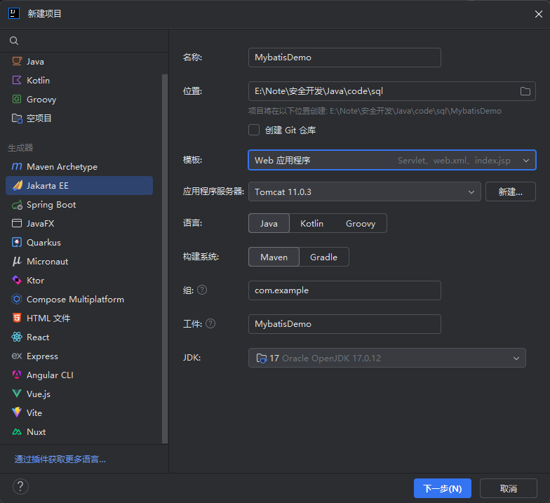

下一步，然后默认，继续下一步，即可

### 项目架构

```
src/
├── main/
│   ├── java/
│   │   └── com/example/mybatisdemo/
│   │       ├── model/           # 数据模型
│   │       ├── mapper/          # MyBatis映射接口
│   │       ├── util/            # 工具类
│   │       └── servlet/         # 控制器
│   ├── resources/
│   │   └── com/example/mybatisdemo/mapper/  # MyBatis映射XML文件
│   └── webapp/                  # Web资源
│       ├── WEB-INF/
│       └── index.jsp            # 主页
```


### pom.xml

> 配置pom.xml添加依赖：
> Jakarta Servlet API
> MyBatis框架
> MySQL连接器
> JSTL支持
> JUnit测试框架

```xml
<?xml version="1.0" encoding="UTF-8"?>
<project xmlns="http://maven.apache.org/POM/4.0.0"
         xmlns:xsi="http://www.w3.org/2001/XMLSchema-instance"
         xsi:schemaLocation="http://maven.apache.org/POM/4.0.0 https://maven.apache.org/xsd/maven-4.0.0.xsd">
    <modelVersion>4.0.0</modelVersion>

    <groupId>com.example</groupId>
    <artifactId>Mybatis-Demo</artifactId>
    <version>1.0-SNAPSHOT</version>
    <name>Mybatis-Demo</name>
    <packaging>war</packaging>

    <properties>
        <project.build.sourceEncoding>UTF-8</project.build.sourceEncoding>
        <maven.compiler.target>17</maven.compiler.target>
        <maven.compiler.source>17</maven.compiler.source>
        <junit.version>5.11.0</junit.version>
    </properties>

    <dependencies>
        <dependency>
            <groupId>jakarta.servlet</groupId>
            <artifactId>jakarta.servlet-api</artifactId>
            <version>6.1.0</version>
            <scope>provided</scope>
        </dependency>
        <dependency>
            <groupId>org.junit.jupiter</groupId>
            <artifactId>junit-jupiter-api</artifactId>
            <version>${junit.version}</version>
            <scope>test</scope>
        </dependency>
        <dependency>
            <groupId>org.junit.jupiter</groupId>
            <artifactId>junit-jupiter-engine</artifactId>
            <version>${junit.version}</version>
            <scope>test</scope>
        </dependency>
        <!-- MyBatis依赖 -->
        <dependency>
            <groupId>org.mybatis</groupId>
            <artifactId>mybatis</artifactId>
            <version>3.5.16</version>
        </dependency>
        <!-- MySQL连接器 -->
        <dependency>
            <groupId>mysql</groupId>
            <artifactId>mysql-connector-java</artifactId>
            <version>8.0.33</version>
        </dependency>
        <!-- JSTL支持 -->
        <dependency>
            <groupId>jakarta.servlet.jsp.jstl</groupId>
            <artifactId>jakarta.servlet.jsp.jstl-api</artifactId>
            <version>3.0.0</version>
        </dependency>
        <dependency>
            <groupId>org.glassfish.web</groupId>
            <artifactId>jakarta.servlet.jsp.jstl</artifactId>
            <version>3.0.1</version>
        </dependency>
    </dependencies>

    <build>
        <plugins>
            <plugin>
                <groupId>org.apache.maven.plugins</groupId>
                <artifactId>maven-war-plugin</artifactId>
                <version>3.4.0</version>
            </plugin>
        </plugins>
    </build>
</project>
```

### mybatis-config.xml 

配置mybatis配置文件来配置数据库的连接，在``src/main/resources/``目录下创建gmybatis-config.xml，按照要求配置自己的数据库信息

```xml
<?xml version="1.0" encoding="UTF-8" ?>
<!DOCTYPE configuration
        PUBLIC "-//mybatis.org//DTD Config 3.0//EN"
        "http://mybatis.org/dtd/mybatis-3-config.dtd">
<configuration>
    <environments default="development">
        <environment id="development">
            <transactionManager type="JDBC"/>
            <dataSource type="POOLED">
                <property name="driver" value="com.mysql.cj.jdbc.Driver"/>
                <property name="url" value="jdbc:mysql://localhost:3306/sql"/>
                <property name="username" value="javastudy"/>
                <property name="password" value="javastudy"/>
            </dataSource>
        </environment>
    </environments>
    <mappers>
        <mapper resource="com/example/mybatisdemo/mapper/StudentMapper.xml"/>
    </mappers>
</configuration>
```


### 实体类设计

src/main/java/com/example/mybatisdemo/model/Student.java

```java
package com.example.mybatisdemo.model;

import java.util.Date;

public class Student {
    private int id;
    private String name;
    private int age;
    private String className;
    private String gender;
    private Date birthDate;
    private int classId;
    private String email;
    private String phone;
    private Date admissionDate;
    private String address;

    public Student() {}

    public Student(int id, String name, int age, String className) {
        this.id = id;
        this.name = name;
        this.age = age;
        this.className = className;
    }

    public int getId() {
        return id;
    }

    public void setId(int id) {
        this.id = id;
    }

    public String getName() {
        return name;
    }

    public void setName(String name) {
        this.name = name;
    }

    public int getAge() {
        return age;
    }

    public void setAge(int age) {
        this.age = age;
    }

    public String getClassName() {
        return className;
    }

    public void setClassName(String className) {
        this.className = className;
    }

    public String getGender() {
        return gender;
    }

    public void setGender(String gender) {
        this.gender = gender;
    }

    public Date getBirthDate() {
        return birthDate;
    }

    public void setBirthDate(Date birthDate) {
        this.birthDate = birthDate;
    }

    public int getClassId() {
        return classId;
    }

    public void setClassId(int classId) {
        this.classId = classId;
    }

    public String getEmail() {
        return email;
    }

    public void setEmail(String email) {
        this.email = email;
    }

    public String getPhone() {
        return phone;
    }

    public void setPhone(String phone) {
        this.phone = phone;
    }

    public Date getAdmissionDate() {
        return admissionDate;
    }

    public void setAdmissionDate(Date admissionDate) {
        this.admissionDate = admissionDate;
    }

    public String getAddress() {
        return address;
    }

    public void setAddress(String address) {
        this.address = address;
    }

    @Override
    public String toString() {
        return "Student{" +
                "id=" + id +
                ", name='" + name + '\'' +
                ", age=" + age +
                ", className='" + className + '\'' +
                '}';
    }
}
```

### Mapper接口开发

src/main/java/com/example/mybatisdemo/mapper/StudentMapper.java

```java
package com.example.mybatisdemo.mapper;

import com.example.mybatisdemo.model.Student;

import java.util.List;

public interface StudentMapper {
    // 使用预编译语句防止SQL注入的查询方法
    Student selectStudentById(int id);
    
    // 存在SQL注入风险的查询方法（用于测试）
    List<Student> selectStudentByIdUnsafe(String id);
    
    // 获取所有学生信息
    List<Student> selectAllStudents();
}
```

### SQL映射文件开发

src/main/resources/com/example/mybatisdemo/mapper/StudentMapper.xml

```xml
<?xml version="1.0" encoding="UTF-8" ?>
<!DOCTYPE mapper
        PUBLIC "-//mybatis.org//DTD Mapper 3.0//EN"
        "http://mybatis.org/dtd/mybatis-3-mapper.dtd">
<mapper namespace="com.example.mybatisdemo.mapper.StudentMapper">
    <resultMap id="StudentResultMap" type="com.example.mybatisdemo.model.Student">
        <id property="id" column="student_id"/>
        <result property="name" column="name"/>
        <result property="gender" column="gender"/>
        <result property="birthDate" column="birth_date"/>
        <result property="classId" column="class_id"/>
        <result property="email" column="email"/>
        <result property="phone" column="phone"/>
        <result property="admissionDate" column="admission_date"/>
        <result property="address" column="address"/>
    </resultMap>

    <!-- 安全的查询方法，使用预编译语句 -->
    <select id="selectStudentById" parameterType="int" resultMap="StudentResultMap">
        SELECT student_id, name, gender, birth_date, class_id, email, phone, admission_date, address FROM students WHERE student_id = #{id}
    </select>

    <!-- 不安全的查询方法，存在SQL注入风险 -->
    <select id="selectStudentByIdUnsafe" resultMap="StudentResultMap">
        SELECT student_id, name, gender, birth_date, class_id, email, phone, admission_date, address FROM students WHERE student_id = ${id}
    </select>

    <!-- 查询所有学生 -->
    <select id="selectAllStudents" resultMap="StudentResultMap">
        SELECT student_id, name, gender, birth_date, class_id, email, phone, admission_date, address FROM students
    </select>
</mapper>
```

### 控制层开发

#### Servlet开发  

src/main/java/com/example/mybatisdemo/StudentServlet.java

创建StudentServlet处理HTTP请求
使用@WebServlet注解映射URL路径
实现doGet方法处理GET请求
解析请求参数（id和unsafe）
根据参数选择不同的查询方式

使用MyBatisUtil获取SqlSession并执行查询

```java
package com.example.mybatisdemo;

import com.example.mybatisdemo.mapper.StudentMapper;
import com.example.mybatisdemo.model.Student;
import com.example.mybatisdemo.util.MyBatisUtil;
import jakarta.servlet.ServletException;
import jakarta.servlet.annotation.WebServlet;
import jakarta.servlet.http.HttpServlet;
import jakarta.servlet.http.HttpServletRequest;
import jakarta.servlet.http.HttpServletResponse;
import org.apache.ibatis.session.SqlSession;

import java.io.IOException;
import java.io.PrintWriter;
import java.util.ArrayList;
import java.util.List;

@WebServlet("/student")
public class StudentServlet extends HttpServlet {
    private static final long serialVersionUID = 1L;

    @Override
    protected void doGet(HttpServletRequest request, HttpServletResponse response)
            throws ServletException, IOException {
        response.setContentType("text/html;charset=UTF-8");
        PrintWriter out = response.getWriter();

        String id = request.getParameter("id");
        String unsafe = request.getParameter("unsafe");

        SqlSession sqlSession = null;
        try {
            sqlSession = MyBatisUtil.getSqlSession();
            StudentMapper mapper = sqlSession.getMapper(StudentMapper.class);

            out.println("<h2>学生信息查询结果</h2>");
            out.println("<a href='index.jsp'>返回首页</a><br/><br/>");

            if (id == null || id.trim().isEmpty()) {
                // 查询所有学生
                List<Student> students = mapper.selectAllStudents();
                printStudents(out, students);
            } else if (unsafe != null && unsafe.equals("true")) {
                // 使用不安全的查询方式（演示SQL注入）
                out.println("<h3 style='color:red'>使用不安全查询方式（仅用于演示SQL注入风险）</h3>");
                // 注意：此处使用${id}会导致SQL注入，仅用于演示
                List<Student> students = mapper.selectStudentByIdUnsafe(id);
                printStudentsUnsafe(out, students);
            } else {
                // 使用安全的查询方式
                out.println("<h3 style='color:green'>使用安全查询方式</h3>");
                // 不再进行数字类型检查，直接传递给MyBatis处理
                Student student = mapper.selectStudentById(Integer.parseInt(id));
                List<Student> students = new ArrayList<>();
                if (student != null) {
                    students.add(student);
                }
                printStudentsUnsafe(out, students);
            }
        } finally {
            if (sqlSession != null) {
                sqlSession.close();
            }
        }
    }

    private void printStudents(PrintWriter out, List<Student> students) {
        if (students != null && !students.isEmpty()) {
            out.println("<table border='1'>");
            out.println("<tr><th>ID</th><th>姓名</th><th>年龄</th><th>班级</th></tr>");
            for (Student student : students) {
                out.println("<tr>");
                out.println("<td>" + student.getId() + "</td>");
                out.println("<td>" + student.getName() + "</td>");
                out.println("<td>" + student.getAge() + "</td>");
                out.println("<td>" + student.getClassName() + "</td>");
                out.println("</tr>");
            }
            out.println("</table>");
        } else {
            out.println("<h3>未查询到学生信息</h3>");
        }
    }
    
    // 用于显示SQL注入测试结果的方法
    private void printStudentsUnsafe(PrintWriter out, List<Student> students) {
        if (students != null && !students.isEmpty()) {
            out.println("<table border='1'>");
            out.println("<tr><th>ID</th><th>姓名</th><th>性别</th><th>出生日期</th><th>班级ID</th><th>邮箱</th><th>电话</th><th>入学日期</th><th>地址</th></tr>");
            for (Student student : students) {
                out.println("<tr>");
                out.println("<td>" + student.getId() + "</td>");
                out.println("<td>" + student.getName() + "</td>");
                out.println("<td>" + student.getGender() + "</td>");
                out.println("<td>" + student.getBirthDate() + "</td>");
                out.println("<td>" + student.getClassId() + "</td>");
                out.println("<td>" + student.getEmail() + "</td>");
                out.println("<td>" + student.getPhone() + "</td>");
                out.println("<td>" + student.getAdmissionDate() + "</td>");
                out.println("<td>" + student.getAddress() + "</td>");
                out.println("</tr>");
            }
            out.println("</table>");
        } else {
            out.println("<h3>未查询到学生信息</h3>");
        }
    }
}
```


#### 工具类开发

src/main/java/com/example/mybatisdemo/util/MyBatisUtil.java

创建MyBatisUtil工具类，用于获取SqlSession实例
实现静态初始化块加载MyBatis配置
提供getSqlSession方法获取数据库会话

```java
package com.example.mybatisdemo.util;

import org.apache.ibatis.io.Resources;
import org.apache.ibatis.session.SqlSession;
import org.apache.ibatis.session.SqlSessionFactory;
import org.apache.ibatis.session.SqlSessionFactoryBuilder;

import java.io.IOException;
import java.io.InputStream;

public class MyBatisUtil {
    private static SqlSessionFactory sqlSessionFactory;

    static {
        try {
            String resource = "mybatis-config.xml";
            InputStream inputStream = Resources.getResourceAsStream(resource);
            sqlSessionFactory = new SqlSessionFactoryBuilder().build(inputStream);
        } catch (IOException e) {
            e.printStackTrace();
        }
    }

    public static SqlSession getSqlSession() {
        return sqlSessionFactory.openSession();
    }
}
```

### 页面index.jsp

```jsp
<%@ page contentType="text/html; charset=UTF-8" pageEncoding="UTF-8" %>
<!DOCTYPE html>
<html>
<head>
    <title>JSP - Hello World</title>
</head>
<body>
<h1><%= "Hello World!" %>
</h1>
<br/>
<a href="hello-servlet">Hello Servlet</a>
<br/><br/>

<h2>SQL注入测试</h2>
<form action="student" method="get">
    <label for="id">学生ID:</label>
    <input type="text" id="id" name="id" placeholder="输入学生ID">
    <input type="checkbox" id="unsafe" name="unsafe" value="true">
    <label for="unsafe">使用不安全查询(用于测试SQL注入)</label>
    <input type="submit" value="查询">
</form>

</body>
</html>
```

### 测试

项目创建后运行出错可以结合ai进行修复，启动项目，进行测试

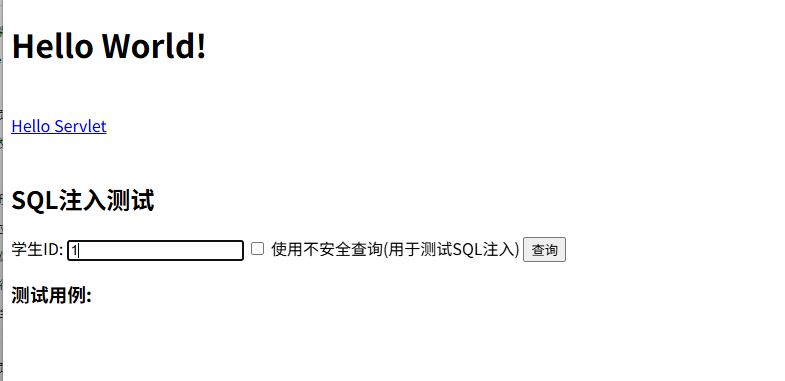

输入1，查询结果

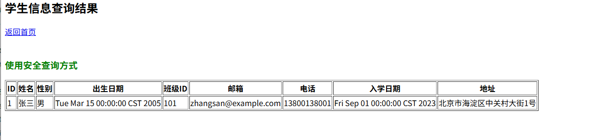

payload：`1 or 1=1`

没有结果

这是因为没有勾选使用不安全的测试，安全的测试用了预编译手法，所以没有结果，当使用不安全的测试的时候，

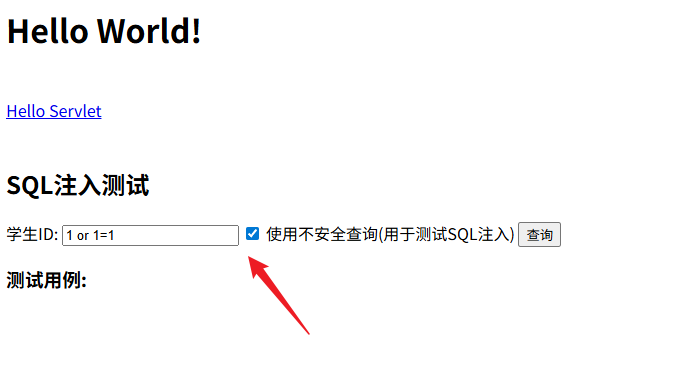

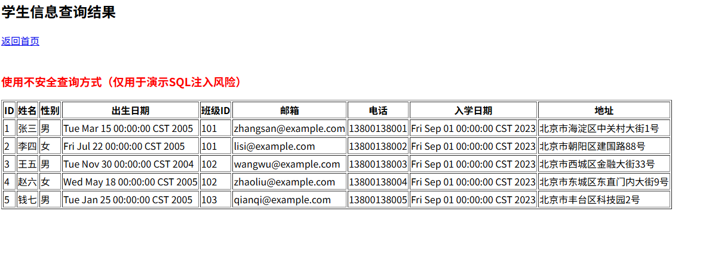

可以看到有sql注入

这是在映射文件StudentMapper.xml中

```xml
    <select id="selectStudentById" parameterType="int" resultMap="StudentResultMap">
        SELECT student_id, name, gender, birth_date, class_id, email, phone, admission_date, address FROM students WHERE student_id = #{id}
    </select>

    <!-- 不安全的查询方法，存在SQL注入风险 -->
    <select id="selectStudentByIdUnsafe" resultMap="StudentResultMap">
        SELECT student_id, name, gender, birth_date, class_id, email, phone, admission_date, address FROM students WHERE student_id = ${id}
    </select>
```

使用的符号

`#`使用预编译

`$`不采用预编译

使用sqlmap测试

> python sqlmap.py  -u "http://localhost:8080/Mybatis_Demo_war_exploded/student?id=1&unsafe=true" -p id --batch

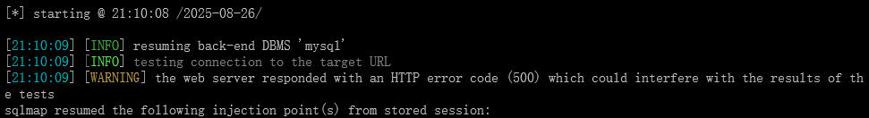

> python sqlmap.py  -u "http://localhost:8080/Mybatis_Demo_war_exploded/student?id=1&unsafe=true" -p id -D sql -T students --dump

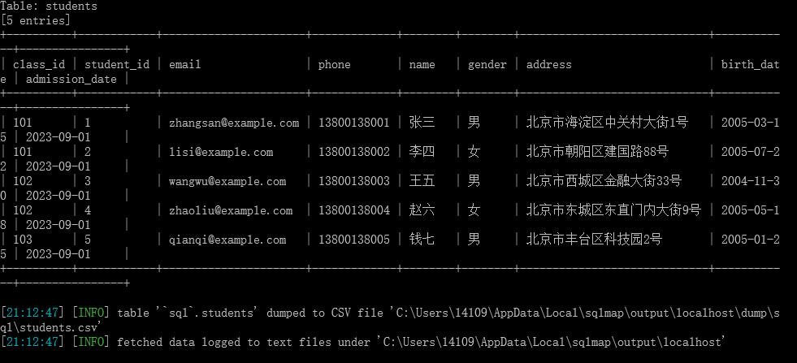


# Hibernate

### Hibernate 简介

**Hibernate** 是一个开源的、高性能的**对象关系映射（ORM, Object-Relational Mapping）** 框架，用于 Java 语言。它的主要目标是将 Java 对象（实例）与关系型数据库中的表记录进行映射，从而让开发者能够以面向对象的方式操作数据库，而无需编写繁琐的 JDBC 代码和 SQL 语句。

**核心特性与优势：**

1. **ORM（对象关系映射）**：
   - **类 ↔ 表**：将一个 Java 类（Entity）映射到一张数据库表。
   - **属性 ↔ 列**：将类的属性（字段）映射到表的列。
   - **对象 ↔ 记录**：创建一个类的对象对应表里的一条记录。
   - **关联关系映射**：可以轻松映射对象之间的一对一、一对多、多对一和多对多关系。
2. **简化开发**：
   - 开发者无需编写大量的 `INSERT`, `UPDATE`, `DELETE`, `SELECT`SQL 语句。
   - 通过如 `session.save(user)`, `session.get(User.class, id)`这样的方法即可完成数据库操作。
3. **数据库无关性（Dialect）**：
   - Hibernate 提供了一套“方言”系统。开发者只需进行简单配置（如 `MySQLDialect`, `PostgreSQLDialect`），Hibernate 就会为不同的数据库生成与之兼容的 SQL，使得应用切换数据库变得非常容易。
4. **HQL（Hibernate Query Language）**：
   - 这是一种面向对象的查询语言，语法类似于 SQL，但操作的是对象和属性，而不是表和列。
   - 例如：`FROM User u WHERE u.username = :name`（这里的 `User`是类名，`username`是类的属性）。
5. **缓存机制**：
   - 提供了一级缓存（Session 级别）和二级缓存（SessionFactory 级别），可以有效减少数据库访问次数，提升应用性能。
6. **事务管理**：
   - 提供了简单而强大的事务管理接口，与 JTA（Java Transaction API）和 JDBC 事务都能很好地集成。

**简单工作流程：**

1. 配置 Hibernate（通常使用 `hibernate.cfg.xml`或注解）。
2. 创建 `SessionFactory`（一个数据库对应一个，线程安全，重量级）。
3. 从 `SessionFactory`打开一个 `Session`（一次数据库操作使用一个，非线程安全，轻量级）。
4. 通过 Session 进行持久化操作（获取、保存、更新、删除对象）。
5. 提交事务，关闭 Session。

------

### 第二部分：Hibernate 与 SQL 注入

SQL 注入是一种非常常见的网络安全漏洞，攻击者通过在用户输入中插入恶意的 SQL 代码，欺骗服务器执行非预期的数据库操作。

#### Hibernate 如何帮助防御 SQL 注入？

Hibernate 的核心设计（使用参数化查询）在很大程度上**帮助开发者避免了 SQL 注入**。

1. **HQL 的参数化查询（Named Parameters 和 Positional Parameters）**：

   HQL 天生支持参数绑定，而不是通过字符串拼接来创建查询。这是防止 SQL 注入的最有效手段。

   - **错误做法（字符串拼接，存在注入风险）**：

     ```
     // 伪代码：危险！千万不要这样做！
     String hql = "FROM User WHERE username = '" + userInput + "'";
     Query query = session.createQuery(hql);
     ```

     如果 `userInput`是 `' OR '1'='1`，整个 HQL 的含义就被改变了。

   - **正确做法（使用命名参数绑定）**：

     ```
     String hql = "FROM User WHERE username = :username";
     Query<User> query = session.createQuery(hql, User.class);
     query.setParameter("username", userInput); // 参数被安全地绑定
     ```

     Hibernate 会确保 `userInput`的值被安全地转义和处理，只被当作参数值，而不是 SQL 语句的一部分。

2. **原生 SQL 查询的参数化（Native SQL）**：

   当必须使用原生 SQL 时，Hibernate 也提供了参数绑定机制。

   - **错误做法**：

     ```
     String sql = "SELECT * FROM users WHERE username = '" + userInput + "'";
     NativeQuery query = session.createNativeQuery(sql);
     ```

   - **正确做法（使用命名参数）**：

     ```
     String sql = "SELECT * FROM users WHERE username = :username";
     NativeQuery<User> query = session.createNativeQuery(sql, User.class);
     query.setParameter("username", userInput);
     ```

     或者使用占位符 `?`：

     ```
     String sql = "SELECT * FROM users WHERE username = ?";
     NativeQuery<User> query = session.createNativeQuery(sql, User.class);
     query.setParameter(1, userInput); // 参数索引从1开始
     ```

#### 什么时候 Hibernate 应用仍可能存在 SQL 注入？

尽管 Hibernate 提供了很好的安全机制，但**如果开发者使用不当，仍然会导致 SQL 注入**。主要的风险点在于：

1. **在 HQL 中使用字符串拼接**：

   这是最直接、最危险的错误。如上文所示，如果开发者手动将用户输入拼接到 HQL 语句中，Hibernate 就无法提供保护。

2. **在 `ORDER BY`等子句中使用非参数化输入**：

   `ORDER BY`后面不能直接使用参数绑定（因为它是标识符/关键字，而不是值）。如果根据用户输入来动态排序，错误做法会导致风险。

   - **危险做法**：

     ```
     String orderBy = userInput; // 例如 userInput = "age; DROP TABLE users; --"
     String hql = "FROM User ORDER BY " + orderBy;
     Query query = session.createQuery(hql);
     ```

   - **安全做法**：

     - **白名单校验**：在代码层面对用户输入的排序字段进行校验，只允许预期的值（如 "age", "name"）。

     ```
     List<String> allowedSortFields = List.of("age", "name", "email");
     if (!allowedSortFields.contains(userInput)) {
         throw new IllegalArgumentException("Invalid sort field");
     }
     String hql = "FROM User ORDER BY " + userInput; // 此时userInput已被校验过，是安全的
     ```

3. **不当使用原生 SQL（SQL 而不是 HQL）**：

   如果整个项目都使用 `createNativeQuery()`并且大量进行字符串拼接，那么风险和直接使用 JDBC 是一样的。

4. **Hibernate 旧版本的历史漏洞**：

   极少数情况下，Hibernate 框架本身可能出现过漏洞（例如早期版本中对某些字符的处理不当）。但这类漏洞非常罕见，且通常会很快被修复。保持 Hibernate 版本更新是很好的习惯。

### 总结

| 方面               | 结论                                                         |
| ------------------ | ------------------------------------------------------------ |
| **Hibernate 本身** | 它是一个强大、高效、能极大提升开发效率的 ORM 框架，其设计**有助于防止 SQL 注入**。 |
| **SQL 注入风险**   | **风险主要来自开发者不良的编码习惯**，而不是框架本身。       |
| **最佳实践**       | 1. **永远不要**将用户输入拼接到 HQL 或 SQL 语句中。 2. **始终使用** `setParameter()`方法来绑定参数。 3. 对于动态表名、列名（如 `ORDER BY`），使用**白名单**进行校验。 4. 定期更新 Hibernate 版本。 |


