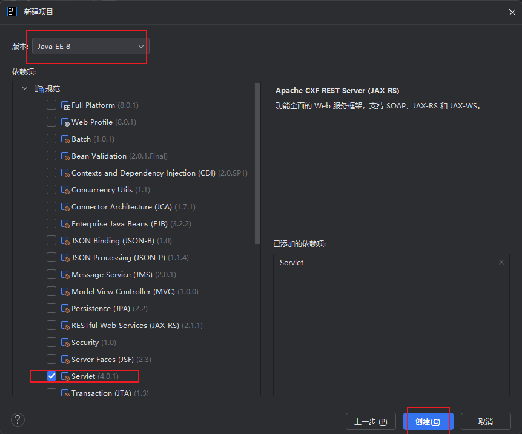

# Servlet

https://mp.weixin.qq.com/s/c_4fOTBKDcByv8MZ9ayaRg

Servlet 是 Java EE（现 Jakarta EE）规范中用于处理客户端请求的核心组件，主要运行在支持 Java 的 Web 服务器（如 Tomcat、Jetty 等）中，负责接收客户端请求、处理业务逻辑并生成响应。它是 Java Web 开发的基础，也是 MVC 模式中 "控制器" 的典型实现。

==虽然目前很多公司都转向了各种MVC框架，但它依然是 Java Web 开发技术的基础，是 Java Web 容器的基石，是行业标准。而现在流行的各种 MVC 框架（包括 SpringMVC），在最底层，还是以 Servlet 为基础的。==

## 简单了解

### 一、Servlet 核心概念

- **定义**：Servlet 是一个实现了 `javax.servlet.Servlet` 接口的 Java 类，由 Web 服务器（Servlet 容器）管理，用于处理 HTTP 等协议的请求。
- **作用**：作为客户端（浏览器、APP 等）与服务器端业务逻辑（如数据库操作）的中间层，接收请求、处理数据、生成响应。
- 特点：
  - 运行在服务器端，由 Servlet 容器（如 Tomcat）实例化和管理。
  - 基于请求 - 响应模型，针对每一次客户端请求进行处理。
  - 单实例多线程：一个 Servlet 类通常只创建一个实例，多线程并发处理多个请求（需注意线程安全）。

### 二、Servlet 工作原理

1. 客户端（如浏览器）通过 HTTP 协议向 Web 服务器发送请求（如 GET/POST）。
2. Web 服务器（如 Tomcat）接收请求后，根据 URL 映射找到对应的 Servlet。
3. Servlet 容器（服务器内置）实例化 Servlet（若未实例化），并调用其生命周期方法处理请求。
4. Servlet 处理完成后，生成响应数据，通过容器返回给客户端。

流程简化：`客户端请求 → Web服务器 → Servlet容器 → Servlet处理 → 响应客户端`

### 三、Servlet 生命周期

Servlet 的生命周期由 Servlet 容器全程管理，分为 4 个阶段：

1. **加载与实例化**
   - 当客户端第一次请求某个 Servlet 时，容器会加载对应的 Servlet 类，并创建其实例（仅一次）。
   - 也可通过配置让容器在启动时就实例化 Servlet（`load-on-startup` 配置）。
2. **初始化（init ()）**
   - 实例化后，容器立即调用 `init(ServletConfig config)` 方法，用于初始化资源（如连接数据库、加载配置）。
   - 该方法仅执行一次，若初始化失败，Servlet 将无法处理请求。
3. **服务（service ()）**
   - 每次客户端请求时，容器会创建新的线程，调用 `service(ServletRequest req, ServletResponse res)` 方法处理请求。
   - `service` 方法会根据请求类型（GET/POST/PUT/DELETE 等），自动分发到对应的 `doGet()`、`doPost()` 等方法。
   - 这是 Servlet 处理业务逻辑的核心阶段。
4. **销毁（destroy ()）**
   - 当容器关闭或 Servlet 被移除时，容器调用 `destroy()` 方法，用于释放资源（如关闭数据库连接）。
   - 销毁后，Servlet 实例被垃圾回收。

### 四、核心接口与类

Servlet 规范定义了一系列接口和抽象类，核心包括：

1. **Servlet 接口**
   所有 Servlet 的根接口，定义了生命周期方法：
   - `init(ServletConfig config)`：初始化
   - `service(ServletRequest req, ServletResponse res)`：处理请求
   - `destroy()`：销毁
   - `getServletConfig()`：获取配置信息
   - `getServletInfo()`：获取 Servlet 描述信息
2. **GenericServlet 抽象类**
   实现了 `Servlet` 接口，提供了通用实现（如默认的 `init()`、`getServletConfig()` 等），简化了 Servlet 开发。但它不针对 HTTP 协议，适用于各种协议的请求处理。
3. **HttpServlet 抽象类**
   继承 `GenericServlet`，专门用于处理 HTTP 请求，重写了 `service()` 方法，根据 HTTP 方法（GET/POST 等）分发到对应的 `doXxx()` 方法：
   - `doGet(HttpServletRequest req, HttpServletResponse resp)`：处理 GET 请求
   - `doPost(HttpServletRequest req, HttpServletResponse resp)`：处理 POST 请求
   - 还有 `doPut()`、`doDelete()` 等对应其他 HTTP 方法。
     实际开发中，通常继承 `HttpServlet` 并重写 `doGet()`/`doPost()` 即可。

## 项目创建





等构建完毕后就可以将启动了

我运行后发现错误，tomcat版本与jdk版本不兼容，需要注意，我修改为jdk17就可以启动了


这个页面就是jsp文件

## Servlet基础编程

创建一个新文件


写入代码

```java
package com.example.servletdemo;

import jakarta.servlet.ServletException;
import jakarta.servlet.http.HttpServlet;
import jakarta.servlet.http.HttpServletRequest;
import jakarta.servlet.http.HttpServletResponse;

import java.io.IOException;

public class ServletDemo extends HttpServlet {
    @Override
    public void init() throws ServletException {
        System.out.println("init over!");
    }

    @Override
    protected void doGet(HttpServletRequest req, HttpServletResponse resp) throws ServletException, IOException {
        System.out.println("doGet over!");
    }

    @Override
    protected void doPost(HttpServletRequest req, HttpServletResponse resp) throws ServletException, IOException {
        System.out.println("dopost over!");
    }

    public ServletDemo() {
        System.out.println("contractor over!");
    }
}

```

然后在web.xml中进行路由配置

### 方法一


配置如下

```xml
    <servlet>
            <servlet-name>ServletDemo</servlet-name>
            <servlet-class>com.example.servletdemo.ServletDemo</servlet-class>
    </servlet>
    <servlet-mapping>
        <servlet-name>ServletDemo</servlet-name>
        <url-pattern>/demo</url-pattern>
    </servlet-mapping>
```

> 解释：
>
> - **`<servlet-name>`**：给当前 Servlet 起一个 “别名”（如 `ServletDemo`），用于后续映射时关联。
>   作用：相当于给 Servlet 类起一个简短的标识，方便在配置中引用（避免重复写长类名）。
>
> - **`<servlet-class>`**：指定 Servlet 类的完整路径（包名 + 类名），如 `com.example.servletdemo.ServletDemo`。
>   作用：告诉 Web 服务器 “这个配置对应的是哪个 Java 类”，服务器会根据这个路径找到并加载对应的 Servlet 类。
>
> - **`<servlet-name>`**：必须与 `<servlet>` 标签中定义的 `servlet-name` 一致（这里是 `ServletDemo`）。
>   作用：通过 “别名” 关联到前面定义的 Servlet 类，建立 “URL → 类” 的对应关系。
>
> - **`<url-pattern>`**：定义客户端访问该 Servlet 的 URL 路径（如 `/demo`）。
>   作用：指定 “当客户端访问 `http://域名/项目名/demo` 时，由 `ServletDemo` 类处理请求”。
>
> - 配置完成后，当客户端（如浏览器）访问：
>   `http://localhost:8080/你的项目名/demo`
>
>   Web 服务器会执行以下步骤：
>
>   1. 根据 URL 中的 `/demo`，找到 `<url-pattern>/demo</url-pattern>` 对应的 `<servlet-mapping>`。
>   2. 通过 `<servlet-name>ServletDemo</servlet-name>`，找到对应的 `<servlet>` 配置。
>   3. 根据 `<servlet-class>` 找到 `com.example.servletdemo.ServletDemo` 类，调用其 `doGet()` 或 `doPost()` 方法处理请求。

然后重新启动服务，并进行访问
http://localhost:8080/ServletDemo_war_exploded/demo

就可以看到终端输出


**这是在访问的时候，先创建对象，创建对象的时候触发构造函数，然后Servlet初始化后，容器立刻调用init方法，`init()`执行完成后，容器调用`service()`方法（HttpServlet 父类中实现），`service()`会根据请求类型（这里是 GET 请求）自动分发到`doGet()`。**

### 方法二

可以直接在ServletDemo类中进行配置


```java
@WebServlet(name = "helloServlet", value = "/hello-servlet")
```

等价写法


然后路径访问/demo，也可以和上面终端输出一样。

也可以通过抓包工具将其修改请求方式为POST，就可以触发doPost方法了

可以添加内容让其请求能够接收参数

```java
 protected void doGet(HttpServletRequest req, HttpServletResponse resp) throws ServletException, IOException {
        String name=req.getParameter("name");
        resp.setContentType("text/html;charset=utf-8");
        PrintWriter out=resp.getWriter();
        out.println(name);
        System.out.println("doGet over!");
    }
```

然后从前端访问

> http://localhost:8080/ServletDemo_war_exploded/demo?name=zifeiyu

页面就会输出参数内容

# 过滤器 -- Filter

## 简单了解

在 Java EE（现 Jakarta EE）的 Servlet 规范中，**Filter（过滤器）** 是一个特殊的 Java 类，它允许你在请求（Request）到达目标资源（如 Servlet、JSP 页面或其他资源）**之前**和/或在响应（Response）返回给客户端**之前**，对请求和响应进行**拦截、检查、修改或处理**。

### **Filter 的核心作用与应用场景**

Filter 的主要用途是实现**横切关注点（Cross-Cutting Concerns）**，即那些与业务逻辑无关但需要在多个地方重复应用的功能。常见的应用场景包括：

- **日志记录（Logging）**： 记录请求的详细信息（如 IP 地址、请求 URL、时间戳、用户代理等），用于审计、监控或调试。
- **身份验证（Authentication）**： 检查用户是否已登录（例如，检查 Session 或 Token）。如果未登录，可以重定向到登录页面或返回 401 状态码。
- **授权（Authorization）**： 检查已登录用户是否有权限访问特定资源（如管理员页面）。如果没有权限，返回 403 状态码。
- **数据压缩（Compression）**： 检查客户端是否支持 GZIP 压缩，如果支持，则对响应内容进行压缩以减少传输大小。
- **字符编码设置（Character Encoding）**： 统一设置请求和响应的字符编码（如 UTF-8），避免中文乱码问题。
- **请求/响应修改（Modification）**： 修改请求头、请求参数或响应内容。例如，添加安全相关的响应头（如 `X-Frame-Options`, `Content-Security-Policy`）、清理 XSS 攻击代码、添加 CORS 头等。
- **资源访问控制**： 限制访问频率（限流）、IP 黑名单/白名单过滤。
- **缓存控制**： 设置响应的缓存头（`Cache-Control`, `Expires`）。
- **性能监控**： 计算处理请求所花费的时间。

## 案列

创建一个FilterDemo包，新建类XssFilterDemo


配置路由

```xml
     <filter>
            <filter-name>xssFilterDemo</filter-name>
            <filter-class>com.example.FlterDeomo.XssFilterDemo</filter-class>
    </filter>
    <filter-mapping>
        <filter-name>xssFilterDemo</filter-name>
        <url-pattern>/demo</url-pattern>
    </filter-mapping>
```

或者在XssFilterDemo中添加

```
@WebFilter(urlPatterns = "/demo")
```

这样过滤器就过滤demo路径。设置成/*就会过滤所有路径，

然后访问之前的/demo路径，就会先经过过滤器


此时，如果将payload修改为xss的payload

> http://localhost:8080/ServletDemo_war_exploded/demo?name=%3Cscript%3Ealert(%22zifeiyu%22);%3C/script%3E

页面就会发生弹窗

然后我们修改过滤操作

```java
public class XssFilterDemo implements Filter {
    @Override
    public void doFilter(ServletRequest request, ServletResponse response, FilterChain chain) throws IOException, ServletException {
        System.out.println("xss filter doFilter");
        HttpServletRequest req = (HttpServletRequest) request;
        String name = req.getParameter("name");
        if(!name.contains("script")){
            chain.doFilter(request,response);
        }else {
            System.out.println("Attack!!!!!!!!!!!");
        }

    }
```

然后重新访问

终端就会输出


就就是一个简单的过滤器演示


# Listener --监听器

### **1. 为什么需要监听器？**

监听器的主要作用是处理那些**与具体请求无关**，但对整个应用、会话或请求范围至关重要的初始化、清理和监控任务。它非常适合处理**横切关注点**，例如：

- **应用启动/关闭时的初始化与清理**： 加载全局配置、建立数据库连接池、启动后台线程、关闭资源等。
- **会话（Session）管理**： 统计在线用户数、记录用户登录/登出日志、在用户会话失效时清理相关资源。
- **请求范围内的初始化**： 在请求开始时设置一些上下文信息。
- **属性变更监控**： 监听应用、会话或请求范围内属性的添加、移除或替换，用于缓存更新、审计等。

------

### **2. 核心监听器接口与事件类型**

Java Servlet API 定义了一系列监听器接口，每个接口对应监听特定类型的事件。你需要实现这些接口来创建自定义监听器。

#### **(1) 监听 `ServletContext` (应用上下文)**

`ServletContext` 代表整个 Web 应用，是应用级别的全局对象。

- **`ServletContextListener`**： 监听 `ServletContext` 的创建和销毁。
  - `void contextInitialized(ServletContextEvent sce)`： **应用启动时**调用。这是执行应用级初始化任务（如加载配置、初始化连接池）的**最佳时机**。
  - `void contextDestroyed(ServletContextEvent sce)`： **应用停止时**调用。用于执行清理工作（如关闭数据库连接、停止线程）。
- **`ServletContextAttributeListener`**： 监听 `ServletContext` 属性的添加、移除或替换。
  - `void attributeAdded(ServletContextAttributeEvent scab)`
  - `void attributeRemoved(ServletContextAttributeEvent scab)`
  - `void attributeReplaced(ServletContextAttributeEvent scab)`

#### **(2) 监听 `HttpSession` (用户会话)**

`HttpSession` 代表一个用户的会话。

- **`HttpSessionListener`**： 监听 `HttpSession` 的创建和销毁（失效）。
  - `void sessionCreated(HttpSessionEvent se)`： **新会话创建时**调用（通常是用户首次访问且未携带有效 Session ID 时）。
  - `void sessionDestroyed(HttpSessionEvent se)`： **会话销毁时**调用（可能是超时、手动调用 `invalidate()` 或服务器关闭）。
- **`HttpSessionAttributeListener`**： 监听 `HttpSession` 属性的添加、移除或替换。
  - `void attributeAdded(HttpSessionBindingEvent se)`
  - `void attributeRemoved(HttpSessionBindingEvent se)`
  - `void attributeReplaced(HttpSessionBindingEvent se)`
- **`HttpSessionActivationListener`** (较少用)： 监听 Session 在分布式环境中的**钝化（Passivation）**（序列化到磁盘）和**活化（Activation）**（从磁盘反序列化）。
- **`HttpSessionBindingListener`** (特殊)： 这个接口不是在监听器类上实现，而是由**被放入 Session 的某个对象**实现。当该对象被添加到 Session 或从 Session 中移除时，其 `valueBound` 和 `valueUnbound` 方法会被自动调用。

#### **(3) 监听 `ServletRequest` (请求)**

`ServletRequest` 代表一次 HTTP 请求。

- **`ServletRequestListener`**： 监听 `ServletRequest` 的初始化（开始）和销毁（结束）。
  - `void requestInitialized(ServletRequestEvent sre)`： **请求开始处理时**调用（在任何 Filter 或 Servlet 执行之前）。
  - `void requestDestroyed(ServletRequestEvent sre)`： **请求处理完成，即将返回响应时**调用。
- **`ServletRequestAttributeListener`**： 监听 `ServletRequest` 属性的添加、移除或替换。
  - `void attributeAdded(ServletRequestAttributeEvent srae)`
  - `void attributeRemoved(ServletRequestAttributeEvent srae)`
  - `void attributeReplaced(ServletRequestAttributeEvent srae)`

## 实现

创建包和新的类


AdminServlet.java

```java
package com.example.servletdemo;

import jakarta.servlet.ServletException;
import jakarta.servlet.annotation.WebServlet;
import jakarta.servlet.http.HttpServlet;
import jakarta.servlet.http.HttpServletRequest;
import jakarta.servlet.http.HttpServletResponse;

import java.io.IOException;

@WebServlet("/admin")
public class AdminServlet extends HttpServlet {
    @Override
    public void init() throws ServletException {
        //
        System.out.println("Admin init");
    }

    @Override
    protected void doGet(HttpServletRequest req, HttpServletResponse resp) throws ServletException, IOException {
        //
        System.out.println("AdminServlet doGet");
        //销毁session
        req.getSession().invalidate();
        //运行此处自动触发监听器的sessionDestroyed方法
    }

    @Override
    public void destroy() {
        //
        super.destroy();
    }
}

```

SessionDemo.java

```java
package com.example.ListenerDemo;

import jakarta.servlet.annotation.WebListener;
import jakarta.servlet.http.HttpSession;
import jakarta.servlet.http.HttpSessionEvent;
import jakarta.servlet.http.HttpSessionListener;

@WebListener("/admin")
public class SessionDemo implements HttpSessionListener {
    public void sessionCreated(HttpSessionEvent se) {
        System.out.println("Session Created");
    }
    public void sessionDestroyed(HttpSessionEvent se) {
        System.out.println("Session Destroyed");
    }

}

```

运行访问

http://localhost:8080/ServletDemo_war_exploded/admin

后，终端会输出

可以看到监听器成功监听到session的创建与销毁，一访问网站生成session、触发创建的监听，然后在 req.getSession().invalidate();处销毁session，然后触发销毁的监听

# 梳理

---

### **1. 三大组件的核心职责**

| 组件         | 核心职责                                                     | 触发机制                                                     | 主要用途                                                     |
| :----------- | :----------------------------------------------------------- | :----------------------------------------------------------- | :----------------------------------------------------------- |
| **Servlet**  | **处理业务逻辑**。接收客户端的 HTTP 请求，处理数据，生成并返回响应（HTML, JSON, XML 等）。 | 显式映射到特定的 URL 模式。只有当请求的 URL 匹配其映射规则时才会被调用。 | 实现具体的业务功能，如用户登录、商品查询、订单提交等。       |
| **Filter**   | **拦截和预处理/后处理**。在请求到达 Servlet **之前**和/或响应返回客户端 **之前**，对请求和响应进行检查、修改或处理。 | 映射到 URL 模式或 Servlet 名称。匹配的请求在进入目标资源前必须经过 Filter 链。 | 处理横切关注点：身份验证、授权、日志记录、字符编码设置、数据压缩、XSS 防护、CORS 配置等。 |
| **Listener** | **监听和响应事件**。监听 Web 应用中关键对象（`ServletContext`, `HttpSession`, `ServletRequest`）的**生命周期事件**或**属性变更事件**。 | 事件驱动。当被监听的对象发生特定事件（如创建、销毁、属性变化）时，容器自动回调监听器的方法。 | 执行初始化/清理任务：应用启动时加载配置/连接池、统计在线用户数、记录会话日志、监控请求性能等。 |

---

### **2. Web 应用的生命周期与三大组件的关系**

一个 Web 应用的生命周期可以分为 **启动 (Startup)**、**运行 (Runtime)** 和 **关闭 (Shutdown)** 三个阶段。三大组件在不同阶段扮演着不同的角色。

#### **阶段一：应用启动 (Web Container 启动时)**

1.  **加载与实例化**：
    *   Servlet 容器（如 Tomcat）启动。
    *   容器扫描 `web.xml` 或类路径下的注解（`@WebServlet`, `@WebFilter`, `@WebListener`）。
    *   为每个找到的 **Listener**、**Filter** 和 **Servlet** 创建**单例实例**（通常每个类型一个实例，由容器管理）。

2.  **初始化 (Initialization)**：
    *   **Listener**: 容器首先调用所有实现了 `ServletContextListener` 的监听器的 `contextInitialized(ServletContextEvent sce)` 方法。
        *   **时机**：这是**最早**可以执行代码的地方。
        *   **作用**：进行**全局初始化**，如加载配置文件、初始化数据库连接池、启动后台监控线程、设置全局变量。**Filter 和 Servlet 的初始化通常依赖于此阶段完成的工作。**
    *   **Filter**: 接着，容器调用每个 Filter 的 `init(FilterConfig filterConfig)` 方法。
        *   **作用**：执行 Filter 特有的初始化，如读取初始化参数、建立 Filter 内部需要的资源。
    *   **Servlet**: 最后，容器调用每个 Servlet 的 `init(ServletConfig config)` 方法（如果 Servlet 配置了 `load-on-startup` 或在第一次请求时）。
        *   **作用**：执行 Servlet 特有的初始化逻辑。

> **关键点**：`contextInitialized()` 是整个应用生命周期的起点，它为后续的 Filter 和 Servlet 初始化提供了环境和基础。

#### **阶段二：应用运行 (处理客户端请求时)**

当客户端发送一个 HTTP 请求（如 `GET /demo?name=zifeyu`）时，容器会根据请求的 URL 路径，启动一个处理流程。这个流程清晰地展示了 **Filter** 和 **Servlet** 的协作：


1.  **请求进入**： 客户端发起请求。
2.  **Filter 链 - 请求预处理**：
    *   容器根据 URL 找到匹配的 **Filter Chain**。
    *   按照配置顺序，依次调用每个 Filter 的 `doFilter()` 方法。
    *   在每个 Filter 的 `doFilter()` 方法中，`chain.doFilter(request, response)` 之前的代码执行**请求预处理**（如设置编码、验证身份、记录日志）。
    *   **关键**：必须调用 `chain.doFilter()` 才能将请求传递给下一个 Filter 或最终的 Servlet。如果某个 Filter 没有调用它（例如，身份验证失败直接返回 401），请求链就会在此中断。
3.  **Servlet - 业务处理**：
    *   请求最终到达目标 **Servlet**。
    *   容器根据 HTTP 方法（GET, POST 等）调用 Servlet 的 `doGet()`, `doPost()` 等方法。
    *   Servlet 执行核心的**业务逻辑**（如查询数据库、处理数据）。
    *   Servlet 通过 `response` 对象生成响应内容（HTML, JSON 等）。
4.  **Filter 链 - 响应后处理**：
    *   Servlet 处理完成后，响应开始返回。
    *   响应沿着 Filter 链**逆序**返回。
    *   按照与请求时**相反**的顺序，依次调用每个 Filter 的 `doFilter()` 方法中 `chain.doFilter()` **之后**的代码。
    *   在这里执行**响应后处理**（如添加安全头、压缩响应、记录响应日志）。
5.  **响应返回**： 最终响应发送回客户端。

**同时运行的 Listener**：
*   在这个请求处理过程中，其他 Listener 也在默默地工作：
    *   **`ServletRequestListener`**: `requestInitialized()` 在请求处理开始时被调用，`requestDestroyed()` 在处理结束时被调用。可用于性能监控。
    *   **`HttpSessionListener`**: 如果请求创建了新会话，`sessionCreated()` 会被调用；如果会话超时或被 `invalidate()`，`sessionDestroyed()` 会被调用。可用于在线用户统计。
    *   **`ServletContextAttributeListener` / `HttpSessionAttributeListener` / `ServletRequestAttributeListener`**: 当应用、会话或请求范围内的属性被添加、移除或替换时被触发。

#### **阶段三：应用关闭 (Web Container 停止时)**

1.  **销毁 (Destruction)**：
    *   容器开始关闭流程。
    *   **Servlet**: 容器调用每个 Servlet 的 `destroy()` 方法。
        *   **作用**：执行 Servlet 特有的资源清理。
    *   **Filter**: 容器调用每个 Filter 的 `destroy()` 方法。
        *   **作用**：执行 Filter 特有的资源清理。
    *   **Listener**: 容器调用所有实现了 `ServletContextListener` 的监听器的 `contextDestroyed(ServletContextEvent sce)` 方法。
        *   **时机**：这是**最后**可以执行代码的地方。
        *   **作用**：执行**全局清理**，如关闭数据库连接池、停止后台线程、保存最后的状态。

> **关键点**：`contextDestroyed()` 是整个应用生命周期的终点，它负责收尾工作，确保资源被正确释放。

---

### **3. 三者关系总结**

1.  **协作流程**：
    *   **Listener** 奠定基础：在应用启动时初始化全局环境，在关闭时清理全局资源。
    *   **Filter** 护航请求：在每次请求/响应过程中，作为“守门人”和“修饰者”，处理非业务性的通用任务。
    *   **Servlet** 执行核心：在 Filter 的“护送”下，专注于处理具体的业务逻辑并生成响应。

2.  **依赖关系**：
    *   Filter 和 Servlet 的正常工作往往**依赖于** Listener 在 `contextInitialized()` 中建立的全局环境（如可用的数据库连接池）。
    *   Listener 本身通常不直接依赖 Filter 或 Servlet，但可以通过监听事件（如会话创建/销毁）来影响应用状态。

3.  **作用范围**：
    *   **Listener**: 作用于**应用生命周期**和**对象事件**，是全局的、被动的。
    *   **Filter**: 作用于**请求处理流程**，是流程中的中间环节，对请求/响应进行拦截和处理。
    *   **Servlet**: 作用于**具体业务功能**，是请求处理流程的终点（业务终点）。

4.  **执行频率**：
    *   **Listener** (生命周期方法): 每个应用实例**启动和关闭时各执行一次**。
    *   **Filter** (`doFilter`): **每次**有匹配的请求/响应经过时都会执行。
    *   **Servlet** (`doGet`/`doPost`): **每次**有匹配的请求到达时都会执行。

---

**总而言之**，Servlet、Filter 和 Listener 共同构成了 Java Web 应用的骨架。Listener 负责“奠基”和“收尾”，Filter 负责“护航”和“修饰”，Servlet 负责“攻坚”和“产出”。它们通过 Web 应用的生命周期紧密协作，共同完成从启动、处理请求到关闭的全过程。理解它们各自的职责和相互关系，是构建健壮、可维护 Web 应用的基础。


